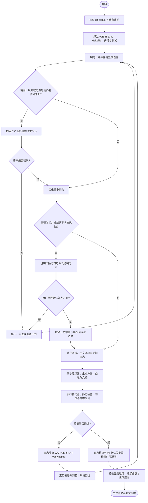

# AGENTS.md

本文件定义仓库内 Go 代码的组织方式、设计原则、注释与日志规范、测试要求和工程约束。新增或修改代码、配置、Protocol
Buffers、接口契约及相关文档时，应遵循本规范，并优先保持与现有代码风格一致。

## 指令优先级与适用范围

- 指令优先级为：用户当前任务要求 > 更深目录中的 `AGENTS.md` > 仓库根目录的 `AGENTS.md` > 全局 `AGENTS.md` > 现有代码惯例。
- 仅修改当前任务涉及的文件，不为了补注释、补日志或统一风格扩大修改范围。
- 生成文件只修改生成源；不得手工修改 `*.pb.go`、`*.pb.validate.go`、`wire_gen.go` 等生成产物。
- 对文档和执行计划使用简体中文；代码标识符、协议字段和项目已有术语保持原有语言与命名。

## 基本原则

- 优先选择简单、清晰、符合 Go 惯例的实现。
- 避免不必要的抽象、封装、配置项和第三方依赖。
- 保持改动范围最小，不进行与当前任务无关的重构。
- 公共行为、错误语义、配置或接口契约发生变化时，应同步更新测试和文档。
- 实现应优先保证正确性和可读性，仅在有测量依据时进行性能优化。
- 提交前必须确保代码通过格式化、静态检查和相关测试。
- 避免不必要的防御性编程。
- 语言语法不能超过 go.mod 中 go 指令声明的语言版本。
- 简单需求改动不需要使用 SDD 模式。

## 目录边界

### `api/*`

用于当前仓库定义的对外的 `pb` 结构和对应的产物。

要求：

- 只能放 pb 源文件和对应的 protoc 产物。
- 应该定义对应的 make api 指令生成 protoc 产物。

### `pkg/<domain>` 与嵌套 `internal`

- `pkg/<domain>` 默认同时保存公共契约、Spec、资源 Manager、构造入口及其实现；使用非导出标识符隐藏实现，用同包文件区分职责。
- 仅当子能力具有清晰、独立的职责与单向依赖边界时，才拆成 `pkg/<domain>/internal/<capability>`，例如日志输出、配置解码和协议中间件。
- 不得把整个领域搬进 `internal/provider` 或 `internal/runtime`，再通过类型别名和函数转发形成公共空壳；也不得仅为测试或控制文件行数新建包。
- 嵌套 internal 不得反向依赖所属领域包；若拆包导致公共契约下沉、循环依赖或额外契约微包，优先回到同包实现。
- 一个领域不得导入另一个领域的嵌套 internal。
- 业务 App/Wire 不得导入任何 internal 路径。
- 根 `internal` 只保存至少被两个独立领域直接复用的能力及模块级测试设施。
- `contrib/<domain>/<driver>` 是业务/Wire 可导入的公共可选实现。
- 简单内聚的公共工具可以保留单包结构，禁止为了目录形式创建无意义微包。

### 文件职责与组装模式

- 文件按具体职责命名，例如 `config.go`、`producer.go`、`consumer.go`、`transaction.go`、`lifecycle.go`；避免 `part1.go` 等仅表达切片顺序的名称。
- 手写实现文件通常控制在 150–300 行；超过 400 行应检查是否包含多个职责并合理拆分。该范围是审阅提示，不是硬性配额；不为凑行数合并无关逻辑或拆断一个完整操作。
- 类型及其紧密关联的方法尽量放在一起；同一职责的短小辅助实现优先留在同一文件，不按每个类型或函数机械拆文件。测试跟随职责组织，避免维护超大测试文件。
- 保留显式构造函数与 Wire 依赖注入模式；由构造返回 cleanup 的资源继续由组装层负责逆序释放。
- Bootstrap 统一位于 `pkg/bootstrap`，在构造期同步向 `app.Spec` 登记贡献；业务 Wire 层聚合 `bootstrap.Bootstrap` 后通过 `bootstrap.NewKratosApp` 调用 `app.NewApp`。领域包只声明自身依赖并提供普通构造函数，不导入 app、bootstrap 或 Wire 参与组装，也不自行启动应用运行时或管理全局容器。

### Driver Registry 适用条件

- 只有一个 Manager 管理多份具名资源、不同资源可使用不同实现、每项配置按 driver 选择实现、Manager 负责资源生命周期四项同时成立时，才允许 Driver Registry。
- database 与 OSS 驱动通过具体 contrib 包的 init 注册无状态 factory；业务/Wire 通过空导入决定编译进应用的驱动。
- 驱动 init 只能注册 factory，禁止配置读取、网络或磁盘 I/O、资源创建和 goroutine。
- Registry 的 factory map 和 frozen 状态必须受锁保护；锁内禁止调用 factory 或执行 I/O。
- 其他领域默认使用显式构造和注入；新增全局注册前必须完成架构确认。

### `contrib/<能力>/<实现>`

用于适配第三方组件、协议、存储系统或框架接口，例如：

```text
contrib/cache/redis
contrib/metrics/prometheus
contrib/tracing/otel
```

要求：

- 每个实现只负责对应第三方能力的适配。
- 第三方 SDK 类型不应无必要地泄漏到核心领域接口中。
- 将第三方组件的配置转换、错误转换和生命周期管理限制在适配层内。
- 核心业务包不应直接依赖具体的 `contrib` 实现。

## 包职责与边界

- 包名应简短、清晰，并描述其提供的能力，避免使用 `common`、`helpers` 等含义模糊的名称。
- 避免循环依赖、双向依赖和跨层访问实现细节。
- 公共接口应保持清晰、简洁且易于正确使用。
- 优先返回具体类型；仅在调用方需要替换实现或隔离外部依赖时引入接口。
- 接口通常应定义在使用方所在的包中，而不是由实现方预先定义。
- 接口应尽量小，并根据实际调用需求设计；不要为了“可测试性”创建没有真实替换需求的接口。
- 领域包应依赖其所需能力的接口，而不是直接依赖基础设施的具体实现。
- 具体实现由 Wire 或其他显式组装层注入，领域逻辑中不得直接完成依赖组装。
- 构造函数应显式接收必要依赖，避免隐藏的全局状态和运行时服务定位。
- 对外暴露公共 API 的包必须提供 `README.md`，从调用方视角说明用法、约束和注意事项；不得仅使用 `doc.go` 代替使用文档。

## API 设计

- 遵循“接受接口，返回具体类型”的原则，但不要机械套用。
- 导出类型、函数、方法和常量应具有符合 GoDoc 规范的注释。
- 不要导出仅供内部实现或测试使用的标识符。
- 参数较少时直接传参；只有在参数较多、需要可选配置或预计稳定扩展时才使用配置结构体。
- 对可选行为优先使用清晰的配置结构体；谨慎使用 functional options，避免为简单构造过程增加复杂度。
- 不要在公共 API 中暴露不必要的第三方库类型。
- `context.Context` 应作为第一个参数传入，不应保存到结构体字段中。
- 不要传入 `nil` context；没有合适上下文时使用 `context.Background()` 或 `context.TODO()`。
- 不要使用布尔参数表达含义不清的行为，必要时使用具名类型、常量或拆分方法。

## 代码注释

- 修改代码、配置、Protocol Buffers 或接口契约时，为非直观逻辑和关键代码节点补充简洁的中文注释。
- 关键代码节点包括关键参数校验、分支决策、状态变更、外部调用、异常处理、重试、降级和回退逻辑。
- 注释优先解释设计原因、默认行为、执行顺序、前置条件、边界行为、兼容性约束、安全边界和资源生命周期，不逐行翻译代码。
- 对路由、中间件、并发、热更新、错误回退等容易误解的逻辑，应说明关键前置条件及行为边界。
- 不添加重复、显而易见或仅复述代码的注释，不保留注释掉的代码或临时调试说明。
- TODO 应说明后续动作和必要上下文；项目有约定时附带 issue 编号。
- 除非用户明确要求改变行为，注释优化不得修改业务逻辑、配置值、接口字段或测试预期。
- 不得为了补充注释扩大任务范围，也不得直接修改生成文件中的注释。

## 错误处理

- 必须处理所有有意义的错误，不得无故忽略或使用空的错误处理分支。
- 为错误补充上下文时使用 `%w` 保留错误链：
  ```go
  return fmt.Errorf("load user %q: %w", userID, err)
  ```
- 判断错误类型或原因时使用 `errors.Is` 和 `errors.As`，不要依赖错误字符串。
- 错误信息使用小写开头，通常不以句号结尾。
- 不要在多个层级重复记录并返回同一个错误；日志应集中在能够决定重试、降级、回退或对外响应的处理边界。
- 仅对程序无法继续运行的启动错误使用 `panic`；正常业务失败必须返回错误。
- 哨兵错误应保持稳定，并仅在调用方确实需要区分错误语义时导出。
- 返回给外部调用方的错误不得泄漏内部路径、凭据、SQL 或敏感实现细节。

## 并发与锁

### 风险识别与确认

- 发现共享可变状态、并发读写、异步任务竞争、重复提交、缓存一致性或可能导致竞态条件的场景时，必须明确告知用户风险，并说明可能造成的数据错误、重复执行、状态不一致或性能问题。
- 未经用户确认，不得自行引入锁或改变现有并发控制策略。应先提供可选方案及适用场景，例如互斥锁、读写锁、分段锁、原子操作、数据库事务或乐观锁、消息串行化、幂等控制。
- 用户确认方案后，实施前必须明确说明：
  - 为什么需要并发控制。
  - 保护的共享资源或临界区是什么。
  - 使用何种锁或同步机制，以及选择理由。
  - 锁或同步机制的粒度和作用范围。
  - 解决的具体并发问题。
  - 对性能、饥饿和死锁风险的影响。
- 选择普通互斥锁时，应说明临界区包含写操作、读写比例不稳定、需要保证复合操作原子性，或读写锁无法带来实际并发收益；不得仅因实现方便而默认使用普通锁。

### 实现约束

- 经确认需要保护的共享可变状态，必须通过锁、channel、原子操作、事务、幂等机制或其他明确的同步方式保护。
- 启动 goroutine 时，必须明确其退出条件、错误处理方式和所有权。
- 禁止创建无法停止或可能永久阻塞的 goroutine。
- 并发操作应支持通过 `context.Context` 取消；短生命周期纯计算任务可根据实际情况例外处理。
- 锁的作用域应尽可能小，不要在持锁期间执行网络请求、磁盘 I/O、阻塞操作或调用不受控的外部代码。
- 获取锁后通常应立即使用 `defer` 释放：
  ```go
  mu.Lock()
  defer mu.Unlock()
  ```
- 当锁位于循环、热点路径或需要在函数返回前尽早释放时，可以显式调用 `Unlock`，但必须保证所有控制流都能正确释放。
- 不要复制包含 `sync.Mutex`、`sync.RWMutex`、`sync.Once` 或其他同步原语的值。
- 修改并发代码时应运行竞态检测：
  ```bash
  go test -race ./...
  ```
- 涉及锁、并发控制、幂等或重试机制的设计与实现，必须在流程图中标注并发入口、共享资源、获取与释放位置、失败或超时路径及相应日志节点。

## 日志与可观测性

- 编写或修改业务代码时，必须在关键执行节点补充必要日志；关键节点包括状态变化、外部依赖调用、重试、降级、回退、最终失败和关键业务结果。
- 新增或修改的关键节点日志至少应包含函数名，以及当前错误信息或可用于排障的关键业务上下文。
- 建议日志事件格式为：`函数名 | 操作/阶段 | 关键上下文 | 结果或错误`。例如：
  `CreateOrder | payment.request | order_id=123 | err=timeout`。
- 优先使用结构化日志字段，不要依赖字符串拼接承载上下文。
- 日志应包含可定位上下文，例如请求 ID、业务主键、操作名称、执行结果和耗时。
- 不得记录密码、令牌、密钥、身份证号、完整手机号、隐私数据或其他敏感信息。
- 避免在循环高频路径、预期内的普通分支或没有排障价值的字段上滥用日志。
- 底层库通常应将错误返回给上层；除非底层能够独立处理、恢复或形成不可替代的观测事件，否则不要重复记录同一错误。
- 指标名称和标签应保持稳定，避免使用用户 ID、请求 ID 等高基数字段作为标签。
- Trace、日志和指标中的请求上下文应通过 `context.Context` 传播。
- 流程图中的日志节点应使用简洁的事件名称和级别标识，使设计、执行路径与线上排障可以对应。

## 流程图与文档

- 所有涉及业务流程、系统设计、架构方案、接口调用链、状态流转、任务执行步骤或代码执行节点的文档，必须提供对应流程图。
- 流程图统一优先使用 Mermaid；仅在 Mermaid 无法清晰表达时使用其他可维护格式，并说明原因。
- 流程图必须覆盖：
  - 开始与结束。
  - 关键判断分支。
  - 异常、超时与回退路径。
  - 外部依赖调用。
  - 数据或状态变化。
  - 关键日志节点。
  - 适用时的并发入口、共享资源和同步边界。
- 文档中的流程图必须与实际实现保持一致；代码逻辑、执行顺序、重试或并发策略变更时，应同步更新相关流程图。
- 日志节点使用与代码一致或可直接映射的事件名称，不得在图中虚构实际不存在的日志。

## 单元测试

- 每个包含手写逻辑的包都必须在本包目录提供独立、完备的单元测试；不得仅依赖 facade、父包、集成测试或其他包的间接覆盖。
- 纯生成代码包的行为应由对应生成器的输入到产物契约测试覆盖；不得为满足测试数量而手工修改生成文件。
- 测试文件必须使用 `_test.go` 后缀，并与被测代码放在同一包目录。
- 单元测试默认与主要被测实现对应：`foo.go` 对应 `foo_test.go`，同一职责的边界和回归用例优先归入该文件；不使用 `extra`、`additional`、`paths` 等增量命名堆放测试。
- 不强求文件一一对应：完整集成、恢复、竞态及 benchmark 场景可按明确职责独立命名；同一实现的测试过长时按具体行为拆分，不为形式合成巨型文件。外部黑盒测试需要与同包测试区分时可使用 `foo_external_test.go`。
- 多个测试共用的 fixture 放在 `test_helpers_test.go` 或明确命名的场景辅助文件；单个测试独用的 helper 就近保留。不为纯类型或常量文件创建空测试文件。
- 测试函数使用 `TestXxx` 命名，并通过子测试表达不同场景。
- 多组输入输出场景优先使用表驱动测试。
- 测试应覆盖主要流程、失败路径、边界条件和容易回归的分支。
- 修复缺陷时，应添加能够复现该缺陷的回归测试。
- 测试应保持确定性，不依赖执行顺序、真实时间、外部网络或共享环境状态。
- 需要临时目录时使用 `t.TempDir()`。
- 需要设置环境变量时使用 `t.Setenv()`。
- 辅助函数应调用 `t.Helper()`。
- 可并行且不存在共享状态的测试可以使用 `t.Parallel()`；不得为了加速而盲目并行化。
- 测试辅助函数、状态控制和 fixture 必须放在 `_test.go` 或职责明确的测试设施包中；不得在业务代码中新增仅供单元测试使用的方法、字段、选项或分支，无论其是否导出。
- 优先通过公共行为验证结果，避免测试私有实现细节。
- 只有在依赖具有外部副作用、执行缓慢、不可确定或需要模拟失败时才使用测试替身。
- Mock 应针对小型接口生成或实现，不要为了使用 Mock 而扩大接口。
- 除非验证交互本身就是需求，否则优先断言最终状态或输出，而不是内部调用次数。

表驱动测试示例：

```go
package testcase

import "testing"

func TestParseName(t *testing.T) {
	t.Parallel()

	tests := []struct {
		name    string
		input   string
		want    string
		wantErr bool
	}{
		{
			name:  "valid name",
			input: "alice",
			want:  "alice",
		},
		{
			name:    "empty name",
			input:   "",
			wantErr: true,
		},
	}

	for _, tt := range tests {
		tt := tt
		t.Run(tt.name, func(t *testing.T) {
			t.Parallel()

			got, err := ParseName(tt.input)
			if tt.wantErr {
				if err == nil {
					t.Fatal("expected an error")
				}
				return
			}
			if err != nil {
				t.Fatalf("ParseName() error = %v", err)
			}
			if got != tt.want {
				t.Errorf("ParseName() = %q, want %q", got, tt.want)
			}
		})
	}
}
```

## 集成测试

- 依赖数据库、消息队列、容器或外部服务的测试，应与快速单元测试明确区分。
- 集成测试不得默认依赖开发者机器上已有的服务或数据。
- 测试创建的数据必须相互隔离，并在结束后清理。
- 对外部服务的调用应设置超时。
- 如使用 build tag，应在项目文档或脚本中提供明确的运行方式。

## 数据库与事务

- 数据访问逻辑应限制在明确的存储层或适配层内。
- 事务边界由用例或应用服务决定，不应隐藏在难以察觉的底层方法中。
- 所有查询必须传递 context，并正确处理关闭和遍历错误。
- 使用 `rows` 时必须关闭并检查最终错误：

  ```go
  rows, err := db.QueryContext(ctx, query, args...)
  if err != nil {
  	return err
  }
  defer rows.Close()

  for rows.Next() {
  	// Scan and process.
  }
  if err := rows.Err(); err != nil {
  	return err
  }
  ```

- 避免在循环中产生无界查询；批量操作应关注 N+1 查询问题。
- Schema 变更应具有向前兼容的迁移策略，避免将破坏性变更与应用切换绑定在同一步骤中。

## 代码风格

- 所有 Go 文件必须通过 `gofmt`；存在 `goimports` 时同时使用 `goimports`。
- 遵循 Go 官方命名惯例：
  - 缩写保持一致，例如 `ID`、`HTTP`、`URL`。
  - getter 不使用 `Get` 前缀，除非该名称用于区分具体操作。
  - 接口名称应描述行为，单方法接口通常使用 `-er` 命名。
- 控制函数长度和嵌套深度，优先使用提前返回处理错误路径。
- 不使用无意义的封装函数或只有一层转发的抽象。
- 不保留注释掉的代码、临时调试输出或无主的 TODO。
- 所有资源release都按照 wire-style release 模式来实现。
- 除非明确可能返回nil或者不清楚来源的实例，否则所有构造函数注入的实例都默认为非 nil，不需要防御性check nil。

## 依赖管理

- 优先使用 Go 标准库。
- 新增第三方依赖前，应确认其必要性、维护状态、许可证和安全风险。
- 不要为了少量简单功能引入大型依赖。
- 依赖版本必须通过 `go.mod` 和 `go.sum` 管理。
- 修改依赖后运行：

  ```bash
  go mod tidy
  ```

- 禁止直接编辑 `go.sum`。
- 不得通过 `replace` 长期指向开发者本地路径。

## 依赖注入与 Wire

- Wire 仅用于编译期依赖组装，不应承载业务逻辑。
- Provider 应尽量保持简单，只负责构造并返回依赖。
- 不要在领域包中引用 Wire。
- Wire injector 和 provider set 应位于应用入口或专门的组装层。
- 修改 provider 后应重新生成 Wire 代码。
- 生成文件不得手工修改，并应包含标准生成标记：

  ```go
  // Code generated by Wire. DO NOT EDIT.
  ```

## 生成代码

- 生成代码必须具有稳定、可重复执行的生成方式。
- 修改生成源后，应同步更新生成产物。
- 不得直接修改生成文件；如需改变结果，应修改生成源或生成器配置。
- 生成命令应记录在 `go:generate`、Makefile 或项目文档中。
- 修改依赖注入、协议文件、Mock 或其他生成源时，应查找并执行对应的代码生成命令或 Make target。

## 安全要求

- 不得在代码、测试、日志或配置示例中提交真实凭据。
- 所有外部输入必须在信任边界处完成校验。
- 构建 SQL、命令或路径时，不得直接拼接未经处理的用户输入。
- 网络请求必须配置合理的超时和响应体大小限制。
- 使用密码学能力时优先采用标准库和经过审查的高层 API，不自行设计加密协议。
- 返回给外部调用方的错误不得泄漏内部路径、凭据、SQL 或敏感实现细节。

## Makefile 与项目命令

- 开始开发或验证前，必须先检查仓库根目录及相关子目录中的 `Makefile`，了解项目提供的构建、测试、代码生成、静态检查和运行命令。
- 如果存在 `make help` 或等价帮助命令，应先通过帮助信息了解可用 target。
- 使用 target 前应阅读其定义及依赖关系，不能仅根据 target 名称推测行为。
- 对行为不明确的 target，可使用以下命令预览将要执行的操作：

  ```bash
  make -n <target>
  ```

- 如果 `Makefile` 已提供对应 target，应优先使用，不要绕过它自行拼装等价命令。
- 修改 Go 代码后，应优先执行项目约定的验证 target，例如：

  ```bash
  make fmt
  make lint
  make test
  make generate
  ```

  具体 target 以仓库实际 `Makefile` 为准，不得假设上述 target 一定存在。

- 不得手工修改由 Makefile 生成的文件。
- 修改 `Makefile` 时，应：
  - 保持现有命名、变量和 target 组织方式一致。
  - 为不生成同名文件的新增 target 添加 `.PHONY` 声明。
  - 尽量复用已有变量和 target，避免重复实现相同命令。
  - 确保 shell 命令失败时 target 能正确返回非零退出码。
  - 避免依赖开发者机器上的隐式环境或未声明工具。
  - 同步更新 `help` 信息或项目文档。
- 执行可能发布、部署、推送、删除数据或修改外部环境的 target 前，必须确认影响范围；未经明确授权不得执行。
- 如果 Makefile 与文档中的命令不一致，以实际可执行行为为依据，并在必要时修正文档。
- 交付结果时，应说明实际执行过的 Make target 及其结果。

## 计划自检

每次制定或更新执行计划后、开始实施前，必须逐项确认以下问题；任务范围、关键事实或方案发生变化时，应重新自检：

1. 要完成什么，以及怎样才算成功？
2. 当前已经知道什么，还需要知道什么？
3. 为什么选择当前路径，还有哪些可行路径及其取舍？
4. 如何验证当前步骤正确，例如测试、检查、指标或用户确认？
5. 发现偏差、失败或新信息后如何处理，包括停止条件、回退方案和计划调整方式？

若任一问题会实质影响范围、风险、成本或实现方案，必须先向用户说明并获得必要确认；其余事项可基于已知上下文作出合理假设，并在计划中明确记录。

## 修改流程

实施改动时按以下顺序进行：

1. 检查 `git status`，保留用户已有改动。
2. 阅读根目录和相关子目录中的 `AGENTS.md`、`Makefile`、相关包、调用方和现有测试，确认行为与边界。
3. 制定或更新计划，并完成计划自检。
4. 识别并发风险、安全边界和可能改变行为的决策；需要用户确认时先停止实施并说明。
5. 进行满足需求的最小改动，为非直观逻辑补充中文注释，为关键业务节点补充日志。
6. 为新增行为、错误路径和缺陷修复补充测试。
7. 同步更新受影响的流程图、生成代码、依赖文件和文档。
8. 运行格式化、静态检查、相关测试和必要的竞态检测。
9. 确认没有引入无关改动、调试代码、敏感信息或未解决的生成差异。
10. 交付时说明改动内容、验证结果、未执行项及剩余风险。



## 多代理协作

- 仅在任务适合拆分且确有必要时使用子代理；派发前应明确各子任务边界、输入、输出和验收条件。
- 父代理应先识别会被多个子代理重复使用的数据、上下文或外部查询结果，例如任务目标、需求约束、文件清单、代码片段、接口文档、测试结果和环境信息。
- 可复用信息必须由父代理统一获取、校验，并在派发任务时显式传递给相关子代理，避免重复读取、重复查询或基于不同版本的信息作出判断。
- 父代理应说明共享数据的来源、获取时间或版本，以及已知限制。
- 子代理发现共享信息过期、缺失或相互矛盾时，应反馈父代理，由父代理统一更新后再继续。
- 仅与单个子任务强相关且不会被复用的信息，可由对应子代理自行获取。
- 父代理负责整合结果、消解冲突并执行最终验证，不能直接拼接未经核验的子代理输出。
- 不得为共享上下文传递密码、令牌、个人信息或其他敏感数据。

## 验证要求

如果项目提供 Makefile，应优先使用其中实际存在的验证入口。使用前必须阅读 target 定义；不得仅根据名称假设其行为。

仅当 Makefile 没有提供对应能力时，才直接运行：

```bash
gofmt -w <changed-go-files>
go test ./...
go vet ./...
```

根据改动范围补充以下验证：

- 修改并发代码：`go test -race ./...` 或范围更小但足以覆盖改动的竞态测试。
- 修改依赖：`go mod tidy`，并检查 `go.mod`、`go.sum` 差异。
- 修改生成源：执行项目规定的生成命令，并确认生成产物无遗漏。
- 修改业务流程、调用链、状态流转或重试策略：检查对应 Mermaid 流程图与关键日志节点是否同步。

如果无法完成全部验证，应说明未执行的命令、原因和潜在风险。

## 禁止事项

- 不得通过新增测试专用公共 API 解决测试困难。
- 不得忽略错误或使用空的错误处理分支。
- 不得在库代码中调用 `os.Exit` 或 `log.Fatal`。
- 不得无理由使用全局可变状态。
- 不得在没有退出机制的情况下启动后台 goroutine。
- 不得为了未来可能出现的需求提前设计复杂扩展点。
- 不得让领域代码直接依赖具体的数据库、消息队列、缓存或第三方 SDK 实现。
- 不得手工修改生成代码或 `go.sum`。
- 不得提交无法通过格式化、编译或相关测试的代码。
- 不得以补注释、补日志或更新流程图为由修改任务范围外的业务逻辑。
