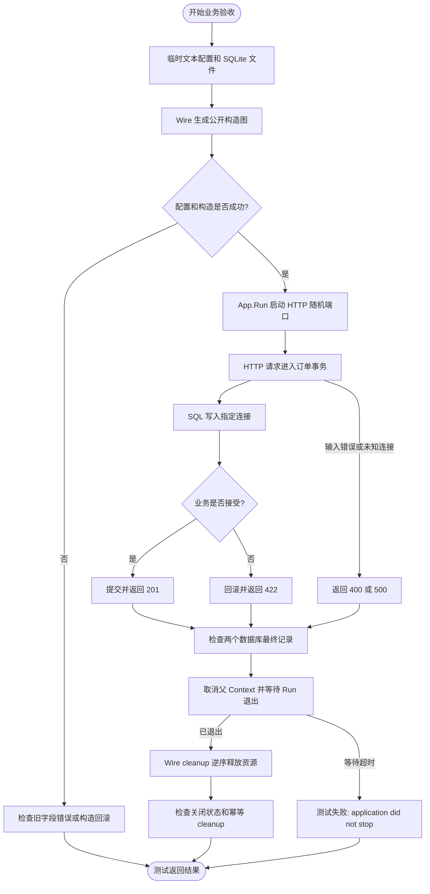
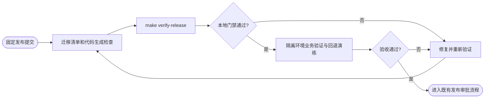
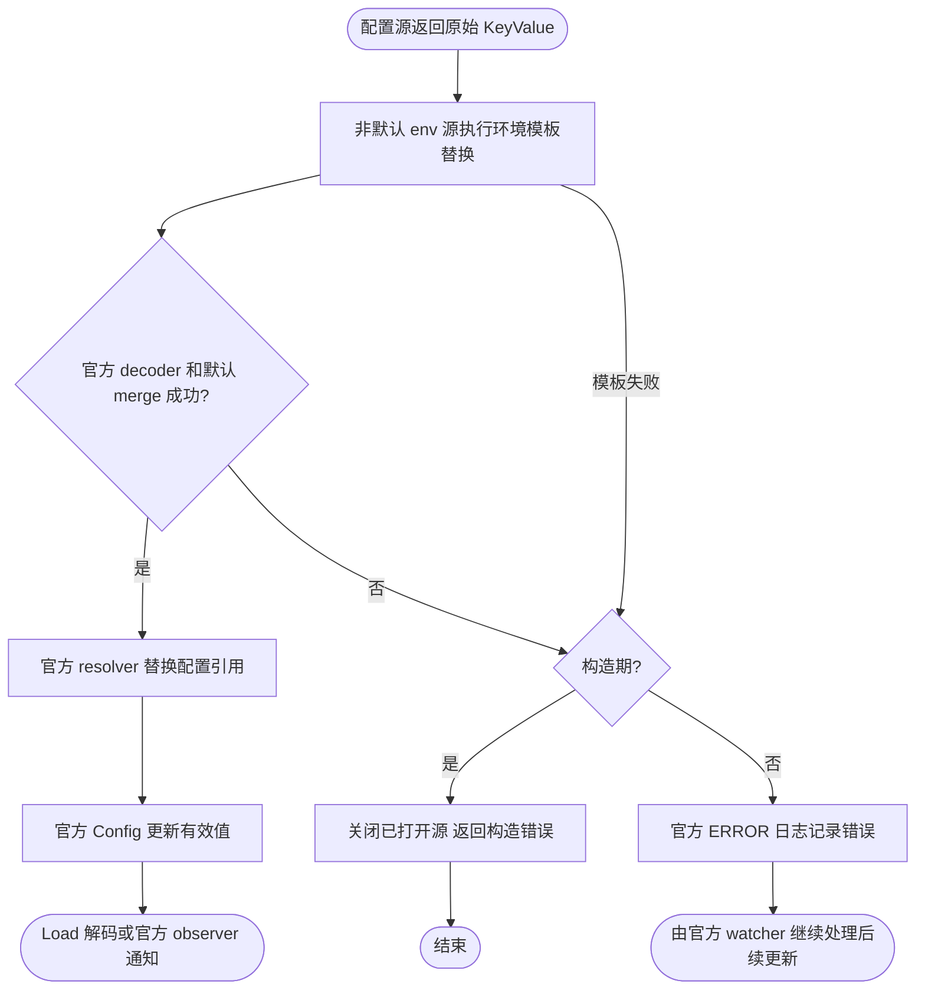
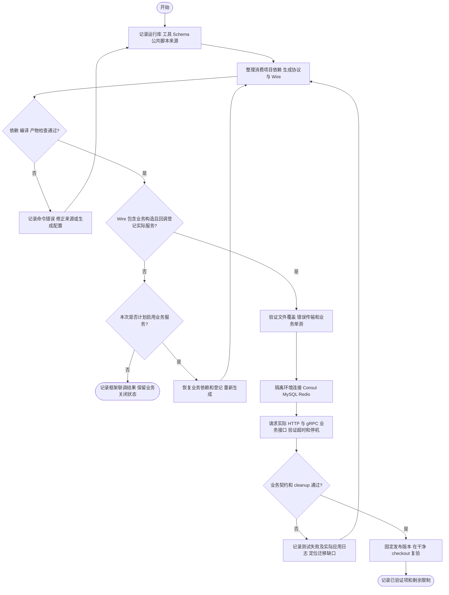
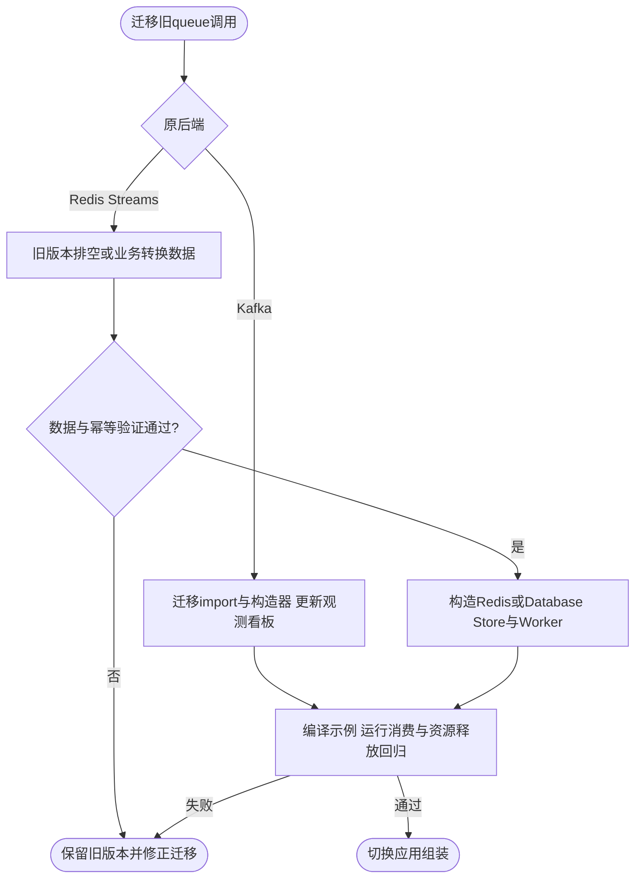
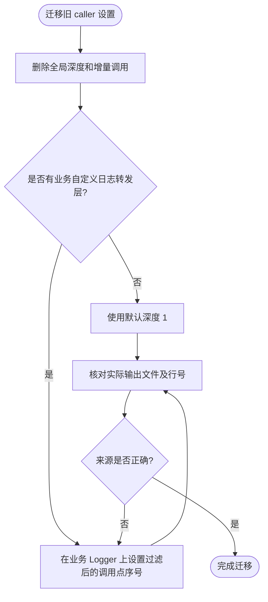
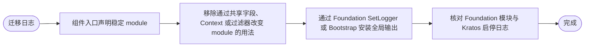

# main → v2 迁移与发布清单

本文对应 main `4fd91b2` 到 v2 的公共接口迁移。适用于应用接入方和框架发布者；
迁移完成意味着应用完成配置和 Wire 改造、重新生成协议代码，并通过本文的业务验收。
仅改 import 前缀不构成迁移完成。

## 资源容量默认值

- WebSocket 旧注册入口现在默认限制传输载荷及解压后消息为 1 MiB。需要其他大小时使用 `WebSocketWithConfig`；`MaxMessageBytes: -1` 显式恢复旧的无限制行为，`0` 使用默认值。见 [Server 文档](pkg/server/README.md)。
- 两种 Cron Delay 策略现在默认每任务每进程允许最多两个调用进入执行权竞争（本地为一轮执行、一轮等待）；超额触发跳过并告警。通过 `WithMaxPendingRuns` 调整，`-1` 恢复无界等待。AllowOverlap 和 Skip 不变。见 [Job 文档](pkg/job/README.md#delay-容量)。
- Deadline 前缀改用只读索引，匹配与更新失败回退语义不变，无需迁移路由配置。

## 驱动与配置源优化兼容性

OSS 的不同逻辑 bucket 现在可以并发调用 factory；自定义驱动必须并发安全并为外部调用设置超时。同名创建仍合并，cleanup 等待已受理创建完成后关闭实例，业务先停止使用再释放。并发及释放流程见 [OSS 文档](pkg/oss/README.md#构造与释放)。

配置更新直接使用官方 Watcher.Next 结果和默认 merge，不重新 Load 来源，也不提供 FullSnapshot 扩展或删除回退。Kafka 批量和并发默认值、同步提交语义不变。Broker 重启可能产生的首读 EOF 现在最多额外重建三次，成功提交后重置预算；明确认证/授权失败仍终止，见 [Kafka 恢复说明](pkg/kafka/README.md)。

## 迁移清单

| 检查 | main 用法 | v2 操作与验收 |
|---|---|---|
| [ ] 工具链 | Go 1.24.12 | 使用根 go.mod 要求的 Go 1.25+；SQLite 验证需要 CGO 和 C 编译器 |
| [ ] 模块路径 | `github.com/jaggerzhuang1994/kratos-foundation` | 改为 `github.com/jaggerzhuang1994/kratos-foundation/v2`，执行 `go mod tidy` |
| [ ] 组装入口 | 领域包中的 Wire/Bootstrap、根 provider set | 使用 `pkg/bootstrap` 和公开构造函数；不得导入领域 internal；重新运行业务 Wire |
| [ ] 组装顺序 | App 直接依赖多个领域 Bootstrap | `InfrastructureBootstrap → Bootstrap → StartupReady → NewKratosApp`；业务 provider 显式依赖基础设施标记 |
| [ ] 资源所有权 | 各组件 release/关闭方式不一致 | 保留构造函数返回的 cleanup；先停止 App，再由 Wire 逆序清理；启动失败检查回滚 |
| [ ] 应用身份 | `pkg/app_info`、GetId/GetName 等 | 使用 `pkg/appinfo` 的 ID/Name/Version/Metadata；检查注册信息与日志身份 |
| [ ] 配置源 | NewConfig 根据环境安排文件/Consul 优先级 | 用 `config.NewSources` 显式排序，后面的源优先；使用 `contrib/config/file/consul/text` |
| [ ] 配置读取 | Kratos Config/Value/Watch 调用 | 改为 `config.Manager.Load/Subscribe`；回调对象独立，取消订阅不等待正在执行的回调 |
| [ ] 订阅语义 | 曾提供多订阅、首次回放及队列 | 现在下一轮成功 Scan 后异步回放当前值，之后按变化串行通知；支持缺失 key 和同 key 多订阅 |
| [ ] 客户端构造 | 旧 Factory 构造及 ResolveClient/MakeGrpcConn/MakeHttpClient | 使用新的 NewFactory 依赖签名；`AcquireClient(ctx, name)` 成功后必须 `defer release()` |
| [ ] 连接选择 | WithDefaultConnName/WithConnName | 生成客户端用 `NewXxxWithConnName(factory, name)`；手写调用显式传连接名 |
| [ ] 调用选项 | GrpcCallOptionFromContext/HttpCallOptionFromContext 等 | 改用 WithGRPCCallOptions / WithHTTPCallOptions 后重新生成；按实际协议透传，原生客户端仍可直接使用 |
| [ ] 协议能力 | GRPCS 枚举、流式 RPC | GRPCS 已删除，不能假定旧枚举提供安全传输；当前 Factory gRPC 走 DialInsecure。TLS gRPC 与流式调用需业务独立适配，不属于生成适配器能力 |
| [ ] 数据库 | GetConnection、UseRead/UseWrite、replicas/datas 自动路由 | 改用 Connection、UseConnection；把目标库配置为独立连接；确认读流量没有全部迁回主库 |
| [ ] 数据库驱动 | 核心包隐式携带实现 | 显式空导入 `contrib/database/mysql` 或 `contrib/database/sqlite`；SQLite driver 名称为 `sqlite3` |
| [ ] 事务 | WithSqlTxOptions，可跨 Manager 误用事务 Context | 使用 `WithSQLTxOptions(*sql.TxOptions)`；事务绑定所属 Manager；嵌套事务不能重新指定 SQL 事务选项 |
| [ ] Redis | GetConnection 和 Manager 透传 Redis 方法 | 使用 `Connection(name)` / `Default()` 获取 client；Manager 持有 client，业务不得单独 Close |
| [ ] 任务 | job 配置与旧注册/Bootstrap | 使用 job.Spec、Manager 和 `bootstrap.NewJobBootstrap`；区分 Once/Daemon/Cron，业务任务响应 Context 取消 |
| [ ] 错误生成器 | IsXxx 同时检查 HTTP code | v2 使用 reason + reason_code；确认依赖 HTTP 状态区分错误的逻辑已迁移 |
| [ ] 错误消息 | 可变参数依赖旧格式化行为 | 单字符串原样保留；多个参数且首参数为 string 时格式化。建议先 Sprintf/Sprint 再传一个字符串 |
| [ ] 可选新能力 | 无统一 Queue/Kafka/OSS 接入 | 仅按业务需要接入；Queue 持久化重试、失败管理和 Kafka 消费均不提供业务 exactly-once，仍需业务幂等 |

### 应用 Spec 登记迁移

`bootstrap.NewSpec(application, servers, jobs, sources)` 注入三个共享领域 Spec 和具体的 ConfigSources 描述，不再自行创建领域 Spec 或依赖具体配置驱动。Wire 添加 `app.NewSpec`、`server.NewSpec`、`job.NewSpec`（BaseProviderSet 已包含），删除 `ApplicationSpec` provider；需要 Spec 的构造函数直接接收对应类型。配置声明 provider 也须接收并转交这三个依赖，更新后重新生成 Wire。

`app.Spec` 的 RegisterRuntime、RegisterAppInfo、RegisterLogger、AddContext、AddMetadata、AddEndpoints、AddSignals 及 Hook 登记方法不再返回 error；删除调用方的错误分支，直接调用即可。冻结后写入会 panic(app.ErrSpecFrozen)，重复登记非 nil AppInfo/Logger 也会 panic。NewApp 的配置、依赖、Context 构造失败及重复冻结仍返回 error。
`bootstrap.Spec` 的声明和转发方法返回同一 `*bootstrap.Spec`，支持链式调用；RegisterRuntime 立即调用共享 application.RegisterRuntime，移除暂存列表和延后重放。移除 bootstrap 阶段状态和调用顺序检查；配置源在 Spec provider 中声明，业务在返回 Bootstrap 的 provider 中描述蓝图，由 Wire 依赖链保证先声明后构造。自定义 Runtime 的登记顺序现在取决于实际调用顺序，App 的并发启动策略不变。流程见 [app](pkg/app/README.md#runtime-登记)。
`NewAppInfoBootstrap`、`NewMetricsBootstrap` 只返回完成标记；修改 provider set 的消费代码后通过实际 Wire 入口重新生成。Wire 对 error 返回执行回滚，不保证 panic 时回滚整条依赖链。

### 服务器声明入口迁移

当前版本移除 HTTPBuilder/GRPCBuilder 的 `Enable/Disable`，部署开关改用 `server.http.disable` 和 `server.grpc.disable`。
业务 HTTP 默认开启；worker 如需保持没有业务监听，必须显式配置 `server.http.disable: true`。
gRPC 省略 disable 时，仅非 nil 服务注册回调触发开启；显式 false 开启，true 关闭。
原来依赖 `Grpc()`、Middleware 或 Option 启用的调用方，须注册服务或在配置中显式开启。
原 `HTTP().HealthChecks(...)`、`HTTP().Health(HealthConfig{Checks: ...})` 改为 `Health().Checks(...)`，
HealthConfig 中的地址、路径、开关和检查期限迁移至 `server.http.health`。
这些字段构造期读取，修改需重启；不提供监听热启停。完整流程图及监控地址归并见 [server](pkg/server/README.md)。

### 删除或改名的配置

目标 protobuf 配置解码时，已删除字段即使值是 null 或空对象也会被拒绝；Manager 不再全局预检未读取的字段。

| 旧字段 | 迁移方式 |
|---|---|
| 旧顶层 `log` | 当前版本重新提供 log 运行期策略；旧输出资源字段迁移至 LOG_* |
| 顶层 `metrics` | 显式构造 Provider，HTTP 指标端点使用 `server.http.metrics` |
| 顶层 `job`、`queue` | 强类型 Spec/构造配置与显式组装 |
| `app.disable_registrar` | 由 Wire provider 返回 `registry.Registrar`；返回 nil 禁用服务注册 |
| `server.middleware.timeout`、`client.clients.*.middleware.timeout` | 改成 `deadline`，按需求设置 fallback_timeout/max_timeout/min_budget |
| `database.connections.*.replicas/datas/trace_resolver_mode` | 删除，改为独立连接和显式选择 |
| `server.log`、`tracing.log`、`tracing.tracer_name` | Logger 派生和 Provider instrumentation scope |
| `redis.connections.*.read_only` | 删除，重新核对 Redis 接入方式 |
| `redis.connections.*.disable_indentity` | 拼写改为 `disable_identity` |

Deadline 缺失时默认回退超时为 10s，仅在父 Context 没有截止时间时生效；显式 `0s`
关闭回退超时。不要把旧 timeout 字段机械改名后沿用语义。

仅支持文档声明的热更新范围：app.stop_timeout、server.middleware、client.clients、
tracing.sampler 和数据库连接池参数。DSN、驱动、连接集合、服务监听地址等变化需要重启。
恢复 main 的 protobuf 字段编号后，此前未发布 v2 的二进制配置不能复用；从 YAML/JSON 重新生成。

### v2 开发期可选依赖迁移

此前 v2 开发版本的 `app.Spec.RegisterRegistrar`、`bootstrap.Spec.RegisterRegistrar` 和
`job.Spec.Coordinator`（包括 `job.Builder.Coordinator`）已移除。Registrar 改为
`app.NewApp` 的最后一个构造参数或 `bootstrap.NewKratosApp` 的 registrar 参数；Coordinator 改为
`job.NewManager` 的最后一个构造参数或 `bootstrap.NewJobBootstrap` 的 coordinator 参数。
删除 Boot 中的对应登记，给 Wire 增加返回目标接口的 provider，再重新生成 injector。
禁用时返回 nil interface，启用时选择对应 contrib 实现；分布式 Cron 在协调器为 nil 时仍报构造错误。
完整示例和构造流程见 [Bootstrap 文档](pkg/bootstrap/README.md#可选依赖由-wire-构造注入)。

### CallOptions 迁移示例

优先使用 `client.WithGRPCCallOptions(ctx, grpc.WaitForReady(true))` 后调用重新生成的统一客户端。
切片隔离及 HTTP 对应 API 见 [client README](pkg/client/README.md#单次调用选项)。

需要直接使用原生客户端时，以下以业务生成的 `orderspb` 为例，业务持有完整调用租约：

```go
_, conn, release, err := factory.AcquireClient(ctx, "orders")
if err != nil {
    return nil, err
}
defer release()
if conn == nil {
    return nil, fmt.Errorf("orders requires a gRPC connection")
}
return orderspb.NewOrderServiceClient(conn).CreateOrder(ctx, request, grpc.WaitForReady(true))
```

调用方仍需给 ctx 设置合理截止时间。HTTP 同理，租用 HTTP client 后调用原生 HTTP
生成客户端；如果直接读取响应体，完成读取和 Body.Close 后才能归还租约。

### 生成器与版本

两个独立模块和二进制现在分别为：

- `github.com/jaggerzhuang1994/kratos-foundation/cmd/protoc-gen-kratos-foundation-client-v2`
- `github.com/jaggerzhuang1994/kratos-foundation/cmd/protoc-gen-kratos-foundation-errors-v2`

它们的 module 路径不在根模块 `/v2/cmd` 下。`-v2` 是工具名的一部分，不会让根模块的
`v2.x.y` tag 自动变成子模块版本。独立子模块发布需要自己的目录前缀 tag；按照当前 module
声明，例如 client 子模块的 `cmd/protoc-gen-kratos-foundation-client-v2/v1.0.0`，errors 同理。
这里只说明规则，不表示这些 tag 已存在；发布清单必须记录实际 tag 或固定提交。

业务构建应固定生成器版本，避免使用浮动 `@latest`。开发仓库可通过 `make init` 安装本地工具；
该 target 也会安装第三方生成工具。新 protoc 参数为：

```sh
protoc <业务原有参数> \
  --kratos-foundation-client-v2_out=paths=source_relative:. \
  --kratos-foundation-errors-v2_out=paths=source_relative:. \
  <业务协议文件>
```

显式 `--plugin` 映射的名称也必须带 `-v2`。重新生成后检查 import 指向框架 `/v2`、Wire 编译通过，
并删除不再使用的旧生成代码。原 HTTPImplProvider/GRPCClientImplProvider 别名已删除，改用 XxxProvider。

## 业务验收与自动化入口

```sh
make init-lint       # 首次准备 lint 工具，版本由 Makefile 固定
make lint            # 根模块和三个生成器模块使用同一份 .golangci.yml
make test-business   # 下面的业务矩阵，强制重新执行
make verify-release  # 顺序执行 verify、lint、test-business，失败立即返回非零
```

`verify-release` 不发布、不推送、不打 tag，也不修改生成文件。`verify` 包含逐模块 test/vet/race；
覆盖门禁只保证手写函数不是 0% 执行覆盖，不代表分支全覆盖或断言完整。

`test-business` 使用现有 Wire 外部模块 fixture：临时生成 Wire 代码，使用当前工作树的公开 API，
启动真实 App 和 HTTP 服务，通过真实 SQLite 驱动提交及回滚订单。每次使用独立临时数据库和
本机随机端口，追踪导出关闭，不依赖 MySQL、Redis、Consul 或云账号。Wire 子进程测试启用
`-race -count=1`；生成客户端的契约测试另行在临时模块编译执行。

| 自动验收项 | 成功条件 | 测试位置 |
|---|---|---|
| Wire 构造与冻结 | 基础设施/业务贡献完成后才冻结 Spec | `pkg/bootstrap/wire_integration_test.go` |
| HTTP 订单提交 | 返回 201，默认库只有成功订单 | fixture `TestBusinessHTTPTransactionsAndCleanup` |
| SQL 已写入后业务拒绝 | 返回 422，被拒绝订单未持久化 | 同上 rollback 子用例 |
| 显式连接选择 | audit 订单只出现在 audit 数据库 | 同上 named connection 子用例 |
| 错误输入和未知连接 | 返回 400/500，不写入订单、不暴露原始数据库错误 | 同上 invalid input/unknown connection 子用例 |
| App 与资源所有权 | 父 Context 取消后 Run 退出；数据库直到 Wire cleanup 才关闭，重复 cleanup 安全 | 同上 |
| 构造失败回滚 | NewApp 失败后恢复全局 Logger | fixture `TestGeneratedAssemblyRollsBackOnAppConstructionFailure` |
| 旧配置拒绝 | 只在实际业务 protobuf 解码时检查保留字段，例如 database replicas | fixture `TestBusinessRejectsRemovedConfig` |
| 生成客户端契约 | HTTP/gRPC 分支、错误链和租约释放通过 | client-v2 `TestGeneratedClientsCompileAndReleaseLeasesAgainstPublicFactory` |

HTTP fixture 是最小订单场景，不代替真实业务服务的权限、限流、幂等及数据迁移验收。
生成客户端契约测试替代了协议网络边界，不代表真实 gRPC 服务互通；项目的重连测试另由 `make verify` 执行。



图中 App.Run 是测试拥有的唯一新增执行协程，主测试通过父 Context 取消它，并通过 done channel
等待退出后才释放资源；未新增业务锁或改变框架同步策略。测试失败由 Go testing 报告，未虚构业务日志事件。

## 发布前人工清单

- [ ] 完成上面的迁移项；对未使用的能力标明“不适用”，不要默认为已验证。
- [ ] 运行 `make proto`，检查生成产物与预期一致；稳定提交上再次生成应无差异。
- [ ] 执行 `make verify-release`，保留提交 SHA、Go/lint/protoc 版本及命令输出。
- [ ] 从业务仓库重新生成 Wire 和全部协议，完成 HTTP/gRPC 真实互通、CallOptions 透传验收。
- [ ] 使用隔离测试环境验证实际采用的 MySQL/Redis/Consul/Kafka/OSS；检查断连恢复、权限、数据隔离。
- [ ] 若使用队列，验证重复投递、幂等、死信和停机期间确认语义。
- [ ] 若原来使用读副本/表路由，确认显式连接选择及主从负载分布。
- [ ] 演练配置非法更新、订阅终止告警和需要重启的配置变更。
- [ ] 演练滚动发布与回退；旧二进制应使用其对应旧配置，不能直接读取迁移后的 v2 配置。
- [ ] 在业务负载下验证延迟、连接池容量和整体停机时长；本地测试不提供性能结论。
- [ ] 记录根模块与各生成器的实际版本；经发布流程批准后再打 tag、推送或部署。



默认 HTTP 现在保留 `/healthz`、`/readyz`，不受业务前缀和鉴权影响；已有同名路由需迁移或显式关闭健康端点。详见 [server README](pkg/server/README.md#默认健康检查)。配置订阅边界见 [config README](pkg/config/README.md)。

监控端点地址可通过 `server.http.metrics.addr` 和 `server.http.health.addr` 指定；为空时复用业务 HTTP，相同时共享监听。路径相对于所选监听根路径，不再受业务 PathPrefix/Filter 影响，已有前缀抓取地址需同步调整。独立端口需同步更新部署端口与抓取/探针地址；手工组装需额外登记 `Runtime.ManagementServers()`，NewServerBootstrap 自动登记。

## 环境模板与官方配置引用

Source 预处理保留环境变量模板 `$VAR` / `${VAR}`、`${VAR:-default}` 和 `${VAR:?描述}`，在 JSON/YAML 解码前替换。合并后继续使用官方默认 resolver，解析 `${key}` / `${key:default}` 配置引用。

业务源中的配置引用须写成 `$${database.host}` 或 `$${database.port:5432}`，通过 `$$` 跳过第一阶段。默认 resolver 输出字符串，不启用额外的实际类型转换选项。第一阶段产生的字面 `${...}` 仍会被第二阶段处理。官方不维护引用依赖图，仅更新被引用字段不会重算此前已替换的字符串；来源更新应同时返回引用模板。详细边界见 [环境变量模板](pkg/config/README.md#环境变量模板)。



## 消费项目迁移经验：auth_service

以下经验来自 2026-09-11 对 auth_service 工作区的审阅（业务基线 `7930c17`，
初次 Foundation 基线 `7de373d`，后续重新接入 `3286f7783051`）。业务仍含未提交改动，
且业务服务注册由维护者有意注释以进行框架联调；这不是迁移缺陷。这是开发期案例，不是发布验收记录；
`require v2.0.0` 配合本地 `replace` 只能说明声明版本，不能证明正在运行已发布的 v2.0.0。

### 先确认实际依赖，再整理迁移改动

需要分别记录四种来源：Foundation 运行库、生成器、配置 Schema、公共构建脚本。
本例运行库由 `go.mod replace` 选择；Schema 由解析出的模块目录提供；三个生成器是独立模块，
已安装二进制不会随运行库更新；公共 Makefile 又来自 `CYBERKITE_DIR` 指定的另一份工作区。
只固定业务仓库提交，仍可能无法在 CI 重现生成结果。

在消费项目根目录检查运行库和工具，工具路径按项目实际位置调整：

```sh
go list -m -f '{{.Path}} {{.Version}} {{.Dir}}' github.com/jaggerzhuang1994/kratos-foundation/v2
go version -m ./tools/protoc-gen-kratos-foundation-client-v2
go version -m ./tools/protoc-gen-kratos-foundation-errors-v2
go version -m ./tools/protoc-gen-jsonschema
```

本例的 `FOUNDATION_PLUGIN_DIR`、`FOUNDATION_PLUGIN_VERSION`、`FOUNDATION_CONFIG_SCHEMA`
属于消费项目公共 Makefile 的变量，不是 Foundation 的统一配置 API。核对项目默认赋值后再选择来源：
若项目已写入 `FOUNDATION_PLUGIN_DIR ?= /本地路径`，仅 `unset FOUNDATION_PLUGIN_DIR` 不会切回远端；
应删除该默认值或在命令行显式传 `FOUNDATION_PLUGIN_DIR=`。Make 变量值不要自带 shell 引号，
由使用变量的 recipe 负责引用路径。

本地 Foundation 增加依赖后，消费项目也要重新整理依赖。本次原工作区定向测试在编译前报告
`compose-go/v2/template` 缺少 `go.sum` 条目；后续接入已在消费项目执行 `go mod tidy` 补齐。
遇到同类问题应执行 tidy 并审阅差异，
不要按报错提示直接依赖 Foundation 的 `internal` 包，也不要手改 `go.sum`。
发布前移除绝对路径 replace，固定运行库、各生成器和公共脚本的实际版本，再在干净 checkout 验证。

### Wire 成功不代表业务服务已登记

本例记录的是旧 `ConsulBaseProviderSet`、单一 `bootstrap.Spec` 和统一组件构造的迁移阶段；
当前仅使用 `BaseProviderSet`，新代码按 [Bootstrap 文档](pkg/bootstrap/README.md) 组装。
维护者有意将 `cmd/auth_service/bootstrap.go` 的 Auth HTTP、Auth gRPC、RBAC gRPC 注册调用注释用于框架联调，
对应服务参数也被移除。`wire_gen.go` 因此没有构造 AuthService、RbacService 及其业务依赖。
ProviderSet 列出了构造函数，并不表示 Wire 一定执行它们。

业务服务被有意关闭时，以下检查属于将来启用服务的验收，不要求恢复当前注释。启用时同时覆盖三个层次：

- 编译图：业务 Bootstrap 显式接收实际服务，生成的 Wire 包含所需业务和资源构造及 cleanup。
- 注册图：HTTP/gRPC 注册回调实际调用生成的 `RegisterXxx`；空回调只能证明组件被选择。
- 运行契约：用真实业务 HTTP 路由和 gRPC 方法请求验证成功与失败响应，不能只检查监听端口或健康探针。

将来恢复业务登记时应修改 Bootstrap/Wire 源并重新生成，不直接修改 `wire_gen.go`。
演示 Job、调试生命周期输出和日志全局设置应单独核对是否属于应用需求，不能作为迁移模板照搬。
Registrar 与 Job Coordinator 由 Wire 构造注入，细节见 [Bootstrap 文档](pkg/bootstrap/README.md)。

### 协议搬迁要统一映射，并控制类型来源

本例把 Auth/RBAC 和调用方所需的 Base API 移到业务 `api/`，使用模块内生成包；
共享 `cyberkite` 类型仍引用原依赖包，`third_party/cyberkite` 仅作 include。
不要把“API 已搬迁”理解为“全部共享协议也要在每个服务重新生成”。
搬迁前后核对 protobuf package、消息/枚举全名、字段编号、RPC 名称及 HTTP 绑定；
Go import 改变不应顺带改变线上协议。若同一进程仍经间接依赖导入旧 API 包，要检查是否重复注册同名描述符。

统一 `M文件=Go包路径` 映射应传给所有启用的插件，而不仅是 Go 插件：
Go、gRPC、HTTP、Foundation client/errors、校验和文档产物必须指向一致的类型。
本例 PGV 的生成目标不能仅靠 M 参数重定位，公共脚本使用适配器在内存
`CodeGeneratorRequest` 中设置相同的 `go_package`，再调用原 PGV；不修改源 proto 或手改生成文件。
这是该工具链的处理方式，不能假定所有插件都遵守同一参数语义。

还应拒绝不同 include 根下的同名 proto import 路径，保留第三方协议自身的 `go_package`，
并使 include 副本与实际 Go 依赖版本同步。生成后检查输出目录、package/import、预期文件是否存在，
在稳定输入和固定工具上再次生成应无差异。仅检查 protoc 退出码会漏掉错误目录或缺少产物的问题。

### 配置验收覆盖来源、合并结果和外部配置

以下配置示例属于旧版混合来源迁移记录：当时目录转 `file.PathList` 的规则由业务定义，
根目录 `*.yaml` 后加载 `{APP_ENV}/*.yaml`，local 文件优先、其他环境 Consul 优先。
当前使用 `spec.Configuration` 显式声明路径与覆盖顺序，移除了按环境选择文件/远程配置的组装逻辑。

本例 `internal/conf/source_test.go` 用临时文件验证顺序和最终覆盖值，并通过 v2 Manager
读取业务 Duration 与 `server.middleware.deadline.fallback_timeout`。这类测试比单独检查 YAML 语法更有效，
但仍不等于构造全部组件或验证 Consul 中的实际配置。发布前还应逐份清理远端旧字段，
检查环境模板替换后的值，并用隔离环境验证组件构造。业务 Schema 应合并所选运行库的
`config.schema.json`，避免编辑器接受运行时已经拒绝的字段。

### 错误迁移必须经过实际传输边界

WebAuthn 撤销凭证错误携带 `rpId` 和 `credentialId`，调用方依赖这些字段执行后续动作。
只验证业务函数返回的 `WithHTTPData`，无法证明 HTTP 网关经过 gRPC 后仍能读取它。
本例 `TestNewWebAuthnCredentialRevokedError` 验证：

```text
业务错误 → FromError → GRPCStatus().Err() → FromError → HTTPData()
```

断言包括 HTTP code、reason_code、生成的 `IsXxx`、JSON 字段名和 base64url 凭证 ID。
当前 Foundation 的 [gRPC 错误实现](pkg/errors/grpc.go) 已携带并恢复可 JSON 编码的 HTTPData，
相关契约位于 [gRPC 错误测试](pkg/errors/grpc_test.go)；发布版本需要包含该行为。
此单测覆盖 status 编解码，不代表真实网络和网关链路已经通过；还需实际 gRPC→HTTP 互通验收。
服务间 gRPC 保留错误栈和 cause 的诊断文本，Go cause 对象及 sentinel 身份不能跨网络恢复，HTTP 响应头不转发。

Redis 迁移除 `Manager.Default()` / `Connection(name)` 外，还应将缺失键判断迁到
`github.com/redis/go-redis/v9` 的 `Nil`，继续使用 `errors.Is`。
本例缺失会话映射“已过期”，基础设施失败映射内部错误，两者不能在替换接口时合并。

### 建议的验收顺序



图中记录节点是验收动作，不表示框架新增日志或自动回退。
后续接入已整理消费项目依赖，将运行库和插件路径改为一致的相对目录，并同步 README 的协议目录、
插件来源和服务登记说明。业务注册被注释是维护者的明确选择，保留该状态。
当前仍是本地源码接入；发布版本固定、外部配置与真实业务互通验收应在对应发布阶段完成。


## 持久化任务队列与 Kafka 分离

本次接口迁移保留独立 `pkg/queue`，`pkg/job` 继续管理 Cron/Once/Daemon，不改名。旧 Kafka 消息 API 迁入 `pkg/kafka`：`contrib/queue/kafka.NewProducer/NewConsumer` 改为 `kafka.NewProducer/NewConsumer`，旧 `queue.NewProducer` 观测装饰器改为 `kafka.NewManagedProducer`；Message、ConsumerRuntime、RetryPolicy 等改用 kafka 包。Kafka offset、批量顺序、恢复和死信语义保留；观测事件/标签改为 kafka.*，指标改为 kafka_*，告警及看板需同步。既有 x-queue-* 消息头保留兼容。

旧 Redis Streams 实现不再提供。新 Redis Store 由业务通过 `Config.KeyPrefix` 指定前缀，内部追加 `:tasks`、`:ready`、`:delayed`、`:reserved`、`:failed` 五种键后缀，无法直接消费旧 Stream/PEL；切换前用旧版本排空旧流，或由业务编写一次性转换任务，确认已处理记录及业务幂等后再切换。不要把原 Stream 名直接当成已迁移的数据。使用过中间版本 `Config.Queue` 的调用方改为提供 `KeyPrefix`；如需继续使用该版本已有数据，应把原 `foundation:queue:{hash}`（不含最后的冒号）作为前缀传入，驱动不自动迁移或重命名键。

任务队列对外使用 `NewQueue(definition, store, observability)` 构造 `Queue[T]`，通过 `Post` 投递、`q.Worker(handler, config)` 创建 `Worker[T]` 并登记 Runtime；默认 Bootstrap 集合提供共享的 Observability。不同队列由不同命名消息类型区分 Wire 实例；旧 Publisher/Consumer/非泛型 Worker 构造不保留兼容入口，详见[类型化 API 迁移](pkg/queue/typed.md#api-迁移)。驱动层保留 `Task` 和 `Store` 契约，投递统一使用 Queue.Post/PostWith。延迟用 `Task.AvailableAt`，RetryPolicy 表示跨进程持久化领取次数及退避；失败任务通过 `Store.Failed` 查询、`Store.Retry` 人工重投。原 PublishBatch/Consumer/Delivery 和死信 Producer 配置只适用于迁移后的 Kafka 消息 API，不是新任务队列契约。Database 改为 `NewStore(repo)`，业务实现 `database.Repo`；Repo 实例绑定单个队列，业务可为不同队列使用不同表；框架提供包含 queue.Task、租约和失败状态的 `database.TaskRecord`，它没有 Queue 字段、TableName、GORM 标签或数据库行字段；持久化实体及编码由业务 Repo 定义，不导入 ORM/SQL 驱动，不再提供 Store.Migrate；可选 `contrib/queue/database/gorm` 提供 SQLite/MySQL 泛型 Repo 和可嵌入的存储 Model，模型工厂填充自定义字段，表名和迁移由业务负责；Insert 可复用业务显式事务，成功仅表示写入事务，最终以外层提交结果为准；消费操作须独立完成提交，只读取已提交任务。示例、默认值及重投边界见 [Queue 文档](pkg/queue/README.md)。



## 组件指标接入补充

Database 指标默认新增 GORM SQL 操作计数和耗时，仍由 database.metrics.disable 控制；database.metrics.labels 除 db_name 外新增 operation、result 为保留标签，已有同名自定义标签需改名。Redis 指标新增 redis_connection 标签，历史序列与升级后序列不同。

Grafana 实例明细使用新 target 抓取标签，需同步更新应用与健康探测 relabel；旧历史数据仍可按 instance 查看。Queue Stats、OSS、业务缓存与 Lock 指标需显式接入，不会自动观察绕过封装的调用。接口、所有权及边界见 [组件指标指南](deploy/observability/docs/components.md) 与 [业务接入指南](deploy/observability/docs/business-metrics.md)。

## 秒单位直方图分桶

Foundation Metrics Provider 现在为 OTel `Histogram` 且 `Unit="s"` 的指标统一设置从 0.0001 秒到 86400 秒的显式桶，覆盖 instrument 的建议分桶。修复 Kafka、Queue、OSS 等低延迟操作因 SDK 首桶过大而显示约 4.75 秒 P95 的问题，并保留 Job 的长任务范围。毫秒单位的 Redis SDK 指标和原生 Prometheus collector 不受影响。

指标名称、sum 和 count 不变，bucket 序列会变化。滚动升级期间不要把新旧分桶直接混合解释为稳定的分位数；等待查询窗口全部覆盖新版本，或按版本隔离。详细边界见 [Metrics](pkg/metrics/README.md)，实际验证见 [组件演示](examples/components/README.md)。

## Caller API 简化

本次变更删除 `Logger.AddCallerDepth(...)` 和包级 `log.WithCallerDepth(...)`，仅保留派生方法 `Logger.WithCallerDepth(n)`。其语义从原始 Go 栈深度改为过滤内置日志包装后的第 n 个调用点；默认 1，n <= 0 恢复默认，多次设置以后一次为准。

直接日志、Kratos Helper/Context/全局入口以及内置 Kafka/Cron 适配器无需补偿。删除原有针对这些包装的 +1/+2 配置。业务自定义日志转发函数仍计入调用点：一层包装使用 `logger.WithCallerDepth(2)`，不要把旧的基准 6 或最终栈深度直接复制到新 API。需要不同深度时在对应业务封装入口派生 Logger，不设置全局值。自定义 Logger 实现同步删除旧增量方法，并遵循新深度契约。

GORM 日志优先使用其提供的查询来源作为 caller，查询位置不受深度设置影响；来源无效时按普通日志规则处理。完整边界见 [日志文档](pkg/log/README.md#caller-depth)。




### 旧 cyberkite 错误的运行期兼容

新版 `errors.FromError` 可直接读取旧结构化错误的 Code/Reason/Message/Metadata，旧 422 不再先经 gRPC Unknown 丢失为 500。Server 默认常驻错误边界与 HTTP Encoder 使用 `errors.Normalize`，发送 gRPC 时保留 `http_code`、`err_stack` 及 cause 诊断文本，过滤响应头。普通未知故障的公开消息统一安全兜底；网关记录诊断后在公开出口过滤堆栈。

尚未升级的发送端若已经丢失 HTTP 状态，接收端仍不能从 reason_code 推断原状态；应升级发送端。业务应去除返回错误处重复日志，保留原因链。默认访问日志不再记录 args/完整堆栈，关闭访问摘要仍保留服务端错误日志；该变化的流程与配置边界见 [Server 错误边界](pkg/server/README.md#请求错误边界与安全日志)。

## 日志 module 必需字段

每条 Foundation 输出现在包含一个有效 module。根实例与未标记的全局调用使用 `unknown`；组件构造入口应使用 `WithModule`。固定模块不再被普通 KV 覆盖，共享 KV 和 Context 不参与模块选择，所有过滤规则均保留 module。普通字段的覆盖规则不变；孤立字段补值 `(MISSING)`。

全局输出通过 Foundation `log.SetLogger` 安装；Kratos 全局 SDK 日志由适配器标记为 `kratos`。直接使用 Kratos SetLogger 会绕过此适配器。Bootstrap cleanup 恢复完整旧绑定。详细规则和流程见 [日志文档](pkg/log/README.md#字段过滤与去重)。



## 日志消息与自定义 msgKey

全局及实例消息方法统一应用当前 `msgKey`。调用方改用 `log.WithModule("config/file").With("files", matches).Info("Matched local configuration files")`，其中 `matches` 为已匹配的文件列表，避免通过 `Infow("msg", ...)` 写死消息字段。原始 `Log/*w` 仍保留调用者给定的键值。

模块视图借用获取时的全局输出，持续应用共享设置，但不跟随之后的 SetLogger；在使用处获取。`Context` 返回的 Kratos Helper 捕获构造时消息字段名，长期保存时优先使用模块 Logger 的 WithContext 视图。消息文案改为具体描述，函数、错误和业务上下文保留为独立字段；原先按管道分隔消息字符串检索的规则需同步调整。流程及完整契约见 [消息输出规则](pkg/log/README.md#字段过滤与去重)。

## 日志三层策略与 API 收敛

当前版本重新开放顶层 `log` 作为运行期策略，配置使用 JSON 字段名，不保留旧二进制字段编号。仅支持当前 schema 中的策略字段；根 level/disable/filter_empty/time_format/msg_key 固定于 `LOG_*`；filter_keys/std/file 以 env 为初始值并支持热更新。

- `log.WithLevel(...)`、`log.WithFilterKeys(...)` 改为返回派生 Logger，必须保存或使用返回值；忽略结果不再修改进程状态。
- `log.WithKV(...)` 改为 `log.With(...)`；AppInfo/Tracing 等组装层共享元数据使用 `log.RegisterFields(...)`。
- 删除包级 `WithFilterEmpty`、`WithTimeFormat`、`WithMsgKey`；改用 `LOG_FILTER_EMPTY`、`LOG_TIME_FORMAT`、`LOG_MSG_KEY` 启动配置。
- `Logger` 增加 `WithLevel`，自定义实现必须返回独立派生视图。移除 `WithModuleConfig` 和 `ModuleConfig`；组件使用 WithModule 声明模块，统一通过 `log.modules` 热更新，模块配置级别高于 WithLevel。
- `bootstrap.NewLogBootstrap` 接收 `(spec, manager, logger)`，其中 `config.Manager` 为必需依赖。更新手动调用和 Wire 生成产物，cleanup 先取消订阅再恢复全局绑定。
- `request.WithDebug(ctx)`（`pkg/request`）返回请求调试上下文，替代日志包内的请求标记入口；使用 `logger.WithContext(ctx)` 或 `log.WithContext(ctx)` 记录。ctx debug 高于实例级别，但不绕过禁用、过滤或输出端显式限制。
- 未显式设置输出端级别时不再重复按全局级别过滤；需要硬限制时设置 `log.std.level` / `log.file.level` 或环境输出级别。

完整默认值、继承、热更新失败边界、并发流程图及示例见 [日志文档](pkg/log/README.md#三层策略与公共-api)。

请求 debug 的跨服务传播由独立传输适配层负责。服务端 `server.middleware.request_debug.accept_incoming` 默认 true，显式 false 关闭接收；客户端 `client.clients.<name>.middleware.request_debug.propagate` 默认 true。保留键不能通过通用 metadata 注入。规则与流程见 [request](pkg/request/README.md)。

文件日志现在默认关闭，普通进程与测试进程行为一致。启用时将 `LOG_FILE_DISABLE=false` 替换为 `LOG_FILE_ENABLE=true`；关闭时删除旧变量或设置 `LOG_FILE_ENABLE=false`。旧变量不再读取；运行期可通过 `log.file.enable=true` 启用文件日志。

## 驱动组装入口

应用通过 `spec.Configuration` 声明额外来源，由 `bootstrap.NewConfigManager` 构造默认包含官方 env source 的配置源链，使用 `registry.NewFactory` 管理具名注册与发现实例，由 `bootstrap.BaseProviderSet` 完成组装。注册与发现仅提供驱动入口。详见[驱动组装与迁移](pkg/registry/README.md)。

## Consul env 单例

删除 pkg/consul 公开构造入口及 Consul 驱动的 options.connection。连接参数迁入 CONSUL_* 启动环境；配置源和全部具名 Consul 实例共享同一进程客户端，无法再按实例连接不同集群。Get 返回 (client, disabled, err)，禁用返回 nil、true、nil，真实初始化失败才返回 error。首次使用固定客户端、禁用状态或错误，修改 env 不会触发重建。驱动 cleanup 只停止自身任务，不关闭共享连接。调用链与同步边界见[单例生命周期](internal/consul/README.md)。

配置管理已移除聚合快照、固定覆盖优先级、全局保留字段校验及 StatusReader。默认 decoder/merge/resolver 采用官方行为；Manager 用 CONFIG_POLL_INTERVAL（默认 1s）定期 Scan，比较最近快照并串行通知独立订阅，支持缺失 key。详见 [配置契约](pkg/config/README.md)。

应用停机策略直接注入 `app.NewStopPolicy(config, manager, logger)`，删除 `bootstrap.NewStopPolicy` 包装和第四个 stopDelay 参数。RuntimeBootstrap 仅表示组装完成，不再携带 StopDelay。`stop_timeout > server.stop_delay` 为部署建议，不再阻止构造或热更新；正数及 Duration 合法性校验保留。

删除 `bootstrap.NewBootstrap`，统一使用 `NewRuntimeBootstrap` → `NewApplicationBootstrap` → `NewKratosApp`。业务 Boot 返回 `Bootstrap` 标记；自行构造组件的登记贡献也须作为 Boot 的前置依赖，并共享 Wire 注入的应用 Spec，避免重复登记。

`NewServerBootstrap` 改为接收共享 app.Spec/server.Spec、配置及观测依赖和 Bootstrap 标记，在业务 Boot 后构造并登记服务器，返回独立 cleanup。NewRuntimeBootstrap 注入 ServerBootstrap 保证顺序；旧的直接传入 app.Spec 和 Runtime 的登记签名不保留。

`NewJobBootstrap` 现在接收共享 app.Spec/job.Spec、协调器、日志/观测依赖及 ServerBootstrap 标记，在 Server 完成后构造并登记 Job Manager。`NewRuntimeBootstrap(serverBootstrap, jobBootstrap)` 汇合两个组件标记并标记组装完成，仅返回 `RuntimeBootstrap`，不登记或重放自定义 Runtime；业务调用 RegisterRuntime 时已直接登记到共享 app.Spec。

`app.registry` 省略或为空时使用 `default`；`client.clients.<name>.discovery` 省略或为空时继承 `client.discovery`，根级也省略或为空时使用 `default`。须配置所选 registry 实例及驱动；显式名称仍可选择其他实例。删除以空 app.registry 禁用注册的用法，改由驱动禁用状态控制。直连客户端不要求发现实例。

客户端新增根级 `fallback_timeout`、`max_timeout`、`min_budget`，分别默认 10s、0s、0s；单个客户端的 deadline 按字段覆盖，显式 0s 保留关闭语义。根时长与 discovery 均支持热更新，继承和校验流程见 [Client 文档](pkg/client/README.md)。

配置 proto 已清除 reserved 声明，消息字段按声明顺序从 1 连续编号，不保证旧 protobuf 二进制兼容。JSON 字段名、枚举数值和生成器扩展编号保持不变。Foundation 旧字段不再因 reserved 被拒绝，应按当前 schema 主动清理；业务自定义消息的 reserved 校验仍有效。

各组件的 `database.log`、`redis.log`、`client.log`、`kafka.log` 及 ModuleLog 协议已删除，迁移到 `log.modules` 列表。模块表达式按顺序首个命中，支持精确、末尾 * 前缀及 * 全匹配；不要沿用旧 log.modules 映射格式。filter_keys 与根、实例、对应输出端取并集；禁用和 level 由首个命中项决定。完整配置与优先级流程见 [日志模块策略](pkg/log/README.md#模块策略)。

## 基础 ProviderSet 命名与默认 Spec

`DriverProviderSet` 与 `DriverProviderSetWithCustomJobCoordinator` 分别更名为 `BaseProviderSet` 与 `BaseProviderSetWithCustomJobCoordinator`，不保留旧别名。默认 local/Consul 配置选择使用 [consulconfig.ProviderSet](contrib/bootstrap/consulconfig/README.md)：`bootstrap.NewSpec(application, servers, jobs, sources)` 统一构造 Spec，contrib 的 NewConfigSources 只组装 ConfigSources；环境选择、校验和延迟加载由 bootstrap.NewSpec 实现。业务显式注入 `bootstrap.RemoteConfigDirName` 和 `bootstrap.LocalConfigPath`，没有默认远程目录。两种 PathsProvider 契约也位于 bootstrap。旧 consulconfig.NewSpec、RemoteConfigName 和自定义名称 ProviderSet 移除；默认远程改为十二层，configs 先于 secrets，每组公共先于应用、基础先于环境、单文件先于片段目录。本地目录只取应用单文件和环境应用单文件，普通文件只加载自身，否则使用 glob。首次加载优先级不改变现有热更新合并语义。修改 provider 后重新生成 Wire。
