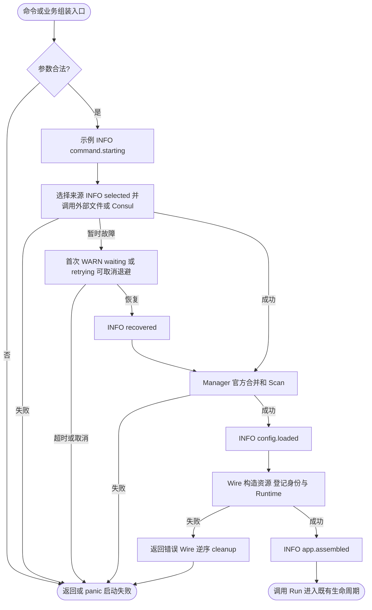
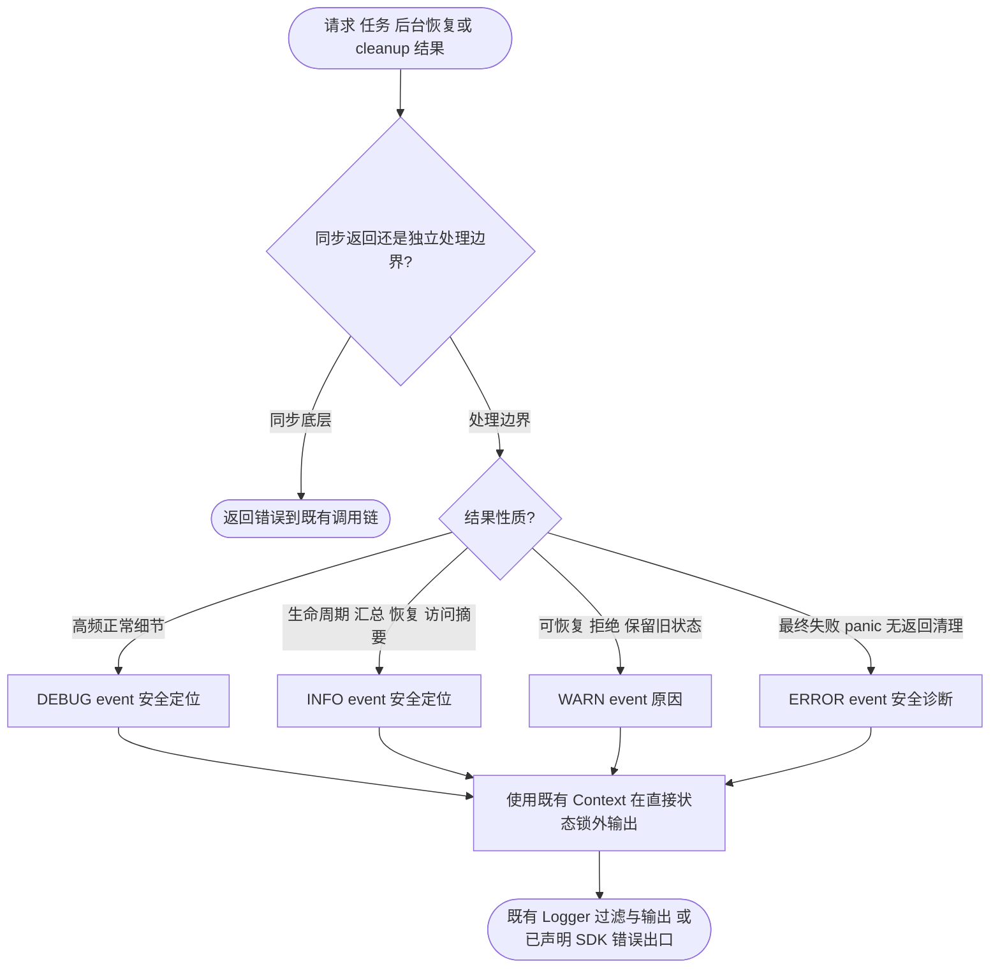

# 包职责与日志审查

审查日期：2026-09-30。范围为当前四个 Go 模块中的 **77 个手写包和 4 个纯生成协议包**；业务 Wire testdata fixture 另外核对组装契约，不作为产品包计数。基于 HEAD `6da3c7084907f914479e497b99b5fc57d46ea770` 和本轮开始时已有的授权工作树；保留前轮修复。本次调整日志与相应测试/文档，没有新增领域包、公共 API、第三方依赖、锁或并发控制策略。

## 拆分结论

当前领域、可选 contrib 适配器和内部能力的边界整体合理，未发现必须搬包的依赖环或职责混杂。保留同包按职责文件化：App/Server/Job 的状态由各自所属对象管理，Bootstrap 承担显式组装；独立算法和 JSON Schema 方言保留真实公共/协议差异；根 internal 中的 Consul、reconnect、deadline、HTTP 和中间件由多个独立领域复用，嵌套 internal 不反向依赖父域。

拆分依据是独立职责、单向依赖及可说明的资源所有权，不以行数或文本重复机械建立微包。Go 官方同样强调包名表达能力及调用方上下文，见[包命名](https://go.dev/blog/package-names)与[组织 Go 代码](https://go.dev/blog/organizing-go-code)。日志保留既有 Kratos 接口，采用键值表达事件和上下文，参照[Go 结构化日志说明](https://go.dev/blog/slog)，不为日志审查另换框架。

## 事件命名

事件名统一为 `<领域>.<对象>.<动作>`，首段与所属领域一致（`app`、`config`、`server`、`client`、`job`、`queue`、`kafka`、`database`、`redis`、`oss`、`registry`、`consul`、`log`），检索时可直接用 `event=queue.*` 等前缀归类；示例业务事件统一使用 `demo.` 前缀，演示业务事件不得借用框架领域前缀。每条事件带一句简短 msg。旧名到新名的映射见 [CHANGELOG](CHANGELOG.md#v240)。

## 逐包清单

“无日志”表示该包没有独立决策/恢复边界，错误、结果、指标或测试诊断已有正确出口；不等于遗漏检查。INFO ready/created 表示事件所属层的构造完成，只有明确外部探测成功才表示连通。

| 包 | 领域职责、拆分与所有权 | 日志裁决及本轮处理 |
| --- | --- | --- |
| [cmd/protoc-gen-jsonschema](cmd/protoc-gen-jsonschema/README.md) | 插件入口，显式 --help/--version 与 pgs 生命周期。56 行，全部领域实现留独立 internal。 仅向 internal/modules；pgs stdin/stdout 为二进制协议，诊断 logger 固定 os.Stderr。显式 CLI help/version 输出 stdout 在协议之外。 | 不能把启动摘要写到 protoc stdout；现有模式正确。单个未知 CLI 参数静默退出可作为后续 UX 改善，不在本轮日志修复改变参数兼容性。 |
| [cmd/protoc-gen-jsonschema/internal/jsonschema](cmd/protoc-gen-jsonschema/internal/jsonschema) | 与方言无关的中间 Schema、RefId、ordered Registry 与独立深复制。374 行两职责文件合理。 只向内部 utils；不依赖模块 Visitor 或具体 draft，拥有单次生成 Registry 而非全局资源，无反向循环。 | 纯数据模型/转换不记录生成失败，向 Module 返回。 |
| [cmd/protoc-gen-jsonschema/internal/jsonschema/draft_04](cmd/protoc-gen-jsonschema/internal/jsonschema/draft_04) | draft-04 输出结构、definitions 引用和 bool exclusiveMaximum/Minimum 转换，同方言 Merge。 只向中间 jsonschema/utils；264 行。对同名定义先完整冲突检查再写，保留外部分支约束；不向模块倒流。 | 无日志正确，冲突错误由 Module CheckErr 一次处理。保留独立方言包是真实协议差异。 |
| [cmd/protoc-gen-jsonschema/internal/jsonschema/draft_06](cmd/protoc-gen-jsonschema/internal/jsonschema/draft_06) | draft-06 输出结构与数值 exclusive 边界/definitions；同方言 Merge。 只向中间 jsonschema/utils；271 行。不导入兄弟 draft、不调用外部服务。 | 无日志正确，转换/冲突错误交 Module。未来规格补全应验证具体 keyword 支持，而非只依版本名宣称全规格。 |
| [cmd/protoc-gen-jsonschema/internal/jsonschema/draft_07](cmd/protoc-gen-jsonschema/internal/jsonschema/draft_07) | draft-07 扩展条件/内容等关键字输出，definitions 与同方言 Merge。 只向中间 jsonschema/utils；299 行。可独立核对该版本结构，不需共享巨型泛型 Schema 反而遮蔽差异。 | 无日志正确，错误交 Module。 |
| [cmd/protoc-gen-jsonschema/internal/jsonschema/draft_201909](cmd/protoc-gen-jsonschema/internal/jsonschema/draft_201909) | draft-2019-09 的 $defs、数组关键词与递归字段映射、同方言 Merge。 只向中间 jsonschema/utils；314 行，完整一次转换与 Merge 可留同文件。RecursiveAnchor 当前字符串直接映射，但前端未赋 DynamicAnchor，未确认公开输入可触发，不能列可触发 bug。 | 无日志正确。未来暴露动态/递归锚点前应增加 meta-schema/输入到产物契约验证；本轮不改无外部证据的字段语义。 |
| [cmd/protoc-gen-jsonschema/internal/jsonschema/draft_202012](cmd/protoc-gen-jsonschema/internal/jsonschema/draft_202012) | draft-2020-12 的 $defs、prefixItems/items 与 dynamic 字段输出、同方言 Merge。 只向中间 jsonschema/utils；308 行。不借用 draft04 的布尔 exclusive 表达，独立协议职责成立。 | 无日志正确，错误交 Module。 |
| [cmd/protoc-gen-jsonschema/internal/modules](cmd/protoc-gen-jsonschema/internal/modules) | protobuf Visitor → 中间 Registry → 优化/方言转换 → JSON/YAML 序列化与 Merge 外部 I/O。8 文件分别表达职责，领域总 1097 行没有搬包必要。 单向依赖内部 proto/jsonschema/drafts/utils。Module 唯一处理生成错误/skip/debug，frontend/backend helpers 返回错误，避免重复。Merge HTTP 已限 30 秒/8MiB，响应体释放。 | 确認缺陷：InitContext 完整 options Debug 与读取失败原始 Merge URL 泄漏凭据到构建 stderr。父代理已授权最小脱敏；保持错误原因与协议输出。其它 helper 无日志正确。 |
| [cmd/protoc-gen-jsonschema/internal/proto](cmd/protoc-gen-jsonschema/internal/proto) | 插件参数/Proto 扩展读取与默认优先级；包含由 third_party/pubg/jsonschema.proto 生成的协议类型。 手写 options 只向 utils；不依赖 Module/drafts。参数读取/ProtoJSON策略与生成器文档一致，生成 pb 不可手改。 | 选项读取不另记输入全文。部分非法枚举/布尔参数有沿用默认行为；以后做严格参数校验须先定义兼容契约，不能当作缺日志直接改行为。 |
| [cmd/protoc-gen-jsonschema/internal/utils](cmd/protoc-gen-jsonschema/internal/utils) | 指针/切片/JSON clone 与比较等生成器内部值操作。132 行独立底层能力，不依赖 parent 领域。 无模块内上层导入；仅复制调用者对象，无外部资源或全局状态。 | 转换错误返回给使用方，无需 Logger。 |
| [cmd/protoc-gen-kratos-foundation-client-v2](cmd/protoc-gen-kratos-foundation-client-v2/README.md) | protogen 入口、服务/RPC 元数据校验、模板与 HTTP/GRPC/Wire 客户端包装生成。四文件按入口/生成/模板职责组织。 不依赖运行时领域实现，模板生成目标 pkg/client。protogen 拥有协议响应，模板 parse/execute 返回 %w；生成代码 AcquireClient(ctx) 后 defer release，协议调用错误返回到实际 client 中间件。 | 普通模式没有 Printf 输出污染 stdout，--version 显式 CLI 除外。模板不补重复请求日志/泄漏 payload，实际调用端的中间件记录业务上下文。 |
| [cmd/protoc-gen-kratos-foundation-errors-v2](cmd/protoc-gen-kratos-foundation-errors-v2/README.md) | protogen 入口、状态码/符号校验、错误 helper 模板生成。四文件职责清楚。 模板生成 pkg/errors；HTTP100..599 校验、符号冲突检查、注释按 Go 字符串引用；正常输出由 protogen 管理。 | template 的 Sprint/Sprintf 只构造 message，不写日志/stdout；message 是公开状态，调用方不得传凭据。WithErrStack 仅采集供内部处理边界日志，不把每次创建错误变成 Error 日志。 |
| [contrib/bootstrap/consulconfig](contrib/bootstrap/consulconfig/README.md) | 显式构造本地/Consul 来源描述、路径模板及前缀组合，Wire provider set 是可选组装入口；不启动运行时、不持有客户端或全局来源容器。 | 纯路径组合不记录重复日志；来源选择、加载和故障归配置适配器/Manager。README 图更新为稳定 selected 事件。 |
| [contrib/config/consul](contrib/config/consul/README.md) | Consul 路径/glob 与完整 KV 快照、有限 Load 和 blocking query watcher；借进程客户端，每个 Watcher 独立取消，无后台发送层。source/watcher/contribution 分工清楚。 | INFO selected；逐文件 Load 详情 DEBUG loaded，Watch 不重复逐文件成功；首次暂时失败 WARN retrying，恢复 INFO recovered；索引回退 WARN index.reset，含 operation/path/attempts/index/error。永久故障返回官方处理边界。 |
| [contrib/config/file](contrib/config/file/README.md) | 有序路径解析/去重、官方文件读取、父目录及符号链接监听、替换重绑与可取消重建退避；source/watcher 两职责文件清楚，资源交 Manager。 | INFO config.file.selected；WARN empty/events_lost/waiting，等待首次记一次，INFO recovered；读取详情 DEBUG loaded。含 files/path/pattern/attempts/error，不输出内容。 |
| [contrib/config/text](contrib/config/text/README.md) | 不可变内存文本源及独立静态 watcher；Load 返回副本，Stop 唤醒 Next；内容由调用者显式提供，不拥有外部连接。单文件同一能力，不必再拆 watcher 包。 | 不记录正文或每次复制/停止；加载成功由 config.loaded 来源类型表示，错误返回。无独立故障恢复需新增日志。 |
| [contrib/database/mysql](contrib/database/mysql/README.md) | MySQL DSN/connector 到 SQL 池与 GORM 方言的适配，物理建连暂时错误的有预算退避。 init 只登记无状态工厂；池交给 Database Manager；自动重试只在建连阶段，不重放事务/SQL。实现单文件且不足百行，不拆分。 | 连接失败及最终重试错误返回 SQL/GORM 调用边界，不打印 DSN、不逐次重复 WARN；启用驱动名由 database.manager.ready 提供。 |
| [contrib/database/sqlite](contrib/database/sqlite/README.md) | SQLite sql.DB 与 GORM 方言适配及 init 登记。 init 只登记 factory；池交给 Database Manager；平台 CGO/内存库限制已在 README 说明。实现约三十行，不拆包。 | 不重复日志；驱动启用由 Manager.ready 的 drivers 给出。driver_test.go 直接覆盖工厂、登记及真实 SQLite CRUD/cleanup 集成；Manager 核心替身契约仍在 pkg/database/manager_test.go。 |
| [contrib/lock/redis](contrib/lock/redis/README.md) | 以注入 Redis client 实现 TTL 锁、持有者令牌校验、Refresh/Release、取消与退避。 只借用 Redis client；lease 必须按操作释放；314 行实现包含同一租约适配职责，当前不需要微包或 manager。普通重试/取消沿用既有策略，本轮未改同步。 | 预期竞争、租约失效及 Redis 错误均返回，core metrics 可覆盖结果；不为底层每次重试新增日志，不记录持有者 token，不新增 Logger option。 |
| [contrib/oss/aliyun](contrib/oss/aliyun/README.md) | 阿里云 SDK 配置/Bucket/URL 适配，对象 CRUD/list/copy、Range、元信息与错误转换。 bucket.go 负责构造，object.go 负责对象操作；SDK 类型留在适配层，通用能力通过 oss 接口暴露；响应 Body 属于操作调用方。336 行 object.go 内聚于单一适配器职责，暂不拆分。 | init 只登记 factory；SDK/存储同步错误返回上层；core 指标包装已覆盖请求/流量，不输出对象内容、options 或 access key，也不机械追加高频日志。README 移除 init 日志节点，启用事件指向 oss.manager.ready。 |
| [contrib/queue/database](contrib/queue/database/README.md) | ORM 无关 Repo/TaskRecord 契约、任务校验与快照转换；Operations/Stats 为可选能力 296 行分布在五个职责文件；不访问 SQL，不迁移，不拥有 Repo/连接，不启动后台任务。边界合理 | 没有 Logger 参数与独立 cleanup；全部可诊断错误返回 Worker/应用，重复记录会丢失业务 Context 并扩大依赖。无需补日志 |
| [contrib/queue/database/gorm](contrib/queue/database/gorm/README.md) | 泛型 Repo、模型/方言校验、原子竞争领取、租约状态、运维查询、统计、显式简单表迁移 七个职责文件，最大 246 行。Factory/ConnectionProvider 由业务注入，连接与迁移生命周期不归 Repo；原子条件更新在存储边界完成，不跨 Handler 持锁。无拆包需求 | 借用数据库 Logger，低层失败同步返回；运维调用由业务入口审计，消费失败由 Worker 记录，不在 SQL/条件更新临界区增加日志 |
| [contrib/queue/redis](contrib/queue/redis/README.md) | 单队列 Redis Lua Store、五类键状态与类型校验、运维查询及统计 四个职责文件，operations 最大 286 行；Lua 脚本保持同一原子职责；借 Manager 连接，构造不发 Redis 命令，无独立 cleanup/后台工作。无拆包需求 | 同步 Redis/解码/租约错误返回 Worker/应用或 OTel；无 Logger 不构成缺口，避免在 Lua 原子状态转换之外重复记录载荷。既有键类型、超时修复未改动 |
| [contrib/registry/consul](contrib/registry/consul/README.md) | 注册健康检查/TTL、发现查询/阻塞索引、独立 watcher、临时故障退避与恢复。 借用进程 Consul client；操作 channel 串行化注册生命周期，心跳/watch 各自拥有取消与完成通知；init 不连接；七个文件职责可单向理解，不新建 runtime 门面。修正 discovery 构造注释中旧资源所有权表述。 | 补稳定后台 retry/recovered/stopped/cleanup 事件；TTL 丢失后的登记成功单独 INFO，续报恢复另记 INFO。发现日志绑定 Watch Context；心跳是独立后台 Context。永久心跳故障无人同步接收时 ERROR；永久发现故障由 Next 返回，不重复 ERROR。 |
| [examples/components/cmd/api](examples/components/cmd/api) | 示例组装、HTTP 服务、数据库/缓存/锁、OSS 与 Kafka/Queue 业务分别按文件组织；属于教学应用而非公共基础设施域，后续生产业务应按其用例边界组织。 | 补事件与业务 Context；阶段汇总 INFO，维护任务/租约刷新/逐条消息成功 DEBUG；隐藏内部故障前 ERROR 含 run_id/component；出站原错误不重复报。命令启动摘要同 minimal。 |
| [examples/minimal/cmd/api](examples/minimal/cmd/api) | 最小公共 API/Wire 应用入口、声明及 HTTP service；业务自身 internal 可使用，未导入 Foundation internal。模块内示例同包分文件，无需提供新 pkg/cmdapp。 | 新增命令入口 INFO command.starting，env/version/config_path；组装后 app.assembled；请求结果由框架访问摘要/错误边界负责，不重复打印正文。 |
| [internal/consul](internal/consul/README.md) | 为配置源和注册发现两个独立领域共享 env 驱动的 Consul 客户端单例。 共享能力满足根 internal 复用条件；sync.Once 发布并冻结首次成功/失败/禁用；client 与 transport 归进程，驱动只借用。不新增重试任务/Reset/公共包装。 | 预期禁用改为 INFO；probe 与 ready 结构化；不记录可能带用户信息的原 Address，保留 module 和 probe timeout；首次初始化失败缓存并返回，由启动边界记录。 |
| [internal/deadline](internal/deadline) | 预算计算、不可变策略编译/原子发布、压缩前缀索引，三文件单向依赖；至少 client/server 独立复用。无需把算法和 Store 再拆微包。 | 无独立日志合理：纯计算/策略返回确定错误与 Info Context，Update 无效时保留旧快照；组装/热更新方记录拒绝。无 I/O、后台 goroutine，不在原子发布或每次查询上写日志。 |
| [internal/middleware/deadline](internal/middleware/deadline) | client/server 共用 HTTP 超时头、gRPC context 状态适配；仅依赖 deadline 内核。与核心计算拆分有清晰协议边界。 | 无独立日志合理：取消、预算不足、超时是请求结果，返回错误；访问摘要/错误边界/指标已有出口。非法入站超时头忽略，不打印原始 header。 |
| [internal/middleware/logging](internal/middleware/logging) | 共用 client/server 请求结果摘要与 debug-only deadline 诊断；不负责故障恢复或资源所有权。 | `server.request.completed` / `client.request.completed` Info，字段 kind/operation/code/reason/latency；Context 关联日志动态字段。deadline.source/remaining 仅 debug 展开。WebSocket upgrade 跳过耗时摘要；不读 body/格式化 req，不输出原始 error/stack，避免与 server Error 边界重复。本轮补稳定 event，清理旧注释代码。 |
| [internal/middleware/metadata](internal/middleware/metadata) | client/server prefix 白名单与编码/解码、WS metadata 来源适配；shared/client/server 同包文件方向清晰。 | 无独立日志合理：热路径纯变换，prefix 配置错误返回；未知/不支持/非法编码输入按契约过滤，不记录 metadata 原文，避免 token/PII 泄漏。不会另起资源或 goroutine。 |
| [internal/middleware/metrics](internal/middleware/metrics) | 共用请求 counter/histogram，归一化状态供观测且保留业务原错误。依赖 metrics 公共 Provider；协议适配与指标资源分责适当。 | 无独立日志合理：此包职责正是低基数请求指标；构造 instrument 失败返回给调用方。成功/业务拒绝无需同时再写日志，访问摘要已覆盖。 |
| [internal/middleware/requestdebug](internal/middleware/requestdebug) | 明确入站 debug 授权策略、出站保留/防伪；额外 gRPC stream Context 包装。依赖 request 公共 Context 契约，不承担鉴权。 | 无独立日志合理：每请求/流只处理诊断标记；不打印 header、授权材料或每次 accept/deny 事件。使用 debug 的具体日志边界自行记录；stream 开关仅在建立时固化。 |
| [internal/middleware/tracing](internal/middleware/tracing) | 共用真实/仅关联 Provider 的协议 tracing 链；disabled NeverSample 保留关联 ID，没有 exporter。 | 无独立日志合理：Span/Trace 本身是信号，调用错误由 Span 和调用方日志承担；没有 cleanup 返回通道或网络资源，因此不增加构造/关闭日志。 |
| [internal/otelattr](internal/otelattr) | metrics/tracing 等领域共用 appinfo 到 OTel Resource 身份映射；16 行纯函数，没有独立生命周期。根 internal 复用条件成立。 | 无独立日志合理：纯属性构造，输出是 service.name/version/instance.id；记录一次函数调用无排障价值。 |
| [internal/reconnect](internal/reconnect) | 纯 Backoff.Delay/Wait、瞬态错误分类，供 client/redis/mysql/consul 复用。 不保存资源、goroutine 或可变重试计数；由调用者拥有重试循环与 Context；满足多个独立领域复用，无拆分必要。 | 不自定业务日志级别/事件，不添加 Logger 参数；consul 异步拥有者记录 WARN/INFO，其他同步建连拥有者返回最终错误。 |
| [internal/testconfig](internal/testconfig) | 多领域配置 fixture、可更新的测试 Source/Watcher；根 internal 是跨领域测试复用设施，位置合理。 依赖 pkg/config 与 contrib/config/text；t.Helper/t.Fatalf 提供测试失败出口；MutableSource 用现有锁/缓冲通知/stopOnce。NewMany 对 protobuf 使用默认 protojson lowerCamel，不是 snake_case 精确配置路径；精确 stop_timeout fixture 命名限制，真实路径 fixture 应用 map/text，未增加生产 API。 | 测试设施用 testing 诊断即可，不再创建应用 Logger；不能把默认 JSON 命名当作读取精确配置路径的证明。此项是已知限制，不是本轮新并发问题。 |
| [internal/testlog](internal/testlog/README.md) | 创建可释放测试 Logger，并为测试临时设置/恢复 LOG 环境变量。两文件分别负责环境配置与 logger fixture。 依赖 pkg/log；失败恢复环境，cleanup 先释放 logger 再恢复；环境为进程共享，现有文档要求串行使用，不声称隔离并行 t.Setenv。 | 应依靠 t.Fatal 返回构造错误及 cleanup 明确失败；不通过尚未可用/已关闭的 Logger 自记录，避免递归日志。 |
| [internal/transport/http](internal/transport/http) | client/server 共用旧 HTTP 错误契约编码/解码；有限读取及错误元数据副本；兼容 JSON SDK 初始化。协议边界清楚，不与资源 Provider 混合。 | 无独立日志合理：解码/超限错误返回客户端链；服务端错误集中请求边界，encoder 再打印会重复。响应写失败发生在协议输出边界且无法替换已发送结果，未引入无 Logger 参数的全局请求日志。不输出原始响应体。 |
| [pkg/app](pkg/app/README.md) | 应用身份/Spec 冻结、Runtime/Hook/Registrar 监督与停止汇总；同包 app/hooks/runtime/spec/config/registrar/stop_policy 分工，无具体 server/job/bootstrap 依赖。生命周期共用 App 状态，不新增 runtime 空壳或转发微包。 | 本轮补 app.assembled/ready/stopping/stopped 与启动回滚结果；实例 Logger 单次派生，避免外部 Logger 的重复 module；固定应用身份与 Context；终态失败 ERROR，其余生命周期 INFO；StopPolicy 变更 INFO、拒绝 WARN，同版本只记一次。 |
| [pkg/appinfo](pkg/appinfo/README.md) | 不可变进程身份及 metadata 副本；单文件、无运行时资源。Bootstrap 登记身份，App 统一记录启动摘要，职责明确。 | 不在生成 ID/读取 metadata 时重复日志；最终 app.assembled 使用身份与 env/hostname。主机/程序名回退沿用稳定占位值，首次构造无额外输出。 |
| [pkg/bootstrap](pkg/bootstrap/README.md) | 唯一组装边界；Configuration 同步登记来源，业务完成标记分别约束 Server/Job 再汇合 Runtime/StartupReady；资源 cleanup 由 Wire 持有。阶段标记、Spec、配置和观测贡献已按文件分工，无需新包。 | 默认来源为空 WARN config.sources.empty；日志策略拒绝 WARN log.policy.rejected；登记本身不重复报成功。AppInfo 同步发布 service.id/name/version 和 env；最终启动摘要归 App。 |
| [pkg/client](pkg/client/README.md) | HTTP/gRPC 构造、中间件装配、配置规范化、具名版本租约、热更新、排空与传输关闭。 factory/spec/builder/pool/config/cleanup/selector 已按职责分文件；Factory 持有传输和 watcher，租约 release 不转移底层所有权；独立熔断子能力保持单向依赖。无需拆出整体 runtime/provider 包。 | 补创建/配置应用事件；拒绝热更新降为 WARN；关闭及超时事件结构化。构造/拨号错误同步返回；低层不重复 ERROR，实际请求交给访问日志、指标和 trace。 |
| [pkg/client/internal/middleware/circuitbreaker](pkg/client/internal/middleware/circuitbreaker) | 校验并构造客户端 SRE 熔断中间件。 只依赖协议与 Aegis，独立子能力；不反向导入 client，不创建资源或后台任务。保留私有包。 | 参数错误在构造/热更新校验边界返回；熔断是调用级错误，交给访问日志与指标，不新增逐次 WARN 或公共 Logger 参数。 |
| [pkg/compress](pkg/compress/readme.md) | Gzip/Deflate/Zlib 内存压缩与解压、可选体积上限。146 行单包内聚，三种算法共用同一压缩/解压操作，无需按算法拆成微包。 只依赖标准库；每次借用独占 writer，成功 Reset 到 io.Discard 后放回 pool；返回字节独立。解压限额在读取边界检查，错误向调用者返回。 | 纯字节转换不拥有请求/业务结果，不补操作日志；调用边界记录输入大小/耗时/失败原因即可，禁止记录原文。未发现日志缺口。 |
| [pkg/config](pkg/config/README.md) | Manager 拥有官方 Config、来源 watcher、最近不可变快照及串行订阅；声明、source、snapshot、polling 与热更新值在同包，internal/decoder 是独立解码能力。无需重建内部根容器或拆 snapshot/source 微包。 | INFO config.loaded 来源类型/数量/轮询间隔；DEBUG 首次回放，INFO 实际变化；WARN 扫描或解码拒绝保留旧值，ERROR observer panic/无返回 cleanup 失败。不输出配置值、环境全文、panic 原文。 |
| [pkg/config/internal/decoder](pkg/config/internal/decoder) | 目标类型校验、默认值、protobuf/普通对象解码与写入，公共错误别名保持兼容；不反向导入 config，不拥有快照或 watcher，内部边界合理。 | 纯解码返回可追踪错误；Manager/HotReloadValue/业务应用边界决定日志级别，不引入 Logger 或在每个字段转换重复报错。 |
| [pkg/crypto/aes](pkg/crypto/aes/README.md) | 随机 IV、PKCS#7 的 AES-CBC 字节/Base64 编码，接口给数据库字段加密调用方使用。117 行、算法边界明确。 仅标准库；随机数失败、长度/填充校验、编码失败返回错误。README/源码明确 CBC 无认证、使用限制，不能把它当作通用 AEAD。 | 不记录 plaintext/key/ciphertext；加密资源或业务边界可记算法名和错误分类。无 Logger 正确。 |
| [pkg/crypto/ecc](pkg/crypto/ecc/README.md) | ECDSA 密钥 PEM/Hex 编解码及 P-256/384/521 ECIES 加解密。288 行同一算法域，辅助 KDF/MAC 私有，无需 internal 空壳。 仅标准库；曲线/点/密钥结构先校验，解密先 HMAC 验证后 CTR；临时私钥属于一次调用。错误保留阶段，不输出密钥或明文。 | 计算函数没有恢复/重试决策，不补底层 Error 日志。算法互操作性/安全证明仍应独立验证，静态审计不是密码学认证。 |
| [pkg/crypto/password](pkg/crypto/password/README.md) | Argon2id 哈希生成、PHC 编解码与常量时间验证。209 行单包合理，属于密码存储算法而非登录用例。 标准库及 x/crypto/argon2；读取 PHC 参数先限制资源开销/长度再计算，不持有进程资源。验证返回结果/错误。 | 不记录密码、PHC 全文；登录失败、限流与账户上下文属于业务认证边界。无日志缺口。 |
| [pkg/crypto/rsa](pkg/crypto/rsa/README.md) | RSA 密钥编解码、PKCS#1 v1.5 分块加解密。131 行内聚单包；现有兼容算法限制由 README 声明。 标准库；长度、nil 和块转换错误返回，无后台生命周期。调用方仍须遵守兼容算法使用边界。 | 不记录私钥或输入；无需为了算法调用成功补 Info。 |
| [pkg/crypto/schnorr](pkg/crypto/schnorr/README.md) | 指定会话的 ECDSA 私钥知识证明生成/验证及转录编码。179 行完整单次算法流程。 仅标准库；校验会话非空、曲线/承诺点/标量范围、公私钥一致性；随机 nonce 不留全局状态。会话唯一性由调用者负责。 | 不记录私钥、nonce 或会话原文。协议业务边界记录证明结果；无底层日志缺口。 |
| [pkg/database](pkg/database/README.md) | 驱动注册、具名 SQL/GORM 资源管理、插件/AES 字段、连接池热更新、SQL 日志/指标/trace、事务。 SQL 池统一由 connectionFactory 追踪并逆序关闭；GORM 根配置/插件按连接独立，事务由 manager 标识所有权。各职责已分文件，AES 与 GORM 插件强耦合，无新增契约微包收益。 | 移除 contrib init 可触发的注册日志，保持纯 factory 登记；补 Manager ready/closed；拒绝热更新为 WARN；合法池参数变更 INFO；无返回 cleanup 只 ERROR 一次。高频 SQL 沿用现有 GORM 策略与 database.gorm.query 事件，未重复追加操作日志。 |
| [pkg/env](pkg/env/README.md) | 启动环境与布尔/字符串读取；独立单包，非法显式值 panic 的启动契约已写明。环境取值不承担请求级动态配置。 | env.AppEnv 在命令/AppInfo/App 摘要中一次表达；不记录每次 Get 或环境全文，不把密码变量传给 Logger。 |
| [pkg/errors](pkg/errors/README.md) | 状态错误、原因码、cause/stack、metadata、HTTP data、gRPC status、validation error 转换。五文件按具体职责组织，比搬到 internal/provider 更清楚。 第三方依赖为 Kratos/gRPC/protobuf，与其它领域无反向依赖。公开格式化和内部 `%+v`/ErrStack 明确区分；FromError 是诊断，服务端安全呈现需 Normalize。内部 gRPC/兼容 HTTP metadata 含诊断字段，公网出口必须按 README 过滤。 | 错误值本身不拥有处理决策；自动日志会在每层包装重复。保留调用边界 Error 一次并选择内部/公开视图。现有 README 已诚实声明外部网关尚需适配，未把该契约再列为新缺陷。 |
| [pkg/gormscope](pkg/gormscope/README.md) | 安全 LIKE/时间/分页 scopes、复合游标、类型与排序方向编码。scopes/cursor/sort_key 分工明确；总 522 行不是单文件超限。 依赖 gorm，使用方方言 QuoteTo/clause 参数绑定；scope 校验失败累积 db.Error，最终 query 边界应检查。schemaCache 为现有 sync.Map；游标调用只读配置，无需新增同步。排序必须最后包含唯一键。 | 不在每个 scope 记录 SQL/游标；DAO 完成 query 后记录失败及受控耗时，避免多层重复与高基数日志/指标。 |
| [pkg/job](pkg/job/README.md) | Spec 声明 Cron/Once/Daemon；Manager 编译并管理任务生命周期；Cron 控制循环管理调度声明；gate 管理本进程准入；中间件管理 tracing/metrics/logging/recovery；配置订阅只改变后续计划 同包以 spec、manager、manager_lifecycle、cron、config_reload、concurrent_policy、middleware、telemetry、log 区分职责。最大生产文件 305 行；无 app/bootstrap/Wire 反向依赖，无 Driver Registry，不需搬入 internal/runtime | 保留任务注册、Cron 状态 Info；执行开始/结束改 Debug；无效配置保留旧规则改 Warn；准入跳过、最终失败、调度与 Cron SDK 适配补稳定点分 event。默认 ErrorHandler 保留任务名、Context 和原错误，自定义处理器继续由业务负责 |
| [pkg/kafka](pkg/kafka/README.md) | Kafka 客户端配置、TLS/SASL、SDK 转换、Producer/Consumer；ConsumerRuntime 提供业务重试、死信、取消及观测 当前域明确是 Kafka，可同时容纳协议适配和消费策略；配置/SDK adapter 与消息策略文件已经分开，无跨领域嵌套 internal 访问。最大生产文件 302 行；不为行数拆 runtime/context 微包，不引入 Registry | ConsumerRuntime started/stopped 改 Info；SDK、重连、退组失败、数据丢失和会话丢失补稳定 event。消息处理日志保留受控分类及 ID/attempt，不追加业务原文、Header 或 Body；原先 ready 文案改为 session prepared Debug，明确仅本地构造完成 |
| [pkg/kafka/internal/telemetry](pkg/kafka/internal/telemetry) | Kafka producer/consumer attempts、retry、dead-letter、runtime failure 的 metrics/span 单向依赖且独立同名测试；239 行。同 Queue 有重复的 OTel 构造/记录样板，但 instrumentation、指标/事件命名、attempt 语义以及 failure/dead-letter 行为不同，不能仅按文本相似搬入共享包 | 无日志合理；构造错误返回、逐条成功指标化，终态日志由消费或发布处理边界负责 |
| [pkg/lock](pkg/lock/README.md) | Locker/Lease 小型业务契约、可选锁与租约指标包装。 核心不依赖 Redis SDK，注入显式 Locker，不引入 registry 或全局资源容器；Lease 属于操作级资源，Release 由使用者负责。两文件已足够清晰。 | 正常竞争/租约失效通过稳定错误与 result 指标表达，错误由用例决定 WARN/ERROR。高频 Acquire/Refresh/Release 不逐次输出成功日志，不为日志添加公共参数。 |
| [pkg/log](pkg/log/README.md) | Kratos Logger 公共契约、不可变派生视图、共享策略/版本、输出构造和全局 SDK 桥接；具体文件分责，internal/output 管独立编码/输出。现有同步和输出资源所有权不改。 | 稳定 module/event/Context；WARN log.settings.rejected 和 policy 拒绝；安全 SDK config.source.rejected 摘要及 DEBUG config.watcher.stopped；不在 Logger 写入中递归给自己记日志。 |
| [pkg/log/internal/output](pkg/log/internal/output) | stdout、文件轮转、过滤、字段格式、堆栈与 guarded writer；只依赖下层/标准库，不反向导入 log。闭包 cleanup 拥有输出，独立子能力成立。 | 文件关闭失败无返回通道，向 stderr 一次输出 ERROR module=log event=log.file.cleanup.failed；正常写入不额外日志，避免递归及关闭后使用。 |
| [pkg/metrics](pkg/metrics/README.md) | 私有 MeterProvider/Prometheus Registry 和 cleanup；Context instrument 辅助；具名业务 cache instrument。3 个同包职责文件足够，无 driver/嵌套微包必要。仅通过 appinfo/otelattr 获取资源身份，HTTP 暴露由 server 持有。 | instrument 构造错误返回；业务计数/采样仅记录指标，不再打印每次 Hit/Miss/Load。幂等 cleanup 限时 5s，失败 `otel.Handle("shutdown metrics provider...")`。无自动 HTTP 监听和独立启动日志；应用组装日志由 Bootstrap 处理。 |
| [pkg/oss](pkg/oss/README.md) | 通用 Bucket 契约、driver registry、具名懒加载缓存与关闭、公开 URL、请求及流量观测包装。 Manager 拥有实现 io.Closer 的 bucket；对象 Body 由操作调用方关闭；指标包装不接管 Manager 生命周期。manager/driver/domain/metrics/metrics_reader 职责独立，保留同包。 | 移除 init 注册日志；补定义构造成功、关闭、无返回 cleanup 失败事件。ready 只表示定义通过校验，既未创建远端 bucket 也未验证云服务；操作/流读取错误继续返回，成功调用和字节消费使用指标。 |
| [pkg/queue](pkg/queue/README.md) | 类型化 Definition/Queue 发布；Worker 领取、执行预算、租约、确认与失败通知；Store 和 Operations 是使用方契约；Stats 注册绑定 OTel 采集 八个生产职责文件清楚；Worker 与单次 execution 分开，消息处理适配独立；没有混入 Redis/SQL 实现，也没有 app/bootstrap/Wire 依赖。最大生产文件 301 行，不需新增包或拆纯转发入口 | 每个 Worker 补一次 started/stopped Info；任务逐次执行改 Debug；重试 Warn、归档失败 Error、租约丢失 Warn、存储最终退出 Error、无法返回的失败通知 Error 已有且保留，补 msg/worker 定位字段。空轮询与正常确认不新增 Info |
| [pkg/queue/internal/telemetry](pkg/queue/internal/telemetry) | 领域内部 OTel instrument 创建与低基数记录；只依赖 metrics/tracing，供 Queue/Worker 使用 单向依赖且无反向导入 queue，具备独立 telemetry 职责。239 行及独立同名测试合理 | 无日志是合理选择：创建错误交构造边界，采集错误交 OTel；高频成功使用指标/span，不另加日志或 goroutine |
| [pkg/redis](pkg/redis/README.md) | 启动配置快照、具名 Redis client 懒创建、遥测钩子及回收信号、幂等关闭、Pub/Sub 事件消费、连接退避。 Manager 统一拥有 client 与指标回收信号；借用调用方不得独立关闭；subscribe 以事件 channel 暴露 parse/panic/close 错误，SDK 负责重订阅。配置/manager/subscribe/dialer 分工清晰，保留同包。 | 补 Manager 构造/关闭 INFO、cleanup 聚合 ERROR。newConnection 在状态锁内安装 SDK hook，未在此新增日志；命令和拨号错误返回调用者，Pub/Sub 错误通过事件交付。ready 不表示已拨号或连通。 |
| [pkg/registry](pkg/registry/README.md) | 无状态注册发现 driver registry、具名能力工厂、作用域配置读取、资源构造失败逆序回滚。 Factory 满足多名称、多实现、配置选 driver 与生命周期管理四条件；对外保持小型 Registrar/Discovery 能力，驱动只读取本实例 options。资源表构造后只读，cleanup 后借用无效。无需拆分。 | RegisterDriver 本来无日志/I/O；Factory 构造/解析错误同步返回，由启动/调用边界处理。背景恢复与无返回 cleanup 日志归实际驱动，避免核心与适配器重复 ERROR。本轮只同步相关 cleanup 事件文档。 |
| [pkg/request](pkg/request/README.md) | 18 行请求 Debug 标记的私有 context key。独立小型共用上下文能力，防止为了 Debug 开关依赖日志实现。 仅 context；不决定信任边界或认证，调用方决定谁能打开 Debug。无资源/循环。 | 标记读写不应产生日志；实际 Debug 内容由中间件/业务出口控制。 |
| [pkg/server](pkg/server/README.md) | Spec 串行声明与校验；Runtime 协调 HTTP/gRPC、管理端口、健康状态；同包文件分离监听所有权、路由、策略、错误边界及 WebSocket。依赖 shared internal 与 metrics/tracing/config/log 的公共契约；不导入 app/bootstrap。无需整包下沉 internal 或再建 provider/runtime 微包。 | `server.assembled` Info 摘要，`server.endpoint.registered` Debug 最终路由；SDK 启停日志；middleware 成功 Info、拒绝 Warn；`server.readiness.changed` 按来源分级；请求故障/panic Error；WS 超限 Warn、无法返回的关闭失败/panic Error。配置/注册/Endpoint/Start/Stop 返回错误交给上层，provider cleanup 无返回通道才 Error。 |
| [pkg/server/internal/middleware/ratelimit](pkg/server/internal/middleware/ratelimit) | server 专属 Aegis BBR 参数转换/验证；无注册器、生命周期容器或父包反向依赖。配置验证归 server 启动和热更新入口。 | 无独立日志合理：限流是高频预期请求结果，错误由访问摘要及指标观察；构造参数错误返回。打印请求或每次拒绝 Warn 会放大过载。 |
| [pkg/server/internal/middleware/validator](pkg/server/internal/middleware/validator) | server 私有请求校验接口适配、生成错误转换；34 行一文件适当，无拆包必要。 | 无独立日志合理：外部输入不合法是 4xx 结果，返回稳定业务错误/细节；访问摘要记录状态。框架不在这里打印原始请求、校验原文或认证材料。 |
| [pkg/totp](pkg/totp/README.md) | RFC6238 秘钥生成、验证码生成/验证、ProvisionURI。216 行同包完整能力，不管理认证账号。 标准库；默认 30s/6 位/Skew1，最大窗口有限；secret 返回给调用者，URI 明确包含 secret。防重放和登录限流不由纯算法提供。 | 不记录 secret、ProvisionURI、验证码。业务认证边界可记账号引用和验证结果；不补纯函数日志。 |
| [pkg/tracing](pkg/tracing/README.md) | 公共 Provider/Trace 与私有 provider、配置、动态 sampler、兼容全局 Tracer 分文件；私有资源构造/订阅/关闭在本包，边界清晰。 | 构造失败返回；Trace 给 Span RecordError/SetStatus 并原样返回，不再日志重复。sampler 无效版本或非采样配置更改在 CAS 成功后一次 `otel.Handle`；cleanup 5s 后失败同出口。正确 sampler 变更可由配置版本及 `Description` 查看，未新增每 Span/每次采样 Info。disabled 模式只延续 ID，无 exporter。 |
| [pkg/utils](pkg/utils/README.md) | map/slice 常用变换、受限并发执行和 ParallelMap。文件分别对应具体能力；目前无外部 I/O、领域依赖或隐藏容器，保留简单工具包合理。 errgroup 执行待全部任务退出后返回；context 取消是协作式，任务函数必须响应取消；调用方函数的共享资源不由本包自动保护。Map 每个结果槽由唯一任务写入。 | 通用计算没有任务语义，不将每项失败自动打印；返回索引/原因给调用方。并发行为已存在，本次不改锁/取消策略。 |
| [pkg/validation](pkg/validation/README.md) | 地址/回调 URL、数字、密码、邮箱和展示文本长度校验。按职责文件化，校验调用没有组装依赖；不需为每个函数拆子包。 仅标准库/uniseg；错误为稳定哨兵或范围说明，避免回显密码/邮箱/输入文本。回调校验含 DNS 外部调用但仅校验时快照，文档不声称请求时 SSRF 保证。 | 预期校验失败应在请求/业务响应边界处理，避免每次错误 Error 日志。DNS 故障可由调用边界记录 hostname；当前没有独立恢复操作需补日志。 |
| [pkg/validation/displaytext](pkg/validation/displaytext/README.md) | 展示文本预处理、Unicode/EGC 属性与长度结果；区别于父包只校验不改变输入。可独立消费，拆分有真实能力边界。 不反向导入 validation；标准库/uniseg；Options 零值保留换行/空白，输出固定点幂等；Original 保留调用者原字节，非安全脱敏器。 | 纯转换无需日志，尤其不要打印 Original/Output。需要统计数据质量由业务边界记录长度/结果分类。 |
| [proto/jsonschema_pb](proto/jsonschema_pb) | pubg/jsonschema.proto 的 protobuf 扩展/关键词协议；一个纯生成文件。生成源在 third_party，根 make proto 提供生成入口。 | descriptor/marshal 型纯协议无处理决策，不补日志或手写测试；契约在 JSON Schema 生成器输入到产物测试中验证。 |
| [proto/kratos_foundation_client](proto/kratos_foundation_client) | 客户端扩展（connection_name 等）protobuf 描述；一个纯生成文件，输入 third_party/kratos_foundation_client/client.proto。 | 不记录扩展读写；客户端生成器校验/产物契约拥有错误出口。 |
| [proto/kratos_foundation_pb](proto/kratos_foundation_pb) | config 根、error_reason protobuf/validate 及 errors helper 产物，五个纯生成文件。 | 不改生成代码；errors helper 模板没有日志，实际 App/传输处理边界负责。 |
| [proto/kratos_foundation_pb/config_pb](proto/kratos_foundation_pb/config_pb) | 12 类领域配置 protobuf/validate 类型，共 24 个纯生成文件。作为独立协议层可被多个领域直接引用，不依赖领域 Manager。 | 校验返回生成错误，不自动记录配置/凭据。配置加载/安装/拒绝边界负责安全摘要。 |

## 启动与配置日志

| 事件 | 级别 | 时间与定位字段 |
| --- | --- | --- |
| command.starting | INFO | 示例 flag 解析成功、Wire initialize 前；module=cmdapp，command/version/env/config_path。自定义命令入口须自行接入，不是新公共 cmdapp 包 |
| config.file.selected / config.consul.selected | INFO | 来源解析及选择；files 或 paths。读取正文尚未代表解码成功 |
| config.loaded | INFO | 初次 Load/Scan 全部完成；sources（来源包名，如 [env file]）/source_count 包含 env，poll_interval；自定义来源仅取包名，不要求额外接口 |
| server.assembled | INFO | http/grpc 配置地址（禁用为 disabled）、management 地址列表、stop_delay；逐路由 server.endpoint.registered 为 DEBUG |
| app.assembled | INFO | NewApp 完成、Run/Endpoint/BeforeStart 前；service.id/name/version、env、hostname、pid、executable、go_version、runtimes、service_registration，msg=application assembled |
| app.ready / app.stopping / app.stopped | INFO；真实终态失败 ERROR | 只有 AfterStart 完成才 ready；首次 stopping 含冻结 stop_timeout；stopped 含 result，失败含 error |
| app.startup.aborted / app.startup.abort.failed | INFO / ERROR | 已请求停止后的逆序回滚结果；runtimes，失败含 error；不冒充原始启动错误 |
| config.watch / config.change | DEBUG / INFO | key、subscription；实际变化含 changed_paths，缺失 found=false，大列表 paths_truncated=true；只表示交付，非消费者已应用 |
| config.snapshot.rejected / config.value.rejected / log.policy.rejected | WARN | 扫描、解码或日志策略拒绝并保留旧值；key/error 或实际拒绝边界；根 key=<root> |
| app.stop_policy.updated / app.stop_policy.rejected | INFO / WARN | 新版本读取时实际预算变化或拒绝；version、有效 stop_timeout，拒绝含 error；同版本只记录一次 |
| config.file.waiting / config.consul.retrying | WARN | 一轮暂时故障的首次重试；path/operation/error，不逐次刷退避日志 |
| config.file.recovered / config.consul.recovered | INFO | 本轮故障恢复；path/operation/attempts；正常初次成功不伪造恢复 |
| config.file.events_lost / config.consul.index.reset | WARN | 完整快照重读或索引重置；path/error 或 previous_index/index |
| config.observer.panicked | ERROR | key/subscription/panic_type；继续其余订阅，不打印原始 panic |
| config.cleanup.failed / log.file.cleanup.failed | ERROR | 无返回值 cleanup 错误；文件 Logger 用一次 stderr 诊断，避免递归 |

早期 Config 与命令事件在应用 Logger 安装前使用 fallback，安装后使用当前输出；不回放早期日志到后来创建的文件。App 生命周期借用本实例 Logger，保留该应用身份。输出仍受级别、字段过滤、模块策略约束，配置禁用或过滤的日志不会强制打印。只打印摘要和受控定位字段，不输出任意 metadata、argv、环境全文、配置正文或密码。日志中的 path 是可信来源定位，应由组装方避免将秘密编码在文件名/KV 键名。

## 其他日志出口

| 边界 | 保留或补齐的事件与级别 | 上下文及约束 |
| --- | --- | --- |
| 访问与服务错误 | INFO server.request.completed / client.request.completed；ERROR server.request.failed / server.request.panic.recovered | 单行 operation/code/reason/latency 和 Context；传输/端点定位，debug 才展开诊断，不记录请求/响应正文 |
| 健康状态变化 | INFO 恢复；WARN 依赖失败/探针超时；DEBUG 初始化/摘流/正常取消 | server.readiness.changed，status/reason/check/path；仅 HTTP 状态改变时记录，同为 503 的原因变化不逐次打印 |
| WebSocket | WARN message.rejected/endpoint.skipped；ERROR close.failed/panic.recovered；DEBUG upgrade.failed/停机拒绝 | 连接 Context、endpoint/path/client/stage；panic_type，纯 stack 仅 DebugOnly，不记录帧或 recover 原文 |
| Client 与资源管理 | INFO created/closed/manager.ready/manager.closed/config.applied/pool.updated；WARN config.rejected/restart_required/cleanup.timeout；ERROR cleanup.failed | client/revision/protocol/reason，或 connections/drivers/buckets/default；不记录 DSN/options/密钥；driver init 只登记 factory，不日志 I/O |
| Consul 后台注册发现 | WARN heartbeat.retry/discovery.retry；INFO registration.restored/heartbeat.recovered/discovery.recovered；ERROR 永久后台 heartbeat.stopped/cleanup.failed | service.id/service/instance/attempt(s)/error，Watcher Context；TTL 重建成功与续报恢复分别表达，不输出原始连接 URL |
| Job | INFO registered/cron 生命周期/config.applied；DEBUG execution/scheduled；WARN trigger.skipped/config.rejected；ERROR 默认 job.failed/cron.failed | job/kind/schedule/result/duration/registration.caller；默认 ErrorHandler 为任务故障出口，自定义处理器由业务负责 |
| Queue | INFO queue.worker.started/stopped；DEBUG queue.task.execution.started/finished；WARN queue.retry.scheduled/queue.lease.lost；ERROR queue.task.failed/queue.storage.failed/queue.failure.callback_failed（reason=error\|panic\|timeout）；投递失败同步返回，不记日志 | queue/worker/task.id/message_version/attempts/result；只记录受控失败原因，不输出载荷；stopped 表示运行退出，Stop 超时不伪报退出 |
| Kafka | INFO consumer.started/stopped；WARN reconnecting/leave_failed/session_lost/retry/dead_lettered；ERROR consumer.failed/fetch.data_loss/publish.failed/dead_letter.failed | connection/group/consumer/topic/partition/message.id/attempt(s)，不输出 Body/Header/认证配置；session_prepared 为 DEBUG，本地构造不冒充 Broker 已连通 |
| Metrics/Tracing | instrument/Provider 构造错误返回；cleanup/sampler 拒绝交 otel.Handle；日常成功使用 metrics/span | 现有 OTel ErrorHandler，默认 stderr 标准日志，未改为 Foundation event；应用须采集 stderr，实例/Context 关联不由此出口保证 |
| 生成器 | JSON Schema 控制项 DEBUG 摘要与安全 Merge 失败诊断；其他 protogen 错误协议处理 | stderr 诊断、stdout 仅插件响应；URL 仅安全 scheme/host，嵌套 url.Error 与路径 token 脱敏，保留错误原因链 |

同步底层校验/转换/SQL/Redis/OSS/租约操作将错误返回决策层；不追加逐函数日志。App 的终态是运行级汇总，可与任务/资源级诊断并存；转发层不再次打印同一错误。既有访问摘要保留单行 INFO，高频任务/消息成功降为 DEBUG。多个 Runtime/请求并发，日志输出顺序不构成全局串行保证，应按 service.id、任务/连接 ID、event 与 result 归纳，不靠相邻行推断因果。原错误内容仍由生成错误的一方保证不夹带秘密，不声称框架能自动脱敏任意业务错误。

## 后续建议与适用边界

- `pkg/utils` 名称较宽，但当前仅内聚的集合/并行计算，无依赖容器或业务堆积；新功能按实际能力命名，现有 API 不为命名审查破坏性迁移。
- Queue/Kafka telemetry 有样板相似，指标/attempt/归档/死信语义不同，目前保留域内实现。只有共享契约稳定且真实被多个领域复用后才考虑提取。
- JSON Schema Merge 的完整 URL 用于格式后缀判断，带查询串的 `.json?signature=...` 成功下载后仍会格式识别失败，已用回归确认；这是独立功能问题，本轮修的是日志凭据泄漏，尚未更改格式选择契约。
- gRPC 完整中间件链与访问/错误日志只覆盖 unary；stream 当前额外 request_debug 不等于整条链，沿用已明确的范围。
- WebSocket 原始握手错误可能被归一化为 500，涉及已写响应与错误分类；本轮未改响应语义，应单独做触发回归后调整。
- readiness 和 SDK/OTel 出口使用进程级绑定；多应用实例并发安装全局 Logger/OTel handler 不属于实例隔离保证。未增加新的全局安装或同步策略。
- 生成器参数严格校验、方言 meta-schema 完整性、密码学互操作性不是包拆分或日志能替代的验证；本次不宣称提供全规格或密码学认证。
- 本次涉及的拆分测试按同名实现归并并保留独立故障价值；其它历史测试命名在相关实现下次改动时整理，不发动无关全仓重命名。

## 验证与文档核对

已执行根目录 `make verify-release` 并通过：四个 Go 模块的 `make test`（每个手写包独立测试、每个手写函数直接覆盖非零）、`make vet`、`make race`、`make lint` 及 `make test-business`。lint 各模块均为 0 issues；业务门禁实际生成临时 Wire 组装与客户端代码，并运行 HTTP/SQLite 业务及租约释放闭环。另执行相关包 `-count=1` / `-race -count=1` 回归，确认新增日志事件、级别和错误链；初次覆盖门禁发现测试迁移导致 Database 公共构造未直接覆盖，已补公共入口契约后全量重验通过。当前新增回归覆盖启动摘要在 Run 前、身份/配置隐私、生命周期事件只输出一次、热更新拒绝级别与旧状态、配置暂时失败/恢复、readiness 原因、WebSocket panic、init 无日志 I/O、文件日志关闭与生成器 URL 脱敏。临时故障由隔离本地 HTTP/文件和可控替身触发，不依赖预置外部服务。

文档核对包含根 README、pkg 索引/开发指南、App/AppInfo/Bootstrap/Config/Log、资源领域及 contrib、Job/Queue/Kafka、Server、生成器和两个业务示例 README；正文、表格、日志示例、Mermaid 分支与旧符号引用已复查。包清单与源码目录逐项比对，81 项无遗漏；本地文档链接按真实路径大小写静态检查通过。新命令入口示例、现有 Wire/生成客户端入口及生成器输入到产物契约由上述测试实际执行；没有重新运行所有历史文档片段或部署命令。

未实连预置 MySQL/Redis/Kafka/Consul/Aliyun/OTLP 服务，未运行 Docker external target、发布或部署；Mermaid 按源码静态核对，未做渲染器验证。日志仍遵守各组件响应 Context 的既有退出契约，不保证强制停止忽略取消的业务回调。
