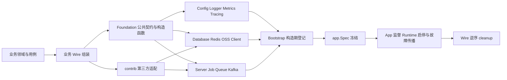
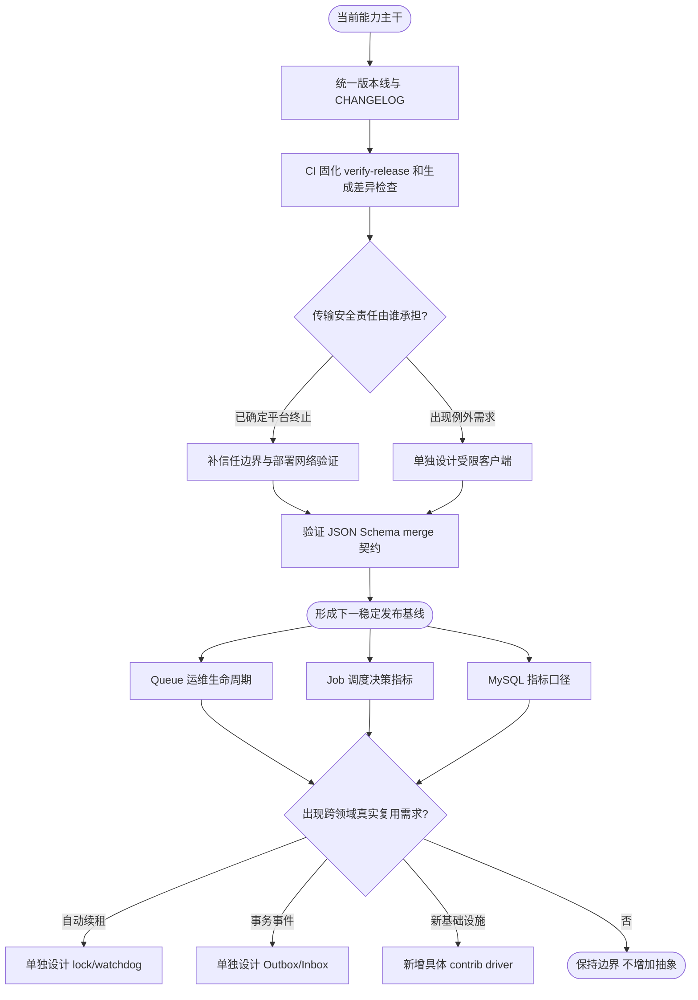

# 项目目标形态与演进路线

本文基于 2026-09-14 至 2026-09-17 的近期需求会话、对应提交和当前源码整理。它描述项目要收敛到什么形态，以及哪些能力已完成、仍需补齐或明确不属于 Foundation。具体 API、默认值和错误语义仍以各包 README 与源码为准。

## 最终定位

`kratos-foundation` 的目标是成为一套供多个 Go/Kratos 服务复用的**生产级应用基础库**，而不是业务框架、服务网格或通用工作流平台。它应让业务项目只保留领域规则和必要适配，并通过显式 Wire 组装获得一致的配置、资源、运行时、错误边界和可观测性。

最终形态应满足以下原则：

- 公共包提供小而稳定的契约、具体构造入口和明确资源所有权；业务不导入 Foundation 的 `internal`。
- 组件通过普通构造函数创建，通过 Wire 显式注入；不使用运行时服务定位器或隐藏的全局容器。
- `app.Spec` 是 Runtime 和应用贡献的唯一冻结边界，Bootstrap 只在构造期同步登记，不承载业务逻辑。
- 配置以统一协议读取；只在组件明确声明的字段上热更新，并在非法更新时保留上一份有效状态。
- 日志、Trace、指标和错误出口使用同一上下文和稳定低基数字段；底层返回错误，能决定重试、回退或响应的边界负责记录。
- 队列、Job、Kafka 分别承担持久任务、本进程调度和事件消费，不混用语义，也不承诺 exactly-once。
- 生成、测试、静态检查、竞态检测和业务组装验证均有可重复的仓库命令；发布说明与实际 tag、API 和迁移路径一致。

## 从近期需求归纳出的核心目标

近期会话不是彼此独立的功能堆叠，而是在反复收敛同一组工程目标：

1. **业务接入更少重复代码。** Queue 已从原始 Store/Handler 组装收敛为 `Queue[T]`、`Worker[T]` 和共享 `Observability`；Bootstrap、Server、Job 同样统一到共享 Spec 与显式阶段标记。
2. **配置路径和运行期行为可控。** local/Consul 路径、远程目录与配置名称可以显式注入；Log、Client、Database、Server 中间件和 Job 仅热更新各自声明的字段。
3. **默认行为适合多数服务，但覆盖边界清楚。** HTTP/gRPC 启用规则、Client 超时与 Discovery、Log 根级别、Job 调度优先级都提供默认值，同时保留业务显式覆盖。
4. **失败必须可定位且不会重复放大。** 配置加载与热更新记录实际来源和订阅身份；Job、Queue、Kafka、Consul 的失败、恢复和资源身份使用结构化日志与稳定分类。
5. **持久任务必须有真实运维语义。** Database/Redis Queue 支持租约恢复、有限重试、失败查询、人工重投及可选 Operations；成功默认删除，GORM 可以保留完成记录，但鉴权、审计、运维 API/UI、幂等和历史治理仍由业务负责。
6. **文档必须描述真实默认值、所有权和失败边界。** 示例不能被误读为默认值，热更新不能被写成整份配置原子切换，测试通过也不能替代调用示例与链接核验。

## 当前能力矩阵

| 领域 | 当前状态 | 已有能力与边界 |
| --- | --- | --- |
| 应用编排 | 已形成主干 | 共享 Spec、冻结、Runtime 监督、服务注册、就绪状态、停机预算和 Wire cleanup；不做 Runtime 自动重启 |
| 配置 | 已形成主干 | file/Consul/env 来源、路径定制、轮询订阅、来源与热更新日志；来源集合在构造期固定，组件只应用自身支持的热更新字段 |
| 日志与错误 | 已形成主干 | 根/模块/输出端级别、文件轮转、请求 debug、按事件级别及请求 debug 展开诊断 KV、敏感字段过滤、服务错误归一化；全局 Logger 只保证单应用逆序释放 |
| Metrics 与 Tracing | 已形成主干 | OTel Provider、Server/Client/Database/Redis/Kafka/Queue/Job/Lock/OSS 指标及 Dashboard/告警示例；外部系统指标仍依赖 exporter |
| Server | 已形成主干 | HTTP/gRPC、WebSocket、中间件、健康与管理监听、端点注册日志、错误安全出口；应用链路使用平台 TLS/mTLS 终止后的受信任内部明文，管理监听须由网络策略保护 |
| Client | 已形成主干 | HTTP/gRPC 工厂、服务发现、超时预算、热更新和版本租约；通用 gRPC 使用平台边界内的 insecure 拨号，不提供配置化 TLS/mTLS |
| Database/Redis/OSS | 已形成主干 | 具名资源、驱动边界、连接池、事务、指标和明确 cleanup；具体驱动按业务需要扩展 |
| Queue | 已形成主干 | 类型化投递/消费、Database/Redis Store、单一公开任务 ID、延迟、租约、重试、执行耗时日志、可选 Operations 元数据分页/详情/状态变更/有界清理、可选保留完成记录；没有 exactly-once、自动续租或管理界面 |
| Job | 已形成主干 | Cron/Once/Daemon、应用 Ready 后启动、注册与执行耗时日志、本进程并发策略、动态禁用与调度热更新、跳过与等待指标；没有跨进程协调器、锁租约或 Redis Job 适配 |
| Kafka | 已形成主干 | Producer、ConsumerRuntime、重试/死信、观测和 TLS/SASL；数据库事务与 Kafka 发布之间没有内置 Outbox |
| 生成器与发布门禁 | 部分完成 | Proto、JSON Schema、错误/客户端生成器及跨模块 test/vet/race/lint；缺少仓库 CI 与一致的版本/变更记录治理 |

## 下一阶段缺口与优先级

优先级表示对“可长期复用的稳定 Foundation”的影响，不表示应在一个版本中全部实现。任何改变并发、锁、租约或兼容性语义的事项，都要先单独确认方案。

### P0：下一次稳定发布前应完成

#### 1. 统一版本与发布治理

下一版本确定为 `v2.1.0`，当前仍是未发布开发线；根文档和 `CHANGELOG.md` 明确区分计划能力与已发布 tag。后续仍需由发布流程保证 tag 单调、提交 SHA 和工具链可追溯。

完成标准：

- 明确当前分支是稳定版后的兼容演进，还是下一稳定版前的预发布线；后续 tag 严格单调前进。
- 持续维护 `CHANGELOG.md`，按 Added/Changed/Removed/Migration 分类，并链接 `MIGRATION_V2.md` 的适用版本。
- PR 与 tag 流程在 CI 中执行 `make verify-release`；发布记录包含提交 SHA、Go/lint/protoc 版本和未执行的外部验收。

#### 2. 建立持续集成，而不只依赖本地门禁

Makefile 已有跨模块 test、vet、race、lint、Wire 业务组装和外部组件入口，但仓库当前没有 CI workflow。稳定性承诺需要在每次变更上自动执行，而不是依赖人工记忆。

完成标准：

- 普通 PR 至少运行 `make verify-release`，并缓存但不绕过依赖校验。
- Proto、Wire 或生成器源变化时验证生成结果无未提交差异。
- 外部 MySQL/Kafka/Redis/Consul 测试按合并前或定时任务运行，失败日志保留服务版本与隔离资源名。

#### 3. 决定传输安全基线

已选择由入口网关、Service Mesh 或同类平台终止和认证 TLS/mTLS。Foundation 配置管理的内部 HTTP/gRPC 与独立管理监听默认保持明文，不再规划通用应用级证书配置；原生 ServerOption 属于业务自管的底层扩展口，HTTP Client 的 HTTPS 及 Kafka、数据库等基础设施客户端仍遵循各自协议配置。

完成标准：

- 根文档和组件文档必须持续写清受信任网络、监听范围与管理端口网络策略。
- 部署验收应验证外部 TLS/mTLS、平台到应用的内部可达性，以及绕过平台直连应用端口会被网络策略拒绝。
- 若未来出现无法使用平台终止的真实场景，再单独设计例外客户端，不把 `insecure_skip_verify` 作为默认解法。

#### 4. 修正 JSON Schema 外部合并语义

五种 draft 的 `Merge` 已改为通过 `allOf` 完整保留外部根约束，并提升外部 definitions；同名 definition 只接受 JSON 语义一致内容，冲突会在生成阶段报告名称并停止。

完成标准：

- 明确 `$id`、相对引用、同名 Definitions 和根约束的合并规则。
- 为五种 draft 使用同一组输入到产物契约测试。
- 不支持的 schema 形态在生成阶段返回可定位错误。

### P1：生产运维能力增强

#### 5. 补齐 Queue 运维生命周期

公共 `queue.Operations` 已提供状态筛选游标分页、单条详情、条件删除/取消/失败重投和有界终态清理。Database Store 通过可选 `OperationsRepo` 动态暴露，GORM 和 Redis 已实现；必需 `Store`/`Repo` 契约保持不变。

业务仍需按真实运维流程补充认证、授权、审计、正文脱敏、调用限流和定时清理编排；管理 API/CLI/UI 不放入 Foundation。若实际需要批量人工处置、dry-run 或清理指标，再基于现有契约增加，避免预设统一面板。

#### 6. 补齐 Job 调度决策指标

已增加 `job_triggers_skipped_total`、`job_pending` 和 `job_wait_duration_seconds`，区分 disabled、already_running、pending_full 及 admitted/canceled。后续只需按真实告警需求调整面板阈值；不要重新引入已删除的分布式协调或续租指标。

#### 7. 校正 MySQL 状态指标口径

应用内 `SHOW STATUS` 采集及 `database.metrics.mysql` 配置已删除。Foundation 只提供应用连接池和 GORM 操作指标；MySQL 服务端全局状态、InnoDB 与复制指标交由平台的 `mysqld-exporter` 等独立采集器，并使用单独最小权限账号。

#### 8. 为可靠事件发布评估 Outbox/Inbox

Database Queue 已支持在本地业务事务中写入任务，但 Kafka 发布不与数据库事务形成原子边界。只有业务确实存在“提交业务数据后必须可靠发布 Kafka 事件”的需求时，再设计 Outbox relay、幂等消费和清理策略；不要把 Queue 与 Kafka 合并成一个含义模糊的抽象。

### P2：有明确复用需求后再做

- `pkg/lock/watchdog`：仅在 Job、请求、消费者中确有多个自动续租用例时新增；需要失效 Context、幂等 release、无泄漏退出和 fencing 边界。单个业务场景先显式使用 `Locker`/`Lease`。
- 新驱动：PostgreSQL、S3 兼容对象存储或其他配置/注册实现应由实际业务需求驱动，继续放在 `contrib/<domain>/<driver>`，不提前建立空壳。
- 对外 `api/`：当前仓库没有该目录；只有 Foundation 自身开始维护对外 Protocol Buffers 契约和可执行生成 target 时再创建。
- 多应用同进程全局日志所有权：现有契约是单应用、逆序 cleanup。只有真实多 App 场景出现时，再决定进程级 owner 或完全移除全局安装。

## 明确非目标

以下能力不应因为“基础库看起来缺少”就直接加入：

- 订单、支付、用户等业务领域模型与用例。
- 通用 RBAC/JWT 产品策略、API Gateway、Service Mesh 或 Kubernetes 控制器。
- 数据库 schema 版本管理平台；Foundation 只需为自身可选表结构提供可执行迁移入口和契约。
- Queue/Kafka exactly-once、永久业务去重或自动补偿业务副作用。
- 运行时服务定位器、全局依赖容器、按字符串获取任意资源。
- 内置 Queue 管理 UI、日志平台或完整 APM 后端；这些应消费 Foundation 的公共运维契约和指标。

## 推荐推进顺序

## 稳定形态验收清单

- 新业务服务可以从 `examples/minimal` 建立应用，只在业务 Wire 层选择资源和 Runtime，无需复制 Foundation 内部编排代码。
- 所有公共资源都说明构造、借用、停止与 cleanup 所有权；失败构造不会泄漏已创建资源。
- 每个热更新字段都有初始默认、显式零值、非法更新和旧状态保留说明；未声明字段明确要求重启。
- Runtime 故障可触发应用停止并保留真实根因；取消不会掩盖业务错误。
- Queue、Job、Kafka 的投递、重试、失败和幂等边界能被业务和运维人员准确区分。
- 默认日志、Trace、指标和告警不泄漏 Payload、凭据或高基数标识，并能定位资源身份与恢复状态。
- 文档示例能编译或有明确静态核验说明；本地链接、Mermaid、生成命令和产物路径与当前树一致。
- 发布 tag、变更记录、迁移文档和 CI 结果共同说明该版本可被业务依赖的范围。
