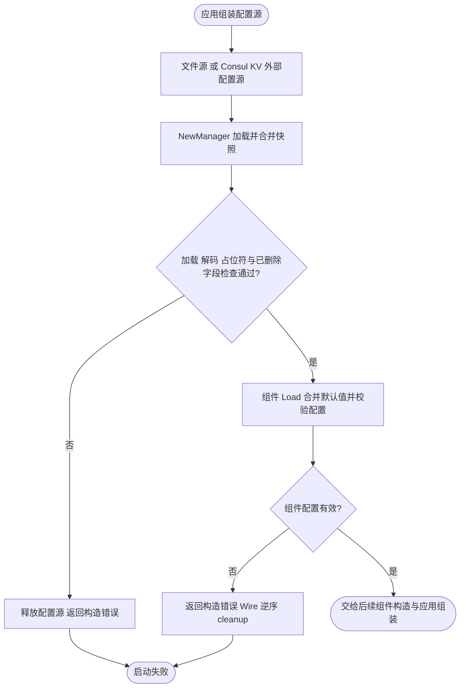
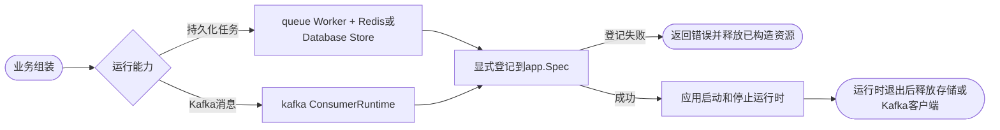

# kratos-foundation

`kratos-foundation` 是基于 [go-kratos](https://github.com/go-kratos/kratos) 的 Go 应用基础库，统一组装日志、配置、服务端、客户端、数据库、缓存、队列、任务与可观测性能力。

> 项目尚未正式发布，公开 API 仍可能在首个稳定版本前调整。

## 环境要求

- Go 1.25+
- 使用 Protocol Buffers 或 Wire 生成功能时，需先安装对应工具链

## 业务模板与监控部署

[最小业务模板](examples/minimal/README.md) 提供可复制的 HTTP/Wire 应用、配置、健康检查与业务指标示例。
[监控部署入口](deploy/observability/README.md) 提供本地 Docker Compose、普通 Prometheus 采集配置及可导入的 Grafana Dashboard；
[Kubernetes 示例](deploy/kubernetes/README.md) 接入已有 kube-prometheus-stack，通过 ServiceMonitor 和 PrometheusRule 复用同一面板与规则。

面板支持环境、集群、命名空间、App、机器/Node、Pod、实例和接口筛选；应用图可按 App/Pod/实例/Node 聚合。
整机指标需额外的 node-exporter，和应用进程指标分开解释。详见 [维度说明](deploy/observability/docs/dashboard.md)、
[告警接入](deploy/observability/docs/alerts.md) 和 [排障手册](deploy/observability/docs/troubleshooting.md)。

## 配置参考

- [`config.example.yaml`](config.example.yaml)：当前 Foundation YAML 配置参考，包含可选字段的注释示例。
- [`config.schema.json`](config.schema.json)：编辑器补全与结构校验；由 [`proto/config.proto`](proto/config.proto) 及其导入协议生成，不能手工修改。
- [`pkg/config`](pkg/config/README.md)：配置源合并、环境变量替换、类型解码、订阅及错误语义。

示例覆盖未弃用的协议字段；连接级 `database.connections.*.gorm` 与全局 `database.gorm` 共用字段，示例只列出部分覆盖值，完整字段看全局块。弃用的 `database.tracing.exclude_metrics` 仅保留说明，数据库指标统一使用 `database.metrics`。

示例值不等于默认值：例如 `server.stop_delay: 3s`、客户端超时和 Redis 连接池大小都是显式设置。注释中的 `[默认: ...]` 说明省略字段后的行为；显式 `0`、`false` 或 `0s` 是否等同省略由具体字段决定。Duration 使用 protobuf 秒字符串，如 `10s`、`0.2s`、`0s`，不能使用 `10m` 或裸数字。Redis 的负时长哨兵 `-1ns`、`-2ns` 分别写为 `-0.000000001s`、`-0.000000002s`，不是 `-1s`、`-2s`。

| YAML 顶层配置 | 用途 | 支持热更新的范围 |
| --- | --- | --- |
| `app` | 注册端点、metadata、注册与停机期限 | 仅 `stop_timeout`；停机开始后预算固定 |
| `tracing` | OTLP 导出器与采样器 | 仅 `sampler`；构造时已禁用的 Provider 不能靠热更新启用 |
| `server` | HTTP/gRPC、中间件、健康与指标端点 | 仅 `middleware`；地址、端点和停机延迟需重启 |
| `discovery` | Consul 查询超时、单/多数据中心 | 无 |
| `registry` | Consul 健康检查、心跳、实例标签 | 无；`tags` 与 `app.metadata` 分开配置 |
| `database` | 具名连接、GORM、连接池及观测 | 仅各连接的 `max_idle_conns`、`max_open_conns`、`conn_max_lifetime`、`conn_max_idle_time` |
| `redis` | 具名连接、追踪与指标 | 无 |
| `client` | 具名服务客户端、调用中间件与清理预算 | 仅 `clients`；`log`、`cleanup_timeout` 需重启 |
| `kafka` | 具名 broker 连接、TLS/SASL、生产/消费参数 | 无 |
| `oss` | 按逻辑名配置 bucket 和驱动参数 | 无 |

热更新按组件生效，不能视为整份应用配置同时切换。Server 中间件会先校验组合再逐项发布；Database 同次更新若含需重启字段，会跳过整次数据库更新，连接池参数也不应用；Client 的日志或 cleanup 预算变更只提示需重启，不阻止有效的 `clients` 更新。配置 Manager 接受快照也不代表每个组件都已应用，具体边界见各包 README。

### 加载与部署

框架不会自动寻找 `config.example.yaml`。应用将需要的配置复制到部署文件，替换地址、连接名和凭据，并通过 [`contrib/config/file`](contrib/config/file/README.md) 的 `NewSources(logger, PathList{...})` 或 [`contrib/config/consul`](contrib/config/consul/README.md) 创建源，再交给 `config.NewManager`。只有应用显式构造的组件才会消费对应配置块；删除数据库或 Redis 配置时，也应调整相应组件的组装。

Sources 按传入顺序合并，后面的源优先级更高；map 递归合并，slice、标量和显式 `null` 整体覆盖。`$VAR` / `${VAR}` 在原始 KeyValue 的 JSON/YAML 解析前通过 Compose 模板替换环境变量，支持默认值和必填检查；普通变量未设置时为空。配置自身引用及其 fallback 已移除；具体边界见 [环境变量模板](pkg/config/README.md#环境变量模板)。凭据应由实际部署配置源或受信任的进程环境提供，示例中的占位值不能用于连接真实服务。



以下能力不属于 Foundation YAML 顶层协议，不能把旧字段补回示例：

| 能力 | 当前配置入口 |
| --- | --- |
| 应用环境 | `APP_ENV`，其次 `KRATOS_ENV`，均未设置时为 `local`；见 [`pkg/env`](pkg/env/README.md) |
| 根日志 | `LOG_*` 环境变量及 `pkg/log` 包级 `WithXXX` 设置；模块级 `database/redis/client/kafka.log` 仍保留 |
| Consul 地址与认证 | 环境变量（如 `CONSUL_HTTP_ADDR`）或 `pkg/consul.Options`；在 Manager 之前构造共享客户端，见 [`pkg/consul`](pkg/consul/README.md) |
| Metrics Provider | 显式构造和注入；HTTP 暴露位置仍由 `server.http.metrics` 配置 |
| Job、Queue | 强类型 Spec/构造配置及显式 Bootstrap；Kafka 连接配置仍位于 `kafka` |

旧顶层 `log`、`metrics`、`job`、`queue` 以及其他 reserved 字段即使设为 `null` 或空对象也会被拒绝，详见 [配置迁移表](pkg/config/README.md) 和 [v2 迁移清单](MIGRATION_V2.md)。

### 健康检查与配置观测

默认业务 HTTP 端口提供 `/metrics`、`/healthz` 和 `/readyz`。`/healthz` 表示 HTTP 能响应；`/readyz` 在全部启动后钩子完成、关键依赖检查通过且未停机时返回 200，否则返回 503。`bootstrap.NewServerBootstrap` 自动绑定应用就绪状态；直接使用 Runtime 时需要显式绑定，否则 readiness 保持 503。

设置 `server.http.metrics.addr` 和 `server.http.health.addr` 可独立监听，例如同时设为 `127.0.0.1:9001` 会共享一个管理监听。空地址复用业务 HTTP；业务 HTTP 禁用时，管理端点只有显式设置地址才会启动。管理端点独立于业务路由前缀、Filter 和鉴权；独立监听使用普通 HTTP，不继承业务 TLS，也不进入业务服务发现。完整地址规则、探针流程及停机边界见 [`pkg/server`](pkg/server/README.md)。

依赖检查通过 `spec.HTTP().HealthChecks(...)` 追加，地址、路径和总检查期限保留 YAML 配置；`Health(HealthConfig{...})` 则整体覆盖文件中的健康端点配置。

配置监听状态、快照接受/拒绝和订阅过载可通过 `config.StatusReader` 查看。应用可显式组装 `bootstrap.NewConfigObservabilityBootstrap`，通过已有 metrics 端点暴露 `foundation_config_*` 指标；仅填写 YAML 不会自动启用该 collector。接入步骤、指标与流程图见 [配置观测组装](pkg/bootstrap/README.md#配置观测组装)。

## 构造依赖约定

Wire 或手工组装层负责提供非空的必需组件依赖（如 Config Manager、Logger、AppInfo、遥测 Provider、Spec 和 Runtime）。构造函数及 Bootstrap 不重复检查这些依赖是否为 `nil`；直接调用时也必须遵守该前置条件。配置、外部输入、回调以及来源不确定的返回值继续按各包契约校验。显式支持禁用的可选依赖（如 Consul Client、Registrar、Discovery 和未使用分布式策略时的 Job Coordinator）保留 `nil` 语义。

## 核心组装流程

```mermaid
flowchart LR
    A[Wire: app.NewSpec / app.NewConfig] --> B[构造组件]
    B --> C[bootstrap.NewXXXBootstrap 同步贡献]
    C --> D[bootstrap.InfrastructureBootstrap]
    D --> U[业务提供 bootstrap.Bootstrap]
    U --> V[bootstrap.StartupReady]
    V --> E[bootstrap.NewKratosApp 调用 app.NewApp 冻结 Spec]
    E --> F[application.Run 启动 Runtime]
    F --> G[Wire cleanup 逆序释放资源]
```



`pkg/bootstrap` 集中提供各组件的 `XXXBootstrap` 与 `NewXXXBootstrap`，领域包只提供声明自身依赖的普通构造函数；`pkg/app` 只定义应用依赖与构造函数。Wire 按 `InfrastructureBootstrap → Bootstrap（业务提供）→ StartupReady → NewKratosApp` 分阶段；业务 provider 显式依赖基础设施完成标记，阶段内不规定额外顺序。Bootstrap 只在构造期同步组装；Runtime 仅在 `application.Run()` 时启动。

`BaseProviderSet`（或自定义 Job Coordinator 版本）可搭配 `ConsulProviderSet`（或自定义远程目录名版本），
默认提供注册发现及按环境二选一的配置源；自定义后端可直接提供相同契约。完整的构造、错误处理和 Wire cleanup 示例见 [`bootstrap`](pkg/bootstrap/README.md)。显式组装时，业务提供 `bootstrap.Bootstrap`，由 `bootstrap.NewBootstrap` 返回 `StartupReady`；统一 Spec 入口使用 `bootstrap.NewApplicationBootstrap` 返回相同的最终标记。资源 cleanup 由 Wire 逆序执行。Server、Queue 和 Job Runtime 在应用启动时同时收到 `Start`，不需要等待 `AfterStart` 钩子。App 直接持有启动、停止与服务完成状态；其私有方法按职责分文件，Registrar 适配只依赖 App；应用依赖 [`pkg/app`](pkg/app/README.md) 暴露的契约和构造函数。

## 日志

`pkg/log` 提供：

- 基于 `LOG_*` 环境变量的严格配置解析。
- stdout/stderr 分流与可轮转文件输出。
- 进程级全局日志状态：任意位置通过 `log.WithLevel/WithKV/WithMsgKey` 等共享设置方法修改，已有 Logger 和全局日志共享生效。
- 每次 `NewLogger` 构造独立输出并返回 cleanup；输出配置构造后固定，包级共享设置方法只更新非资源状态；`log.WithModule` 返回借用当前输出的派生视图。
- 不可变的模块、上下文、级别和敏感字段派生。
- 每条输出保留有效 `module`，缺失时为 `unknown`；通过 Foundation 安装全局绑定后，Kratos SDK 日志归属 `kratos`。

完整用法、配置表和设计边界见 [`pkg/log/README.md`](pkg/log/README.md)。

## Database 与 OSS 驱动注册

Database 和 OSS 满足“一个 Manager 管理多份具名资源，并按配置选择不同驱动”的条件，因此使用 `init + frozen registry`。业务/Wire 通过空导入明确决定哪些驱动进入最终二进制；驱动的 `init` 只注册 factory，不读取配置或创建外部资源。

Database 可同时编译 MySQL 与 SQLite3，具体连接由 `database.connections[*].driver` 选择：

```go
package assembly

import (
	_ "github.com/jaggerzhuang1994/kratos-foundation/v2/contrib/database/mysql"
	_ "github.com/jaggerzhuang1994/kratos-foundation/v2/contrib/database/sqlite"
)
```

OSS 默认提供阿里云实现，bucket 由 `oss.buckets[*].driver: aliyun` 选择：

```go
package assembly

import _ "github.com/jaggerzhuang1994/kratos-foundation/v2/contrib/oss/aliyun"
```

注册完成后，组装层只调用公共的 `database.NewManager(...)` 和 `oss.NewManager(...)`。驱动注册表在首次构造 Manager 时冻结；需要新增 PostgreSQL、七牛云等实现时，应增加对应 `contrib/<domain>/<driver>` 包，而不是把具体 SDK 放进领域包。

## 任务队列与 Kafka 消息

`pkg/queue` 提供持久化任务契约、Dispatcher 与 Worker，Redis 后端由 `contrib/queue/redis` 构造，Database 后端由 `contrib/queue/database` 适配业务提供的 Repo（使用 TaskRecord 交换任务及执行状态，可选 GORM 泛型 Repo，支持与业务数据在同一本地事务中写入任务）。支持即时/延迟投递、租约恢复、持久化重试、失败查询与人工重试；业务 Handler 仍须幂等。业务将 Worker 登记到同一个 `app.Spec`，由应用统一启停，随后释放存储连接。完整配置、运行示例和失败边界见 [Queue 文档](pkg/queue/README.md)。

`pkg/kafka` 独立提供客户端工厂、消息生产者、消费者及消费运行时，适合事件传播与消费组处理；不作为任务队列后端。构造、批量发送、offset 提交、重试/死信和资源所有权见 [Kafka 文档](pkg/kafka/README.md)。两者使用显式注入，不进入全局 Driver Registry。



## Job 并发协调

`pkg/job` 保留通用并发协调契约，具体 Redis 组合由业务/Wire 显式选择并通过 `job.NewManager` 的最后一个构造参数注入。统一 Spec 模式由 `bootstrap.NewComponentsBootstrap` 接收并转交协调器，Spec 仅声明任务与策略。

不需要跨进程协调时，业务 provider 返回 nil `job.ConcurrencyCoordinator`；启用时提供 Redis contrib 实现，并在任务上显式选择 `SkipIfDistributedRunning` 或 `DelayIfDistributedRunning`。分布式策略缺少协调器会在 Manager 构造时返回错误；仅注入协调器不会把进程内策略升级为分布式策略。这里不使用全局驱动注册表，也不会根据 `job.lock.driver` 自动分发。Delay 默认有界等待，超额触发会跳过；详见 [Job 容量说明](pkg/job/README.md#delay-容量)。

`registry.Registrar` 同样由 Wire 注入 `bootstrap.NewKratosApp`，返回 nil 即禁用服务注册。完整的 nil provider 与 Wire 示例见 [Bootstrap 文档](pkg/bootstrap/README.md#可选依赖由-wire-构造注入)，Redis provider 与租约边界见 [Job 文档](pkg/job/README.md)。

## 主要目录

完整包分类见 [`pkg/README.md`](pkg/README.md)，新增工具、契约、资源组件、Runtime、Bootstrap 或第三方适配时，参考[包开发模式指南](pkg/DEVELOPMENT.md)。指南包含 watchdog 看门狗锁的包归属、生命周期与开发示例。

```text
api/                              对外 Protocol Buffers 定义及生成产物
pkg/<domain>/                     公共契约、构造入口与同领域实现
pkg/<domain>/internal/<capability>/ 按需拆出的独立私有子能力
contrib/<domain>/<driver>/        业务 App/Wire 可选择的公共第三方实现
internal/<capability>/            至少由两个领域直接复用的私有能力及测试设施
proto/                            仓库内部 Protocol Buffers 定义及生成产物
```

例如，Tracing 的配置、Exporter 与 Sampler 按文件组织在 `pkg/tracing`，进程信息采集位于 `pkg/appinfo/appinfo.go`。日志输出、配置解码、队列遥测以及 client/server 专属中间件具有独立职责，保留所属领域的嵌套 `internal`。优先用非导出标识符隐藏实现，不增加纯转发层。

手写实现文件通常控制在 150–300 行，超过 400 行检查职责是否需要拆分；不为行数或目录一致性机械拆包。Wire 仍通过公开构造函数创建依赖并持有 cleanup，Bootstrap 在构造期贡献 `app.Spec`，`app.NewApp` 在最终屏障后冻结并组装应用。

## v2 迁移与发布

从 main 升级时，按 [v2 迁移与发布清单](MIGRATION_V2.md) 核对接口、配置、生成器和业务验收。
`make lint` 覆盖全部 Go 模块；`make test-business` 验证 Wire、HTTP/SQLite 订单事务和生成客户端契约。
发布前运行 `make verify-release`，并完成清单中的业务环境验收。该命令不会推送、打 tag 或部署。

## 开发与验证

```bash
make test
make vet
make race
make lint
```

一次执行不需外部基础设施的完整验证：

```bash
make verify
```

修改 Protocol Buffers 或 Wire 等生成源后，使用仓库对应的 `make proto` 或 `make generate` 目标，不要手工修改生成文件。

本地 Docker 真实服务验证：在仓库根目录运行 `make test-external`，自动创建并清理隔离的 MySQL/Kafka/Redis/Consul，执行集成、恢复和批量基准。服务版本、端口、产物及适用边界见 [外部测试说明](testdata/external/README.md)。

完整组件与真实指标演示见 [components 示例](examples/components/README.md)，保留最小模板的轻量接入方式。


### 旧错误兼容与安全请求日志

默认 Server 请求链与 HTTP 编码器统一归一化旧结构化错误，保留原始 HTTP 状态及业务码，保留服务间 gRPC 堆栈及 cause 诊断，过滤响应头；HTTP 公开输出仍屏蔽堆栈。关闭访问日志仍保留一次服务端故障诊断；访问摘要不包含请求或响应正文。适用边界与流程见 [Server 错误边界](pkg/server/README.md#请求错误边界与安全日志) 和 [错误兼容](pkg/errors/README.md)。
