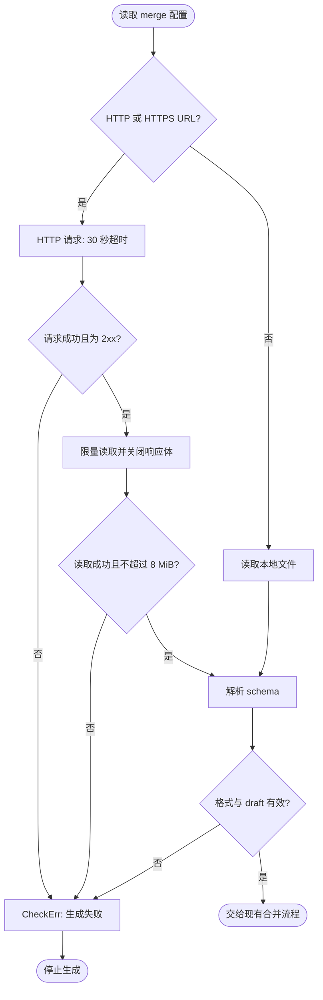

# protoc-gen-jsonschema

`protoc-gen-jsonschema` is a plugin that converts `protocol buffer` files into `JSON Schema`. While it primarily focuses on the protobuf standard, it also supports certain non-standard specifications, such as those used by Kubernetes, Node.js, and ArgoCD. Rather than trying to cover the entire JSON Schema specification, the plugin is intentionally designed to focus on [ProtoJSON](https://protobuf.dev/programming-guides/json/) and the patterns most frequently used in practice. It supports JSON Schema versions `draft-04`, `draft-06`, `draft-07`, `draft-2019-09`, and `draft-2020-12`. as well as support protocol buffer `syntax proto2`, `syntax proto3`.

If you’d like to support another specification, contributions are always welcome! Feel free to submit a PR.

# Installation

If you have go runtime, you can `go install` it.
```
go install github.com/pubg/protoc-gen-jsonschema
```

Alternatively, you can download a pre-built binary from [GitHub Release](https://github.com/pubg/protoc-gen-jsonschema/releases).

# Usage

Refer to the [Plugin Options](#plugin-options) section below for various options available for this plugin.

### I'm not sure which options to use
This plugin provides default options that are ready to use. For testing or generating a basic json-schema file, the following command is sufficient without extra options.
```
protoc --jsonschema_out=. *.proto
```

### Generate with yaml format
```
protoc --jsonschema_out=. --jsonschema_opt=output_file_suffix=.yaml *.proto
```

### Shrink bytes for transfer over network
```
protoc --jsonschema_out=. --jsonschema_opt=pretty_json_output=false *.proto
```

### I'd like to comply with the protobuf JSON mapping standard
By default, this plugin does not comply with the Protobuf standard because most plugins and other JSON libraries do not address integers larger than a 53-bit value. To ensure greater compatibility with other libraries, this plugin converts int64 values to integers instead of strings. However, to comply with the Protobuf standard, int64 values should be converted to strings. The below options will assist you.
```
protoc --jsonschema_out=. --jsonschema_opt=respect_protojson_int64=true --jsonschema_opt=respect_protojson_presence=true *.proto
```

### I'm not satisfied with the plugin's options. I want to customize every field
This plugin offers options for fields, messages, and enums. You can utilize these options in the jsonschema.proto file within your proto.
```
cp jsonschema.proto examples/jsonschema.proto
protoc --jsonschema_out=. --proto_path=examples examples/jsonschema.proto
```

# Options

### Plugin Options

### entrypoint_message
```
entrypoint_message is used which message should be entrypoint object of schema.

default: null or empty
example:
    - --jsonschema_opt=entrypoint_message=MyMessage
```

### output_file_suffix
```
output_file_suffix is used to determine output file name suffix.
Values should end with '.json' or '.yaml' or '.yml'.

default: .schema.json
example:
    - --jsonschema_opt=output_file_suffix=.schema.json
    - --jsonschema_opt=output_file_suffix=.schema.yaml
```

### pretty_json_output
```
pretty_json_output is used to determine output json should be pretty printed.
This option is only used when output_file_suffix is '.json'.

default: true
example:
    - --jsonschema_opt=pretty_json_output=true
    - --jsonschema_opt=pretty_json_output=false
```

### draft
```
draft is used to determine which draft version should be used.
The value should be one of Draft04, Draft05, Draft06, Draft07, Draft201909, Draft202012.

default: Draft202012
example:
    - --jsonschema_opt=draft=Draft202012
```

### mandatory_nullable
```
mandatory_nullable determines whether this plugin should treat optional field as nullable.
Many programming languages do not differentiate between undefined and null.
However, scripting languages like JavaScript and TypeScript can distinguish between them.
By default, optional field is treated as nullable and undefined.

default: false
example:
    - --jsonschema_opt=mandatory_nullable=true
    - --jsonschema_opt=mandatory_nullable=false
```

### int64_as_string
```
Deprecated: use `respect_protojson_int64` instead. It's has same functionality.
Just change the name to be more clear.

Old Description:
int64_as_string determines whether int64 field treat as string.
Depends on Javascript specification, The JS stores integer to only 53bits.
So, if you want to use int64 field in JS, you should use string type.
References:

default: false
example:
    - --jsonschema_opt=int64_as_string=true
    - --jsonschema_opt=int64_as_string=false
```

### preserve_proto_field_names
```
preserve_proto_field_names is used to determine if output json field names
should be identical to the proto field names.
Otherwise field names either use the value of the `json_name` field option
or they are automatically converted to lowerCamelCase.
This default behaviour mirrors the behaviour of Protobuf's canonical JSON format (ProtoJSON).

default: false
example:
    - --jsonschema_opt=preserve_proto_field_names=true
    - --jsonschema_opt=preserve_proto_field_names=false
```

### additional_properties
```
additional_properties option can controls all message's additional_properties property.
If you want set additional properties for all messages, use always_true or always_false.
If you want to set additional properties for not defined messages, use default_true or default_false.

default: 'DoNothing'
example:
  - --jsonschema_opt=additional_properties=AlwaysTrue
  - --jsonschema_opt=additional_properties=AlwaysFalse
  - --jsonschema_opt=additional_properties=DefaultTrue
  - --jsonschema_opt=additional_properties=DefaultFalse
  - --jsonschema_opt=additional_properties=DoNothing
```

### respect_protojson_presence
```
This options is used to determine if the plugin should respect the presence of fields
in the ProtoJSON format. If set to true and fields that does have presence, plugin will
generate the `required` keyword in the output schema for those fields.

default: false
example:
  - --jsonschema_opt=respect_protojson_presence=true
  - --jsonschema_opt=respect_protojson_presence=false
```

### respect_protojson_int64
```
This options is used to determine if the plugin should respect the int64 fields
in the ProtoJSON format. If set to true, int64 fields will be treated as strings
in the output schema, otherwise they will be treated as numbers.

default: false
example:
  - --jsonschema_opt=respect_protojson_int64=true
  - --jsonschema_opt=respect_protojson_int64=false
```

### Protobuf Options

Below tables are not auto-generated features.
Check out the [Options](./options.md) file to see auto-generated options.

| protobuf label | jsonschema                           |
|----------------|--------------------------------------|
| required       | $.required.append(field)             |
| optional       | oneof {type: null, $original_schema} |
| repeated       | type: array, items: $original_schema |

| WellKnown Types                                 |
|-------------------------------------------------|
| k8s.io.apimachinery.pkg.util.intstr.IntOrString |
| k8s.io.api.core.v1.Volume                       |
| k8s.io.api.core.v1.SecretProjection             |
| k8s.io.api.core.v1.ConfigMapVolumeSource        |
| k8s.io.api.core.v1.ConfigMapProjection          |
| k8s.io.api.core.v1.ConfigMapKeySelector         |
| k8s.io.api.core.v1.SecretKeySelector            |
| k8s.io.api.core.v1.ConfigMapEnvSource           |
| k8s.io.api.core.v1.SecretEnvSource              |
| k8s.io.api.core.v1.Probe                        |
| k8s.io.api.core.v1.EphemeralContainer           |
| google.protobuf.Timestamp                       |
| google.protobuf.Duration                        |
| google.protobuf.Any                             |
| google.protobuf.NullValue                       |

`google.protobuf.Duration` 默认生成 `type: string`，不设置 `format: duration`，
并使用 pattern `^-?[0-9]+(\.[0-9]{1,9})?s$`：只接受以 `s` 结尾的秒数字符串，
支持负数和最多 9 位小数，例如 `1s`、`-0.5s`、`0.000000001s`。
`1ms`、`1m`、`PT1S` 和超过 9 位的小数不符合该规则。

特殊类型映射位于 [well_known.go](./internal/modules/well_known.go)。

# 开发与文档生成

生成行为的测试位于 `internal/modules/*_test.go`。Go 版本以本模块 `go.mod` 为准，协议生成使用仓库根目录的 Makefile 和 `third_party`。

在仓库根目录执行 `make -C cmd/protoc-gen-jsonschema deps options`，可从 `third_party/pubg/jsonschema.proto` 重新生成 `options.md`；`deps` 安装固定版本的 `protoc-gen-doc`，`options` 仅生成文档。


## 输出和远程合并边界

`pretty_json_output` 默认保留缩进输出；设为 `false` 时生成紧凑 JSON，非法布尔值会导致生成失败。YAML 不受此选项影响。

普通字段、数组元素和 map 值共用已有的特殊类型映射：`Timestamp` 为 `date-time` 字符串，`Duration` 为秒数字符串，`Any` 为对象，`NullValue` 为 `null`。

远程 `merge` URL 的完整请求最多等待 30 秒，只接受 2xx 响应，并限制响应体为 8 MiB。读取失败、超时、状态码异常或超限时，生成器报告错误并停止；本地文件读取保持原有行为。


