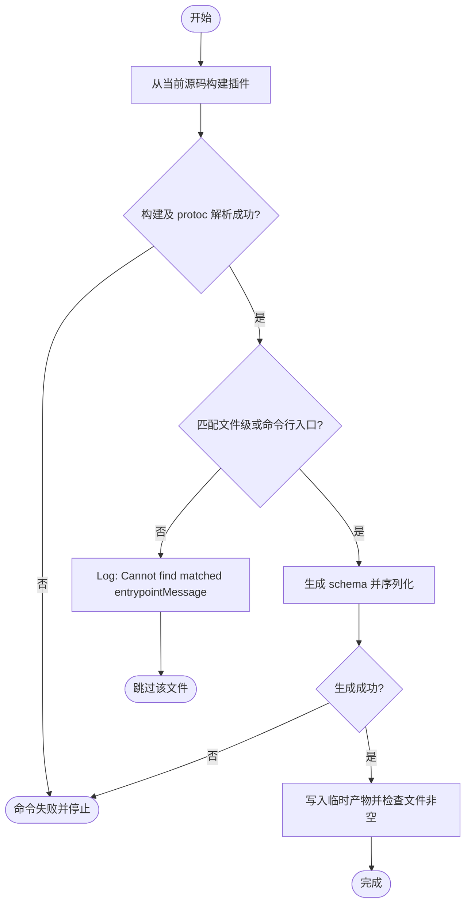
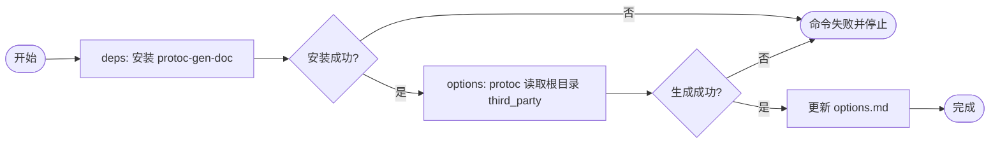
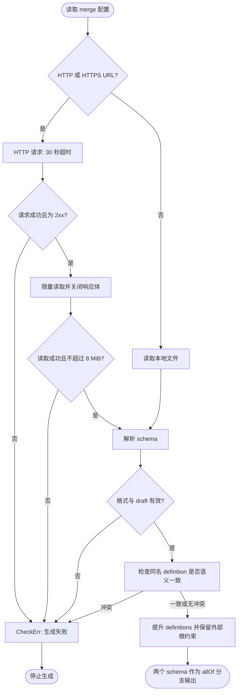

# protoc-gen-jsonschema

`protoc-gen-jsonschema` is a plugin that converts `protocol buffer` files into `JSON Schema`. While it primarily focuses on the protobuf standard, it also supports certain non-standard specifications, such as those used by Kubernetes, Node.js, and ArgoCD. Rather than trying to cover the entire JSON Schema specification, the plugin is intentionally designed to focus on [ProtoJSON](https://protobuf.dev/programming-guides/json/) and the patterns most frequently used in practice. It supports JSON Schema versions `draft-04`, `draft-06`, `draft-07`, `draft-2019-09`, and `draft-2020-12`. as well as support protocol buffer `syntax proto2`, `syntax proto3`.

If you’d like to support another specification, contributions are always welcome! Feel free to submit a PR.

# 安装与最小示例

本工具基于 [pubg/protoc-gen-jsonschema](https://github.com/pubg/protoc-gen-jsonschema) 维护；该链接仅说明上游来源。请使用本仓库源码构建，避免安装上游二进制后遗漏本仓库的行为修复。需要 Go（版本见本模块 `go.mod`）和已安装的 `protoc`；仓库根目录的 `make init` 也会安装本工具，`make proto` 会直接构建当前源码。

以下命令从**仓库根目录**执行，在临时目录创建和生成示例，不修改仓库产物：

```sh
set -eu
repo_dir="$PWD"
schema_demo_dir="$(mktemp -d)"
(cd cmd/protoc-gen-jsonschema && go build -o "$schema_demo_dir/protoc-gen-jsonschema" .)
cat > "$schema_demo_dir/config.proto" <<'PROTO'
syntax = "proto3";
package demo;
option go_package = "example.com/demo;demo";
message Config {
  optional string name = 1;
}
PROTO
protoc --proto_path="$schema_demo_dir" \
  --plugin=protoc-gen-jsonschema="$schema_demo_dir/protoc-gen-jsonschema" \
  --jsonschema_out="$schema_demo_dir" \
  --jsonschema_opt=entrypoint_message=Config "$schema_demo_dir/config.proto"
test -s "$schema_demo_dir/config.schema.json"
```

`entrypoint_message` 必须指定当前文件中的顶层消息名；没有入口或找不到匹配消息时，插件输出提示并跳过该文件，不生成 schema。入口也可使用下面的文件级选项配置，文件级非空值优先于命令行参数。

继续在同一 shell 使用上述变量，给 protoc 命令增加以下选项可改变输出：

| 用途 | 附加选项 |
|---|---|
| YAML | `--jsonschema_opt=output_file_suffix=.yaml` |
| 紧凑 JSON | `--jsonschema_opt=pretty_json_output=false` |
| int64 系列字段映射为字符串 | `--jsonschema_opt=respect_protojson_int64=true` |
| 按当前 presence 策略生成 required | `--jsonschema_opt=respect_protojson_presence=true` |

这些选项仍须与入口配置一起使用。Presence 策略见下文，不代表完整覆盖所有 ProtoJSON 接受形式。

## 自定义字段与文件选项

使用仓库的 `third_party/pubg/jsonschema.proto`，不需要复制协议文件。继续在同一 shell 覆盖临时示例：

```sh
cat > "$schema_demo_dir/config.proto" <<'PROTO'
syntax = "proto3";
package demo;
option go_package = "example.com/demo;demo";
import "pubg/jsonschema.proto";
option (pubg.jsonschema.file) = { entrypoint_message: "Config" };
message Config {
  optional string name = 1 [(pubg.jsonschema.field) = { nullable: true }];
}
PROTO
protoc --proto_path="$schema_demo_dir" --proto_path="$repo_dir/third_party" \
  --plugin=protoc-gen-jsonschema="$schema_demo_dir/protoc-gen-jsonschema" \
  --jsonschema_out="$schema_demo_dir" "$schema_demo_dir/config.proto"
test -s "$schema_demo_dir/config.schema.json"
```

此例通过字段选项让 `name` 接受 null。文件、消息、字段和枚举选项见 [options.md](./options.md)。



# Options

### Plugin Options

### entrypoint_message
```
entrypoint_message is used which message should be entrypoint object of schema.

default: null or empty
example:
    - --jsonschema_opt=entrypoint_message=MyMessage
```

### output_file_suffix
```
output_file_suffix is used to determine output file name suffix.
Values should end with '.json' or '.yaml' or '.yml'.

default: .schema.json
example:
    - --jsonschema_opt=output_file_suffix=.schema.json
    - --jsonschema_opt=output_file_suffix=.schema.yaml
```

### pretty_json_output
```
pretty_json_output is used to determine output json should be pretty printed.
This option is only used when output_file_suffix is '.json'.

default: true
example:
    - --jsonschema_opt=pretty_json_output=true
    - --jsonschema_opt=pretty_json_output=false
```

### draft
```
draft is used to determine which draft version should be used.
支持值为 Draft04、Draft06、Draft07、Draft201909、Draft202012。
Draft05 虽存在于内部枚举中，但当前不支持生成，选择后会跳过产物。
无法识别的 draft 字符串当前回退到默认 Draft202012。

default: Draft202012
example:
    - --jsonschema_opt=draft=Draft202012
```

### mandatory_nullable
```
mandatory_nullable 默认 true：不会自动为 optional 或真实 oneof 成员添加 null。
设为 false 时，这些字段会生成包含 null 的 oneOf。
字段选项 nullable=true 不受该开关限制，始终允许 null。
此选项控制 null 值，字段能否省略由 required 策略决定。

default: true
example:
    - --jsonschema_opt=mandatory_nullable=true
    - --jsonschema_opt=mandatory_nullable=false
```

### int64_as_string
```
Deprecated: use `respect_protojson_int64` instead. It's has same functionality.
Just change the name to be more clear.

Old Description:
int64_as_string determines whether int64 field treat as string.
Depends on Javascript specification, The JS stores integer to only 53bits.
So, if you want to use int64 field in JS, you should use string type.
References:

default: false
example:
    - --jsonschema_opt=int64_as_string=true
    - --jsonschema_opt=int64_as_string=false
```

### preserve_proto_field_names
```
preserve_proto_field_names is used to determine if output json field names
should be identical to the proto field names.
Otherwise field names either use the value of the `json_name` field option
or they are automatically converted to lowerCamelCase.
This default behaviour mirrors the behaviour of Protobuf's canonical JSON format (ProtoJSON).

default: false
example:
    - --jsonschema_opt=preserve_proto_field_names=true
    - --jsonschema_opt=preserve_proto_field_names=false
```

### additional_properties
```
additional_properties option can controls all message's additional_properties property.
If you want set additional properties for all messages, use always_true or always_false.
If you want to set additional properties for not defined messages, use default_true or default_false.

default: 'DoNothing'
example:
  - --jsonschema_opt=additional_properties=AlwaysTrue
  - --jsonschema_opt=additional_properties=AlwaysFalse
  - --jsonschema_opt=additional_properties=DefaultTrue
  - --jsonschema_opt=additional_properties=DefaultFalse
  - --jsonschema_opt=additional_properties=DoNothing
```

### respect_protojson_presence
```
设为 true 时，非真实 oneof 成员且 HasPresence 的字段加入 required。
默认 false 时，非真实 oneof、无 optional keyword、非 repeated/map 的字段加入 required。
因此默认策略也会要求普通 proto3 标量字段；真实 oneof 成员不会单独加入 required。
当前生成器不生成真实 oneof 成员之间的互斥约束；字段可为 null 不等于约束整个 oneof 只能出现一个成员。

default: false
example:
  - --jsonschema_opt=respect_protojson_presence=true
  - --jsonschema_opt=respect_protojson_presence=false
```

### respect_protojson_int64
```
This options is used to determine if the plugin should respect the int64 fields
in the ProtoJSON format. If set to true, int64 fields will be treated as strings
in the output schema, otherwise they will be treated as numbers.

default: false
example:
  - --jsonschema_opt=respect_protojson_int64=true
  - --jsonschema_opt=respect_protojson_int64=false
```

### Protobuf Options

Below tables are not auto-generated features.
Check out the [Options](./options.md) file to see auto-generated options.

| protobuf label | jsonschema                           |
|----------------|--------------------------------------|
| required       | $.required.append(field)             |
| optional       | 默认不自动包含 null；`mandatory_nullable=false` 或字段 `nullable=true` 时添加含 null 的 oneOf |
| repeated       | type: array, items: $original_schema |

| WellKnown Types                                 |
|-------------------------------------------------|
| k8s.io.apimachinery.pkg.util.intstr.IntOrString |
| k8s.io.api.core.v1.Volume                       |
| k8s.io.api.core.v1.SecretProjection             |
| k8s.io.api.core.v1.ConfigMapVolumeSource        |
| k8s.io.api.core.v1.ConfigMapProjection          |
| k8s.io.api.core.v1.ConfigMapKeySelector         |
| k8s.io.api.core.v1.SecretKeySelector            |
| k8s.io.api.core.v1.ConfigMapEnvSource           |
| k8s.io.api.core.v1.SecretEnvSource              |
| k8s.io.api.core.v1.Probe                        |
| k8s.io.api.core.v1.EphemeralContainer           |
| google.protobuf.Timestamp                       |
| google.protobuf.Duration                        |
| google.protobuf.Any                             |
| google.protobuf.NullValue                       |

`google.protobuf.Duration` 默认生成 `type: string`，不设置 `format: duration`，
并使用 pattern `^-?[0-9]+(\.[0-9]{1,9})?s$`：只接受以 `s` 结尾的秒数字符串，
支持负数和最多 9 位小数，例如 `1s`、`-0.5s`、`0.000000001s`。
`1ms`、`1m`、`PT1S` 和超过 9 位的小数不符合该规则。

特殊类型映射位于 [well_known.go](./internal/modules/well_known.go)。

# 开发与文档生成

生成行为的测试位于 `internal/modules/*_test.go`。Go 版本以本模块 `go.mod` 为准，协议生成使用仓库根目录的 Makefile 和 `third_party`。

在仓库根目录执行 `make -C cmd/protoc-gen-jsonschema deps options`，可从 `third_party/pubg/jsonschema.proto` 重新生成 `options.md`；`deps` 安装固定版本的 `protoc-gen-doc`，`options` 仅生成文档。



## 输出和远程合并边界

`pretty_json_output` 默认保留缩进输出；设为 `false` 时生成紧凑 JSON，非法布尔值会导致生成失败。YAML 不受此选项影响。

普通字段、数组元素和 map 值共用已有的特殊类型映射：`Timestamp` 为 `date-time` 字符串，`Duration` 为秒数字符串，`Any` 为对象，`NullValue` 为 `null`。

远程 `merge` URL 的完整请求最多等待 30 秒，只接受 2xx 响应，并限制响应体为 8 MiB。读取失败、超时、状态码异常或超限时，生成器报告错误并停止；本地文件读取保持原有行为。

合并时，生成 schema 与外部 schema 作为两个 `allOf` 分支共同生效；外部根级 `required`、`properties`、组合关键字及其他约束不会被丢弃。外部根 `$ref` 会转换为该分支内的首个 `allOf` 项，避免旧 draft 忽略 `$ref` 同级约束。外部 `$schema` 由当前输出 draft 统一决定；外部 `$id` 与其分支内 definitions 一起保留，使相对引用仍以原资源为解析基准。同时把 definitions 提升到输出的统一容器，兼容没有独立 `$id` 的 fragment 引用。同名 definition 按 JSON 数据模型比较：语义相同可复用，不同则报告 definition 名称并停止生成，避免引用静默指向错误定义。


