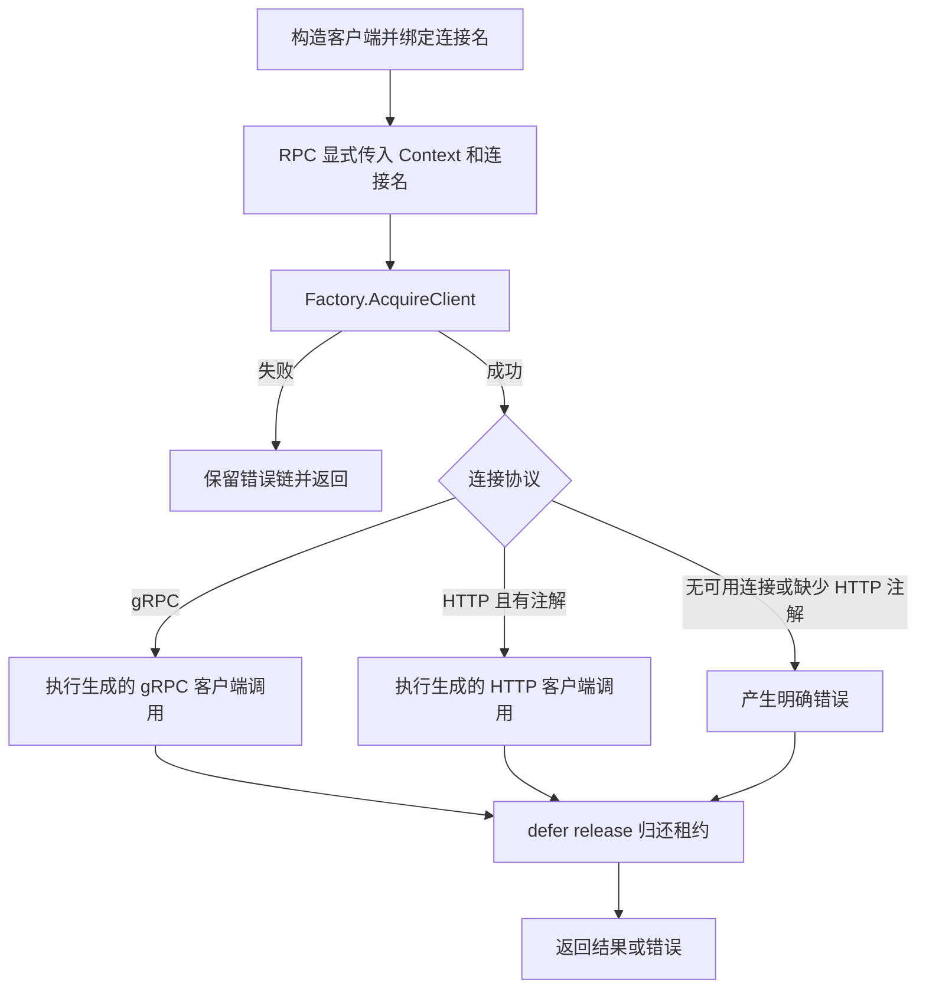

# protoc-gen-kratos-foundation-client-v2

生成基于 `pkg/client.Factory` 的非流式 HTTP/gRPC 客户端适配器。它与 protobuf、gRPC，以及有 HTTP 注解时的 Kratos HTTP 生成代码放在同一 Go 包中。

在本目录构建插件，再在业务协议目录运行 protoc：

```sh
go build -o /tmp/protoc-gen-kratos-foundation-client-v2 .
protoc --proto_path=. \
  --plugin=protoc-gen-kratos-foundation-client-v2=/tmp/protoc-gen-kratos-foundation-client-v2 \
  --kratos-foundation-client-v2_out=paths=source_relative:. orders/v1/order.proto
```

生成的 `NewOrderService(factory)` 使用服务选项 `kratos_foundation_client.client_name` 指定的连接名；未指定时使用 proto 所在目录名，顶层文件使用文件名。服务选项不能是空白或包含首尾空白。

需要把同一个服务绑定到另一份连接配置时，在构造阶段显式指定：

```go
orders := NewOrderService(factory)
regionalOrders := NewOrderServiceWithConnName(factory, "orders-eu")
```

每次 RPC 都调用 `factory.AcquireClient(ctx, connName)`，并在 RPC 返回后释放租约。连接名称不再通过 Context 传递；原来使用 Context 覆盖名称的调用应改为持有绑定相应名称的客户端。生成的默认 Wire Provider 仍使用 `NewOrderService`，指定名称的构造函数由业务按需组装。

旧版本生成代码需要重新生成。当前模板只调用现有公共 API，不再引用已删除的 `WithDefaultConnName`、`ConnNameFromContext`；单次选项改用 `WithHTTPCallOptions` / `WithGRPCCallOptions`，按实际协议透传。HTTP 调用需要 `google.api.http` 注解；无注解时返回明确错误。流式 RPC 在生成阶段报错。



`go test ./...` 会生成带注解与不带注解的客户端，在临时模块中对仓库当前 `client.Factory` 编译并执行，覆盖默认/指定连接名、错误链、HTTP/gRPC 分支和租约释放。临时模块使用仓库根依赖版本，不修改生成插件的模块依赖。

单次调用选项的隔离规则、协议选择和调用流程见 [client README](../../pkg/client/README.md#单次调用选项)。生成器与根模块必须同时更新；只更新生成器会使旧根模块缺少新 API。
