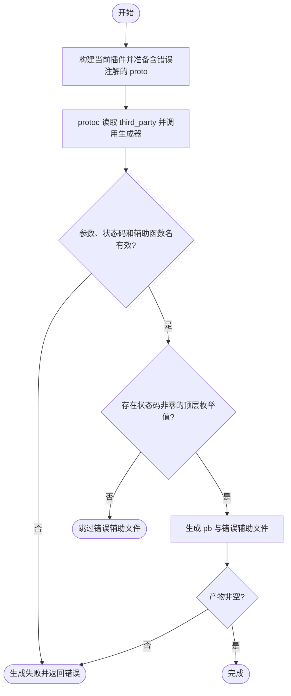
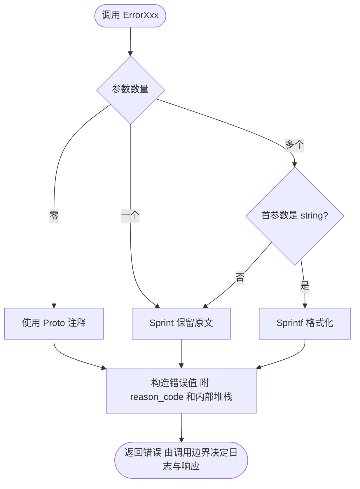

# protoc-gen-kratos-foundation-errors-v2

使用仓库根目录的 `make proto` 会构建当前插件并重新生成内部错误函数。
业务协议需要更新插件后重新运行对应的 protoc 命令。

插件名称已添加 `-v2` 后缀，业务 protoc 命令应使用
`--kratos-foundation-errors-v2_out`；显式指定插件时使用
`--plugin=protoc-gen-kratos-foundation-errors-v2=/path/to/protoc-gen-kratos-foundation-errors-v2`。

## 首次使用

需要 Go、`protoc` 和 `protoc-gen-go`（后者由仓库根目录 `make init-proto` 安装）。以下命令从**仓库根目录**执行，仅在临时目录构建当前插件和生成示例：

```sh
set -eu
repo_dir="$PWD"
errors_demo_dir="$(mktemp -d)"
(cd cmd/protoc-gen-kratos-foundation-errors-v2 && go build -o "$errors_demo_dir/protoc-gen-kratos-foundation-errors-v2" .)
cat > "$errors_demo_dir/error_reason.proto" <<'PROTO'
syntax = "proto3";
package demo;
option go_package = "example.com/demo;demo";
import "errors/errors.proto";
enum ErrorReason {
  option (errors.default_code) = 500;
  UNSPECIFIED = 0 [(errors.code) = 0];
  // user %s not found
  VALIDATOR = 1 [(errors.code) = 404];
}
PROTO
protoc --proto_path="$errors_demo_dir" --proto_path="$repo_dir/third_party" \
  --go_out=paths=source_relative:"$errors_demo_dir" \
  --plugin=protoc-gen-kratos-foundation-errors-v2="$errors_demo_dir/protoc-gen-kratos-foundation-errors-v2" \
  --kratos-foundation-errors-v2_out=paths=source_relative:"$errors_demo_dir" \
  "$errors_demo_dir/error_reason.proto"
test -s "$errors_demo_dir/error_reason.pb.go"
test -s "$errors_demo_dir/error_reason_errors.pb.go"
```

生成 `ErrorValidator`、`ErrorValidatorWithFormat` 和 `IsValidator`；业务模块编译产物时需要依赖本仓库 `/v2/pkg/errors`。插件处理顶层枚举，HTTP 状态由枚举的 `errors.default_code` 提供默认值，枚举值的 `errors.code` 优先。未配置时为 0；0 跳过该值，非零值必须为 100–599，否则生成失败。同一文件生成重复辅助函数名时也会失败。

可添加 `--kratos-foundation-errors-v2_opt=stack_skip=4` 调整生成函数采集堆栈时跳过的帧数，默认 4，必须非负；按实际调用封装层调整。



## 消息与错误识别

`ErrorXxx` 保留 main 的字符串首参数格式化调用：

```go
ErrorValidator("user %s not found", name)
```

无参数使用 Proto 注释，单参数原样转为字符串（例如 `100% complete` 不会被当成模板），
多个参数且首参数为 string 时调用 `fmt.Sprintf`，非 string 首参数使用 `fmt.Sprint`。
从此前 v2 的片段拼接行为迁移时，显式使用 `fmt.Sprint(parts...)` 再传一个字符串。
新代码建议显式构造消息以消除歧义：

```go
ErrorValidator(fmt.Sprintf("user %s not found", name))
ErrorValidator(fmt.Sprint("user ", name, " not found"))
```

Proto 注释包含格式指令时生成的 `ErrorXxxWithFormat` 仍使用注释作为格式模板。
`IsXxx` 以 reason 和 reason_code 作为业务身份，不以 HTTP 状态作为身份的一部分，
因此改变传输状态或经过 gRPC 转换不影响业务错误识别。


