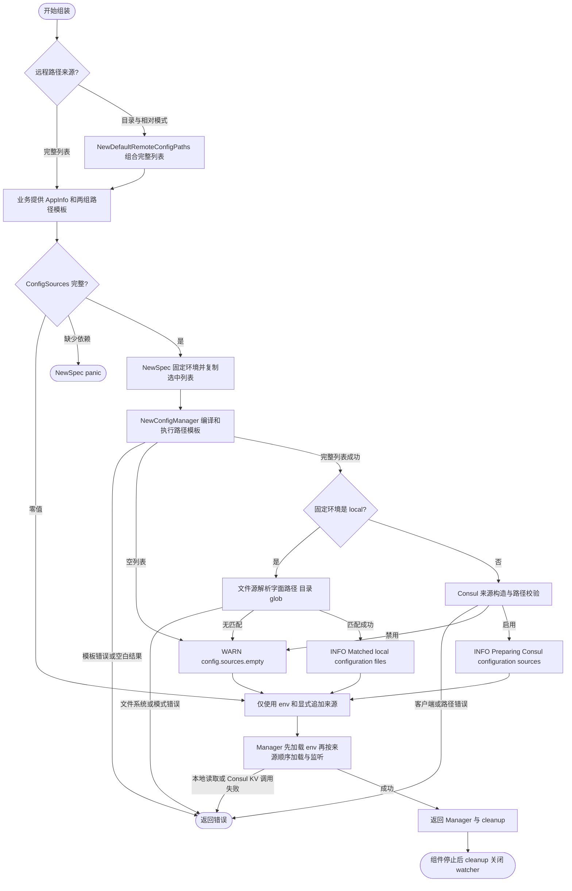

# Consul 配置组装

`consulconfig` 为 `bootstrap.NewSpec` 提供本地文件和 Consul 配置源构造函数。业务分别声明两个有序 `[]string` 列表；bootstrap 先执行 Go `text/template` 替换，再将结果交给对应配置源解析精确路径、目录或 glob。

## Wire 接入

配合 `bootstrap.BaseProviderSet` 使用 `consulconfig.ProviderSet`。业务提供 `AppInfo` 及两个命名切片类型，供 Wire 区分本地和远程依赖：

```go
// 类型定义位于 pkg/bootstrap。
type LocalConfigPaths []string
type RemoteConfigPaths []string
```

```go
// 放入应用的 wireinject 文件；business.ProviderSet 和 Boot 由消费项目提供。
func localConfigPaths() bootstrap.LocalConfigPaths {
    return bootstrap.LocalConfigPaths{
        "configs/{{app}}.yaml",
        "configs/{{env}}/{{app}}/*.yaml",
    }
}

func remoteConfigPaths() bootstrap.RemoteConfigPaths {
    return bootstrap.RemoteConfigPaths{
        "configs/common*.yaml",
        "configs/services/{{env}}/{{app}}/{{version}}/*.yaml",
        "secrets/shared-orders.yaml",
    }
}

func wireApp(info appinfo.AppInfo) (*kratos.App, func(), error) {
    wire.Build(bootstrap.BaseProviderSet, consulconfig.ProviderSet,
        localConfigPaths, remoteConfigPaths, business.ProviderSet, Boot)
    return nil, nil, nil
}
```

`ProviderSet` 只包含 `bootstrap.NewSpec` 和 `NewConfigSources`，不再注入目录、配置名称或路径函数。也可将两组命名切片作为 injector 参数。业务可直接传入 `[]string` 调用 `NewConfigSources`；自定义配置名称直接写在路径中，不影响应用身份。不要同时提供另一个 `*bootstrap.Spec` provider。

## 模板变量与解析顺序

| 写法 | 值 |
| --- | --- |
| `{{env}}` | `env.AppEnv()`，在 `NewSpec` 时固定 |
| `{{app}}` | 注入的 `AppInfo.Name()` |
| `{{version}}` | 注入的 `AppInfo.Version()` |

使用标准 `text/template` 语法，支持条件等模板动作；`env`、`app`、`version` 通过 `FuncMap` 注册为无参数函数，使用小写且不带点，例如 `{{env}}`；条件可写为 `{{if eq env "prod"}}...{{end}}`。未使用模板的普通路径原样传递。仅处理当前环境选中的列表：`local` 使用本地，其余合法环境使用 Consul。

模板编译与执行发生在 `NewConfigManager` 加载阶段；整个选中列表成功替换后才调用配置源。语法错误、引用未知函数、执行错误（例如向无参数函数传参）以及替换后为空白的路径返回带列表索引（从 0 开始）的错误，不产生部分加载。空列表则禁用该来源，继续使用 env 与其他显式来源，并记录 `WARN config.sources.empty`。Consul 被禁用时也不回退本地文件。

替换后的值不做路径转义，其中的通配符仍参与后续匹配。模板与应用身份应由可信业务组装提供；模板列表不支持热更新。

- 本地：已存在的字面文件优先；目录加载直属 `*.yaml` 普通文件；其他路径按 `filepath.Glob` 展开。每项结果按名字典序排列，重叠路径保留首次位置；`*` 不跨目录。无匹配继续使用其他来源，非法 glob 或文件系统错误返回错误。详见[文件配置源](../../config/file/README.md)。
- Consul：使用 `path.Match` 语法；支持精确键、目录直属 `*.yaml` 及完整 glob。每项结果按键名字典序排列。启用客户端时校验空白、重复和非法模式；客户端禁用时不执行来源路径校验。详见[Consul 配置源](../../config/consul/README.md)。
- 列表越靠后，初次加载优先级越高。现有 Manager 热更新按各来源独立合并，不重算全源优先级，低优先级来源的后续更新可能覆盖已有高优先级值；详见[来源与合并](../../../pkg/config/README.md#来源与合并)。

## 远程目录与相对路径组合

业务也可分别提供两个 `consulconfig` 命名切片：

```go
// 类型定义位于 contrib/bootstrap/consulconfig。
type RemoteConfigDirs []string
type RemoteConfigPaths []string
```

`NewDefaultRemoteConfigPaths(dirs, paths)` 按目录列表顺序，对每个目录依次拼接全部相对路径，返回新的 `bootstrap.RemoteConfigPaths`；不读取环境、不替换模板、不访问 Consul。目录和相对路径都可包含 `{{env}}`、`{{app}}`、`{{version}}`，组合后的完整路径在 `NewConfigManager` 加载阶段统一替换，再由 Consul 解析路径模式。两个输入任一为空会得到空路径列表，远程来源按前述规则禁用。业务对输入列表或返回列表的修改互不影响。

```go
func remoteConfigDirs() consulconfig.RemoteConfigDirs {
    return consulconfig.RemoteConfigDirs{"configs", "secrets"}
}

func remoteConfigPatterns() consulconfig.RemoteConfigPaths {
    return consulconfig.RemoteConfigPaths{
        "common*.yaml",
        "{{env}}/common*.yaml",
        "services/{{app}}.yaml",
        "services/{{app}}/*.yaml",
        "services/{{env}}/{{app}}.yaml",
        "services/{{app}}/{{env}}/*.yaml",
    }
}

// 可在业务 wireinject 文件中组装；与直接提供 bootstrap.RemoteConfigPaths 二选一。
func wireApp(info appinfo.AppInfo) (*kratos.App, func(), error) {
    wire.Build(bootstrap.BaseProviderSet, consulconfig.ProviderSet,
        localConfigPaths, remoteConfigDirs, remoteConfigPatterns,
        consulconfig.NewDefaultRemoteConfigPaths, business.ProviderSet, Boot)
    return nil, nil, nil
}
```

上述目录列表生成十二层路径：先加载 configs 的六层，再加载 secrets 的六层。每组公共先于应用、基础先于环境、单文件先于目录片段。环境单文件位于 `services/{{env}}/{{app}}.yaml`，不会被基础层 `services/{{app}}/*.yaml` 混入其他环境；`{{version}}` 可由业务加入任一相对路径。

本地路径由业务直接提供 `bootstrap.LocalConfigPaths`。需要只加载应用基础与环境文件时，声明 `[]string{"configs/{{app}}.yaml", "configs/{{env}}/{{app}}.yaml"}`；传入目录则按通用文件源规则加载直属 YAML。

## 手工组装与所有权

以下函数可用于业务组装，`info` 由调用方提供。应用应先停止使用配置的组件，再调用返回的 cleanup；调用方必须处理错误。

```go
package assembly

import (
    "github.com/jaggerzhuang1994/kratos-foundation/v2/contrib/bootstrap/consulconfig"
    "github.com/jaggerzhuang1994/kratos-foundation/v2/pkg/app"
    "github.com/jaggerzhuang1994/kratos-foundation/v2/pkg/appinfo"
    "github.com/jaggerzhuang1994/kratos-foundation/v2/pkg/bootstrap"
    "github.com/jaggerzhuang1994/kratos-foundation/v2/pkg/config"
    "github.com/jaggerzhuang1994/kratos-foundation/v2/pkg/job"
    "github.com/jaggerzhuang1994/kratos-foundation/v2/pkg/server"
)

func Configure(info appinfo.AppInfo) (config.Manager, func(), error) {
    sources := consulconfig.NewConfigSources(info,
        []string{"configs/{{app}}.yaml", "configs/{{env}}/{{app}}/*.yaml"},
        []string{"configs/common*.yaml", "configs/services/{{env}}/{{app}}/{{version}}/*.yaml"})
    spec := bootstrap.NewSpec(app.NewSpec(), server.NewSpec(), job.NewSpec(), sources)
    manager, cleanup, err := bootstrap.NewConfigManager(spec)
    if err != nil {
        return nil, nil, err
    }
    return manager, cleanup, nil
}
```

`NewConfigSources` 只组装描述并借用输入切片；`NewSpec` 固定环境并复制选中的路径列表，之后修改原切片不会影响加载器。AppInfo 和来源函数仍共享，加载期间不得修改其依赖的状态。零值 `ConfigSources` 不登记默认来源；非零描述必须提供 AppInfo 和两个来源构造函数，否则属于组装错误并 panic。可继续通过 `spec.Configuration(...)` 追加来源。



NewSpec 不执行 I/O 或启动 goroutine。Manager 拥有配置来源和 watcher，cleanup 关闭它们；Consul 共享客户端不归该加载器释放。加载失败不能继续使用半构造实例。

## 迁移与验证

旧版 `LocalConfigPath`、`RemoteConfigDirName`、`RemoteConfigName`、两个 `*ConfigPathsProvider` 和 `ProviderSetWithCustomRemoteConfigName` 已移除。迁移为业务提供两组命名切片，`NewConfigSources(info, localPaths, remotePaths)` 只接收这三项；自定义远程名称写成路径字面量，应用名称使用 `{{app}}`。

旧版本地“传目录后自动选择应用基础和环境文件”的行为须显式声明两条模板；直接传目录采用通用文件源的直属 YAML 规则。旧远程十二层可用 `RemoteConfigDirs{"configs", "secrets"}` 与六条相对模式组合保留；更新 injector 后重新执行业务 Wire 生成命令。

根目录 `make test-business` 在临时模块生成并运行[真实 Wire 用例](../../../pkg/bootstrap/testdata/wireassembly/wire.go)，覆盖路径列表参数和业务 provider。`make test` 覆盖模板错误、先替换再展开本地 glob、顺序、列表快照、环境固定及禁用 Consul 等行为；不依赖真实 Consul 服务。
