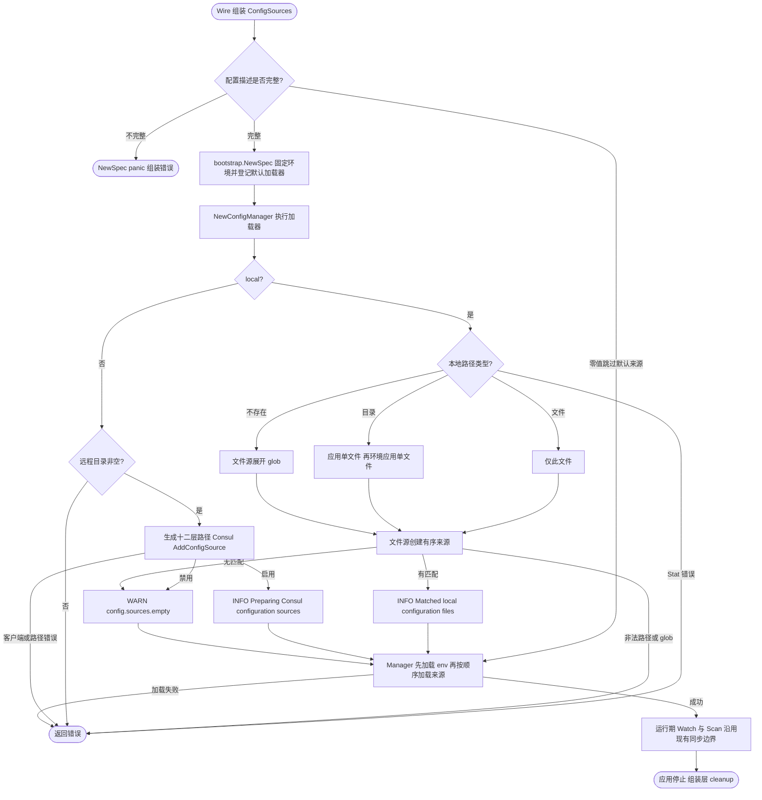

# Consul 配置组装

Spec 统一由 `bootstrap.NewSpec(application, servers, jobs, sources)` 构造。`consulconfig` 提供路径规则与 `NewConfigSources`，后者只组装具体的 `bootstrap.ConfigSources`。环境选择、校验和延迟加载逻辑由 `bootstrap.NewSpec` 实现；来源构造函数由 contrib 注入，bootstrap 不导入具体配置驱动。

## Wire 接入

配合 `bootstrap.BaseProviderSet` 使用 `consulconfig.ProviderSet`。业务显式提供 `AppInfo`、`bootstrap.LocalConfigPath` 和 `bootstrap.RemoteConfigDirName`，后者没有默认值；不要再同时提供另一个返回 `*bootstrap.Spec` 的 provider。

```go
// 放入应用的 wireinject 文件；业务 provider 集合和 Boot 由消费项目提供。
func wireApp(info appinfo.AppInfo, local bootstrap.LocalConfigPath, directory bootstrap.RemoteConfigDirName) (*kratos.App, func(), error) {
    wire.Build(bootstrap.BaseProviderSet, consulconfig.ProviderSet, business.ProviderSet, Boot)
    return nil, nil, nil
}
```

`ProviderSet` 包含 `bootstrap.NewSpec`、`NewConfigSources`、`NewDefaultLocalConfigPathsProvider` 和 `NewDefaultRemoteConfigPathsProvider`。三个领域 Spec 由 BaseProviderSet 共享。四个路径契约均定义在 bootstrap：

```go
// 均位于 pkg/bootstrap。
type RemoteConfigDirName string
type LocalConfigPath string
type RemoteConfigPathsProvider func(directory RemoteConfigDirName, name, environment string) []string
type LocalConfigPathsProvider func(location LocalConfigPath, name, environment string) ([]string, error)
```

手工组装的完整函数如下。返回 Spec 只登记声明；之后调用 `bootstrap.NewConfigManager`，处理错误并保留返回的 cleanup。应用先停止使用配置的组件，再由组装层逆序释放资源。

```go
package assembly

import (
    "github.com/jaggerzhuang1994/kratos-foundation/v2/contrib/bootstrap/consulconfig"
    "github.com/jaggerzhuang1994/kratos-foundation/v2/pkg/app"
    "github.com/jaggerzhuang1994/kratos-foundation/v2/pkg/appinfo"
    "github.com/jaggerzhuang1994/kratos-foundation/v2/pkg/bootstrap"
    "github.com/jaggerzhuang1994/kratos-foundation/v2/pkg/job"
    "github.com/jaggerzhuang1994/kratos-foundation/v2/pkg/server"
)

func Configure(application *app.Spec, servers *server.Spec, jobs *job.Spec, info appinfo.AppInfo, local bootstrap.LocalConfigPath, directory bootstrap.RemoteConfigDirName) *bootstrap.Spec {
    sources := consulconfig.NewConfigSources(info, local, directory,
        consulconfig.NewDefaultLocalConfigPathsProvider(),
        consulconfig.NewDefaultRemoteConfigPathsProvider())
    return bootstrap.NewSpec(application, servers, jobs, sources)
}
```

`ConfigSources` 按值传入 NewSpec；后续替换描述的字段不会改变已登记的加载器。AppInfo 和函数仍共享，调用方不应在加载期间修改它们依赖的状态。业务直接使用 ProviderSet，无需额外提供 config.SourceLoader。

需要自定义规则时，不使用整组 `ProviderSet`：显式提供 `bootstrap.NewSpec`、`NewConfigSources`、两种路径 provider，其中无需定制的规则继续使用默认 provider。函数类型必须保持为 bootstrap 中定义的命名类型，以供 Wire 区分。仍然可以通过 `spec.Configuration(...)` 在初始加载器之后追加来源。

## 远程路径和优先级

local 使用本地配置，dev/test/pre/prod 使用 Consul。环境由 `env.AppEnv()` 在 bootstrap.NewSpec 构造时固定；路径函数与配置 I/O 在 `NewConfigManager` 执行加载器时调用。非 local 环境的空白远程目录名会报错，不自动取应用名。Consul 禁用时返回空来源，不回退本地文件。

以下为**首次加载从低到高的优先级**。`dir` 为业务提供的 RemoteConfigDirName，`app` 始终为 AppInfo.Name()，`env` 为当前环境：

| 顺序 | 路径 |
| --- | --- |
| 1 | `configs/common*.yaml` |
| 2 | `configs/{env}/common*.yaml` |
| 3 | `configs/{dir}/{app}.yaml` |
| 4 | `configs/{dir}/{app}/*.yaml` |
| 5 | `configs/{dir}/{env}/{app}.yaml` |
| 6 | `configs/{dir}/{env}/{app}/*.yaml` |
| 7 | `secrets/common*.yaml` |
| 8 | `secrets/{env}/common*.yaml` |
| 9 | `secrets/{dir}/{app}.yaml` |
| 10 | `secrets/{dir}/{app}/*.yaml` |
| 11 | `secrets/{dir}/{env}/{app}.yaml` |
| 12 | `secrets/{dir}/{env}/{app}/*.yaml` |

规则是 configs 先于 secrets；每组公共先于应用、基础先于环境、单文件先于同名目录片段。因而 secrets 的公共配置也能覆盖 configs 的应用配置。每个 glob 内按键名字典序加载，后加载值覆盖先加载值；`*.yaml` 只匹配该层文件，不递归。返回的路径切片每次独立，调用方可修改，不影响后续调用。

上述固定优先级只保证初次加载。现有 Manager 热更新由各来源独立合并，不重算全源优先级；低优先级来源的后续更新可能覆盖已有高优先级值。此次变更不改变该行为，详见[来源与合并](../../../pkg/config/README.md#来源与合并)。

## 本地路径

默认 LocalConfigPathsProvider 在配置加载时检查字面路径：

- 是普通文件：只加载这个文件，包括名称中含 glob 字符的真实文件。
- 是目录：依次加载 `{path}/{app}.yaml` 和 `{path}/{env}/{app}.yaml`，第二个覆盖第一个；不加载目录内其他应用的文件。
- 路径不存在：交给文件源按 `filepath.Glob` 展开，匹配文件按名字典序加载。非法 glob 返回错误；无匹配继续使用 env 及其他声明来源。

Stat 的权限、非法路径等错误直接返回，不当作无匹配。已有非普通文件由文件源拒绝。符号链接按目标文件或目录处理。文件监听及变化合并沿用[文件配置源](../../config/file/README.md)，不修改通用文件源的目录加载规则。

## 加载过程与所有权



NewSpec 不执行 I/O、不启动 goroutine；非零 ConfigSources 缺少必要依赖属于组装错误并 panic；零值跳过默认来源，可通过 Configuration 显式声明来源。加载失败返回错误，调用方必须处理，不能继续使用半构造实例。默认加载器返回空来源列表时记录 `WARN config.sources.empty`。Manager 的 cleanup 关闭配置 watcher；Consul 共享客户端不归本加载器释放。

## 迁移与验证

移除 `consulconfig.NewSpec`、`RemoteConfigName`、`NewDefaultRemoteConfigName` 和 `ProviderSetWithCustomRemoteConfigName`。名称不再兼作目录：目录由 `bootstrap.RemoteConfigDirName` 显式提供，应用文件名取 AppInfo.Name()。`bootstrap.NewSpec` 接收具体的 `bootstrap.ConfigSources`，不再注入泛化的 `config.SourceLoader`；原远程函数增加目录参数，本地路径也使用可替换的 provider。

真实 Wire 用例位于 [injector](../../../pkg/bootstrap/testdata/wireassembly/wire.go)，覆盖目录作为 injector 参数和业务 provider 两种方式。根目录执行 `make test-business` 生成并运行临时 injector 与业务测试；本包测试覆盖来源描述和路径规则；bootstrap 测试覆盖本地文件/目录/glob、延迟解析、环境固定、错误及 Consul 禁用，无需真实 Consul。
