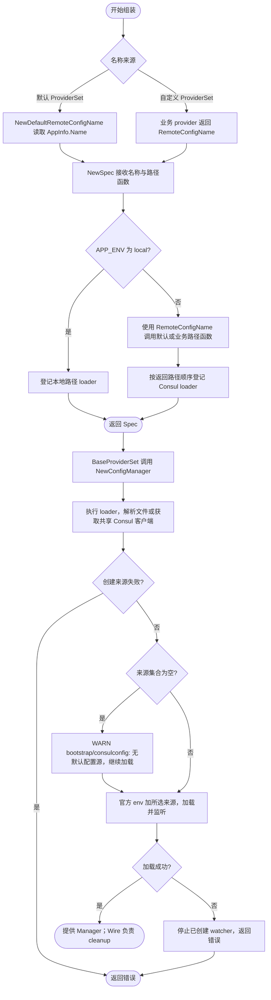

# Consul 配置组装

`NewSpec(localConfigPath bootstrap.LocalConfigPath, remoteConfigName RemoteConfigName, remoteConfigPaths bootstrap.RemoteConfigPathsProvider)` 是与 `bootstrap.BaseProviderSet` 配合的可选 Wire provider，应用无需重复编写环境分支，远程路径可采用 ProviderSet 的默认规则或由业务提供。仅构造并声明 Spec，不执行配置 I/O；配置加载和 cleanup 仍由 `bootstrap.NewConfigManager` 负责。

```go
// 放入带 wireinject 标签的应用 injector 文件；业务提供 Bootstrap 和业务 provider。
import "github.com/jaggerzhuang1994/kratos-foundation/v2/contrib/bootstrap/consulconfig"

func wireApp(info appinfo.AppInfo, localConfigPath bootstrap.LocalConfigPath) (*kratos.App, func(), error) {
    wire.Build(bootstrap.BaseProviderSet, consulconfig.ProviderSet, internal.ProviderSet, Bootstrap)
    return nil, nil, nil
}
```

`bootstrap.LocalConfigPath` 是定义在 `pkg/bootstrap` 的独立字符串类型，避免与版本号等普通 `string` 依赖混淆。应用入口将路径转换为 `bootstrap.LocalConfigPath(path)` 后传入 injector。

`ProviderSet` 提供 `NewSpec`、`NewDefaultRemoteConfigName` 和 `NewDefaultRemoteConfigPathsProvider`。默认名称取 `AppInfo.Name()`；默认路径函数按以下八层顺序生成独立列表，调用方可修改。函数只计算路径，不执行 I/O。直接使用时通过 `consulconfig.NewDefaultRemoteConfigPathsProvider()("auth_service", "prod")` 获取路径。

```text
configs/common*.yaml
configs/{environment}/common*.yaml
secrets/common*.yaml
secrets/{environment}/common*.yaml
configs/{name}/*.yaml
configs/{name}/{environment}/*.yaml
secrets/{name}/*.yaml
secrets/{name}/{environment}/*.yaml
```

需要自定义名称时，使用 `ProviderSetWithCustomRemoteConfigName` 替换默认 `ProviderSet`，并注册业务 provider：

```go
func newRemoteConfigName() consulconfig.RemoteConfigName {
    return "shared-orders"
}

// 放在 wireinject 文件中；其他依赖和业务 provider 与上面的示例一致。
func wireApp(info appinfo.AppInfo, localConfigPath bootstrap.LocalConfigPath) (*kratos.App, func(), error) {
    wire.Build(bootstrap.BaseProviderSet,
        consulconfig.ProviderSetWithCustomRemoteConfigName,
        newRemoteConfigName, internal.ProviderSet, Bootstrap)
    return nil, nil, nil
}
```

名称只决定远程配置路径，不改变应用身份、注册名称或本地配置路径；非 local 构造 Spec 时读取一次，不随配置热更新。local 分支不使用远程名称或路径函数，但 Wire 仍需满足构造参数依赖。两个 ProviderSet 不可同时注册，默认 ProviderSet 也不能再搭配自定义名称 provider，否则 Wire 会报告重复依赖。

需要自定义路径时，直接组装 `NewSpec`、名称 provider（默认可用 `NewDefaultRemoteConfigName`）及自己的路径 provider，不添加上述两个 ProviderSet，避免重复提供路径函数。

`bootstrap.RemoteConfigPathsProvider` 定义为 `func(name, environment string) []string`，必须通过 Wire 提供函数值（例如 injector 参数或 `wire.Value(bootstrap.RemoteConfigPathsProvider(remotePaths))`）。业务函数示例：

```go
func remotePaths(name, environment string) []string {
    return []string{"configs/common.yaml", "configs/" + environment + "/" + name + ".yaml"}
}
```

这是业务路径约定示例，并非框架默认值。回调在非 local 的 `NewSpec` 构造期同步调用一次，应只计算路径；local 不调用它。

这是组装片段，`info` 由应用调用 `appinfo.New(version)` 提供；调用方检查错误，成功后持有并逆序调用返回的 cleanup。实际生成验证见根目录 `make test-business`。需要追加服务、任务及运行时的应用继续在业务 Bootstrap 中声明；配置源必须在 Manager 构造之前声明，额外配置源需要业务 provider 包装 `NewSpec` 后追加 `spec.Configuration(...)`。

- `APP_ENV`（回退 `KRATOS_ENV`）未设置默认 `local`。local 只使用传入的本地文件、目录或 glob，不获取 Consul 客户端。
- dev/test/pre/prod 忽略本地路径，将注入的 `RemoteConfigName` 与当前环境传给路径函数。框架不再限制应用名或拼接目录，业务负责名称到路径的映射，具体路径合法性由 Consul source 校验。
- 本地来源未匹配、远程路径函数返回空列表或 Consul 被禁用时，记录 WARN 日志并继续加载 env 及业务追加的来源，允许仅使用 env 启动。路径语法、文件解析或 Consul 访问等实际错误仍会返回，不会被吞掉。远程来源已声明但全部 KV 缺失仍遵循 Consul source 的加载行为。
- 默认 Manager 仍先包含官方 env source。非 local 按业务函数返回的路径顺序初次加载，后加载覆盖前加载；热更新沿用官方 merge，不保证固定来源优先级。

包路径由 `contrib/bootstrap/consul` 更名为 `contrib/bootstrap/consulconfig`，包名为 `consulconfig`，不保留旧路径。日志 module 已为 `bootstrap/consulconfig`，精确匹配旧 module 的过滤规则需同步迁移；上下文字段为 `env` 和 `name`。

本包不会自动注册 Registry 驱动；使用 Consul 注册/发现时，应用仍需空导入 `contrib/registry/consul` 并配置 `registry.instances.default.driver: consul`。Consul 连接由 `CONSUL_*` 环境驱动的单例提供，Manager 只停止配置 watcher，不释放共享客户端。详细参数见[Consul 配置源](../../config/consul/README.md)。


