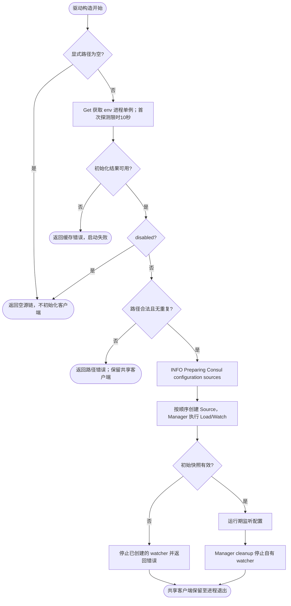
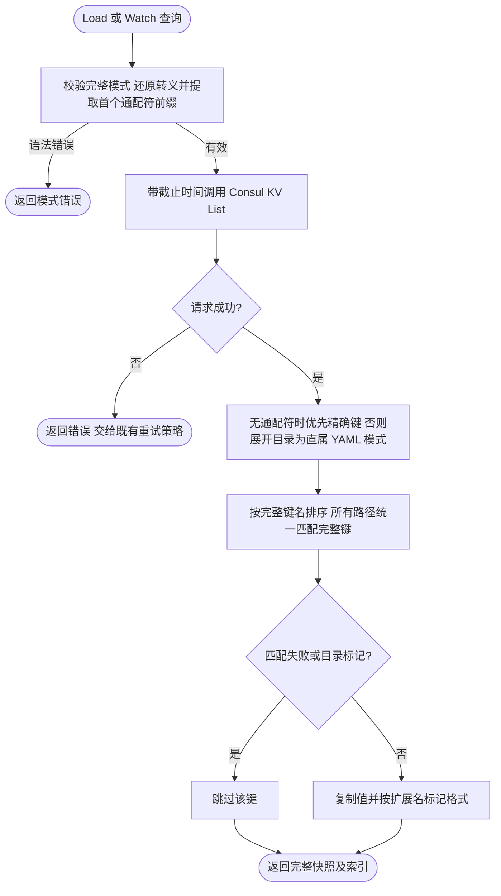

# Consul 配置源

配置源诊断使用全局日志，声明 `module=config/consul`；配置路径使用结构化字段。

`contrib/config/consul` 把有序 Consul KV 路径转换成 Kratos 配置源。后面的路径优先级更高，路径不能为空、包含首尾空白或重复。

手工组装时普通导入本包及 `pkg/app`、`pkg/server`、`pkg/job`、`pkg/bootstrap`，客户端由内部 env 单例提供。Wire 场景应注入同一组领域 Spec，再由业务 provider 转交 bootstrap.NewSpec：

```go
spec := bootstrap.NewSpec(app.NewSpec(), server.NewSpec(), job.NewSpec())
spec.Configuration(consul.AddConfigSource("configs/app.yaml"))
return spec, nil
```

Wire 通过 `bootstrap.NewConfigManager` 执行配置阶段。路径在声明时复制，实际连接和路径解析延迟到该阶段；没有 init 注册表或进程默认路径。Manager 默认先加载官方 env source，后声明的源优先级更高。返回 cleanup 统一停止 watcher，不关闭共享客户端。完整组装见 [Configuration](../../../pkg/bootstrap/README.md#configuration-配置阶段)。

驱动使用 `pkg/log` 全局日志记录构造事件，不要求 Logger 参数。
应用 Logger 安装前使用默认标准输出，安装后使用当前应用输出。

显式空路径列表禁用该来源，不初始化单例；非空路径在单例初始化失败时返回错误，已禁用则返回空来源且不报错。驱动不负责关闭共享客户端。



## 热更新与断线恢复

KV 监听由本包通过 Consul blocking query 实现。每次通知包含完整前缀，包括仅删除键或前缀变空。官方 Config 直接合并通知结果，不再重复 Load；空结果或字段删除不会撤销旧缓存，也不会恢复低优先级值。

网络错误、HTTP 429 和 5xx 使用可取消退避恢复：100ms 基数逐次翻倍、5s 封顶，并加入 80%–100% 抖动。恢复时清除旧查询索引并拉取完整状态；Consul 索引回退也会重新建立查询基线。认证和授权等永久 HTTP 错误直接返回，交由官方 watcher 循环记录及重试，不再提供 Manager 终止状态。

`Load` 的请求与有限重试共用 10 秒预算；监听长轮询等待最多 30 秒，单次 HTTP 请求另有 10 秒余量。Watcher 不创建后台发送协程，`Stop` 可以取消在途监听请求和退避，且不同 Watcher 独立。Manager 清理过程中已经开始的普通 `Load` 最迟在自己的预算结束时返回。

暂时失败期间保留最后有效配置。Source 内部负责上述网络重试；`HotReloadValue` 在恢复后继续更新，不需要重建应用或 Wire 依赖。

## 路径边界

Consul `PathList` 与文件源 `AddConfigSource` 的路径参数 都支持目录、具体文件和 glob：

| 输入 | 读取规则 |
| --- | --- |
| `configs/app` | 精确键存在时只读该键；否则读取 `configs/app/*.yaml` |
| `configs/app/` | 明确读取目录直属 `*.yaml`，忽略同名精确键 |
| `configs/app/config.yaml` | 优先读取精确键；不存在时按同名目录解析 |
| `configs/app/*` | 按显式模式读取直属键，不限制扩展名 |
| `configs/*/app?.yaml` | 按完整模式匹配指定层级 |

Consul 没有文件系统目录类型，因此每份快照根据精确键是否存在决定文件或目录语义，
不通过扩展名猜测类型。精确键删除后会读取同名目录；精确键重新出现后恢复单键读取。
目录只选择直属 `.yaml` 键，忽略子目录、`.yml`、目录标记及相邻前缀 `configs/app-other`。
无匹配键时返回空快照。与本地构造时展开文件列表不同，Consul 每次快照都重新匹配新增及删除键。

支持完整的 Go `path.Match` 语法，对完整 KV 键进行匹配：

- `*`：零个或多个非 `/` 字符；连续 `**` 也不表示递归通配。
- `?`：一个非 `/` 字符。
- `[abc]`、`[a-z]`、`[^a-z]`：字符组、范围和取反字符组，支持 Unicode。
- 反斜杠转义：例如 `\*` 匹配字面的星号，`\\` 匹配字面的反斜杠。

查询前缀为首个未转义的 `*`、`?` 或 `[` 之前的字面内容，转义字符先还原。
例如 `path/a/*/path/b/*/*.yaml` 查询 `path/a/`，`configs/app?.yaml` 查询 `configs/app`，
`configs/\*/[ab].yaml` 查询 `configs/*/`。仅含转义、不含通配符的路径按还原后的键查询，并按上述精确键优先规则解析。
非法字符组、悬空转义等在构造时返回错误，错误链保留 `path.ErrBadPattern`，不等到远程查询才失败。
扩展名不限于 YAML，匹配语义直接遵循 `path.Match`，不使用操作系统相关的 `filepath.Match`。

固定前缀可以截止于目录名中间，例如 `configs/app*/config*.yaml` 查询 `configs/app`；
也可以为空，例如 `*/common.yaml` 查询整个 KV 空间，再保留匹配键。
查询范围越宽，拉取的数据越多；返回范围仍受客户端 ACL 权限约束。
`configs/orders/*.yaml` 保持只匹配直属 YAML 的语义，不包含其他环境子目录。

每次 Load 和 Watch 都重新匹配、按完整键名排序；监听使用同一个固定前缀，
新增和删除匹配键会进入下一份完整快照，目录标记被排除，没有匹配项返回空快照。
目录简写的 Source Key 相对于该目录；文件或 glob 的 Key 去掉固定前缀中最后一个 `/` 及其前面的部分，保留相对路径和完整文件名；
例如固定前缀 `configs/app` 对应键 `configs/app1/config.yaml` 时，Key 是 `app1/config.yaml`。
目录简写不提供隐式递归加载，多层匹配请显式写出 glob。无通配符的文件键也采用相同的相对 Key 规则，例如 `configs/common.yaml` 的 Key 为 `common.yaml`。
默认应用路径和环境选择见 [Bootstrap](../../../pkg/bootstrap/README.md#配置选择和路径约定)。



显式文件或 glob 的扩展名不受路径解析限制，但最终必须有对应的 Kratos codec；匹配成功不代表内容可解码。

## 驱动组装入口

应用通过 `spec.Configuration` 声明额外来源，由 `bootstrap.NewConfigManager` 构造默认包含官方 env source 的配置源链，使用 `registry.NewFactory` 管理具名注册与发现实例，由 `bootstrap.BaseProviderSet` 完成组装。注册与发现仅提供驱动入口。详见[驱动组装与迁移](../../../pkg/registry/README.md)。
