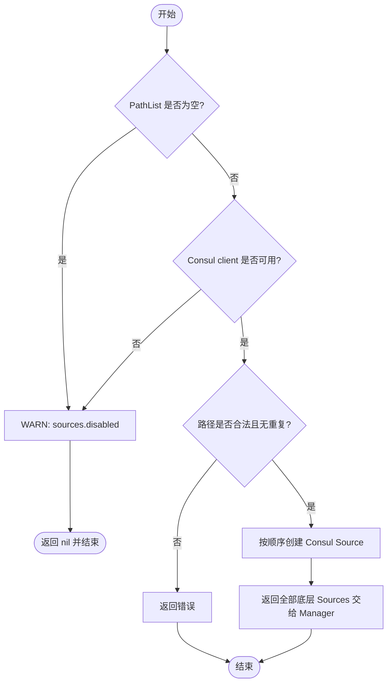
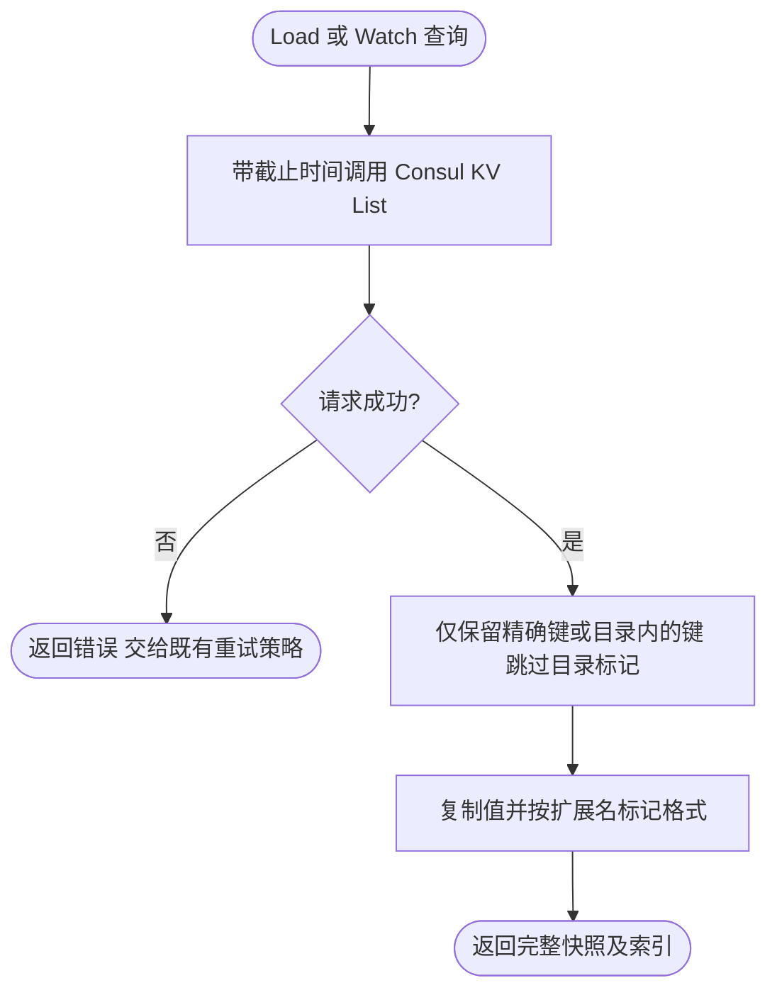

# Consul 配置源

`contrib/config/consul` 把有序 Consul KV 路径转换成 Kratos 配置源。后面的路径优先级更高，路径不能为空、包含首尾空白或重复。

使用 `NewSources`，将每个 Consul 路径对应的底层 Source 直接交给 `pkg/config`：

```go
consulSources, err := consul.NewSources(client, logger, consul.PathList{
	"services/example/base",
	"services/example/custom",
})
if err != nil {
	return err
}

sources := config.NewSources()
sources = append(sources, consulSources...)
manager, cleanup, err := config.NewManager(sources)
if err != nil {
	return err
}
defer cleanup()
```

空路径列表或 nil 客户端表示 Consul 配置被禁用，返回 nil 且不报错。构造函数只借用客户端，不负责关闭它。



## 热更新与断线恢复

KV 监听由本包通过 Consul blocking query 实现。每次通知包含完整前缀，包括仅删除键或前缀变空；配置管理器重新加载完整输入并按原顺序合并，因此删除高优先级覆盖后可以恢复低优先级值。

网络错误、HTTP 429 和 5xx 使用可取消退避恢复：100ms 基数逐次翻倍、5s 封顶，并加入 80%–100% 抖动。恢复时清除旧查询索引并拉取完整状态；Consul 索引回退也会重新建立查询基线。认证和授权等永久 HTTP 错误直接返回，使 Manager 明确报告 watcher 终止。

`Load` 的请求与有限重试共用 10 秒预算；监听长轮询等待最多 30 秒，单次 HTTP 请求另有 10 秒余量。Watcher 不创建后台发送协程，`Stop` 可以取消在途监听请求和退避，且不同 Watcher 独立。Manager 清理过程中已经开始的普通 `Load` 最迟在自己的预算结束时返回。

暂时失败期间保留最后有效配置。Stream 会主动重试暂时的全量重载失败，无需等待另一次变更通知；`HotReloadValue` 在恢复后继续更新，不需要重建应用或 Wire 依赖。

## 路径边界

每个路径仅接收完全相同的 KV 键或该路径目录内的键。例如 `settings` 可以加载 `settings/value.yaml`，不会加载 `settings-other/value.yaml`。显式文件路径如 `settings.yaml` 继续有效。


