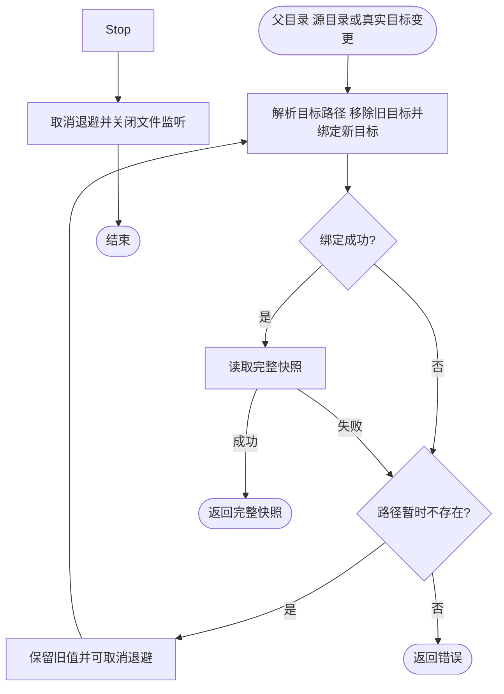
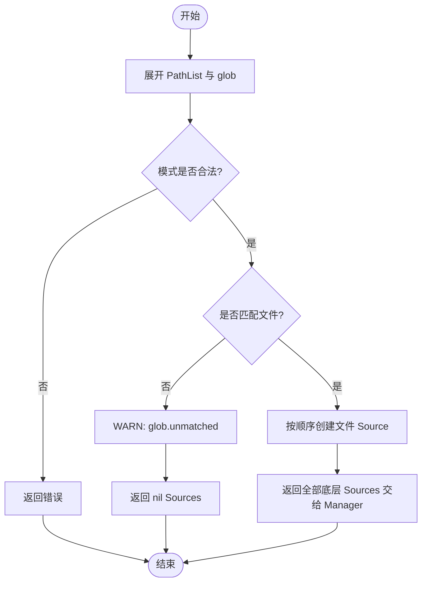

# 文件配置源

`contrib/config/file` 把明确的文件路径或 `filepath.Glob` 模式转换成 Kratos 配置源。路径和匹配结果保持输入顺序，后面的文件优先级更高；重叠模式命中的同一文件只加载一次。

使用 `NewSources`，让 `pkg/config` 直接驱动每个底层文件源：

```go
fileSources, err := file.NewSources(logger, file.PathList{
	"config/base.yaml",
	"config/custom/*.yaml",
})
if err != nil {
	return err
}

sources := config.NewSources()
sources = append(sources, fileSources...)
manager, cleanup, err := config.NewManager(sources)
if err != nil {
	return err
}
defer cleanup()
```

空路径列表、全部未匹配的模式都会返回 nil 且不报错；非法 glob 模式返回错误。未匹配模式会记录警告，方便同一镜像在不同环境使用可选配置挂载。

文件监听绑定父目录，文件被原子替换后仍能接收后续变更；普通父目录被移走重建时会重新绑定监听。已选中的文件或目录暂时不存在时保留最后有效配置，使用 100ms 至 5s 的指数退避与抖动等待重建，`Stop` 会取消等待。目录源中删除子文件会发布完整快照（包括空快照），让已删除的覆盖配置退出优先级合并。

Glob 只在构造时展开，不会自动加入之后新增的匹配文件；需要动态增删文件时应直接配置目录路径。符号链接文件同时监听真实目标的写入和链接所在父目录的替换；链接切换目标后移除旧目标监听，并在发布快照前绑定新目标。不承诺跟踪任意祖先符号链接的替换。监控父目录的方式符合 [fsnotify 的原子写入建议](https://github.com/fsnotify/fsnotify#watching-a-file-doesnt-work-well)。





Watcher 显式声明 `FullSnapshot() bool` 为 true，配置管理器复制通知结果后直接更新本源缓存，不再重复读取文件；初始 Load 保留。空结果表示完整删除，缓冲所有权与第三方兼容规则见 [配置契约](../../../pkg/config/README.md#watcher-完整快照契约)。
