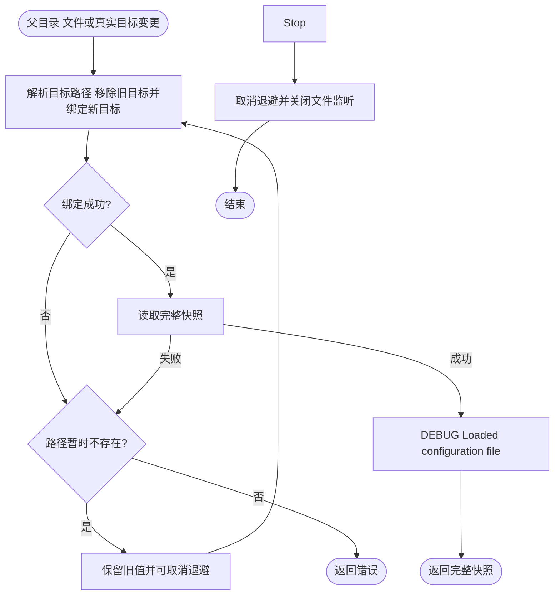
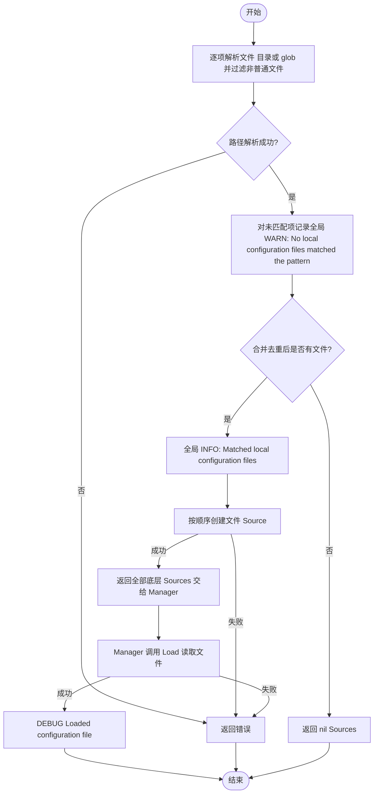

# 文件配置源

配置源诊断使用全局日志，声明 `module=config/file`；未匹配路径和匹配文件列表使用结构化字段。

每次成功读取（包括初次加载和热更新）以 DEBUG 记录 `Loaded configuration file`，字段包含 `function` 和 `path`；文件源的 `path` 为实际加载文件的绝对路径（符号链接保留链接路径）。不记录配置内容；失败或无匹配时不输出此成功日志。需将当前日志输出级别设为 DEBUG 才能看到。

`contrib/config/file` 把目录、具体文件路径或 `filepath.Glob` 模式转换成 Kratos 配置源。按 PathList 输入顺序处理，每项匹配结果按文件名字典序排列，后面的文件优先级更高；重叠模式命中的同一路径只加载一次，保留第一次出现的位置。

使用 `NewSources`，让 `pkg/config` 直接驱动每个底层文件源：

```go
fileSources, err := file.NewSources(file.PathList{
	"config/base.yaml",
	"config/custom/*.yaml",
})
if err != nil {
	return err
}

sources := config.NewSources()
sources = append(sources, fileSources...)
manager, cleanup, err := config.NewManager(sources)
if err != nil {
	return err
}
defer cleanup()
```

`NewSources` 只接收 `PathList`，使用 `pkg/log` 全局日志，不要求注入或构造 Logger。
应用 Logger 安装前使用默认标准输出；Bootstrap 安装后使用当前应用输出，本构造函数不拥有日志资源或 cleanup。

每一项采用相同的路径规则：

- 已存在的字面文件：直接加载，文件名中的 glob 元字符不再展开。
- 已存在的目录：只选择直属 `*.yaml` 普通文件，忽略 `.yml` 和子目录，允许文件符号链接。
- 其他输入：使用 `filepath.Glob` 展开，仅保留普通文件；匹配到目录不会加载目录内容。`*` 不跨目录。

显式文件或 glob 不限制扩展名，但内容需要有对应的 Kratos codec 才能解码。
空列表返回 nil；空路径项、非法模式、文件状态或目录读取错误返回错误。
空目录和未匹配项会记录警告并跳过，全部未匹配时返回 nil。示例应用显式检查配置文件存在；框架不按环境附加非空限制。

文件监听绑定父目录，文件被原子替换后仍能接收后续变更；普通父目录被移走重建时会重新绑定监听。已选中的文件暂时不存在时保留最后有效配置，使用 100ms 至 5s 的指数退避与抖动等待重建，`Stop` 会取消等待。文件删除不会发布空快照或撤销旧配置，而是等待原路径恢复。

目录和 glob 都只在构造时展开，不会自动加入之后新增的匹配文件；需要重新构造配置源才能重新选择。这是与旧目录源动态增删行为的区别。符号链接文件同时监听真实目标的写入和链接所在父目录的替换；链接切换目标后移除旧目标监听，并在发布快照前绑定新目标。不承诺跟踪任意祖先符号链接的替换。监控父目录的方式符合 [fsnotify 的原子写入建议](https://github.com/fsnotify/fsnotify#watching-a-file-doesnt-work-well)。





Watcher 返回文件内容，由官方 Config 直接处理，不额外重新 Load，也不解释 FullSnapshot 扩展。文件暂时缺失仍等待原路径恢复；合并边界见 [配置契约](../../../pkg/config/README.md#来源与合并)。

## Configuration 声明入口

普通导入本包后，在提供 Spec 的业务构造函数中调用：

```go
spec := bootstrap.NewSpec(app.NewSpec(), server.NewSpec(), job.NewSpec(), bootstrap.ConfigSources{}).Configuration(
    file.AddConfigSource("config/base.yaml", "config/custom/*.yaml"))
```

手工组装前置条件：普通导入 `pkg/app`、`pkg/server`、`pkg/job` 和 `pkg/bootstrap`，使用零值 ConfigSources 跳过默认来源，再通过 Configuration 登记加载器。Wire 场景改为接收并转交同一组领域 Spec，由业务 provider 返回 bootstrap.Spec；不要在依赖 Manager 的 Boot 中调用。路径会复制，声明时不执行 I/O；`bootstrap.NewConfigManager` 执行来源构造，Manager 默认先加载官方 env source，再加载这些文件。空路径列表不添加来源，不存在进程级默认路径或 init 注册表。路径集合在构造期确定，内容可热更新，cleanup 统一停止 watcher。完整示例见 [Configuration](../../../pkg/bootstrap/README.md#configuration-配置阶段)。
