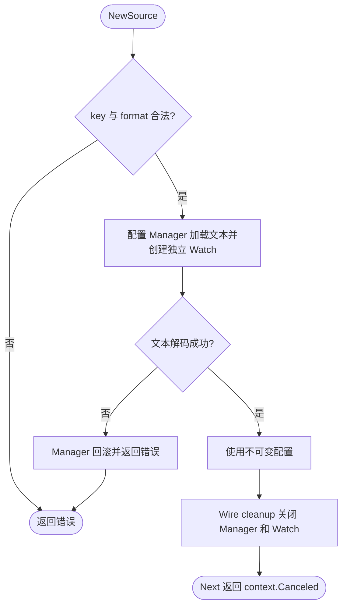

# text

`NewSource(key, format, content)` 提供不可变的内存文本配置源，例如 `NewSource("app.yaml", "yaml", "app: {}")`。key、format 必须非空且不含首尾空白；文本格式是否可解码由配置 Manager 加载时校验。

`Source` 是独立的依赖注入类型，可由业务组装层转入 `config.Sources`，交给 `config.NewManager`。每次 Load 返回独立内容副本。文本源没有热更新；每个 Watch 独立等待 Stop，由 Manager cleanup 关闭，不应直接等待静态源产生事件。

源本身不访问外部服务、不记录日志。
