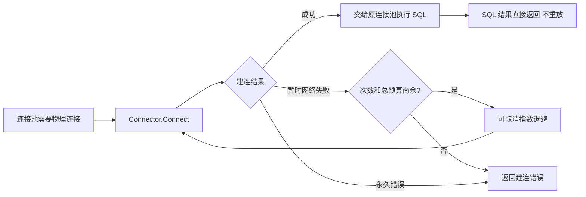

# MySQL 驱动

导入 `contrib/database/mysql` 后，驱动以 `mysql` 名称注册到 `pkg/database`。连接继续使用原有 DSN、`*sql.DB` 连接池和 GORM 方言，资源由 database Manager 的 cleanup 释放。

`driver.go` 在建立物理连接遇到暂时性网络错误时渐进重试：每次建连最多尝试 5 次，总预算 30 秒。首次失败后等待 80–100ms，随后间隔翻倍；调用方取消或期限到达会结束当前拨号和等待。每次新的建连都重新计算尝试次数。

调用方更短的 Context 期限优先。DSN 的 `timeout` 仍限制每一次拨号，`readTimeout`、`writeTimeout` 保持原有 SDK 语义；多次尝试的总耗时包含退避，可以超过单次拨号的 `timeout`。认证、配置和其他非暂时性错误直接返回。

运行期旧连接失效后，由 `database/sql` 剔除并通过同一个池建立新连接。新增重试仅发生在物理建连阶段，不重放 SQL 或事务；当前操作的执行错误仍交给调用方处理。cleanup 关闭连接池后不会重新打开。

