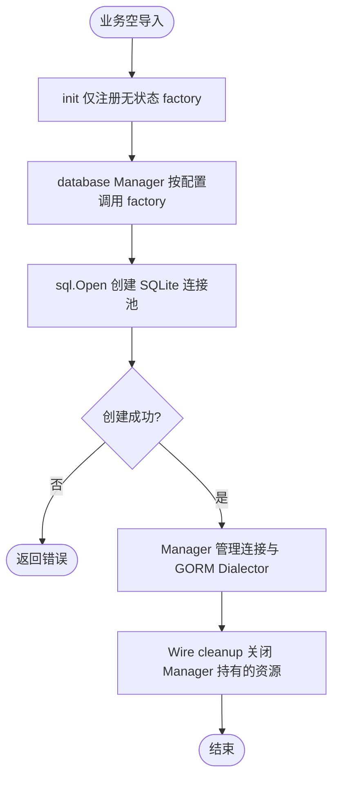

# sqlite

在业务组装层空导入本包，向 `pkg/database` 注册 `sqlite3` 驱动；数据库配置的 driver 应为 `sqlite3`，DSN 使用 SQLite 文件路径或 URI。构造入口是 `database.NewManager`，不直接调用本包内部工厂。

本包使用 `gorm.io/driver/sqlite`，构建环境需满足其 CGO 要求。内存库生命周期与物理连接相关，多连接场景需使用合适的共享内存 URI 或限制连接数。

init 不读取配置或创建连接；调用方借用连接，不重复关闭。错误返回 Manager 处理，本适配器不重复记录日志。
