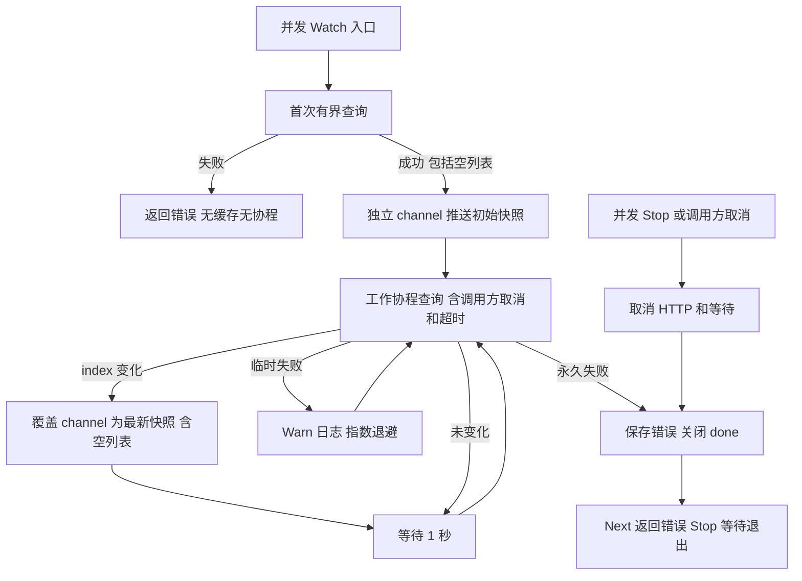

# Consul 服务发现

发现及重试日志归属 `module=discovery`，并包含 `driver=consul`。

`NewDiscovery(logger, config, client)` 返回 Kratos `registry.Discovery`。共享客户端为 nil 时禁用，配置与公共 Wire 构造签名保持不变。默认请求超时 10 秒，支持单数据中心和多数据中心。

每个 `Watch` 独立拥有取消函数、最新快照 channel 和工作协程。首次请求失败直接返回错误，不创建缓存或后台任务；再次订阅会重新请求。首次成功即推送快照，包括空列表。后续成功的 Consul index 变化也会推送空列表，及时移除失效节点。消费者慢时合并为最新快照。`GetService` 单次直接查询，没有健康实例时返回未解析错误。

已建立的订阅遇到临时网络错误、单次请求超时、HTTP 429/5xx，会持续指数退避恢复：100ms 起、5s 封顶、80%–100% 抖动，成功后重置。断线期间不伪造空结果；恢复后以 Consul 成功结果为准。权限等永久错误结束订阅并由 `Next` 返回；调用方取消或 `Stop` 会取消进行中的 HTTP 请求并等待协程退出。`Stop` 可重复或并发调用。

单数据中心沿用 SDK 阻塞查询，等待时间不超过请求超时的一半，给 Consul 等待抖动留出余量；成功查询间隔至少 1 秒。Consul index 回退时把下一次阻塞 index 重置为 0，普通零 index 提升到 1，避免快照恢复后错过更新或紧循环。多数据中心目录请求通过 SDK `Raw.Query` 绑定 context，随后非阻塞读取各 DC，避免前一个 DC 的长轮询延迟后续 DC。所有请求共用一次查询的超时预算，返回实例的 `Metadata["dc"]` 保留来源。

这里仅维护服务目录订阅，没有业务调用重放；共享客户端仍由 `pkg/consul` cleanup 清理。固定 Kratos Consul SDK 的首次失败缓存、忽略空列表和多 DC 无 context 路径无法从公开选项修复，因此同包保留了小型 watcher，HTTP/认证/响应解码仍复用 HashiCorp API SDK。
