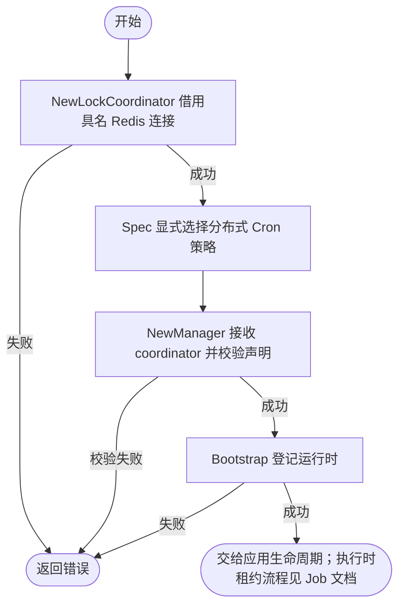

# Redis Job Coordinator

`contrib/job/redis` 把公共 Redis Manager、Redis Locker 和通用 Job 并发协调器组合成业务/Wire 可直接选择的实现。

完整的构造、错误处理与 Bootstrap 登记示例统一见 [Job 使用说明](../../../pkg/job/README.md)。顺序是：借用 Redis 连接构造 coordinator，在 Spec 中为 Cron 设置 `SkipIfDistributedRunning` 或 `DelayIfDistributedRunning`，然后通过 `job.NewManager` 的 coordinator 参数注入实现。仅注入协调器不会把 `SkipIfRunning` 升级成跨进程互斥；Manager 构造后也不会重新读取 Spec。

构造阶段只选择并借用 `pkg/redis.Manager` 持有的连接，不执行 Redis 命令，也不接管连接关闭。实际获取、续租和释放锁发生在任务执行期间。

Job 锁实现由业务/Wire 显式选择；这里没有全局驱动注册表，也不会根据 `job.lock.driver` 自动分发。需要其他协调方案时，业务可以直接构造实现 `job.ConcurrencyCoordinator` 的公共组件并通过构造参数交给 `job.NewManager` 或 `bootstrap.NewJobBootstrap`。
