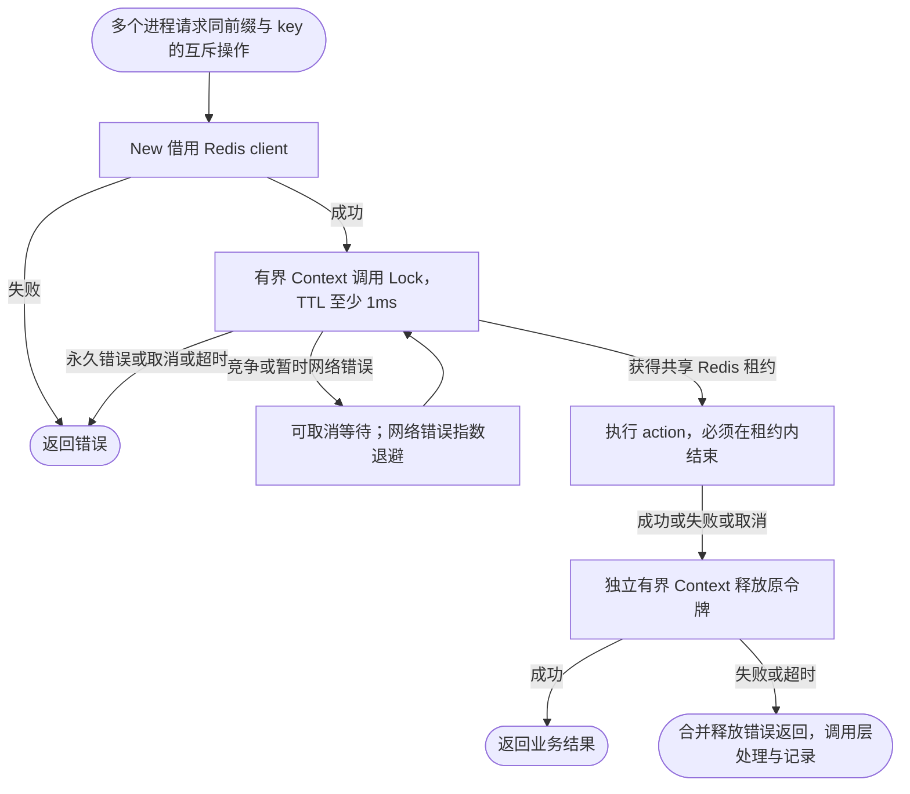

# Redis 分布式锁

Locker 借用 `pkg/redis.Manager` 的连接，不持有独立连接池，也不负责关闭客户端。

下面的函数借用已有 Redis Manager 的 `locks` 连接（配置见 [Redis 使用说明](../../../pkg/redis/README.md)），通过 `New` 构造 Locker。`WithKeyPrefix` 使用应用与环境前缀隔离无关任务；参与同一互斥操作的进程必须使用相同前缀和逻辑 key。省略连接名时使用默认连接，省略前缀时为 `lock:`。

```go
package assembly

import (
	"context"
	"errors"
	"time"

	lockredis "github.com/jaggerzhuang1994/kratos-foundation/v2/contrib/lock/redis"
	foundationredis "github.com/jaggerzhuang1994/kratos-foundation/v2/pkg/redis"
)

func runLocked(ctx context.Context, manager foundationredis.Manager, action func(context.Context) error) (err error) {
	locker, err := lockredis.New(manager,
		lockredis.WithConnection("locks"),
		lockredis.WithKeyPrefix("example:production:lock:"))
	if err != nil {
		return err
	}
	workCtx, cancel := context.WithTimeout(ctx, 30*time.Second)
	defer cancel()
	lease, err := locker.Lock(workCtx, "rebuild-index", time.Minute)
	if err != nil {
		return err
	}
	defer func() {
		// 原 Context 取消后仍允许有界释放；合并错误，避免覆盖业务失败。
		releaseCtx, releaseCancel := context.WithTimeout(context.WithoutCancel(ctx), 5*time.Second)
		defer releaseCancel()
		err = errors.Join(err, lease.Unlock(releaseCtx))
	}()
	return action(workCtx)
}
```

`action` 必须响应 Context 并在租约到期前结束；Locker 不自动续租。`Lock`、`TryLock` 和 `Refresh` 的 TTL 至少为 **1ms**，底层按毫秒精度处理；小于 1ms 即使为正也会返回错误。长任务需要由业务显式续租，失去租约后不能继续假定独占执行权。这里只释放操作级租约，共享客户端由 Redis Manager cleanup 在业务停止后释放。



本适配器不记录操作日志，错误交给能决定业务结果的调用层。

`Lock` 在尚未取得租约时等待锁竞争，并对暂时网络错误使用从 100ms 开始、翻倍到 5s、带抖动的可取消退避；收到锁竞争结果后重置网络退避。`TryLock` 仍只尝试一次。任务取得租约后不能通过重新拿锁延续旧执行，续租及释放只操作原租约令牌。

锁脚本继续使用 Manager 的原客户端，保留已有命令重试、追踪和指标 hooks。退避等待可被 Context 取消；已发出的网络读写仍受 Redis 的 `read_timeout`、`write_timeout`、`context_timeout_enabled` 配置约束，不能保证只取消 Context 就立即中断在途 I/O。默认读取超时有限；显式配置无限读取且不启用 Context 超时时，需要网络返回或 Manager cleanup 关闭连接来结束在途调用。
