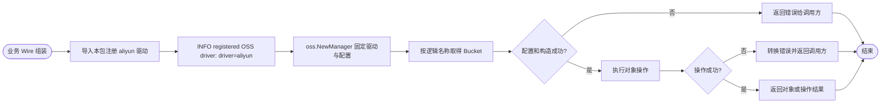

# 阿里云 OSS 适配器

本包实现 `pkg/oss.Bucket`，导入后注册 `aliyun` 驱动。业务 Wire 层构造 `oss.NewManager`，通过逻辑 bucket 名借用实例；Manager 持有资源并负责 cleanup。也可显式调用 `New(Config)` 创建独立实例。

`GetObject` 保留响应中的 `ContentEncoding`、`CacheControl` 和 `ContentDisposition`，与对象其他元信息一起返回。未提供的响应头对应空字符串；调用方负责关闭返回的 Body。

实现保留在同一个包内：

- `bucket.go`：驱动注册、SDK 配置、Bucket 构造与对象 URL。
- `object.go`：对象操作及其输入校验、Range、对象信息和错误转换。

具体配置、资源所有权及业务调用方式见 [oss 使用说明](../../../pkg/oss/README.md)。
