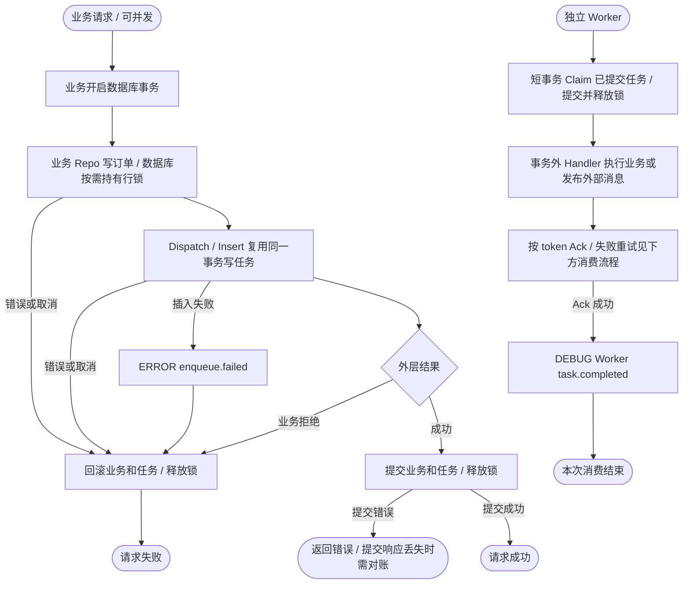
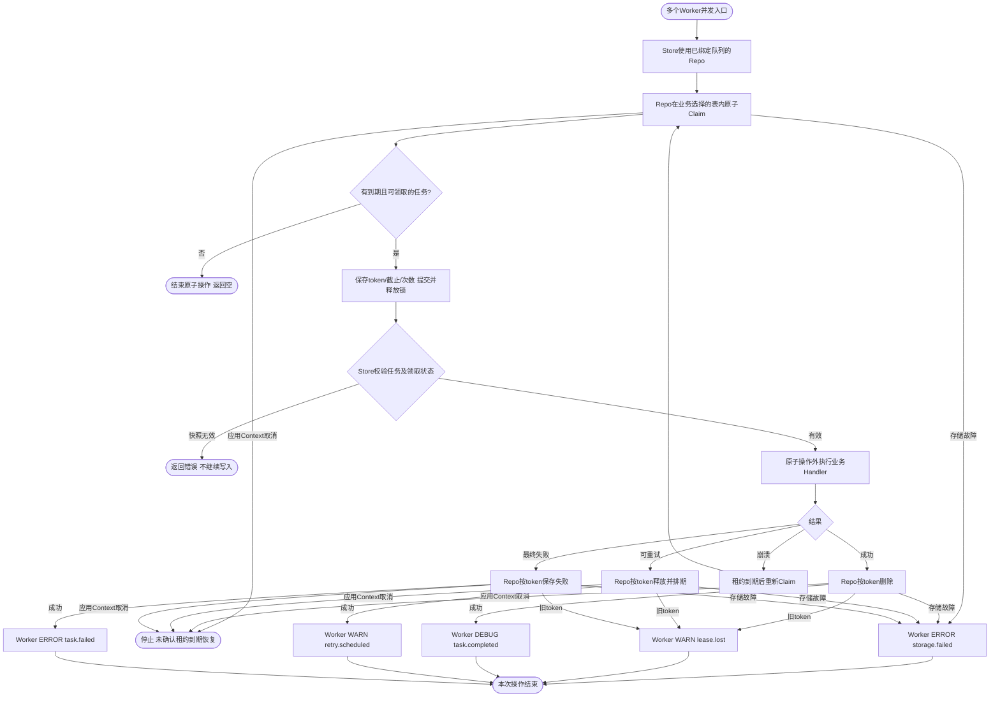

# Database 任务队列

仅保存队列字段可使用 [GORM 简单模式](gorm/README.md#简单模式)，无需业务 Model/Factory；自定义字段、索引与事务映射保留扩展模式。类型化发布与消费见 [接入文档](../../../pkg/queue/typed.md)。

本包提供面向**单个队列**的 `Repo` 契约、任务状态模型 `TaskRecord` 和实现 `queue.Store` 的适配器。业务自行实现 Repo，决定使用 GORM、database/sql 或其他访问方式，并为不同队列选择不同表或其他隔离方式。本包不依赖 ORM/数据库驱动，不执行 SQL，不提供迁移入口。

**一个 Repo 实例绑定一个队列。** Store 不再接收队列配置，Repo 方法没有 queue 参数，TaskRecord 没有 Queue 字段，也没有 TableName 方法。Worker、Queue 的逻辑队列名仅用于观测，不决定 Repo 的表名或路由。

Store 负责任务校验、领取 token 生成、任务副本及仓储结果校验。Repo 负责实际存储、原子操作、错误转换、索引、迁移和连接生命周期。Store 构造不调用 Repo，不启动 goroutine，无 cleanup；应用先停止 Worker，再由业务释放 Repo 所用资源。

可选的 [GORM 泛型 Repo](gorm/README.md) 提供基础存储 Model 和默认仓储实现，业务通过嵌入模型、定义表名及工厂填充自定义字段；不影响本包的 ORM 无关边界。

## 业务组装

以下函数由业务 Wire 调用。emailRepo、reportRepo 分别是业务已构造的仓储，例如各自绑定邮件任务表和报表任务表；两者可以共用连接池，但必须隔离任务数据。

```go
package assembly

import databasequeue "github.com/jaggerzhuang1994/kratos-foundation/v2/contrib/queue/database"

func NewTaskStores(emailRepo, reportRepo databasequeue.Repo) (*databasequeue.Store, *databasequeue.Store) {
    return databasequeue.NewStore(emailRepo), databasequeue.NewStore(reportRepo)
}
```

业务 Wire 建议通过具体 Repo 类型或显式 provider 函数区分不同队列，避免将同一个 Repo 错误地注入两个队列。业务可用 `var _ databasequeue.Repo = (*EmailRepo)(nil)` 验证接口完整性。Store 再注入 Queue/Worker，见 [Queue 组装示例](../../../pkg/queue/README.md)。接口编译通过不代表 Repo 已满足并发和持久化保证。

## Repo 接口约束

所有方法支持 Context 取消和并发调用，输入只读且不得在返回后保留可变引用，返回 TaskRecord 及其 Payload/Headers 必须是独立快照。除 Insert 可参与投递方显式事务外，状态变更方法成功返回必须已提交；Claim 只能读取已提交任务。Insert 在外层事务中成功只表示写入该事务，最终提交或回滚由业务决定。其他存储错误保留错误链；取消或提交响应丢失不能被当成“没有任务”。

| 方法 | 必须保证的原子行为 | 冲突语义 |
| --- | --- | --- |
| Insert | 在当前 Repo 插入完整 TaskRecord；待执行/已领取/失败 Task.ID 唯一，禁止覆盖式 upsert | `queue.ErrDuplicate` |
| Claim | 选取 Failed=false、Task.AvailableAt ≤ now、租约为空或到期 的一条记录；写入给定 token/截止并增加 Attempts，返回更新后快照 | 无候选返回 nil, nil；竞争失败可重选或返回空 |
| DeleteReserved | Task.ID/Token 匹配、Failed=false、租约非空时删除 | `queue.ErrLeaseLost` |
| ReleaseReserved | 使用同一所有权条件，设置 Task.AvailableAt，清空 ReservedUntil/Token，保留其余任务数据和 Attempts | `queue.ErrLeaseLost` |
| FailReserved | 同一所有权条件，设置 Failed/FailureReason/FailedAt，清空 ReservedUntil/Token，保留任务和 Attempts | `queue.ErrLeaseLost` |
| ListFailed | 当前 Repo 的失败记录，按 FailedAt、Task.ID 升序，最多 limit 条 | 无记录返回空切片 |
| RetryFailed | 仅修改失败 Task.ID；清除失败和租约字段，Attempts=0，设置 Task.AvailableAt，保留其余任务数据 | `queue.ErrNotFound` |

多个 Worker 可能竞争同一个 Repo。Claim 的读取候选与更新必须通过事务/行锁或包含旧身份、token、到期状态的条件更新保证原子性；无条件更新会重复领取。业务 Handler 必须在数据库原子操作完成后执行，不跨业务执行持锁。具体同步机制、索引、竞争重试及公平性由业务实现，本包不提供数据库特定策略。

过期重领必须增加 Attempts 并更换 token；旧 Worker 的确认、释放及失败归档必须被拒绝。完成后可复用 Task.ID，但新领取不能复用旧 token。任务允许重投且领取次数有限：业务完成后、确认前崩溃仍可能重投；领取后执行前反复崩溃也可能耗尽次数并进入失败状态，因此不保证 Handler 至少实际执行一次或最终成功，业务 Handler 必须幂等。底层只返回错误，由 Worker 记录受控日志，不重复暴露 SQL、参数或凭据。

## 与业务事务一起投递

可以把业务数据和任务写入同一个数据库本地事务，消除“业务提交后、投递前崩溃”的窗口。两个 Repo 必须使用同一个实际事务连接，而不只是同一个数据库地址。业务显式开启事务，并把回调 Context 传给业务 Repo 和 Queue.Post；任务 Repo.Insert 从该 Context 取事务，不自行提交。

如果业务采用 `pkg/database.Manager`，两个 Repo 都通过同一个 Manager 的 `Connection(txCtx)` 取连接即可复用事务。该依赖只存在于业务实现和以下组装示例，本适配器不导入 GORM 或数据库驱动。

```go
package biz

import (
    "context"

    "github.com/jaggerzhuang1994/kratos-foundation/v2/pkg/database"
    "github.com/jaggerzhuang1994/kratos-foundation/v2/pkg/queue"
)

// OrderRepo 由业务提供，实现须使用同一 Manager 的 Connection(ctx)。
type OrderRepo interface {
    Create(context.Context, string) error
}

type OrderCreated struct { OrderID string `json:"order_id"` }

// 前置条件：tasks 使用 OrderCreated 的消息定义，注入 Database Store，Repo.Insert 复用 tx 的事务。
func CreateOrder(ctx context.Context, tx database.TransactionManager, orders OrderRepo, tasks *queue.Queue[OrderCreated], orderID string) error {
    return tx.Transaction(ctx, func(txCtx context.Context) error {
        if err := orders.Create(txCtx, orderID); err != nil {
            return err
        }
        _, err := tasks.PostWith(txCtx, OrderCreated{OrderID:orderID}, queue.PostOptions{ID:orderID})
        return err
    })
}
```

必须检查外层 Transaction 的最终返回值；Post 返回 nil 及成功指标只表示投递调用成功，不表示事务已提交。事务 Context 不能逃逸回调，也不能拿来启动 Worker。事务应只包含短时本地写入，避免网络调用、长任务或等待 Worker；数据库事务结束时释放相应行锁，失败/超时回滚业务和任务。不同连接、Redis Store 或另开独立事务的 Insert 不满足该保证；提交响应丢失仍是结果不确定，需要业务唯一键及对账。

任务表由 Worker 直接消费时，这是事务性任务表，可承担 Outbox 的持久待办职责。如果 Handler 把记录发布到 Kafka/其他外部系统，则它是典型 Outbox relay。两种方式均不保证外部副作用 exactly-once：业务执行成功后、Ack 前崩溃仍会重投，需要下游幂等；默认有限重试，失败记录仍需监控和人工处理。



## Task 与 TaskRecord

`queue.Task` 表示投递的任务载荷；`database.TaskRecord` 表示这个任务连同领取次数、租约和失败状态。选择 TaskRecord 是为了区分这两层含义；`Job` 容易与现有 `pkg/job` 的 Cron/Once/Daemon 概念混淆。

```go
// 业务仓储和框架交换的状态，不是数据库行结构。
record := databasequeue.TaskRecord{
    Task: queue.Task{ID: "welcome-42", Type: "send-email", Payload: payload},
    Attempts: 0,
}
```

以上片段中的 payload 是业务准备的 []byte，queue 指向 pkg/queue，databasequeue 指向本包。记录字段为：

| 字段 | 含义 |
| --- | --- |
| Task | 完整 queue.Task，包含 ID、Type、Payload、Headers、AvailableAt、CreatedAt |
| Attempts | 累计领取次数 |
| Token / ReservedUntil | 当前领取标识及租约截止时间 |
| Failed / FailureReason / FailedAt | 失败状态、受控分类及失败时间 |

TaskRecord 不包含 GORM 标签、TableName、数据库主键或 JSON 存储字节，时间使用 time.Time。业务 Repo 自己定义 GORM/SQL 实体、表名和序列化方式，在持久化实体与 TaskRecord 之间转换；本包抽象契约不要求特定 schema；选择可选 GORM Repo 时须遵守其基础存储 Model 的字段约束。

Task.ID 为 1–128 字节且非空白，必须逐字节比较，区分大小写、音调、前导零和尾随空格。数据库排序规则、字段容量、索引和迁移均由业务负责。存储精度不足时，Repo 必须把最早执行时间和租约截止向上取整，避免提前执行或回收；Store 原样传递 time.Time，不指定毫秒存储格式。lease 至少 1ms，与统一 Store 契约一致。各 Worker 应同步时钟；不保证准点执行或严格 FIFO。

损坏的持久化数据由 Repo 负责解码、保留原文并隔离失败，向框架返回诊断错误，不能静默丢弃。Store 拒绝无效 token、未增加次数、已失败、未到执行时间或租约过短的领取快照，不按不可信结果继续改写记录。失败列表遇到无效任务也返回错误。任务正文的具体修复方式由业务实体和编码决定。



## 验证边界

框架用 Repo 替身验证任务状态、参数传递、时间保留、独立快照、无效仓储结果及错误链；还验证独立 Store 使用各自绑定的 Repo。根入口为 `make verify` 和 `make lint`；局部诊断使用 `go test -race ./contrib/queue/database`。本包测试不导入具体 ORM/驱动，也不宣称证明业务 Repo 的原子性。`pkg/database/transaction_test.go` 使用真实 SQLite 验证业务写入与任务投递一起提交、一起回滚，以及提交前独立连接不可见；不替代业务完整 Repo 的并发契约测试。

业务 Repo 的真实存储测试须覆盖：不同 Repo/表隔离；同任务并发领取只有一个有效持有者；到期边界与过期重领；旧 token 的确认/释放/失败写入拒绝；完成后 ID 复用；重复入队；Release/Fail/Retry 及重启恢复；取消和提交不确定性；标识比较；失败列表范围/排序/限制和独立快照。

## 可选统计

`Store.Stats(ctx, now)` 仅在 Repo 实现 `queue.StatsProvider` 时转发，未实现返回错误。
普通 Repo 的必需方法保持不变；不得以进程内发送/完成计数替代持久化积压。
状态、最老 ready 排期等待年龄、采集 timeout 和 cleanup 见 [Queue 统计文档](../../../pkg/queue/README.md#持久化积压统计)。
