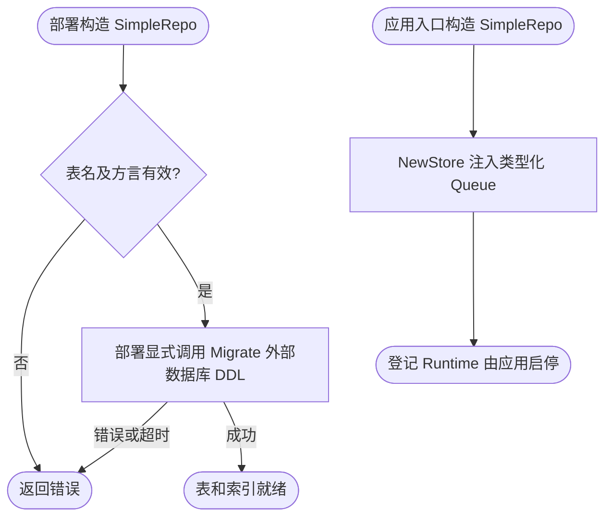
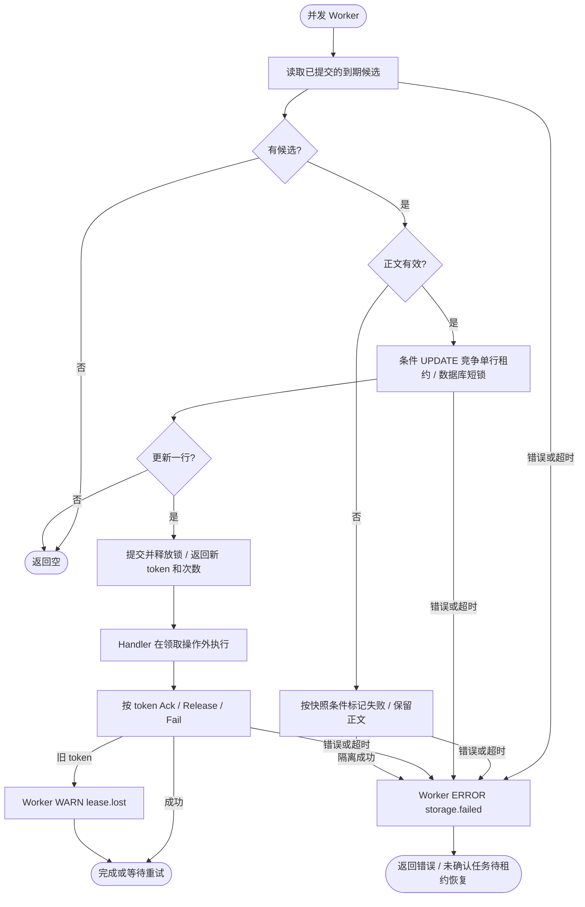

# GORM 任务仓储

本包是可选的 `database.Repo` 实现，支持 SQLite 与 MySQL；不导入数据库驱动，不注册连接、不自动迁移表、不拥有连接生命周期。其他方言在构造期拒绝。业务使用 `pkg/database.Manager` 或实现 `ConnectionProvider`，按 Context 返回 GORM 会话。

## 简单模式

仅保存队列任务时，应用入口调用 `NewSimpleRepo(ctx, provider, SimpleConfig{Table: "email_tasks"})`，再调用 `databasequeue.NewStore(repo)`。业务无需定义 Model、Factory 或 Repo；`provider` 与扩展模式相同，已初始化且支持 Context 中的事务。构造只校验表名和方言，不建表，不启动后台任务。

部署迁移命令显式调用 `repo.Migrate(ctx)` 并检查错误。它使用框架模型补齐该表和索引，重复执行可复用；不应在业务启动或消费时调用。生产 DDL 的审批、锁等待、超时、权限与版本管理由部署流程负责。该工具支持当前 SQLite/MySQL 方言；没有自动回滚迁移或自动修复历史损坏数据。

每个实例固定绑定独立物理表，表名仍须为简单标识符；多个简单队列可使用同一 Go 模型而不会混用表。任务字段、ID 编码、事务、并发、统计及失败管理完全复用下述 Repo 契约。需要按业务身份建立索引或查询状态时使用扩展模式，不往简单表手工添加业务映射。



迁移工具返回错误供部署命令处理，本包不虚构额外日志节点。示例调用必须分别检查 NewSimpleRepo 与 Migrate 的错误；构造成功不代表表已存在。简单模式借用连接，不增加 cleanup。

## 扩展模式：模型与构造

下面是完整的组装示例；`manager` 已初始化，迁移由业务在启动 Worker 前完成，连接最终由原拥有者 cleanup。

```go
package assembly

import (
    "context"

    databasequeue "github.com/jaggerzhuang1994/kratos-foundation/v2/contrib/queue/database"
    queuegorm "github.com/jaggerzhuang1994/kratos-foundation/v2/contrib/queue/database/gorm"
)

type EmailTask struct {
    queuegorm.Model
    TenantID string `gorm:"index"`
    OrderID string `gorm:"index"`
}

func (*EmailTask) TableName() string { return "email_tasks" }

func NewEmailStore(ctx context.Context, manager queuegorm.ConnectionProvider) (*databasequeue.Store, error) {
    repo, err := queuegorm.NewRepo(ctx, manager, func(ctx context.Context, record *databasequeue.TaskRecord) (*EmailTask, error) {
        // 从已校验的业务数据填充自定义列；任务正文仍由框架保存。
        return &EmailTask{OrderID: record.Task.ID}, nil
    })
    if err != nil {
        return nil, err
    }
    return databasequeue.NewStore(repo), nil
}
```

业务模型必须是按值匿名嵌入本包 Model 的结构体，其指针满足 Entity。不能添加第二主键、覆盖基础字段/列、修改基础字段标签、使用 embeddedPrefix 或软删除。TableName 必须返回固定的简单标识符（字母或下划线开头，其后字母、数字、下划线），不支持运行时动态表名或 schema 前缀。不同队列使用不同具体模型/表；一个 Repo 只对应一个队列，不在表内区分 queue。

工厂只在 Insert 调用，返回新的非 nil 模型并填充自定义字段；不得保留模型引用或执行外部副作用。框架覆盖 Model 字段，业务工厂对传入任务的修改不会改变已编码正文。工厂错误保留错误链。消费只返回 TaskRecord，不返回扩展模型；Handler 所需数据应放入 Payload，自定义列适合业务查询、索引或审计。

基础 ID 是 Task.ID 的十六进制编码，确保常见不区分大小写/音调的数据库排序规则仍能精确区分任务 ID；字段至少需要 256 字符。Identity 在每次插入时重新生成，避免任务删除后同 ID 重建导致旧快照误领取。Data 保存完整任务 JSON，Payload 保留二进制信息。时间索引用毫秒整数，截止向上取整，查询时钟向下取整；恢复的 AvailableAt 来自索引，CreatedAt 保留正文精度。业务迁移必须保留这些字段和唯一主键，不能通过手工修改表或任务正文绕开契约。

Repo 跳过 GORM 模型钩子和关联对象的自动创建，状态更新只写队列管理列，不对业务模型执行整体 Save。业务字段在领取、释放、失败和重试期间保留。不能配置会自动修改队列列的数据库触发器，不能用自定义 Scope 或 GORM 插件偷偷过滤/修改任务。

## 事务与并发

Insert 通过 `Connection(ctx)` 取得会话，允许复用同一 Manager 的业务事务；成功仅代表插入该事务，最终以业务提交结果为准。工厂和业务 Repo 均应传播该 Context。普通插入不做 upsert，重复 ID 返回 `queue.ErrDuplicate`；错误转换在独立会话 Config 上启用，不改变共享连接配置。

Claim、DeleteReserved、ReleaseReserved、FailReserved、RetryFailed 必须在没有外层事务的 Context 中调用，连接提供者必须保证这一点；Repo 会拒绝 GORM 能识别的已打开事务，不要把业务事务 Context 传给 Worker。Repo 不使用长期事务或进程锁：读取候选后，以 ID、Identity、Token、Attempts、租约和可执行时间作为条件执行单次更新，只有更新一行才取得租约。冲突返回空领取；数据库错误返回调用方，不隐式重试。单行更新期间由数据库加锁，语句/默认短事务结束即释放，不跨 Handler 持锁；热点任务可能反复竞争，不保证公平性。

Ack/Release/Fail 以 ID、Token、非失败及非空租约为条件更新，旧 owner 返回 `ErrLeaseLost`。失败保留在原行，Retry 清零次数并重新排期。Claim 解码发现损坏时，按同一快照条件标记失败、保留原始正文并返回错误；失败查询也明确报告损坏。至少需一个正常 Worker 或外部 supervisor 恢复消费；有限尝试次数、网络结果不确定及业务幂等边界见 [核心文档](../../../../pkg/queue/README.md)。本包不提供 exactly-once、永久去重、自动续租或故障数据库的数据恢复。



## 验证

根 `make verify` 和 `make lint` 覆盖本包，SQLite 测试用临时文件，验证生命周期、自定义字段、并发领取、旧 token 拒绝、同事务提交/回滚及提交前不可见。设置 `FOUNDATION_TEST_QUEUE_MYSQL_DSN` 后运行 `go test -race -count=1 ./contrib/queue/database/gorm`，同一套测试切换到真实 MySQL；必须使用隔离数据库，测试拒绝已有的 queue_test_tasks 表，结束后只删除自己创建的表。根 `make test-external` 也执行该测试。SQLite 验证不能代替 MySQL 生产配置测试。数据库表、权限、刷盘、主从复制和业务事务实现仍由应用负责；核心 database 包保持无 ORM 依赖。

## 只读统计

`Repo.Stats(ctx, now)` 使用单条 `SUM(CASE...)`/`MIN(CASE...)` 聚合查询返回单表快照，不读取任务载荷、不加锁、不迁移表。
排期截止与 Claim 使用相同毫秒边界：过期租约计入 ready，有效租约计入 running，失败任务独立计数。
最老 ready 取当前 `available_at`，不是创建时间；空集合精确返回零数量。统计拒绝外层事务，避免读取业务未提交状态。
完整状态聚合需要访问队列表，现有索引不能保证常数时间；大表应结合实际执行计划控制采集频率和 timeout。本实现不自动新增索引。
接入 `queue.RegisterStats` 并在释放借用连接前注销，具体指标与流程见 [Queue 统计文档](../../../../pkg/queue/README.md#持久化积压统计)。
