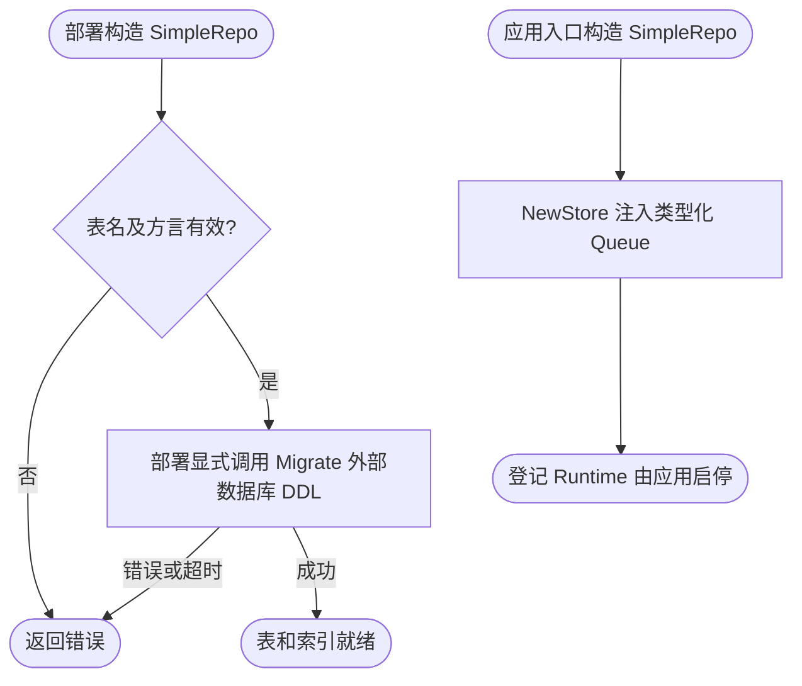
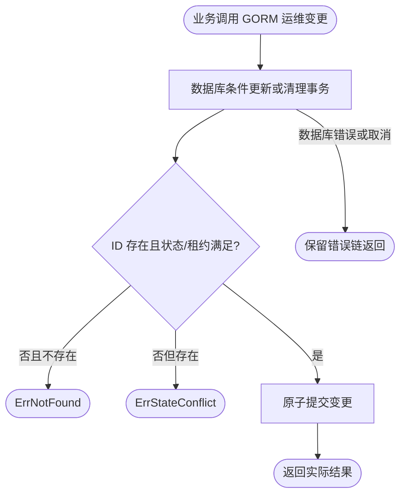
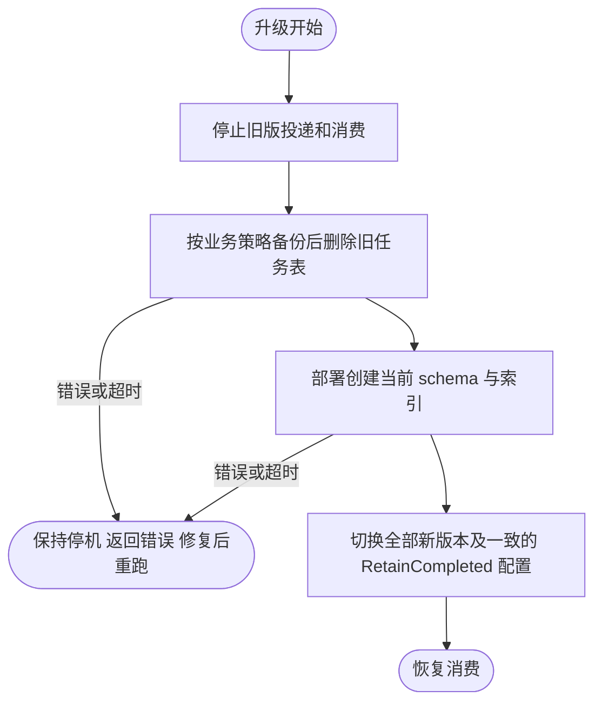
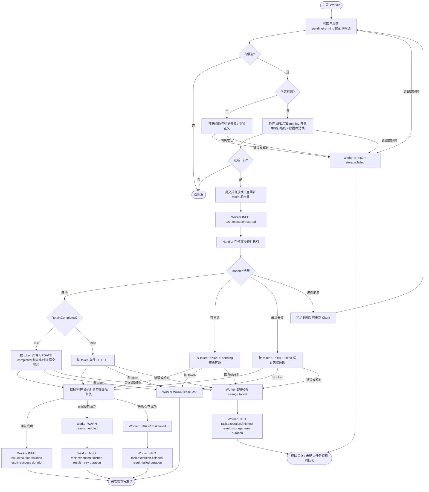

# GORM 任务仓储

本包是可选的 `database.Repo` 实现，支持 SQLite 与 MySQL；不导入数据库驱动，不注册连接、不自动迁移表、不拥有连接生命周期。其他方言在构造期拒绝。业务使用 `pkg/database.Manager` 或实现 `ConnectionProvider`，按 Context 返回 GORM 会话。

## 简单模式

仅保存队列任务时，应用入口调用 `NewSimpleRepo(ctx, provider, SimpleConfig{Table: "email_tasks"})`，再调用 `databasequeue.NewStore(repo)`。业务无需定义 Model、Factory 或 Repo；`provider` 与扩展模式相同，已初始化且支持 Context 中的事务。构造只校验表名和方言，不建表，不启动后台任务。

部署迁移命令在空表环境显式调用 `repo.Migrate(ctx)` 并检查错误。它使用框架模型创建或核对当前表和索引，重复执行可复用；不应在业务启动或消费时调用，也不负责把 v2.1 之前的旧表转换为新结构。生产 DDL 的审批、锁等待、超时、权限与版本管理由部署流程负责。该工具支持当前 SQLite/MySQL 方言；没有自动回滚迁移或自动修复历史损坏数据。

每个实例固定绑定独立物理表，表名仍须为简单标识符；多个简单队列可使用同一 Go 模型而不会混用表。任务字段、ID 编码、事务、并发、统计及失败管理完全复用下述 Repo 契约。需要按业务身份建立索引或查询状态时使用扩展模式，不往简单表手工添加业务映射。



迁移工具返回错误供部署命令处理，本包不虚构额外日志节点。示例调用必须分别检查 NewSimpleRepo 与 Migrate 的错误；构造成功不代表表已存在。简单模式借用连接，不增加 cleanup。

## 保留执行记录

任务在两种模式下都会入库；`RetainCompleted` 只控制成功确认后的处理。简单模式使用 `SimpleConfig{Table: "email_tasks", RetainCompleted: true}`，扩展模式使用下方 `Config{RetainCompleted: true}`。默认 `false` 时成功即删除；`true` 时保留完整正文、自定义列、尝试次数及完成时间。失败任务两种模式均保留。

配置在 Repo 构造时复制，不支持热更新。同一物理表的所有消费者必须使用一致配置，否则是否保留取决于完成确认的消费者。业务可以用 `config.Manager.Load` 将自有配置节点解码成 `SimpleConfig`（字段为 `table`、`retain_completed`），然后显式构造 Repo；Foundation 根协议没有新增全局 queue 配置节点。

| status | 含义及变化 |
| --- | --- |
| `pending` | 新入队、Release 等待重试或人工 Retry；具体可执行时间见 available_at |
| `running` | Claim 已提交租约；不代表进程仍存活，过期后可重新领取 |
| `completed` | 成功 Ack 且开启保留；写入 completed_at，清空 token/reserved_until |
| `failed` | 最终失败或损坏数据隔离；保留 failure_reason/failed_at，清空租约 |

`status`、`completed_at` 是 GORM `Model` 的存储列。原 `failed` 列与 TaskRecord.Failed 保留兼容，正常状态变更在同一数据库语句中同步 status 与失败/租约字段；业务不得独立改写这些列。领取只检索 pending/running，再按失败标记、available_at 和租约截止判断可执行性；未知状态不参与领取。completed 不计入积压统计。

`available_at`、`failed_at`、`completed_at` 使用 SQL `timestamp` 时间列并以 UTC `time.Time` 读写；MySQL 与 SQLite 都保留 `timestamp` 声明类型。框架按当前方言共同可依赖的默认精度处理边界：SQLite 为毫秒，MySQL 为秒；写入向上取整、查询时钟向下取整，避免提前执行或回收。MySQL 写入值还必须落在 UTC `1970-01-01 00:00:01` 至 `2038-01-19 03:14:07`，构造出的仓储会在写库前拒绝零值和越界时间。未失败或未完成时对应字段为 NULL。`completed_at` 记录 Store 发起成功确认的时间，不是业务事务提交时间。Attempts 是本轮累计领取次数（包括租约恢复），人工 Retry 仍会清零。每个任务只保留一行最新状态，不保存每次尝试的独立历史、返回值或 Handler 错误原文。完成记录不会自动清理，保留期间 ID 不能复用，Retry 只允许失败任务。重启后关闭保留仅影响后续确认，不会清理已有完成记录。

业务可直接只读查询所绑定任务表，例如以下 SQL；`id` 就是公开的 `Task.ID`，按二进制语义存储，`data` 只保存消息版本、载荷、Headers 和创建时间。GORM Repo 同时实现可选 `OperationsRepo`，可通过 `Queue.Operations()` 构建业务自己的分页运维入口；框架不提供管理界面。

```sql
SELECT id, status, attempts, completed_at, failure_reason, failed_at
FROM email_tasks
ORDER BY completed_at DESC, id ASC
LIMIT 100;
```

运维 List 按存储主键稳定升序分页，Cursor 为后端不透明值；状态按查询时的 `available_at`、有效租约、失败及完成字段计算，返回结果不包含正文。Get 才返回完整任务快照。Delete 仅接受 failed/completed，Cancel 仅接受没有有效租约的 pending/scheduled，Retry 仅接受 failed；不存在返回 `queue.ErrNotFound`，存在但状态不允许返回 `queue.ErrStateConflict`。Cleanup 在事务内按 ID 选取并再次带终态和截止条件删除至多 `limit` 条 failed/completed，和 Worker 并发时不会删除已转为其他状态的记录。



### v2.1 表重建

v2.1 改变主键编码、删除 `identity`、新增 `generation`，并把 `available_at`、`failed_at`、`completed_at` 从整数改为 SQL 时间列；不提供旧任务数据的原地转换或双写兼容。升级前停止旧版投递和消费，按业务备份要求处理历史数据后删除并重建任务表，再统一切换新版本。不要让新旧 Worker 共用同一物理表。

简单模式由部署命令在空表环境调用 `Migrate(ctx)` 创建当前表和索引；该方法只执行当前模型的 AutoMigrate，不回填或解释旧 schema。扩展模式由业务迁移创建与 `Model` 一致的字段和索引。迁移失败时保持停机，修复后重跑；迁移只返回错误，不新增运行期后台任务。



## 扩展模式：模型与构造

下面是完整的组装示例；`manager` 已初始化，迁移由业务在启动 Worker 前完成，连接最终由原拥有者 cleanup。

```go
package assembly

import (
    "context"

    databasequeue "github.com/jaggerzhuang1994/kratos-foundation/v2/contrib/queue/database"
    queuegorm "github.com/jaggerzhuang1994/kratos-foundation/v2/contrib/queue/database/gorm"
)

type EmailTask struct {
    queuegorm.Model
    TenantID string `gorm:"index"`
    OrderID string `gorm:"index"`
}

func (*EmailTask) TableName() string { return "email_tasks" }

func NewEmailStore(ctx context.Context, manager queuegorm.ConnectionProvider) (*databasequeue.Store, error) {
    repo, err := queuegorm.NewRepo(ctx, manager, func(ctx context.Context, record *databasequeue.TaskRecord) (*EmailTask, error) {
        // 从已校验的业务数据填充自定义列；任务正文仍由框架保存。
        return &EmailTask{OrderID: record.Task.ID}, nil
    }, queuegorm.Config{RetainCompleted: true})
    if err != nil {
        return nil, err
    }
    return databasequeue.NewStore(repo), nil
}
```

业务模型必须是按值匿名嵌入本包 Model 的结构体，其指针满足 Entity。不能添加第二主键、覆盖基础字段/列、修改基础字段标签、使用 embeddedPrefix 或软删除。TableName 必须返回固定的简单标识符（字母或下划线开头，其后字母、数字、下划线），不支持运行时动态表名或 schema 前缀。不同队列使用不同具体模型/表；一个 Repo 只对应一个队列，不在表内区分 queue。

工厂只在 Insert 调用，返回新的非 nil 模型并填充自定义字段；不得保留模型引用或执行外部副作用。框架覆盖 Model 字段，业务工厂对传入任务的修改不会改变已编码正文。工厂错误保留错误链。消费只返回 TaskRecord，不返回扩展模型；Handler 所需数据应放入 Payload，自定义列适合业务查询、索引或审计。

基础 `id` 直接保存 `Task.ID`，是唯一公开任务标识；MySQL 使用 `varbinary(128)`、SQLite 使用 `BLOB` 保持逐字节比较，不能改成受数字亲和性、大小写、音调或尾随空格规则影响的文本列。`generation` 是每次插入重新生成的内部行世代令牌，只用于避免任务删除后同 ID 重建导致旧领取快照误更新，不是第二个任务 ID，也不会通过 Task 或运维接口返回。`data` 不再重复保存 ID 和 AvailableAt，只保存消息版本、Payload、Headers 与 CreatedAt。AvailableAt 从独立时间列恢复；Payload 在 JSON 中保留二进制信息。业务迁移必须保留这些字段和唯一主键，不能通过手工修改表或任务正文绕开契约。

Repo 跳过 GORM 模型钩子和关联对象的自动创建，状态更新只写队列管理列（status、completed_at 与原有租约/失败字段），不对业务模型执行整体 Save。业务字段在领取、释放、失败和重试期间保留。不能配置会自动修改队列列的数据库触发器，不能用自定义 Scope 或 GORM 插件偷偷过滤/修改任务。

## 事务与并发

Insert 通过 `Connection(ctx)` 取得会话，允许复用同一 Manager 的业务事务；成功仅代表插入该事务，最终以业务提交结果为准。工厂和业务 Repo 均应传播该 Context。普通插入不做 upsert，重复 ID 返回 `queue.ErrDuplicate`；错误转换在独立会话 Config 上启用，不改变共享连接配置。

Claim、CompleteReserved、ReleaseReserved、FailReserved、RetryFailed 必须在没有外层事务的 Context 中调用，连接提供者必须保证这一点；Repo 会拒绝 GORM 能识别的已打开事务，不要把业务事务 Context 传给 Worker。Repo 不使用长期事务或进程锁：读取候选后，以 ID、Generation、Token、Attempts、租约和可执行时间作为条件执行单次更新，只有更新一行才取得租约。冲突返回空领取；数据库错误返回调用方，不隐式重试。单行更新期间由数据库加锁，语句/默认短事务结束即释放，不跨 Handler 持锁；热点任务可能反复竞争，不保证公平性。

Ack/Release/Fail 以 ID、Token、非失败及非空租约为条件更新，旧 owner 返回 `ErrLeaseLost`。成功按 `RetainCompleted` 删除或保留在原行；失败始终保留在原行，Retry 清零次数并重新排期。Claim 解码发现损坏时，按同一快照条件标记失败、保留原始正文并返回错误；失败查询也明确报告损坏。至少需一个正常 Worker 或外部 supervisor 恢复消费；有限尝试次数、网络结果不确定及业务幂等边界见 [核心文档](../../../../pkg/queue/README.md)。本包不提供 exactly-once、永久去重、自动续租或故障数据库的数据恢复。



## 验证

根 `make verify` 和 `make lint` 覆盖本包，SQLite 测试用临时文件，验证生命周期、自定义字段、并发领取、旧 token 拒绝、同事务提交/回滚及提交前不可见。设置 `FOUNDATION_TEST_QUEUE_MYSQL_DSN` 后运行 `go test -race -count=1 ./contrib/queue/database/gorm`，同一套测试切换到真实 MySQL；必须使用隔离数据库，测试拒绝已有的 queue_test_tasks 表，结束后只删除自己创建的表。根 `make test-external` 也执行该测试。SQLite 验证不能代替 MySQL 生产配置测试。数据库表、权限、刷盘、主从复制和业务事务实现仍由应用负责；核心 database 包保持无 ORM 依赖。

## 只读统计

`Repo.Stats(ctx, now)` 使用单条 `SUM(CASE...)`/`MIN(CASE...)` 聚合查询返回单表快照，不读取任务载荷、不加锁、不迁移表。
排期截止与 Claim 使用相同的数据库时间精度边界：过期租约计入 ready，有效租约计入 running，失败任务独立计数，completed 行不计入任何积压或最老等待年龄。
最老 ready 取当前 `available_at`，不是创建时间；空集合精确返回零数量。统计拒绝外层事务，避免读取业务未提交状态。
统计覆盖索引 `(status, failed, available_at, reserved_until)` 避免为聚合读取任务正文所在的数据行，但仍扫描非 completed 记录，不是常数时间。应结合活跃/失败任务量控制采集频率和 timeout；本实现不在采集时自动新增索引或缓存结果。
接入 `queue.RegisterStats` 并在释放借用连接前注销，具体指标与流程见 [Queue 统计文档](../../../../pkg/queue/README.md#持久化积压统计)。

## 查询索引与容量边界

Model 在保留原有单列索引的基础上增加以下非唯一联合索引；默认命名为 `idx_<表名>_queue_failed` 和 `idx_<表名>_queue_stats`，自定义 GORM NamingStrategy 时以实际生成名称为准。

| 索引列顺序 | 用途 |
| --- | --- |
| failed, failed_at, id | 失败列表按失败时间、ID 排序，支持 LIMIT 提前停止 |
| status, failed, available_at, reserved_until | 覆盖统计查询的过滤与聚合列，减少回表 |

简单模式通过部署命令执行 `Migrate(ctx)` 创建索引；扩展模式由业务迁移添加同列顺序的索引。创建索引需要额外空间，并增加插入和状态更新的维护成本；大表部署须评估 DDL 时间和锁等待，消费路径不执行 DDL。迁移流程及失败处理见上方“v2.1 表重建”流程图。

在本地 MySQL 8.4.6、256MiB buffer pool、临时内存数据目录、512 字节正文、9 万完成 + 1 万失败 + 1 条待执行的隔离数据上，预热后 7 次串行查询的中位耗时如下；不包含 Handler 和并发锁竞争，不是生产 SLA：

| 查询 | 优化前 | 优化后 | 优化后执行计划 |
| --- | --- | --- | --- |
| 领取候选 | 275.34ms | 0.25ms | 状态索引扫描 1 行 |
| 精确统计 | 31.99ms | 2.65ms | 覆盖索引扫描 10001 行 |
| 失败列表前 100 条 | 35.10ms | 0.64ms | 联合索引读取 100 行，无额外排序 |

领取查询显式选择 pending/running，避免历史失败记录进入候选范围；大量 pending/running、未来排期或未到期租约仍可能扩大扫描范围。记录总量不能单独保证查询延迟，应在生产状态分布和并发负载下核对执行计划与慢查询。自定义历史查询（例如按 completed_at 排序）不由上述索引保证，业务需按自己的访问模式设计索引。
