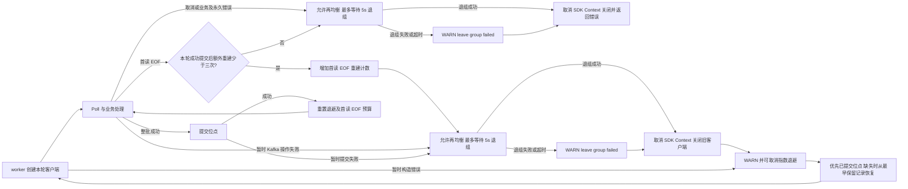

# Kafka 队列适配器

`NewProducer` 创建并独占 Kafka 客户端，返回幂等 cleanup；调用方在停止使用 Producer 后释放它。`NewConsumer` 借用 `pkg/kafka.ClientFactory`，每次 Consume 按并发数创建客户端并在退出时关闭；整批消息处理成功后才提交位点。

实现保持在同一个包内，按职责组织：

- `driver.go`：公共构造入口与客户端选项。
- `config.go`：配置校验与默认值。
- `producer.go`：发布、批量失败收集与 Producer cleanup。
- `consumer.go`：消费者生命周期、并发实例、暂时故障恢复与客户端关闭。
- `consumer_recovery.go`：Kafka 操作错误与可恢复失败分类。
- `consumer_fetch.go`：Fetch 事件分类、投递和位点提交。
- `message.go`：通用消息与 Kafka Record 的双向转换。

与业务 Handler、可观测性及应用生命周期的组装方式见 [queue 使用说明](../../../pkg/queue/README.md)。

## 断线与消费恢复

franz-go 自身负责连接重建、Fetch 重试和消费组会话恢复，保持其原生指数退避。若这些机制之外的 Kafka 操作仍返回暂时错误（例如提交位点耗尽 SDK 重试或组代次失效），仅故障 worker 关闭旧客户端，再通过可取消退避重新创建客户端；其他 worker 继续运行。额外恢复等待从 100ms 基数翻倍至 5s，加入 80%–100% 抖动；一旦成功处理并提交消息，连续失败次数重置。

重建后优先从 Broker 的已提交位点继续消费。首次会话尊重配置的 `StartLatest`；恢复会话若仍没有已提交位点，则从该分区最早保留记录开始，可能重放保留历史，以避免首批提交失败后跳过已投递记录。已存在的提交位点和配置的越界重置策略保持不变。提交结果不确定或提交失败时，已执行的 Handler 可能再次执行，因此仍要求业务幂等，保持 **at-least-once** 语义。恢复不会直接重试旧客户端的业务 Handler，也不会跨越未确认批次提交新位点。

SDK 的 `ErrFirstReadEOF` 也可能由 Broker 重启引起，其 TLS/SASL 提示不是认证失败的确证。该错误从 Fetch 向外传播后，每个 worker 最多额外重建三次，沿用可取消退避；只有实际提交成功才重置这项预算。持续协议不匹配仍会在预算耗尽后终止，明确的认证、授权和证书验证失败不进入这项恢复。

只有明确发生在 Kafka 构造、Fetch 或提交阶段的暂时错误（以及上述有界首读 EOF）才触发恢复。Handler 即使返回 EOF 等网络错误，也会照常终止消费；认证、授权、客户端关闭及其他永久错误同样终止。worker Context 控制 Poll 和退避等待，每轮 SDK 客户端拥有独立的生命周期。退出时先允许再均衡，再用最多 5 秒的独立 Context 执行 LeaveGroup，最后取消 SDK Context 并关闭客户端。健康 Broker 可立即释放成员及分区；退组超时或失败会记录 WARN，并继续清理，Broker 侧成员仍可能保留至会话超时。

## 批量消费与本地开销

`ConsumerConfig.MaxPollRecords` 的零值仍为 1，支持 1–10000；这是单次 Poll 上限，不保证每批凑满。`Concurrency` 的零值仍为 1，每个 worker 使用独立 Client。保持整批顺序处理、整批成功后同步 CommitRecords；任意 Handler、Context 或提交失败都不越过该批提前确认。单分区直接借用 Fetch 的记录切片，避免展平分配；多分区、多 Broker 保留 SDK 遍历顺序和完整提交列表，交给 Handler 的消息所有权不变。

批量调优应使用真实 Broker 和业务 Handler：固定并发，依次比较 1、32、128 的吞吐、处理及提交 p95/p99、消费积压和重放量，再调整并发。增加批量可摊薄同步提交成本，但也扩大失败时可能重放的范围，延长阻止再均衡的处理时间；全部处理和提交时间应留在业务配置的再均衡预算内。框架不自动调大默认值或切换异步提交。

本地基准（仓库根目录）`go test ./contrib/queue/kafka -run '^$' -bench BenchmarkProcessFetches -benchmem -count=6` 只测解码、投递和提交前的本地开销，提交器无网络延迟，不能作为 Broker 吞吐或最佳批量的结论。实际提交与失败恢复流程见上图。

真实 Docker 验证入口为仓库根目录 `make test-external`，包括 Broker 重启恢复、未提交消息重放，以及 1/32/128 批次的网络提交分位数；环境、隔离和结果边界见 [外部测试说明](../../../testdata/external/README.md)。
