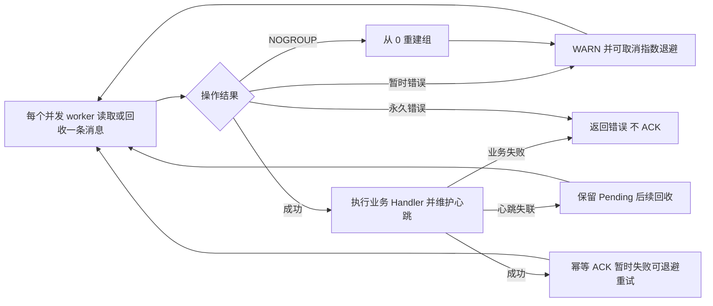

# Redis Streams 队列适配器

`NewProducer` 和 `NewConsumer` 从 `pkg/redis.Manager` 借用具名客户端，资源仍由 Manager 拥有。消费者通过 Context 管理运行周期，成功处理消息并完成心跳清理后才确认投递。

每个并发 worker 串行消费，读取新消息和回收 Pending 都固定每次领取一条，再为正在处理的消息维护心跳。这样不会将等待执行的消息提前放入本 worker 的 Pending，避免慢 Handler 导致后续消息被其他 worker 回收。通过 `Concurrency` 增加处理并发；`ConsumerConfig.BatchSize` 已移除。

实现保持在同一个包内，按职责组织：

- `driver.go`：公共构造入口与客户端解析。
- `config.go`：配置校验与默认值。
- `producer.go`：发布、批量 Pipeline 与逐条失败收集。
- `consumer.go`：消费者生命周期、并发实例、消费组和 Pending 回收。
- `consumer_delivery.go`：投递处理、Pending 心跳刷新、取消与 ACK 顺序。
- `consumer_operations.go`：Redis 网络命令边界。
- `message.go`：消息字段编码、解码与无效记录保留。

与业务 Handler、可观测性及应用生命周期的组装方式见 [queue 使用说明](../../../pkg/queue/README.md)。

网络暂时失败时，消费组创建、读取、Pending 回收及 ACK 使用可取消的指数退避恢复：从 100ms 开始翻倍，封顶 5s，并加入 80%–100% 抖动；成功或空读结束本轮退避。首次创建消费组尊重 `StartPosition`；运行期间遇到 `NOGROUP` 时固定从 `0` 重新建组，即使原先选择 `StartLatest` 也不会跳过 Stream 中保留的离线积压。丢组已失去历史确认位置，恢复可能重复投递以前处理过的消息；认证、权限、错误数据类型和 client 关闭等永久错误直接返回。退避只包围 Redis 操作，不重新调用已经成功的业务 Handler；ACK 可以重复确认同一消息。

心跳刷新失败不会原地无限刷新 claim，也不会 ACK 该消息。暂时断线后保留 Pending，由正常闲置回收再次投递；业务 Handler 的错误即使是网络错误也继续向上返回。消费者仍提供至少一次交付语义，Handler 应能处理重复消息。取消 Context 会停止重连等待，客户端仍由 Manager cleanup 关闭。

