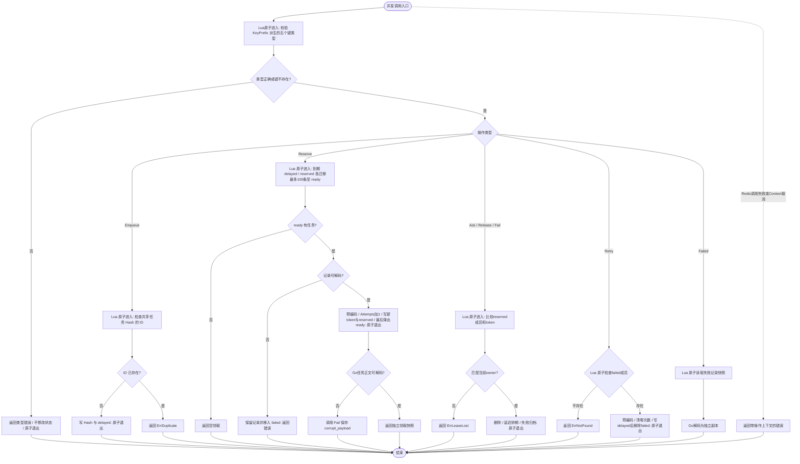

# Redis 持久化任务队列

本 Store 可直接注入 [类型化 Queue](../../../pkg/queue/typed.md)，业务无需编写 JSON 编解码或启停转发；物理 key 前缀仍由应用入口配置。

本包实现 `pkg/queue.Store` 和可选 `pkg/queue.Operations`，支持立即或延迟执行、租约回收、失败记录、人工重试和有界运维清理。旧 Redis Streams Producer/Consumer API 已移除；本包不提供 Consumer Group、广播或 Kafka 兼容接口。

## 构造与所有权

业务组装层先构造 `pkg/redis.Manager`，再显式调用：

```go
store, err := redisqueue.NewStore(redisManager, redisqueue.Config{
    Connection: "default",
    KeyPrefix:  "app:queue:email",
})
if err != nil {
    return err
}
// 将 store 注入 pkg/queue 的 Queue/Worker；具体用法见核心包 README。
```

其中 `redisqueue` 指向 `github.com/jaggerzhuang1994/kratos-foundation/v2/contrib/queue/redis`，`redisManager` 是已构造的 `pkg/redis.Manager`。Connection 和 KeyPrefix 均必填；Connection 构造时去除首尾空白，KeyPrefix 不得为空或全为空白，无默认前缀。KeyPrefix 原样保留，不裁剪空白或尾部冒号，也没有原队列名的 64 字节限制。构造只向 Manager 解析连接，不发送 Redis 命令、不启动 goroutine、不返回 cleanup。Store 借用连接，应用停止 worker 后再执行 Manager cleanup；连接关闭后的操作返回 Redis 错误。配置在构造期固定，不支持热切换。

## 状态与并发边界

- 每个队列使用任务 Hash、ready List 和 delayed/reserved/failed Sorted Set。任务正文以 Go JSON 序列化，二进制 Payload 使用 JSON 的 base64 表示；Headers 与正文读取后均为独立副本。
- Enqueue 将任务持久写入 delayed；AvailableAt 决定最早领取时间。Reserve 每次先迁移最多 100 条到期任务和 100 条过期租约，再从 ready 原子领取一条。积压超过迁移上限时需要多轮领取，不能保证全局严格时间顺序。
- Reserve 由调用方传入时钟和租约，租约至少为 1ms；Redis 调度精度为毫秒；入队、Release/Retry 的最早执行时间和租约截止时间向上取整，查询时钟向下取整，因此不会因亚毫秒截断而提前执行或回收，可能额外延迟不足 1ms。所有 worker 应使用一致的系统时钟，Redis 服务端时间不参与判定。
- 每个脚本在写入前检查五个键的类型，类型冲突直接返回错误且不改变队列状态；修复冲突后可重试。迁移先写目标再移除源，领取先读取、编码并写租约再弹出 ready；失败重投先写 delayed 再移除 failed，避免先删除唯一调度入口。Lua 原子脚本保护同队列共享状态；每次领取增加 Attempts 并产生新 token。Ack、Release、Fail 比较 token 和 reserved 成员关系，不允许旧 owner 确认已重新领取的任务。没有进程内锁，没有后台心跳。
- 租约过期但尚未回收时，原 owner 仍可能完成任务；一旦被重新领取，旧 token 返回 `queue.ErrLeaseLost`。业务处理可能因租约超时或确认失败而重复执行，Handler 应自行实现业务幂等。
- Release 保留 Attempts 并更新调度时间；Fail 保存不超过 128 字节的原因分类与失败时间；Retry 仅接受失败任务，清零 Attempts 并按指定时间重新调度。Task.AvailableAt 随 Release/Retry 更新，返回快照与调度索引一致。
- 任务 ID 必须为 1–128 字节且不能全为空白。同队列内已有待执行、已领取或失败 ID 时，Enqueue 返回 `queue.ErrDuplicate`；Ack 后删除记录，允许复用 ID。Retry 找不到任务返回 `queue.ErrNotFound`，任务存在但不是 failed 时返回 `queue.ErrStateConflict`。
- Failed 要求 limit 在 1–1000 之间，按失败时间升序返回最多 limit 条记录。Store 不启动自动过期任务；运维应监控 Redis 容量并通过业务调度显式调用 Cleanup。
- 领取时遇到损坏 envelope 或任务正文，转入失败索引并报错，保留原始记录，不持续占据 ready 或 reserved。Failed 遇到损坏记录或失败索引对应的正文缺失会返回错误，不能静默跳过；需运维修复保存的原始数据后再人工 Retry。

业务负责分配前缀；同一 Redis 中相同前缀共享队列，不同前缀隔离队列。驱动只追加固定后缀，不散列、不添加框架命名空间或 hash tag。以 `app:queue:email` 为例：

| 键 | 类型 | 用途 |
| --- | --- | --- |
| `app:queue:email:tasks` | Hash | 任务及执行状态 |
| `app:queue:email:ready` | List | 待领取任务 |
| `app:queue:email:delayed` | Sorted Set | 延迟任务 |
| `app:queue:email:reserved` | Sorted Set | 已领取租约 |
| `app:queue:email:failed` | Sorted Set | 失败任务 |

建议前缀不带尾部冒号；若提供 `email:`，实际键为 `email::tasks` 等。业务可在前缀中自行指定 `{email}` 等 hash tag，驱动原样保留。当前连接来自 Manager 的 `*redis.Client`，这不表示已提供 Redis Cluster 客户端支持。持久性取决于部署的 Redis AOF/RDB、复制及故障恢复配置；本包不改变服务端持久化策略。



Lua 执行期间无需显式获取/释放锁，原子边界即同步边界；每次增加五次本地 TYPE 检查，没有额外网络往返，脚本执行期间其他 Redis 操作仍会等待。Lua 错误不会回滚已完成的命令：这里防止的是已验证的 key 类型冲突及提前删除源索引导致的丢失，不承诺在任意 ACL 变更、存储损坏、淘汰或主从故障下自动恢复。历史版本已产生的孤立记录需要人工对账修复，不自动扫描或猜测执行状态。队列前缀应专用，禁止外部修改类型或设置 TTL；队列 Redis 不应配置会淘汰这些键的策略，持久化和复制仍需按业务可靠性要求部署。Redis 脚本已开始执行后，客户端取消不能撤销已提交状态；这类不确定结果可能导致重试，业务必须具备幂等性。底层 Store 只返回错误，由 Worker/应用边界记录日志，图中没有虚构 Store 日志节点。

## 可选运维能力

`Queue.Operations()` 可直接发现本 Store。List 使用 HSCAN 分批读取任务 ID，再查询四个状态索引；每次请求最多检查 `max(64, limit*4)` 且不超过 4000 条候选，Cursor 会保存扫描位置和本批未消费 ID，因此无遗漏但在大量过滤不命中时可能返回不足一页。Cursor 解码上限为 1 MiB、最多保留 4000 个非空且不超过 128 字节的任务 ID，超限或畸形输入直接拒绝。并发状态变化意味着跨页结果不是全局快照。List 仅返回元数据，Get 返回正文。

Delete 只允许 failed，Cancel 只允许 pending/scheduled，Retry 只允许 failed；状态检查与修改在 Lua 中原子完成，有有效租约的 running 返回 `ErrStateConflict`。Ack 会删除成功记录，所以 Redis 不存在 completed 历史，按 completed 查询或清理返回空。Cleanup 只删除截止时间之前的 failed，单次上限 1000；业务负责定时触发、鉴权和审计。

## 验证

在仓库根目录执行 `go test ./contrib/queue/redis`，运行无网络的 Go API、编码和错误语义测试。设置 `FOUNDATION_TEST_REDIS_ADDR=127.0.0.1:6379` 后，同一命令还会验证真实 Redis Lua 的延迟调度、租约回收、旧 token 拒绝、失败重试、损坏数据隔离、并发领取，以及七种操作 × 五个 key 的类型故障前后快照和修复后重试。测试使用随机队列前缀，只删除自己的五个键，不执行 FLUSHDB；请使用隔离的测试 Redis。并发验证执行 `go test -race ./contrib/queue/redis`，同样需要该环境变量才能覆盖真实服务。根 `make test` / `make race` 统一执行所有模块的验证入口。

## 只读统计与年龄上限

`Store.Stats(ctx, now)` 通过一次只读 Lua 原子查询现有五个键，不迁移到期任务，不改变消费顺序或现有同步策略。
ready = ready list 长度 + 到期 delayed 数量 + 过期 reserved 数量；scheduled/running 分别只计未来排期/有效租约，failed 使用失败集合数量。
ready 候选不超过 1000 时读取这些候选载荷，按当前 `AvailableAt` 的最小值计算最老排期等待年龄。
**候选超过 1000 时不全量扫描，数量仍精确，`OldestReadyKnown=false`；指标 known=0 且省略 age。监控不得解释为年龄为零。**
空 ready 为已知空集合。候选载荷缺失、损坏、Redis 错误或超时返回采样错误，不返回虚假的零值；采样不复用旧快照。
命令数量和候选数有界，但载荷大小沿用业务任务限制；本功能不为年龄增加存储索引，亦不修改现有 Lua 写入路径。
与消费操作并发时，Redis 在单次 Lua 内返回一致快照；脚本执行期间没有 Go 锁或后台 goroutine。
接入与生命周期见 [Queue 统计文档](../../../pkg/queue/README.md#持久化积压统计)。

采样连接必须配置 `context_timeout_enabled: true`（go-redis `ContextTimeoutEnabled`）；否则 Stats 明确返回错误，避免 Context 截止时间被客户端忽略。采样不修改借用连接选项。
