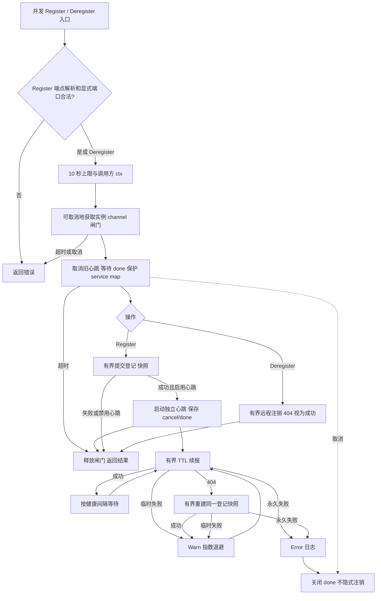

# Consul 服务注册

注册及心跳日志归属 `module=registry`，并包含 `driver=consul`。

`NewRegistry(logger, config, client)` 返回 Kratos `registry.Registrar`。共享客户端为 nil 时禁用，公共 Wire 构造、tags、TCP 健康检查、TTL 心跳开关及间隔配置保持不变。关闭心跳时没有后台续报或恢复任务。`Register` 成功后由 `Deregister` 结束该实例的心跳；共享 HTTP 客户端仍由 `pkg/consul` cleanup 管理。

`NewRegistry` 可直接加入业务 Wire provider 集合，其返回值注入 `bootstrap.NewKratosApp`（或直接调用的 `app.NewApp`）。无需服务注册时，改用返回 nil `registry.Registrar` 的业务 provider；两者只能选择一个。示例见 [Bootstrap 文档](../../../pkg/bootstrap/README.md#可选依赖由-wire-构造注入)。

显式端口必须在 0–65535 范围内，越界端口在远程注册前返回错误。缺失端口继续沿用既有的 0 值语义。

每次登记保存独立载荷快照，保留原有 ID、端点、版本、元数据与检查配置。首次 Register 不额外重试；成功后 TTL 心跳独立于 Register 的短期 context。每个 HTTP 请求最长 10 秒，调用方较短 deadline 和自定义 HttpClient.Timeout 仍有效。临时网络错误、单次请求超时、HTTP 429/5xx 按 100ms 起、5s 封顶、80%–100% 抖动持续指数退避，成功后重置；单次超时不会注销仍在运行的服务。

TTL 更新返回 HTTP 404 表示 check 丢失，使用同一快照重新登记，然后优先恢复续报。权限等永久错误记录 Error 后结束后台心跳。恢复只涉及基础设施登记与续报，不重放业务。主动取消工作协程不会隐式远程注销，远程注销统一由 Deregister 执行。

同一 registrar 实例使用可取消的 channel 闸门串行处理 Register/Deregister，保护 service map，并防止重复注册或注销与后台补登记竞争；后台心跳不访问该 map。操作在等待闸门和网络请求时都受调用方 deadline 及 10 秒上限约束。Deregister 取得闸门后先取消对应心跳并等待退出，再发有界注销请求，404 视为成功。若等待闸门超时，操作返回超时且没有取得该服务的生命周期控制权；调用方可再次注销。不同 registrar 之间不共享同步状态。

HashiCorp SDK 继续负责 HTTP、认证、请求与错误转换。此处仅替换固定 Kratos Consul SDK 中首次心跳未绑定 context、单次 DeadlineExceeded 永久结束和退出时无界注销的生命周期实现。
