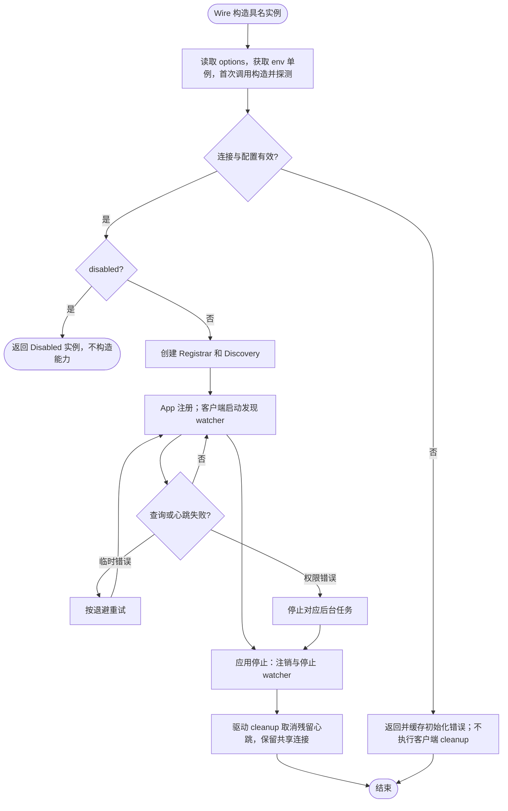

# Consul 注册与发现驱动

业务空导入本包后，`init` 向 `pkg/registry` 登记 `consul` 工厂。使用 `registry.instances.<name>.driver: consul` 创建具名实例，同时提供 Registrar 与 Discovery；只导入而未声明实例不会连接 Consul。

本包不提供单独构造注册/发现适配器的公共函数，也没有旧 Discovery 包的转发入口。配置与示例见[具名驱动](../../../pkg/registry/README.md)。`options.registry` 控制健康检查、心跳和标签，`options.discovery` 控制查询超时与数据中心；连接仅由启动 env 决定，`options.connection` 已删除并在使用时返回错误。

Consul 禁用时，工厂保存 Disabled 实例，Registrar/Discovery 解析返回 nil、nil；App 不注册。要求发现目标的客户端仍会因发现能力不可用而返回错误。

省略选项时的默认行为：

| 选项 | 默认值 |
| --- | --- |
| registry.disable_health_check / disable_heartbeat | false |
| registry.healthcheck_internal | 10s，必须为至少一秒的整秒 |
| registry.deregister_critical_service_after | 600s，必须为至少一秒的整秒 |
| registry.tags | 空列表；拒绝空白、首尾空格与重复标签 |
| discovery.timeout | 10s，必须为正数 |
| discovery.dc | SINGLE；另支持 MULTI |

SDK 客户端归进程单例所有，配置源与具名实例共同借用。App 停止注册、客户端停止发现监听后，Wire 逆序执行 cleanup；驱动取消残留心跳，保留共享连接。发现 watcher 的 Stop 会取消挂起查询；超时及临时错误按已有退避重试，权限错误停止监听。注册 heartbeat 在 Deregister 时停止，缺失 TTL 检查时重新登记快照。

并发与同步边界见[Factory 生命周期](../../../pkg/registry/README.md#生命周期与并发)。注册操作仍通过实例内可取消的 operations channel 串行化；发现 watcher 各自拥有取消函数与 Stop 的 once，不共享阻塞索引。

在仓库根执行 `go test -race ./contrib/registry/consul`，使用本机测试 HTTP 服务验证注册、查询、监听取消、重连与资源释放，无需真实 Consul。
