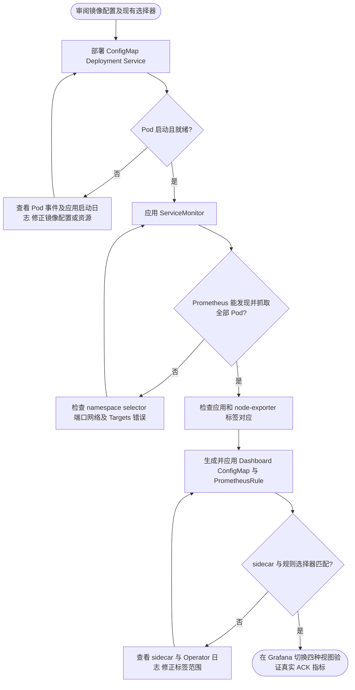

# Kubernetes / kube-prometheus-stack 接入

本示例消费已有 Prometheus Operator 和 Grafana，不创建或升级集群监控栈。应用资源位于 [app.yaml](app.yaml)，采集定义位于 [servicemonitor.yaml](servicemonitor.yaml)。所有命令在仓库根目录执行；先确认 kubectl context、命名空间、镜像仓库和现有 release 选择器，再按业务发布流程部署。

## 1. 构建并部署业务镜像

```sh
docker build -f examples/minimal/Dockerfile -t foundation-minimal-api:dev .
```

`app.yaml` 使用 `foundation-minimal-api:dev`；真实集群需要把构建结果发布到节点能拉取的仓库，并修改 image 为实际固定版本或 digest。本地 kind/minikube 需要先按所用工具的镜像加载方式加载镜像。示例不替你推送镜像。

确认配置后：

```sh
kubectl apply -f deploy/kubernetes/app.yaml
kubectl -n foundation-demo rollout status deployment/minimal-api --timeout=120s
```

默认两个 Pod、HTTP 8000、管理端口 9001，Service 仅 ClusterIP。资源 requests/limits 为演示值，需按压测调整。示例独立管理监听使用 HTTP；Ingress 不应公开 9001，生产环境用现有 NetworkPolicy 限制监控与探针访问。进程非 root、根文件系统只读、无文件日志，输出由集群日志系统收集。

配置以目录挂载，不使用 subPath；但配置变更是否热更新仍取决于 Foundation 各组件契约。监听地址或其他重启字段变更后须 rollout，不能把 ConfigMap 更新等同于应用已应用。结束宽限期 40s 大于应用预算 30s，给 Wire cleanup 留出余量；它不是无限等待保证。

## 2. 让 Prometheus 发现每个 Pod

修改 ServiceMonitor 中的 `release: monitoring` 和 `cluster: example-cluster`；env 从 Service 的 `environment` 标签读取，示例为 dev。按业务调整 namespace、App 名和 Service/Deployment 的相同 selector。然后应用：

```sh
kubectl apply -f deploy/kubernetes/servicemonitor.yaml
```

已有 Prometheus 必须同时满足：

- `serviceMonitorSelector` 能选中该 ServiceMonitor 的标签；`release` 是示例，不是通用固定值。
- `serviceMonitorNamespaceSelector` 允许发现 `foundation-demo` 中的 ServiceMonitor。
- 该 ServiceMonitor 的 namespaceSelector 能选择 Service 所在命名空间，Service selector 能选择业务 Pod，端口名称 `management` 一致。
- Prometheus 能访问 Pod 的 9001 端口，相关 RBAC/网络策略允许发现和抓取。

ServiceMonitor 发现 Service 后，抓取的是每个后端 Pod 地址，不能另外对 Service ClusterIP 再抓一次。若已有 PodMonitor/注解采集，请二选一，避免重复计数。`instance` 保留真实采集地址；node 取 `__meta_kubernetes_pod_node_name`，不从 hostname 推断。honorLabels=false 时 OTel 指标与目标冲突的 job/instance 会变为 exported_job/exported_instance，Dashboard 使用的是目标 instance。

## 3. 机器指标

[kube-prometheus-values.yaml](kube-prometheus-values.yaml) 给出已有 node-exporter ServiceMonitor 的标签补齐方式。将其中 relabelings 合并到**已固定版本**的 kube-prometheus-stack values，保留现有规则；按该版本 Chart 的 values 验证后，用已有 Helm 发布流程更新。本文不自动升级 Chart。

node-exporter 的 env/cluster 必须和应用 ServiceMonitor 一致，node 必须为真实 Kubernetes Node 名。仅设置 Prometheus externalLabels 不会给本地存储中的每条序列补齐这些标签；示例告警要求在目标 relabeling 中补齐；默认应用面板不使用这些标签。

同一集群承载多个环境时，机器指标通常只有一份：应统一机器层的环境归属，或按部署平台定义独立的集群/机器 Dashboard。不能随意给同一 node-exporter 复制多个 env 抓取任务来伪造独立机器资源。本例面向一个 env 对应一组监控目标的部署。

ACK 容器概览已展示 cAdvisor CPU/内存、容器重启与节点资源，支持四种视图；应用进程 RSS 与容器 Working Set 分开。Deployment 期望副本与更完整的控制面指标使用平台面板。

## 4. 导入 Dashboard 和告警

可以直接在 Grafana 导入 [容器概览](../observability/grafana/dashboards/foundation.json) 和 [组件明细](../observability/grafana/dashboards/foundation-components.json)，选择已有 Prometheus 数据源。也可以使用 sidecar；生成的 ConfigMap 同时包含这两份面板：

```sh
# 将 namespace/release 改成现有监控栈的真实值；仅生成本地文件。
python3 deploy/observability/render-kubernetes.py \
  --namespace monitoring --release monitoring \
  --output /tmp/foundation-monitoring

# 核对生成文件和选择器之后，按部署流程应用。
kubectl apply -f /tmp/foundation-monitoring/dashboard.json
kubectl apply -f /tmp/foundation-monitoring/rules.yaml
```

ConfigMap 必须位于 Grafana sidecar 搜索的命名空间，标签需匹配 sidecar 的 label/labelValue；默认示例为 `grafana_dashboard=1`。Dashboard 数据源变量可选择已有 Prometheus；新面板不固定本地数据源 UID，导入后选择实际单集群数据源。

生成的 rules.yaml 仍是示例应用规则，部署前需核对采集标签与阈值；它不是 ACK 新面板全部指标的告警策略。

Prometheus 的 `ruleSelector` 与 `ruleNamespaceSelector` 必须允许读取生成的 PrometheusRule。普通 Prometheus 和 Operator 使用同一个 alerts.yaml 源；不要同时加载普通规则与对应 PrometheusRule。通知接入见 [告警说明](../observability/docs/alerts.md)。

## 验证与失败分支

```sh
kubectl -n foundation-demo get pods -o wide
kubectl -n foundation-demo get endpointslices -l kubernetes.io/service-name=minimal-api
kubectl -n foundation-demo get servicemonitor minimal-api -o yaml
kubectl -n foundation-demo port-forward service/minimal-api 18000:8000 19001:9001
```

另一个终端请求 `/hello`、`/readyz` 和 `/metrics`，然后在 Prometheus Targets 确认两个 Pod 均可见，且 env/cluster/namespace/app/node/pod/instance 齐全。端口转发只验证选中的后端，不证明 Prometheus 抓取了所有 Pod；务必检查 Targets。



参考 [Prometheus Operator API](https://prometheus-operator.dev/docs/api-reference/api/)、[node-exporter Chart values](https://github.com/prometheus-community/helm-charts/blob/main/charts/prometheus-node-exporter/values.yaml)。

## 健康探测与共享 Kafka

新增 [blackbox 部署](blackbox.yaml) 与 [health-values.yaml](health-values.yaml)，实际逐Pod探测readyz/healthz；将additionalScrapeConfigs合并而非覆盖现有列表。可选 [Kafka exporter](kafka-exporter.yaml) 提供消费组lag，先修改broker、版本、认证及监控release。完整前提、标签和边界见 [外部采集指南](../observability/docs/external-metrics.md)。这些资源不会随渲染脚本自动部署。

应用 ServiceMonitor 的 target 标签仅为示例扩展身份。默认面板从 kube_pod_info 发现对象，不使用 target。此示例 ServiceMonitor 的 pod 标签可供应用指标使用，但需把隐藏 app_pod_label 设为 pod，并在应用采集端提供真实 container；新面板还需要现有 ACK 的基础采集组件。
