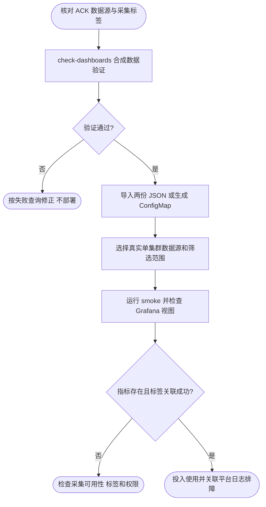

# ACK 容器与应用全视图监控

导入 [ACK · 容器概览](grafana/dashboards/foundation.json) 和 [ACK · 应用组件](grafana/dashboards/foundation-components.json)，选择已接入 ACK 默认监控的 Prometheus 数据源。两份面板分别使用 UID `ack-container-overview` 和 `ack-application-components`，不以历史面板为兼容目标。

## 页面规划

容器概览从存活与异常开始，依次展示工作负载 CPU/内存、节点整机资源、对象清单、应用黄金指标和采集可用性。应用组件页集中展示 Server/Client、SQL、Redis、Queue、Kafka、Job、Lock、OSS、缓存与 Go Runtime。

顶部支持 Pod、Node、Instance（Pod IP）、Container 四种视图；筛选包括命名空间、节点、Pod 和容器。应用组件按相同对象范围下钻。节点区始终是整机口径且只受节点筛选影响；工作负载区的 Node 视图仅汇总所选工作负载。完整的口径、标签与失败边界见 [面板说明](docs/dashboard.md)。

## ACK 接入

一个数据源对应一个集群，需具备 kube-state-metrics、kubelet/cAdvisor、node-exporter。默认 ACK 集成不保证所有可选指标启用；先看“采集可用性”区块，再检查缺失组件。核心指标有样本也不代表所有目标健康。

应用指标另外需要 namespace/container/pod_name 采集标签；若应用采集使用 pod，按面板说明修改隐藏 app_pod_label。基础设施区不依赖应用 target_info 或 foundation 标签。node-exporter 的 node 或 nodename 需与 Kubernetes 节点名匹配；虚拟节点可能没有整机指标。

直接导入两份 JSON 并选择真实数据源即可。共享入口示例：

```text
/d/ack-container-overview?var-namespace=orders&var-view=view_pod
```

数据源权限负责访问隔离；筛选项不是租户权限控制。文件 provisioning 应更新源 JSON 后同步，避免界面编辑被覆盖。

## 验证与打包

先确保 Docker 可用；以下命令均从仓库根目录执行：

```sh
# 合成 ACK 数据验证，不访问实际监控数据。
make -C deploy/observability check-dashboards

# 如已有包含 promtool 的本地容器，可复用，避免额外启动镜像。
make -C deploy/observability check-dashboards PROMTOOL_CONTAINER=foundation-observability-prometheus-1

# 仅生成 ConfigMap 和示例规则包装，不连接集群。
make -C deploy/observability render-kubernetes
```

打包产物位于 `/tmp/foundation-monitoring/dashboard.json` 和 `rules.yaml`。JSON 是面板源文件，不手改打包产物。`rules.yaml` 仍是原有示例应用告警，不是新 ACK 全视图面板的完整告警策略；部署前须按实际平台调整，不应因导入面板就直接启用告警。

真实联调需使用能直接访问 Prometheus HTTP API 的地址，可选传入能读取面板 API 的 Grafana 地址；认证按平台正常流程处理，不在仓库写入凭据：

```sh
make -C deploy/observability smoke \
  PROMETHEUS_URL=http://127.0.0.1:19090 \
  GRAFANA_URL=http://127.0.0.1:13000
```

此处地址仅示意已有的本地端口转发；必须指向具备 ACK 指标的服务。smoke 检查核心指标存在、资源与节点关联有结果、四种视图查询及可选的 Grafana JSON 导入，不代替浏览器变量插值和视觉验收。



## 本地应用示例的范围

现有 Compose 仍用于 Foundation HTTP、组件指标和示例告警体验，提供 Prometheus、Grafana、blackbox；它不是 ACK 集群，没有 kube-state-metrics/cAdvisor/node-exporter 的完整基础数据，不能用它验证新容器面板的数据完整性。启动、停止和配置检查入口仍为 `make -C deploy/observability up/down/check`，其工具和固定镜像见 Makefile。`check` 验证现有 Compose、Prometheus 与告警，不等于面板验证。

普通服务器的 [standalone.yaml](prometheus/standalone.yaml) 也是应用采集示例；新面板面向 ACK，不伪造普通进程的 Pod 和节点身份。Kubernetes ConfigMap 接入见 [Kubernetes 示例](../kubernetes/README.md)。

- [组件指标](docs/components.md)：启用条件与业务口径。
- [业务埋点](docs/business-metrics.md)：Counter、Histogram 与缓存指标接入。
- [外部采集](docs/external-metrics.md)：blackbox、Kafka Lag、MySQL；与节点/cAdvisor 基础指标不同。
- [排障](docs/troubleshooting.md)：标签、采集、查询与组件诊断。
- [components 示例](../../examples/components/README.md)：本地真实业务流量验证，不替代 ACK 联调。
