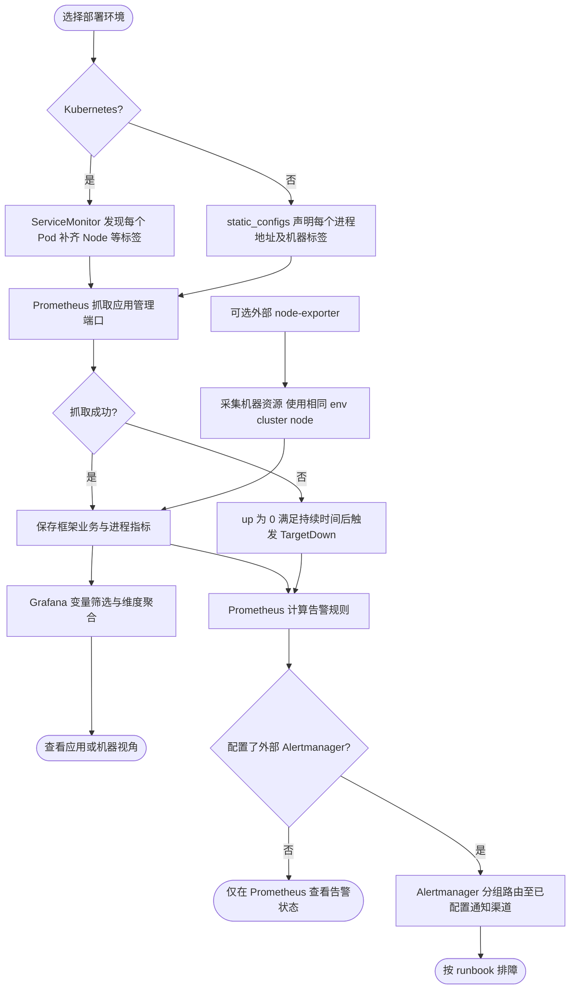

# 应用监控模板与本地部署

[应用总览](grafana/dashboards/foundation.json) 与 [组件排障明细](grafana/dashboards/foundation-components.json) 两份 Dashboard 同时用于 Kubernetes、普通服务器与本地开发。业务无需修改 Foundation 的 metrics 实现；Prometheus 在抓取时补齐部署身份标签，使 Go、进程、框架和业务指标具有相同的筛选维度。

## 本地完整体验

前置条件：Docker Engine/Compose 可用、网络能拉取镜像，宿主机 13000、18000、19001、19090 端口空闲。仓库根目录执行：

```sh
make -C deploy/observability check
make -C deploy/observability up
curl --fail http://127.0.0.1:18000/hello
curl --fail http://127.0.0.1:19001/readyz
```

打开 [Grafana 应用概览](http://127.0.0.1:13000/d/foundation-overview) 和 [Prometheus Targets](http://127.0.0.1:19090/targets)。本地 Grafana 使用匿名 Viewer，登录表单禁用；只绑定 loopback，便于直接查看。线上需接入现有 Grafana 认证和权限体系，不沿用本地匿名配置。文件 provisioning 的面板不允许 UI 保存修改；复制到业务 Grafana 后可另存。

首次构建下载 Go 依赖与镜像；示例固定 Prometheus v3.5.5、Grafana 12.3.11，作为验证基线，不声明为最新版本。更新版本后重新执行配置、规则和面板验证。Prometheus 每 15s 抓取，Grafana 每 30s 刷新；持续调用 `/hello` 产生业务流量，等待至少两次抓取，再查看速率图。

只启动应用、Prometheus、Grafana。没有部署 node-exporter、日志存储、链路后端或 Alertmanager，因此机器图表默认为空，告警在 Prometheus 中计算但不会发送通知。Compose 在 macOS/Windows 上运行于 Linux VM；即使额外部署 node-exporter，也不能把 Linux VM 指标当作宿主操作系统指标。

停止示例（保留卷中的历史数据）：

```sh
make -C deploy/observability down
```

## 普通服务器接入

在每个实例启动 `/metrics` 管理端口。以 [standalone.yaml](prometheus/standalone.yaml) 为普通 Prometheus 配置模板，和 [alerts.yaml](prometheus/alerts.yaml) 放在同一个配置目录，替换地址、env/cluster/namespace/app/node。`127.0.0.1` 只适合 Prometheus 与服务同一网络命名空间；若 Prometheus 在容器里，改成可达的主机地址。不要把负载均衡或反向代理地址当成实例地址，否则无法可靠区分实例。

多个 App 或实例各增加一个 static_configs 条目；同一机器上的多个 App 使用相同 node、不同 app/instance。非 K8s 使用 `namespace=standalone`、`pod=none`。在机器上已有 node-exporter 时启用对应抓取；其 env、cluster、node 必须与该机应用完全一致。机器图表关联失败时不会悄悄显示另一台机器。

应用 `/metrics` 是普通 HTTP 管理接口，不继承业务鉴权；限制为监控网络访问。现有 Prometheus 将这些 scrape_configs、规则文件路径合并到自己的配置，不覆盖已有采集任务。执行 `promtool check config` 后，通过已有运维流程重载。

## Kubernetes 接入

使用 [Kubernetes 文档](../kubernetes/README.md) 的 Deployment、ServiceMonitor 和 PrometheusRule 包装。无需额外部署第二套 Prometheus/Grafana。同一份 JSON 可人工导入，也可以包装成带 `grafana_dashboard=1` 的 ConfigMap，交给 kube-prometheus-stack 的 Grafana sidecar。

## 一份模板如何给各业务使用

建议优先保留共享 Dashboard，通过变量和 URL 保存各应用入口。例如：

```text
/d/foundation-overview?var-env=prod&var-cluster=cluster-a&var-namespace=orders&var-app=orders-api
```

其余变量保持 All。业务希望自定义面板时，导入 JSON、选择 Prometheus 数据源、**更换唯一 UID**、修改标题并保存默认 App。手动复制的 Dashboard 后续不会自动继承上游更新，需要按版本合并；重复使用同一个 UID 会覆盖原有面板。纯复用方可使用共享模板和链接，避免重复维护。

Grafana 的变量筛选不是租户隔离。Folder 权限控制面板访问；如要求各业务只能查询自己的数据，还需在数据源或监控后端实现权限与隔离，不能依靠隐藏 app 变量。

筛选含义、指标来源和聚合边界见 [面板说明](docs/dashboard.md)。



## 验证与维护

- `make -C examples/minimal test`：实际执行 HTTP handler，验证业务及框架指标名称/标签，并运行 race/vet。
- `make -C deploy/observability check`：Compose 语法、两份 Prometheus 配置、全部告警表达式和规则测试。
- `make -C deploy/observability smoke`：在本地 Compose 已启动后产生 10 个真实请求，核验就绪、目标标签、Grafana 导入以及四种聚合维度的全部查询。速率样本最多等待 45s；机器查询可执行不代表已采到机器数据。
- `make -C deploy/observability render-kubernetes`：由同一 JSON 和 alerts.yaml 生成 `/tmp/foundation-monitoring/dashboard.json`、`rules.yaml`，不连接集群；生成结果不手改，调整源文件后重生成。
- Dashboard 的每个查询应在实际 Prometheus 上执行；JSON 合法或 Grafana 接受导入不代表指标存在。机器图表还需在具有 node-exporter 的环境验证。

遵循官方 [Grafana provisioning](https://grafana.com/docs/grafana/latest/administration/provisioning/)、[变量](https://grafana.com/docs/grafana/latest/visualizations/dashboards/variables/) 与 [Prometheus 配置](https://prometheus.io/docs/prometheus/latest/configuration/configuration/) 约定。

组件观测已包含 Redis、Database、Kafka、Queue、Job、Client 和可选 Lock 包装的分区；启用条件与尚未覆盖的指标见 [组件指标说明](docs/components.md)。最小 Compose 继续只运行 HTTP 示例，不会自动创建这些业务依赖。

新增 Go Runtime、Config、Health、SQL、Queue Store、OSS、业务缓存及共享 Kafka Lag 分区。默认实例明细图例包含 App / Node / Pod / 地址，并始终保留环境、集群与命名空间。需要汇总时再选择App或Node；共享队列快照和Kafka位点有专门去重规则。

- [业务指标接入指南与可复用任务说明](docs/business-metrics.md)：构造、埋点、命名、Grafana查询及缓存命中率。
- [Ready/Health与Kafka外部采集](docs/external-metrics.md)：本地、普通Prometheus、Kubernetes配置。

本地Compose现在额外运行blackbox用于真实健康探测；业务示例仍仅HTTP。Kafka exporter是可选叠加配置，数据库/队列/OSS/缓存需业务实际接入后才产生样本。

完整的本地组件业务流量与预期/实际指标核验，见 [components 示例](../../examples/components/README.md)。该示例在当前监控项目增加独立 app，不影响最小模板的依赖范围。
