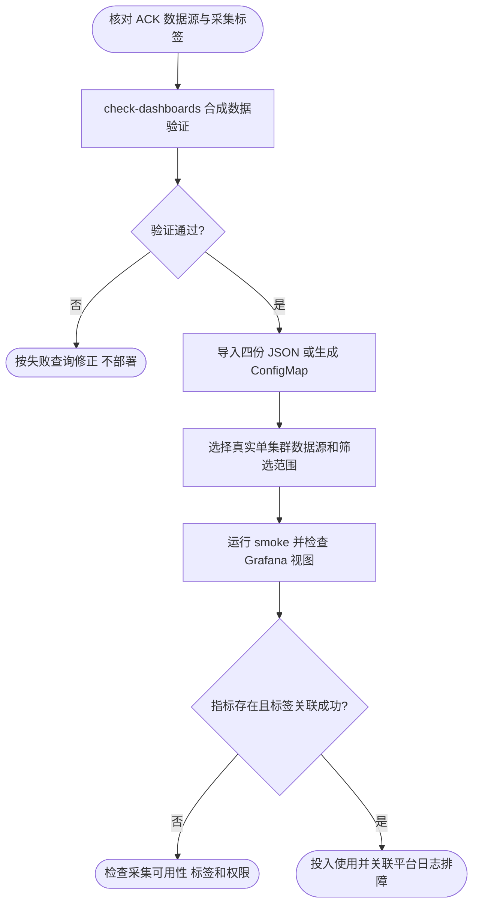

# Foundation 指标面板

导入下面四份 JSON 并选择 Prometheus 数据源。ACK 应用从“服务运行总览”进入，沿页面导航下钻；共享资源页可独立使用。

| 页面 | 回答的问题 | UID |
| --- | --- | --- |
| [服务运行总览](grafana/dashboards/foundation-service.json) | 流量、错误、延迟是否异常，哪些接口受影响？ | `ack-service-overview` |
| [容器与节点](grafana/dashboards/foundation.json) | Pod、部署副本或机器资源是否异常？ | `ack-container-overview` |
| [应用组件](grafana/dashboards/foundation-components.json) | 是连接池、缓存、消息、任务还是 Go 进程的问题？ | `ack-application-components` |
| [共享资源与健康](grafana/dashboards/foundation-shared.json) | 队列积压、Kafka Lag、实际 HTTP 探测是否异常？ | `foundation-shared-resources` |

## 页面规划

服务总览先展示 RED（速率、错误、耗时）和已发现应用 Pod 的就绪情况，再定位异常端点、采集失败与 Pod 关联缺失。容器与节点页优先显示采集条件及异常对象，资源详情折叠展示。组件页将使用量/容量、平均/P95/P99 等相关指标并列，减少重复图；共享页展示库存、位点差和真实探测结果。

前三页支持 Pod、Node、Instance（Pod IP）、Container 四种视图；应用指标按命名空间和应用隔离，切换 Node 视图仍保留应用身份。资源区不按 app 猜测 Kubernetes 对象归属：整机图只受节点筛选，Deployment 表只受命名空间和 Deployment 筛选。共享页使用自己的 env/cluster、逻辑队列、Kafka 集群/消费组/真实 Topic、探测应用筛选，不套用 Pod/Node 视图。导航保留时间和同名筛选。完整口径见 [面板说明](docs/dashboard.md)。

## ACK 接入

一个数据源对应一个集群，需具备 kube-state-metrics、kubelet/cAdvisor、node-exporter。默认 ACK 集成不保证所有可选指标启用；先看“采集可用性”区块，再检查缺失组件。核心指标有样本也不代表所有目标健康。

应用指标另外需要 namespace/app/container 和 pod_name 采集标签；若采集使用 pod，在可见的“应用 Pod 标签”选择 pod。All 可展示尚未附加 app 的旧指标，具体应用筛选需要真实 app 标签。基础设施区不依赖应用 target_info 或 foundation 标签。node-exporter 的 node 或 nodename 需与 Kubernetes 节点名匹配；虚拟节点可能没有整机指标。

导入四份 JSON 并选择真实数据源。应用入口示例：

```text
/d/ack-service-overview?var-namespace=orders&var-app=orders-api&var-view=view_pod&var-app_pod_label=pod
```

数据源权限负责访问隔离；筛选项不是租户权限控制。文件 provisioning 应更新源 JSON 后同步，避免界面编辑被覆盖。

## 验证与打包

先确保 Docker 可用；以下命令均从仓库根目录执行：

```sh
# 空样本语法及非空 ACK/组件/共享资源样本验证，不访问实际监控数据。
make -C deploy/observability check-dashboards

# 如已有包含 promtool 的本地容器，可复用，避免额外启动镜像。
make -C deploy/observability check-dashboards PROMTOOL_CONTAINER=foundation-observability-prometheus-1

# 仅生成 ConfigMap 和示例规则包装，不连接集群。
make -C deploy/observability render-kubernetes
```

打包产物位于 `/tmp/foundation-monitoring/dashboard.json` 和 `rules.yaml`；ConfigMap 包含四份面板。JSON 是面板源文件，不手改打包产物。`rules.yaml` 仍是原有示例应用告警，不是面板的完整告警策略；部署前须按实际平台调整，不应因导入面板就直接启用告警。

真实联调需使用能直接访问 Prometheus HTTP API 的地址，可选传入能读取面板 API 的 Grafana 地址；认证按平台正常流程处理，不在仓库写入凭据：

```sh
make -C deploy/observability smoke \
  PROMETHEUS_URL=http://127.0.0.1:19090 \
  GRAFANA_URL=http://127.0.0.1:13000 \
  APP_POD_LABEL=pod \
  COMPONENTS=server,sql,redis,queue,go
```

此处地址仅示意已有的本地端口转发；必须指向具备 ACK 指标的服务。`COMPONENTS` 只填写已启用的组件，可选值为 server/client/sql/redis/cache/queue/kafka/job/lock/oss/go/queue-stats/kafka-lag/probe，逗号分隔。指定后要求代表指标及面板关联有有效非空结果；Queue/Kafka 支持仅 Producer 或仅 Consumer。未指定的组件明确报告“未验证”，不能把空图当接入成功。`APP_POD_LABEL` 默认 pod_name，可选 pod。smoke 还检查核心指标、四种视图查询和可选的 Grafana JSON 导入，不代替浏览器插值及视觉验收。


```mermaid
flowchart TD
    A([核对 ACK 数据源与采集标签]) --> B[check-dashboards 合成数据验证]
    B --> C{验证通过?}
    C -- 否 --> D([按失败查询修正 不部署])
    C -- 是 --> E[导入四份 JSON 或生成 ConfigMap]
    E --> F[选择真实单集群数据源和筛选范围]
    F --> G[运行 smoke 并检查 Grafana 视图]
    G --> H{指标存在且标签关联成功?}
    H -- 否 --> I([检查采集可用性 标签和权限])
    H -- 是 --> J([投入使用并关联平台日志排障])
```

## 本地应用示例的范围

现有 Compose 仍用于 Foundation HTTP、组件指标和示例告警体验，提供 Prometheus、Grafana、blackbox；它不是 ACK 集群，没有 kube-state-metrics/cAdvisor/node-exporter 的完整基础数据，不能用它验证新容器面板的数据完整性。启动、停止和配置检查入口仍为 `make -C deploy/observability up/down/check`，其工具和固定镜像见 Makefile。`check` 验证现有 Compose、Prometheus 与告警，不等于面板验证。

普通服务器的 [standalone.yaml](prometheus/standalone.yaml) 也是应用采集示例；前三页面向 ACK，不伪造普通进程的 Pod 和节点身份。共享页可以在标签契约满足时单独使用；库存和外部采集配置见 [外部采集说明](docs/external-metrics.md)。Kubernetes ConfigMap 接入见 [Kubernetes 示例](../kubernetes/README.md)。

- [组件指标](docs/components.md)：启用条件与业务口径。
- [业务埋点](docs/business-metrics.md)：Counter、Histogram 与缓存指标接入。
- [外部采集](docs/external-metrics.md)：blackbox、Kafka Lag、MySQL；与节点/cAdvisor 基础指标不同。
- [排障](docs/troubleshooting.md)：标签、采集、查询与组件诊断。
- [components 示例](../../examples/components/README.md)：本地真实业务流量验证，不替代 ACK 联调。
