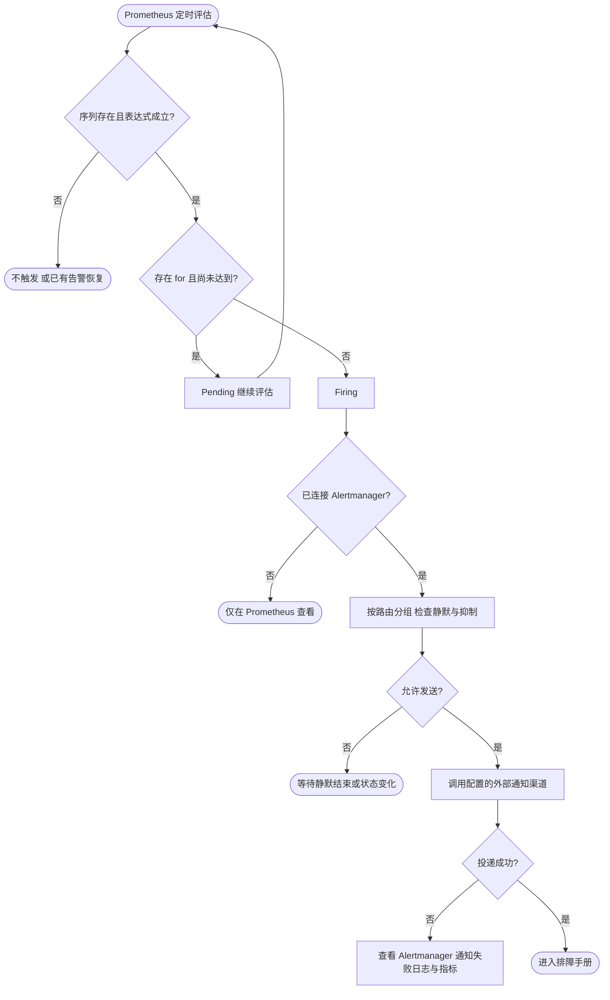

# 告警规则与通知接入

[alerts.yaml](../prometheus/alerts.yaml) 是普通 Prometheus 和 Kubernetes PrometheusRule 的唯一规则源；[规则测试](../prometheus/alerts.test.yaml) 随规则一起维护。阈值是演示基线，业务应按流量、SLO、硬件和维护窗口调整。

| 告警 | 条件 | 持续时间 | 处理入口 |
| --- | --- | --- | --- |
| FoundationTargetDown | 已发现应用目标 up=0 | 2m | 抓取端口、进程、网络、Targets 错误 |
| FoundationHighServerErrorRate | App 5xx >5%，5m 请求至少 100 | 5m | 发布变更、错误分布、依赖 |
| FoundationHighLatency | App P95 >500ms，5m 请求至少 100 | 10m | 慢接口、资源、外部调用 |
| FoundationNodeCPUHigh | 应用所在机器 CPU >90% | 15m | 机器进程分布、竞争 |
| FoundationNodeMemoryHigh | 应用所在机器内存使用 >90% | 10m | 可用内存、OOM、进程 RSS |
| FoundationNodeDiskLow | 应用所在机器根分区可用 <10% | 15m | 磁盘、日志及保留策略 |

应用错误率和延迟按 env/cluster/namespace/app 聚合，先聚合计数或桶再求比值或分位数。低流量抑制减少少量请求造成的噪声，也意味着低流量关键业务需要自己的成功事件/端到端探测告警。机器告警按 env/cluster/node 聚合且只匹配应用目标所在的机器；不重复为同机每个 App 发一条告警。

## 尚不代表的保证

- up=0 只覆盖仍在服务发现中的失败目标。所有 Pod 被删除、Deployment 缩为零或采集配置误删时，不能靠它发现服务整体消失。K8s 应保留 kube-prometheus-stack 的 Deployment 副本不可用等告警；普通环境针对已知必需 App 配置独立 absent/心跳规则。
- up=1 不等于 `/readyz` 成功。需要端到端可用性时，本模板新增 blackbox exporter 实际探测 /readyz、/healthz；探测结果 probe_success 和探测采集 up 分别告警。
- node-exporter 不存在或标签不匹配时机器规则无数据，不自动告警。保留已有 exporter 存活监控。
- 当前请求延迟最大有限桶是 1s；不应直接把模板阈值改为 5s/10s 后期待可靠长尾判断。
- 配置长期无更新本身不是故障；因此不按 last_success 的年龄报警。订阅过载结束后计数仍在，但 increase 窗口结束会恢复；恢复告警不代表订阅已自动恢复。
- 应用 CPU、内存没有统一可用的“使用百分比”阈值。Pod limits、OOM、CPU throttling 使用已有 kubelet/cAdvisor 与 kube-state-metrics 规则。

## 接入通知

本地 Compose 只计算规则，可在 Prometheus Alerts 页面看到 pending/firing，不发送任何外部消息。K8s 的 PrometheusRule 由现有 Prometheus 评估，通知复用现有 Alertmanager 配置。

普通 Prometheus 在现有配置增加 alerting.alertmanagers，指向实际 Alertmanager 地址；之后在 Alertmanager 路由里根据 env、app、severity 分组。建议应用告警按 alertname/env/cluster/namespace/app 分组，机器告警按 alertname/env/cluster/node 分组；业务团队负责接收人、静默、升级和重复提醒间隔。模板不提供真实接收人或凭据。

每条告警的 `runbook` 注解为仓库相对文档定位。发布前可换成团队可访问的文档 URL，或由接收模板拼接仓库 URL；它不是已经可点击的绝对 runbook_url。应用名也可以用于生成带 var-app 的 Dashboard 链接，但需同时包含 env/cluster/namespace，避免同名应用混淆。

规则变更后在仓库根目录运行 `make -C deploy/observability check`；通过不代表业务阈值合理或通知渠道已联通。参见 [Prometheus 告警规则](https://prometheus.io/docs/prometheus/latest/configuration/alerting_rules/)。

## 组件告警

新增六条规则：Kafka/Queue 消费运行时故障、Job 执行失败、Lock 续租失败、Redis 池等待超时和 Database 连接池持续饱和。前五条检查 5m 内计数增长，不另加 for；DB 对每个实例连接池使用数/正数上限大于 90% 持续 10m 报警，排除无限上限。按 app 与组件身份保留归因；DB 保留 instance 等原始标签。

这些是演示告警基线：不对 TryLock 普通竞争、Redis key 不存在、未接入的组件或单纯无流量报警。5m 窗口结束后恢复并不证明业务已自动恢复；任务执行失败是否需要立即通知应由业务等级决定。新 Counter 首次出现时若已经非零，`increase` 无法还原出现前的变化；稀疏的一次性任务需配合业务结果/日志告警。详见 [组件排障](troubleshooting.md#组件告警) 与 [指标边界](components.md)。

新增状态规则：健康探测失败1m、探测结果不可采集2m、Queue统计失败2m、配置watcher停止2m；Queue最老就绪年龄>300s持续5m、Kafka消费组Topic Lag>1000持续10m。后两项为业务需调整的演示阈值。Redis大队列年龄未知时不会触发年龄规则，需要同时查看age_known；缺失的exporter/完全消失的采集目标仍需平台目标存在性规则。
