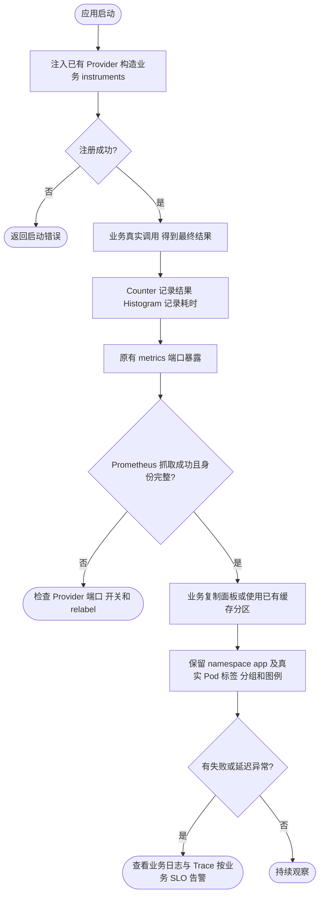

# 业务指标接入指南

业务无需创建第二个 Prometheus Registry 或新增监听端口：注入 Foundation 已有的 `metrics.Provider`，构造期创建 instrument，在业务结果处记录，指标会随当前应用的 `/metrics` 一起暴露。最小可运行例子见 [greetingService](../../../examples/minimal/cmd/api/service.go) 和它的 [HTTP 指标测试](../../../examples/minimal/cmd/api/service_test.go)。

## 1. 先定义指标语义

| 要回答的问题 | 类型 | 示例 |
| --- | --- | --- |
| 完成了多少次、成功或失败多少次 | Counter | business_orders_total{operation,result} |
| 操作需要多久、P95/P99 是多少 | Histogram | business_order_duration_seconds{operation,result} |
| 当前有多少任务、库存或连接 | Gauge / ObservableGauge | business_pending_orders |
| 缓存有效命中多少、回源多久 | 已封装 CacheMetrics | business_cache_lookups_total、business_cache_load_duration_seconds |

标签使用固定枚举：operation=create/cancel，result=success/error。禁止订单 ID、用户 ID、原始 URL/SQL、错误原文或无限增长的租户列表。job/instance 由 Prometheus 抓取配置附加；namespace/app/环境/Node/Pod 按平台采集约定配置，面板按应用筛选要求目标提供 app，业务不要重复声明 `app`、`instance`、`job` 等目标标签。

命名包含业务前缀、基础单位（秒/字节）和计数后缀；实际导出名称需通过 `/metrics` 确认，OTel 会规范化点号和单位。Histogram 的有效边界要能支持业务 SLO；秒值不能填入毫秒数。Foundation Provider 为 Unit 为 `s` 的 OTel Histogram 应用统一 View，26 个有限桶覆盖 0.0001～86400 秒，并覆盖 instrument 的 `WithExplicitBucketBoundaries` 建议；示例复用该布局。非秒单位、未声明单位及原生 Prometheus collector 不受此 View 影响，应分别核对真实桶。完整边界、长尾限制和滚动升级混桶风险见 [Metrics 文档](../../../pkg/metrics/README.md#秒单位直方图)。

## 2. 构造期注册，业务边界记录

以下是可编译的业务观测类型，放入消费项目的业务包。构造时传入已有 Provider；不要每次请求新建 Provider，也不要每次请求注册 callback。

```go
package business

import (
    "context"
    "time"

    "github.com/jaggerzhuang1994/kratos-foundation/v2/pkg/metrics"
    "go.opentelemetry.io/otel/attribute"
    "go.opentelemetry.io/otel/metric"
)

// OrderMetrics 由业务服务持有，与应用 Provider 共享生命周期。
type OrderMetrics struct {
    count metric.Int64Counter
    duration metric.Float64Histogram
}

// NewOrderMetrics 使用已有 Provider 注册订单观测，不另建资源。
func NewOrderMetrics(provider metrics.Provider) (*OrderMetrics, error) {
    meter := provider.Meter("example.com/orders")
    count, err := meter.Int64Counter("business_orders_total")
    if err != nil { return nil, err }
    // 秒单位 Histogram 由 Provider 的统一 View 决定有效桶。
    duration, err := meter.Float64Histogram("business_order_duration_seconds", metric.WithUnit("s"))
    if err != nil { return nil, err }
    return &OrderMetrics{count: count, duration: duration}, nil
}

// RecordCreate 应在创建订单的最终结果处调用一次，不在内部每次重试重复调用。
func (m *OrderMetrics) RecordCreate(ctx context.Context, started time.Time, err error) {
    result := "success"
    if err != nil { result = "error" }
    attrs := metric.WithAttributes(attribute.String("operation", "create"), attribute.String("result", result))
    m.count.Add(ctx, 1, attrs)
    m.duration.Record(ctx, time.Since(started).Seconds(), attrs)
}
```

在真正处理结果的边界记录，传入当前请求 Context。业务失败日志和 Trace 同样由该边界处理；不要将错误文本变成指标标签。Counter 无事件时可能没有序列，别为了“显示正常”编造成功事件。

Provider cleanup 由原有 Wire 组装层负责；本例 instruments 没有独立 cleanup。ObservableGauge 如果注册 callback，必须持有 Registration，先 Unregister，再释放 callback 借用的资源，最后关闭 Provider；回调不做无界查询或无法取消的 I/O。

## 3. Prometheus 确认采集

在消费项目实际管理端口执行 `curl -fsS http://127.0.0.1:9001/metrics`，确认业务名称、单位、标签；再到 Prometheus 查询 `business_orders_total`，确认 namespace、app、container 及真实 Pod 标签能与 `kube_pod_info` 的 namespace/pod 关联。面板显式的 `app_pod_label` 可选 `pod_name` 或 `pod`，默认 `pod_name`；All 可以查看缺少 app 的旧序列，选择具体应用要求目标提供 app。

当前 ACK 面板需要真实 Kubernetes 身份，不使用本地示例 target 标签。app 由采集端附加，业务 instrument 不重复声明它。所有实例必须直接采集，不能把业务负载均衡地址作为唯一采集目标。

## 4. 展示到 Grafana

[服务运行总览](../grafana/dashboards/foundation-service.json)、[组件详情](../grafana/dashboards/foundation-components.json)、[容器与节点资源](../grafana/dashboards/foundation.json)和[共享资源](../grafana/dashboards/foundation-shared.json)分别对应运行状态、调用细节、实例资源及共享库存。共享面板自动发现已有变量候选，但不会推断任意业务指标的含义和图表类型。业务可复制适合的 JSON、更换 `uid` 和标题后导入自己的 Folder；保留 datasource、namespace、app、app_pod_label 与对象身份变量，再新增图表。不要复用原 UID 覆盖公共模板，文件 provisioning 的面板修改应回写源 JSON。

下面是独立业务图表的固定容器明细示例，前提是指标具有 namespace/app/container 和所选 Pod 标签。使用现有 namespace、app、pod、container、app_pod_label 变量；这两个片段不随 view 切换，也不关联 node。需要完整四视图时，复制当前请求速率/P95 的 Pod 元数据关联和视图表达式，再替换指标名与业务标签；即使切换 Node 视图，也要保留 namespace/app 分组。

请求速率：

```promql
sum by (namespace,app,container,${app_pod_label:raw},operation,result) (
  rate(business_orders_total{namespace=~"${namespace}",app=~"${app}",${app_pod_label:raw}=~"${pod}",container=~"${container}"}[$__rate_interval])
)
```

P95（单位设为 seconds）：

```promql
histogram_quantile(0.95, sum by (le,namespace,app,container,${app_pod_label:raw},operation) (
  rate(business_order_duration_seconds_bucket{namespace=~"${namespace}",app=~"${app}",${app_pod_label:raw}=~"${pod}",container=~"${container}"}[$__rate_interval])
))
```

图例设为 `{{namespace}} / {{app}} / {{${app_pod_label:raw}}} / {{container}} / {{operation}} / {{result}}`，P95 无 result 时移除末尾。先对每条 Counter 求 rate 再聚合，先合并 Histogram 桶再算分位数；禁止 sum(rate) 的总量直接称作平均延迟、平均多个 P95、或相加多个进程重复读取的共享库存 Gauge。

低频业务事件用所选窗口 `increase` 的即时结果表或柱状图，避免只展示几乎一直为零的每秒速率。状态值用状态时间线，连接/容量用组合图，端点表合并 QPS、错误率和分位数；数据链接携带 datasource、namespace、app、对象筛选和时间范围，从真实保留的身份标签下钻，不能从视图拼接文本猜测 Pod。共享库存按同一逻辑 Store 去重，与应用处理速率分开；颜色表示结果或数值变化，不代替业务 SLO。

错误率需以错误请求数除总请求数：已有成功流量而从未出现错误标签时，用相同分组的 `0 * 总量` 补错误分子；无总流量时保留空值。可复制模板 Client 分区的完整公式，替换指标和结果标签，不要使用无条件 `or vector(0)` 掩盖抓取故障。

## 5. 业务缓存命中率

构造时 `cacheMetrics, err := metrics.NewCacheMetrics(provider, "products")`，检查错误后注入缓存业务层：

- 确认有效缓存值：`cacheMetrics.Hit(ctx)`。
- key 不存在、已过期或业务认为不可用：`cacheMetrics.Miss(ctx)`。
- Redis 网络、认证或读取失败：`cacheMetrics.Error(ctx)`，不算普通 miss。
- 实际回源完成：`cacheMetrics.Load(ctx, time.Since(started), err)`；并发请求合并时只由实际回源的一方记录。

缓存写入成功不算命中；需要区分写失败时另建固定操作指标。通用 helper 不替业务决定降级、回源、写入或并发策略。面板已有“业务缓存”分区，指标产生后选择 cache_name 即可展示，无须再次复制图表。


```mermaid
flowchart TD
    A([应用启动]) --> B[注入已有 Provider 构造业务 instruments]
    B --> C{注册成功?}
    C -- 否 --> D([返回启动错误])
    C -- 是 --> E[业务真实调用 得到最终结果]
    E --> F[Counter 记录结果 Histogram 记录耗时]
    F --> G[原有 metrics 端口暴露]
    G --> H{Prometheus 抓取成功且身份完整?}
    H -- 否 --> I([检查 Provider 端口 开关和 relabel])
    H -- 是 --> J[业务复制面板或使用已有缓存分区]
    J --> K[保留 namespace app 及真实 Pod 标签 分组和图例]
    K --> L{有失败或延迟异常?}
    L -- 是 --> M([查看业务日志与 Trace 按业务 SLO 告警])
    L -- 否 --> N([持续观察])
```

## 可复用的接入任务说明

可以把下段作为消费项目 AI 工具的任务说明或本地 skill 内容，不依赖全局安装：

> 为当前业务接入 Foundation 指标。先读本项目 AGENTS.md、Makefile 和 Foundation 的 metrics/业务指标指南，列出指标事件、单位、有效桶、固定标签、SLO 与清理顺序；确认 Unit 为 s 的 OTel Histogram 统一 View 会覆盖 instrument 建议桶。复用已有 Provider，在构造期创建 instrument，禁止业务 ID/原始错误/SQL 标签。为真实成功、失败及无流量情况验证导出；根据 Counter/Histogram/Gauge 的实际语义新增 Grafana 图表，复用 kube_pod_info 对象关联及 namespace/app/pod/container 筛选、可见 app_pod_label 和四种 view；Node 聚合仍保留应用身份，图例可区分实例。共享状态 Gauge 去重，不累加；不要伪造未接入的指标。同步中文使用说明和流程图，运行本项目相关测试与 PromQL 校验，报告实际验证和未联调项。

参考：[Prometheus 指标设计](https://prometheus.io/docs/practices/instrumentation/)、[指标类型](https://prometheus.io/docs/concepts/metric_types/)。
