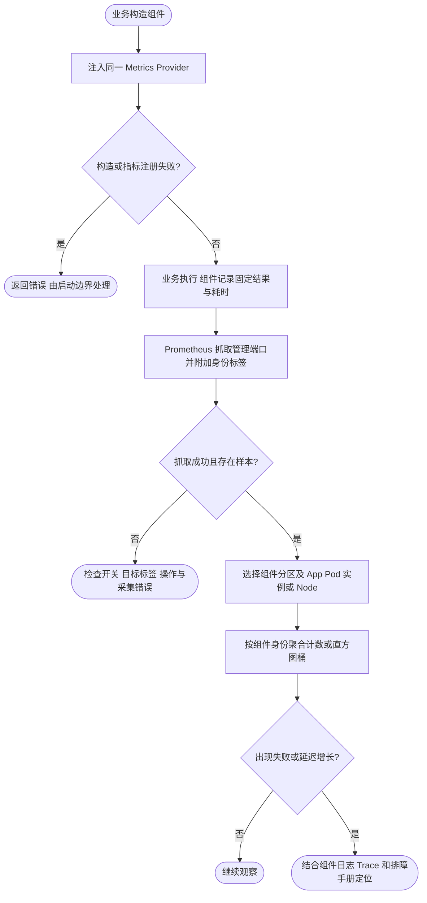

# 组件指标与面板接入

[同一 Dashboard](../grafana/dashboards/foundation.json) 的折叠分区复用 datasource、env、cluster、namespace、app、node、pod、instance 和 group_by。普通 Prometheus 与 Kubernetes 使用相同 JSON；业务可以更换 UID 后复制到自己的 Folder，也可以共享面板并保存带筛选的 URL。数据源权限仍需单独管理。

采集前提：组件与 HTTP `/metrics` 共用同一个 `metrics.Provider`，组件观测没有被关闭，采集目标附带 `foundation="true"` 及身份标签，且操作实际发生。只创建 Counter/Histogram 不一定立即生成样本；速率至少需要两次抓取，不能把 No data 显示成成功或零错误。本地最小示例没有接入下表组件，新增分区留空是正常现象；业务接入之后自动展示。

| 分区 | 当前指标与额外筛选 | 启用方式与边界 |
| --- | --- | --- |
| Client | client_requests_code_total、client_requests_seconds；operation/kind | 使用 Foundation Client Factory，middleware.metrics.disable 未开启。任意 net/http 或第三方 SDK 不会自动覆盖 |
| Database | go_sql_*；db_name | NewManager 注入 Provider，database.metrics.disable 未开启；所有已创建连接池。使用中、空闲、最大连接、等待速率和平均等待时间；新增 database_sql_operations_total / database_sql_operation_duration_seconds 记录 GORM 操作尝试与耗时 |
| Redis | db_client_connections_*；redis_connection/pool_name/state/type/status | Redis Manager 创建的 client 且 redis.metrics.disable 未开启；当前 redisotel v9.17.2，观察应用客户端，不是 Redis server |
| Kafka | kafka_producer_*、kafka_consumer_*；kafka_destination/kafka_consumer/kafka_result | 使用包提供的 Producer/Runtime，并注入 Observability 的 Metrics/Tracing；绕过封装的原生 SDK 调用不包含这些业务计数 |
| Queue | queue_producer_*、queue_consumer_*；queue_destination/queue_consumer/queue_result | 使用 Queue/Worker 并注入 Observability；派发、处理尝试、最终结果、重试、失败归档和运行时故障 |
| Job | job_runs_total、job_duration_seconds、job_running；exported_job/status | Manager 注入 Provider；默认启用，可由 job.WithMetrics(false) 关闭。只统计已进入执行的任务，跳过和等待不等于执行失败 |
| Lock | lock_operations_total、lock_operation_duration_seconds、lock_released_hold_duration_seconds；lock_name/operation/result | 业务构造时显式用 lock.WithMetrics 包装原 Locker，再注入业务，见 [Lock 文档](../../../pkg/lock/README.md) |

Redis 新增 redis_connection 标签保留配置连接身份，解决多个 client 共用地址时样本无法区分的问题。旧版本序列没有该标签，按 All 可查看旧数据，按具体连接只展示新数据。使用多个进程时，应先按 instance 排障，再切到 app 汇总。

Job 的原始指标标签名是 `job`，Prometheus 抓取也有 `job` 标签。模板统一 `honor_labels: false`，所以任务名成为 `exported_job`；不要修改成 honor_labels=true 来迁就图表，否则可能破坏目标身份。组件产生的 `operation` 仅由各自分区使用；顶层接口筛选只影响 Server 和 Client。

## 口径与单位

- 所有 P95 都先合并所选分组的桶再计算；不平均各实例 P95。无操作时留空。Server/Client 的最大有限桶为 1 秒，不能精确区分更长尾延迟。Kafka/Queue 采用当前 OTel SDK 默认桶，业务有明确 SLO 时应单独设计边界。
- DB 等待时间来自 sql.DB 池等待累计时间，除以等待次数；不是查询耗时。利用率先按每个实例计算，再取分组最大值，避免总量稀释局部耗尽；上限为 0 的无限池被排除。
- MySQL 还暴露默认连接的 `gorm_status_<variable>` 快照（prefix 可配置），但当前采集执行 `SHOW STATUS`，部分值属于会话；失败会保留旧快照。不能据此宣称全库 QPS 或采集实时成功，因此通用面板不添加这些推测性曲线。
- Redis `use_time_milliseconds` 的桶和结果来自命令/pipeline hook；pipeline 每批一次，不能当消息数或命令总数。单位毫秒；建连耗时同样是毫秒。池 waits_duration_nanoseconds 累计纳秒，平均等待在面板换算为秒。
- Redis SDK 将池 waits/timeouts/hits/misses 以 Gauge 暴露，但值是客户端存活期间的累计数；模板按单调计数的变化计算速率，client 重建归零。hits/misses 表示连接池复用，不是缓存命中率。status=error 包含 redis.Nil（key 不存在），所以没有默认配置“Redis 非成功比例过高”告警。
- Kafka/Queue 生产消息计数按消息数，生产耗时按调用；消费最终结果、每次 handler 尝试、重试、失败归档、运行时故障分别观察。Queue failed_tasks 的 result=success 表示失败任务归档成功，绝不是任务执行成功；Kafka dead_letters 的 success 表示死信投递成功。它们都不等于积压或业务成功率。
- Lock 获取耗时包含底层等待与重试。TryLock contended 是正常竞争；timeout 无法单独区分锁竞争和 Redis 超时。持有时长只在成功 Unlock 返回时采样，不覆盖已过期、释放失败或进程崩溃，不能生成可信的“当前持有锁数量”。

## 其他能力与后续缺口

已经可以接入的公共指标还有进程 CPU/RSS、Go 堆/GC/goroutine，以及配置 watcher 存活、版本、接受/拒绝、订阅过载、队列深度和回调耗时。当前概览已经展示其中一部分；`metrics.Provider` 也允许业务注册自己的低基数 Counter、Histogram 和 Gauge。

以下能力已补入可选采集或接入示例；必须完成对应组装，面板才有真实数据：

| 能力 | 可补的指标 | 数据来源与边界 |
| --- | --- | --- |
| OSS | oss_requests_total、oss_request_duration_seconds、oss_transferred_bytes_total、oss_streams_total、oss_stream_duration_seconds | oss.WithMetrics 包装 Manager；请求和流分开；字节为实际 Reader 消费量，包含预读和重放，不等于物理网络流量；下载流 Close 后统计完成结果 |
| SQL 慢操作 | database_sql_slow_operations_total、database_sql_slow_threshold_seconds | 有效 GORM slow_threshold，默认 200ms；0s 禁用。按连接和操作统计，无 SQL 文本标签；计数不等于日志行数，详见 Database README |
| SQL 执行 | database_sql_operations_total、database_sql_operation_duration_seconds | 跟随 Database 指标开关的 GORM 回调；含框架回调处理，不覆盖原生 sql.DB、事务控制语句或游标后续扫描 |
| Redis 业务缓存 | business_cache_lookups_total、business_cache_loads_total、business_cache_load_duration_seconds | metrics.NewCacheMetrics 由业务调用 Hit/Miss/Error/Load，缓存分区可直接展示，不能从连接池 hits/misses 推导 |
| Kafka | kafka_consumergroup_lag | 可选 Kafka exporter 示例、抓取配置和 Lag 分区；按共享 Kafka 集群/消费组/Topic/分区，不受 App/Pod 筛选；Broker 磁盘/ISR 仍需独立采集 |
| Queue | queue_tasks、queue_oldest_ready_age_seconds、queue_stats_collection_success、queue_stats_oldest_ready_known | 显式 queue.RegisterStats；数据库单条聚合、Redis只读Lua。Redis ready候选>1000时年龄未知并省略；要求context_timeout_enabled:true。共享快照用max去重不累加 |
| Job 调度 | 跳过、调度等待、续租丢失 | 在实际调度/协调状态切换处埋点；已有 running 不能推导跳过次数 |
| Kubernetes | Pod working set、CPU throttling、重启、OOM、期望/就绪副本 | kubelet/cAdvisor 与 kube-state-metrics；普通服务没有这些概念 |

Job 调度跳过/等待与 Kubernetes 专属资源仍需分别接入对应采集。业务自定义指标和缓存接入步骤见 [业务指标指南](business-metrics.md)，健康和 Kafka 部署见 [外部采集](external-metrics.md)。

指标维度与开销设计可参照 [Prometheus 埋点规范](https://prometheus.io/docs/practices/instrumentation/)；服务端基础设施的独立采集见 [Prometheus Exporter 列表](https://prometheus.io/docs/instrumenting/exporters/)，需逐项确认部署版本与权限。

Queue 数量属于共享 Store 快照，推荐单独选择一个采集实例，或对同一 app/queue_destination 使用 max 去重；不同 Store 必须使用不同逻辑队列名。数据库聚合可能扫描队列表，设置采集超时并按规模调整频率。Redis 年龄不可用时不是零等待；不要只看年龄告警而忽略采集成功与年龄可用性。

Go Runtime 新分区展示线程、VMS/RSS、堆/栈、对象与分配速率、GC频率/平均暂停/CPU估计开销、调度P95。配置状态指标及 Config 分区已移除；来源错误查看官方 Config 日志，热更新生效情况通过组件日志与实际参数验证。

本地可复现实测见 [components 示例](../../../examples/components/README.md)。Queue 空轮询产生的 `redis.Nil` 也会计入 SDK 非成功返回，空闲时比例可能接近 100%；应结合 `error_type`、连接超时与 Queue 运行时错误判断，不能据此认定 Redis 服务故障。
