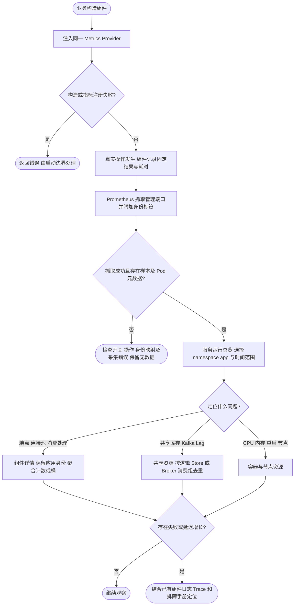

# 组件指标与面板接入

[应用组件详情](../grafana/dashboards/foundation-components.json)用于定位具体端点、连接池、消费者和任务。先在[服务运行总览](../grafana/dashboards/foundation-service.json)查看请求、错误、延迟、就绪副本和采集状态，再进入详情；CPU、内存、重启和节点资源见[容器与节点资源](../grafana/dashboards/foundation.json)，Queue 库存及 Kafka Lag 见[共享资源](../grafana/dashboards/foundation-shared.json)。四页之间的链接保留可共用的筛选和时间范围。

组件页复用 datasource、view、namespace、app、node、pod、container，通过 `kube_pod_info` 关联节点/IP，支持 Pod、Node、Instance（Pod IP）、Container 四种视图。应用指标需附加 namespace/container 和稳定的 app 身份；显式的“应用 Pod 标签”变量 `app_pod_label` 可选 `pod_name` 或 `pod`，默认 `pod_name`，与真实采集标签一致。所有应用聚合保留 namespace/app；Node 视图也不会把不同应用合为一条曲线。app 候选来自有非空 app 标签的 `up`；All 允许旧指标缺少 app，选择具体应用则要求目标提供该标签。数据源权限仍需单独管理，普通非 Kubernetes 采集不适用此关联；缺少匹配 Pod 元数据的应用序列不会进入组件图。

采集前提：组件与 HTTP `/metrics` 共用同一个 `metrics.Provider`，组件观测没有被关闭，采集目标身份标签与筛选匹配，且操作实际发生。只创建 Counter/Histogram 不一定立即生成样本；速率至少需要两次抓取，不能把 No data 显示成成功或零错误。本地最小示例没有接入全部组件，未接入分区留空是正常现象；业务接入之后才有数据。

## 分区与启用条件

| 分区 | 当前指标与额外筛选 | 启用方式与边界 |
| --- | --- | --- |
| Server | server_requests_code_total、server_requests_seconds；operation/kind | Foundation HTTP/gRPC unary 指标中间件；不保证覆盖 panic、前置 Deadline 拒绝、直接 ResponseWriter 写出的状态码；gRPC Stream、WebSocket 生命周期不在此统计内 |
| Client | client_requests_code_total、client_requests_seconds；operation/kind | 使用 Foundation Client Factory 且 middleware.metrics.disable 未开启；HTTP 只有 Invoke 经过指标中间件，直接 Do 绕过；gRPC Stream、任意 net/http 或第三方 SDK 不自动覆盖 |
| Database | go_sql_*、database_sql_operations_total、database_sql_operation_duration_seconds；db_name | NewManager 注入 Provider，database.metrics.disable 未开启；池指标覆盖已创建连接池，SQL 指标来自 GORM 回调，含回调处理，不覆盖原生 sql.DB、事务控制语句或游标后续扫描 |
| Redis | db_client_connections_*；redis_connection/pool_name/state/type/status | Redis Manager 创建 client 且 redis.metrics.disable 未开启；redisotel v9.17.2 观察应用客户端，不是 Redis server；建连与命令/pipeline 分开 |
| Cache | business_cache_lookups_total、business_cache_loads_total、business_cache_load_duration_seconds；cache_name | 业务调用 metrics.NewCacheMetrics 的 Hit/Miss/Error/Load；不能从 Redis 连接池复用推导缓存命中率 |
| Kafka | kafka_producer_*、kafka_consumer_*；kafka_destination/kafka_consumer/kafka_result | 使用包提供的 Producer/Runtime 并注入 Observability 的 Metrics/Tracing；原生 SDK 调用不在封装业务计数内，提交和自动恢复结果尚无独立指标 |
| Queue | queue_producer_*、queue_consumer_*；queue_destination/queue_consumer/queue_result | 使用 Queue/Worker 并注入 Observability；派发、领取执行、处理尝试、重试、失败归档、运行时故障分别观察；库存另需显式 RegisterStats |
| Job | job_runs_total、job_duration_seconds、job_running、job_triggers_skipped_total、job_pending、job_wait_duration_seconds；exported_job/status/reason/result | Manager 注入 Provider；默认启用，可由 job.WithMetrics(false) 关闭。执行结果与准入跳过、等待分开解释 |
| Lock | lock_operations_total、lock_operation_duration_seconds、lock_released_hold_duration_seconds；lock_name/operation/result | 构造时显式 lock.WithMetrics 包装原 Locker 后注入业务，见 [Lock 文档](../../../pkg/lock/README.md) |
| OSS | oss_requests_total、oss_request_duration_seconds、oss_transferred_bytes_total、oss_streams_total、oss_stream_duration_seconds；bucket/operation/result | 显式 oss.WithMetrics 包装 Manager；请求与完整流分开，下载流 Close 后才统计完成结果 |
| Runtime | Go/Process collector 与额外 GC CPU、调度直方图 | Provider 默认采集；FD 等 Process 指标的平台支持不同，缺失保持无数据 |

Redis 的 redis_connection 标签保留配置连接身份，区分多个 client 共用地址的样本。旧序列没有该标签，按 All 可查看旧数据，按具体连接只展示带该身份的数据。多个进程排障时，先按 Pod/Container 定位，再切换视图比较。

Job 原始任务标签名是 `job`，与 Prometheus 目标 job 冲突。模板统一 `honor_labels: false`，任务名成为 `exported_job`；不要改成 honor_labels=true 迁就图表，否则可能破坏目标身份。顶层 operation 筛选只影响 Server 和 Client；其他组件按自己的操作维度展示。

## 展示方式与口径

详情页保留 79 张数据图，将同类信号放在一起；每个分区可折叠。Server/Client 端点表合并当前 QPS、所选窗口请求增量、5xx 比例及 P95/P99，默认按 5xx 比例排序。窗口请求数由 `increase` 外推，可能非整数；QPS、比例和分位数用 `$__rate_interval`，与窗口总量不是同一时间口径。表格链接可查看该应用端点趋势、服务总览或当前筛选对象的资源；不从 Node 名称或拼接视图标签推测 Pod。

- Server/Client 将 4xx/5xx 比例及平均/P95/P99 分别放到组合图中。结果码只代表当前中间件观测到的返回结果，不等同全部网络请求的最终状态；无请求时比例与延迟保持无数据。
- P95/P99 先汇总同一分组的直方图桶再计算，不平均实例分位数。通过 Foundation Provider 创建且 `Unit == "s"` 的 OTel Histogram 使用统一 View：26 个有限桶覆盖 0.0001～86400 秒，覆盖 instrument 的建议桶；超过 86400 秒仍计入 sum/count，但长尾分位数缺少分辨率。毫秒、纳秒或未声明单位的 instrument，以及 GORM 原生 Prometheus collector，不受该 View 影响。具体边界与滚动升级的混桶风险见 [Metrics 秒单位直方图](../../../pkg/metrics/README.md#秒单位直方图)。
- DB 组合图同时展示使用中、空闲和最大连接；上限为 0 表示无限池，混合有限/无限池时不能用汇总上限计算总利用率。独立的最忙利用率先逐实例计算，再取当前分组最大值，排除无限池；等待速率和平均等待时间来自 sql.DB 获取连接的累计等待，不是 SQL 执行耗时。
- Foundation 不在应用进程执行 MySQL `SHOW STATUS`。MySQL 全局状态、InnoDB 和复制指标由独立 `mysqld-exporter` 等基础设施采集器提供，与应用连接池指标分开解释。
- Redis 使用/空闲连接同图展示，池容量只表示 Options.PoolSize 基准容量，不等于 MaxActiveConns 硬上限，因此不由它推导利用率。命令/pipeline 调用 P95 与建连 P95 并排；`use_time_milliseconds` 和 `create_time_milliseconds` 单位均为毫秒，建连按 status 分开，pipeline 每批一次。`waits_duration_nanoseconds` 是累计纳秒，平均池等待换算为秒。
- Redis SDK 将 waits/timeouts/hits/misses 作为 Gauge 暴露，但值为 client 存活期累计数；模板按其变化计算速率，重建 client 会归零。hits/misses 表示连接池复用。status=error 包含 redis.Nil（key 不存在或 Queue 空轮询），空闲队列时比例可能接近 100%；结合 error_type、池超时和 Queue 运行时错误判断，不设默认“Redis 非成功比例过高”告警。
- Queue 的 consumer_messages 是一次领取完成状态处理的结果，retry 表示安排后续持久重试，storage_error 表示状态落库失败；再次领取会再次计数，不是去重消息数或跨领取的最终业务结果。消息耗时包含本次执行、状态落库和同步失败通知，不包含持久化重试等待。attempt 耗时包含准入判断、处理器选择、解码/校验和实际 Handler；超限或缺处理器时也可能记录而未调用 Handler，排除状态落库。两种 P95 并排对照；停止取消可能在状态处理前退出而不记录消息结果/耗时。
- Kafka 消息耗时包含本进程 Handler 重试、退避等待和死信处理，与单次 Handler 尝试 P95 并排；不包含消息拉取或位点提交，Handler 成功不能证明提交成功。生产计数按消息、耗时按调用；当前批量失败可能将整批记为失败，不是精确的 Broker 确认失败消息数。Queue failed_tasks 的 success 表示归档成功，Kafka dead_letters 的 success 表示死信投递成功；均不是任务处理成功或积压。
- Queue 组件页保留观察器视角：同一 Store 的 Pod 快照不能相加；统计成功与年龄可用性用状态时间线区分成功、失败/未知和缺失。共享资源页按逻辑 Store/队列查看全局库存。同名队列须指向同一 Store，不同 Store 使用不同逻辑名称；Redis ready 候选超过 1000 时年龄未知，不能解释为零等待。
- Job running/pending 使用阶梯图；完成、跳过和失败用所选窗口 `increase` 表，适合低频任务，结果可能非整数。disabled/already_running/pending_full 不进入 Handler，不属于执行失败。当前执行取消归入 failure，Daemon 返回 nil 归入 success；success 不能证明守护任务仍运行。最后成功时间尚无专门 Gauge。
- Lock 获取耗时包含底层等待与重试，TryLock contended 是正常竞争；timeout 无法单独区分竞争与 Redis 超时。持有时长仅在成功 Unlock 返回时采样，不覆盖过期、释放失败或进程崩溃，不能生成可信的当前持有数量。
- OSS Reader 字节按实际消费记录，预读/重放重复计数，不是物理网络流量；Get 完整流结果需 Close 后才产生。
- Runtime 将 RSS、Go Sys、Heap Alloc 组合，并单列堆/栈/GC 明细；这些值有重叠，不能直接相加。GC 频率与估计 CPU 用各自单位，平均 STW 只由 Summary sum/count 计算。FD 打开/上限与逐进程最忙利用率并排；无平台指标或上限时不补零。VMS 是虚拟地址空间，不是物理内存。

成功固定绿色、失败固定红色，缺失灰色；百分比连续色阶只表示数值高低，不是业务 SLO。需要告警时按业务和资源约束定义阈值，不能把图表颜色当作默认告警规则。

```mermaid
flowchart TD
    A([业务构造组件]) --> B[注入同一 Metrics Provider]
    B --> C{构造或指标注册失败?}
    C -- 是 --> D([返回错误 由启动边界处理])
    C -- 否 --> E[真实操作发生 组件记录固定结果与耗时]
    E --> F[Prometheus 抓取管理端口并附加身份标签]
    F --> G{抓取成功且存在样本及 Pod 元数据?}
    G -- 否 --> H([检查开关 操作 身份映射及采集错误 保留无数据])
    G -- 是 --> I[服务运行总览 选择 namespace app 与时间范围]
    I --> J{定位什么问题?}
    J -- 端点 连接池 消费处理 --> K[组件详情 保留应用身份 聚合计数或桶]
    J -- 共享库存 Kafka Lag --> Q[共享资源 按逻辑 Store 或 Broker 消费组去重]
    J -- CPU 内存 重启 节点 --> R[容器与节点资源]
    K --> L{存在失败或延迟增长?}
    Q --> L
    R --> L
    L -- 否 --> M([继续观察])
    L -- 是 --> N([结合已有组件日志 Trace 和排障手册定位])
```

## 外部采集与未覆盖能力

以下能力需要额外组装或部署，导入 JSON 不会自动补出数据：

| 能力 | 指标 | 数据来源与边界 |
| --- | --- | --- |
| SQL 慢操作 | database_sql_slow_operations_total、database_sql_slow_threshold_seconds | 有效 GORM slow_threshold，默认 200ms；0s 禁用。按连接/操作统计，无 SQL 文本标签，计数不等于日志行数，见 [Database 文档](../../../pkg/database/README.md) |
| Kafka Lag | kafka_consumergroup_lag | 可选 Kafka exporter 与抓取配置；共享资源页按 Kafka 集群、消费组、Broker Topic/分区展示。组件 kafka_topic 变量筛选应用逻辑目的地，共享页 broker_topic 筛选物理 Topic，不能直接互换；Broker 磁盘/ISR 仍需独立采集 |
| Queue 库存 | queue_tasks、queue_oldest_ready_age_seconds、queue_stats_collection_success、queue_stats_oldest_ready_known | 显式 queue.RegisterStats；数据库聚合可能扫描队列表，按规模设置超时与采集频率；Redis 只读 Lua 要求 context_timeout_enabled:true。共享快照以 max 去重，不累加，采集失败与年龄未知分别观察 |
| Job 调度 | job_triggers_skipped_total、job_pending、job_wait_duration_seconds | 本进程 gate 的 disabled、already_running、pending_full 与 admitted/canceled 等待结果；不提供跨进程启用状态、协调器或续租语义 |
| 健康探测 | probe_success 等 | 外部 blackbox 目标需配置实际服务端点；无探测数据保持未接入，不由应用 up 推断业务健康 |
| Kubernetes | Pod working set、CPU throttling、重启、OOM、期望/就绪副本 | kubelet/cAdvisor 与 kube-state-metrics；普通服务没有这些概念 |

配置 watcher 的存活、版本、接受/拒绝、订阅过载和回调耗时尚无公共指标。来源错误查看官方 Config 日志，热更新生效通过组件日志与实际参数验证，不在面板虚构状态。请求 in-flight、Job 最后成功时间和 Kafka 提交/恢复结果等信号也需后续埋点；本轮面板优化不修改上述上报逻辑。

业务指标与缓存接入见[业务指标指南](business-metrics.md)，健康、Kafka、MySQL 部署边界见[外部采集](external-metrics.md)，组件本地可复现实测见 [components 示例](../../../examples/components/README.md)。指标维度与开销可参照 [Prometheus 埋点规范](https://prometheus.io/docs/practices/instrumentation/)，基础设施独立采集见 [Prometheus Exporter 列表](https://prometheus.io/docs/instrumenting/exporters/)，部署版本与权限需分别确认。
