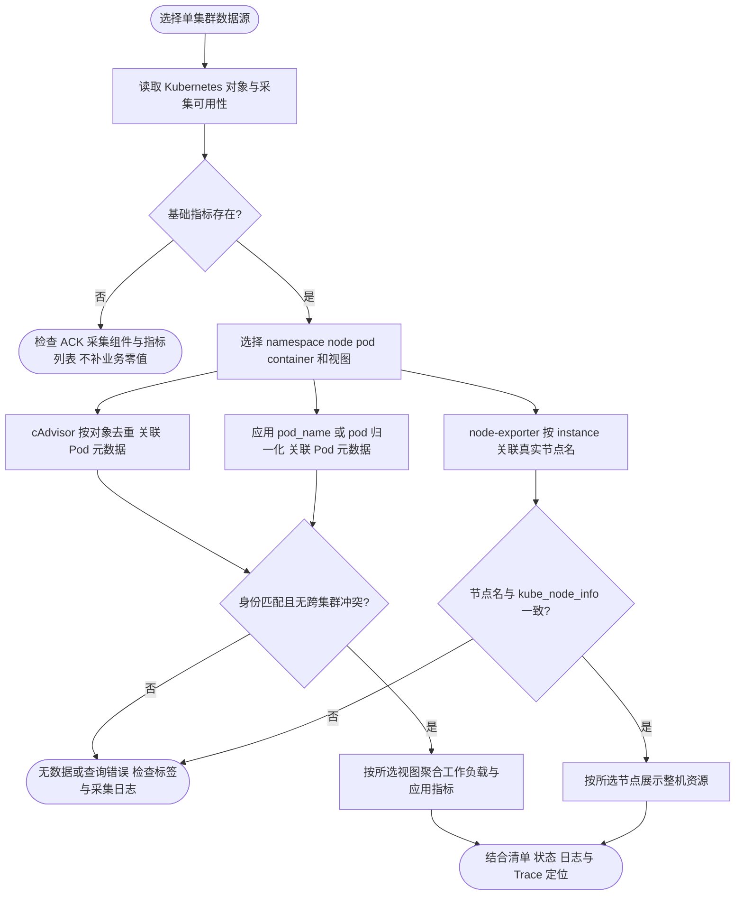

# ACK 容器全视图面板

[容器概览](../grafana/dashboards/foundation.json) 面向 ACK 容器、Pod 和节点运行状态；[应用组件](../grafana/dashboards/foundation-components.json) 用于 Foundation 请求、数据库、消息和任务排障。重新设计后使用独立 UID：`ack-container-overview`、`ack-application-components`。

## 页面与视图

容器概览按六个区块组织：

1. **存活与异常**：Ready 节点、Running Pod、Ready Pod、运行中容器、等待中容器和窗口重启次数。
2. **工作负载资源**：CPU 核数、内存工作集、CPU/内存相对容器 Limit、CPU 限流周期、RSS 和容器运行趋势。
3. **节点资源**：整机 CPU/内存、归一化 Load、最满文件系统、网络和磁盘吞吐、节点压力、可分配 CPU。
4. **对象清单与异常**：Pod/容器清单、Pod 阶段和等待原因。
5. **应用黄金指标**：Foundation 请求速率、5xx、P95、进程 CPU/RSS。
6. **采集可用性**：数据源内是否存在各类核心样本，区分未接入与真实业务零值。

顶部先选数据源，再选视图、命名空间、节点、Pod、容器。应用接口筛选只影响请求指标；组件页另外提供连接、队列、任务等筛选。

| 视图 | 图例与聚合 | 解释 |
| --- | --- | --- |
| Pod | namespace / pod | 所选容器按 Pod 求和；不同命名空间不合并 |
| Container | namespace / pod / container | 每个 Pod 内各容器分别展示 |
| Node | node | 工作负载区为该节点上**所选工作负载**之和；不是整机用量 |
| Instance（Pod IP） | namespace / pod / pod_ip | Kubernetes 运行实例地址；不是 Prometheus 的 exporter 抓取地址 |

视图切换作用于工作负载趋势和应用组件图表；首屏数量是当前筛选范围总量。**节点资源区只受节点筛选影响**，忽略命名空间、Pod、容器及视图。Pod 状态和 Pod 清单不受容器筛选影响；Container 视图下 Pod 阶段仍表示 Pod 状态。未调度的 Pod 允许出现在 Pod/Instance 视图，Node 视图显示“未调度”，IP 可能为空。

## 接入契约

一个 Prometheus 数据源对应一个集群。面板不猜测阿里云实例采用 cluster、cluster_id 还是其他跨集群标签；聚合多个集群的数据源须先隔离集群，否则同名 namespace/pod/node 会被合并或产生多对多匹配。变量不能作为权限隔离。

| 来源 | 必要指标/标签 | 用途 |
| --- | --- | --- |
| kube-state-metrics | kube_pod_info：namespace/pod/node/pod_ip；kube_node_info：node | 发现对象及关联节点/IP |
| kube-state-metrics | kube_pod_status_phase、kube_pod_status_ready、kube_pod_container_status_running/waiting/restarts_total | 存活、就绪、异常和重启 |
| kube-state-metrics | kube_pod_container_resource_limits：namespace/pod/container/resource/unit | 容器 Limit 比例；不是 Pod 级资源预算 |
| kubelet/cAdvisor | container_cpu_usage_seconds_total、container_memory_working_set_bytes：namespace/pod/container | 容器资源用量 |
| node-exporter | node_cpu_seconds_total、node_memory_MemAvailable_bytes、node_memory_MemTotal_bytes；instance | 节点资源 |
| node-exporter | node_uname_info：instance + node 或 nodename | 关联到 kube_node_info.node；优先 node，其次 nodename，名称必须真实一致 |
| Foundation 应用 | 业务指标 + namespace/container/pod_name | 应用与 Kubernetes 对象关联 |

应用使用 `pod` 而不是 `pod_name` 时，将两份 JSON 中隐藏变量 `app_pod_label` 的 current 改为 `pod`。它是固定白名单标签名，不是任意 PromQL。基础设施区直接使用标准 `pod`，不要求 Foundation 的 target_info、foundation 标签或 job 过滤。节点内部仅通过标准 instance 关联同一个 node-exporter 的数据，不把它当成容器身份。

`container_memory_rss`、CFS 限流、部分磁盘/状态指标可能不在当前 ACK 默认采集列表中；对应图表留空，需按实际版本核对。ECI/虚拟节点可能没有 node-exporter，节点图表不能伪造物理机数据。未采集应用埋点不会影响基础设施区。

Pod 元数据需在当前查询时刻仍存在。短任务结束并被删除后，跨较长窗口的 increase 无法再关联当前元数据，会遗漏已消失对象；本面板用于实时排障，不作为精确账单、SLA 或审计报表。

## 计算边界

- Running 不等于 Ready；容器运行状态不是 `up`。`up` 只证明抓取成功。容器统计不含 init container。
- 计数和资源查询先按对象去除采集副本，再聚合。cAdvisor 排除空 container 和 `POD` sandbox，避免把父 cgroup 与普通容器重复相加。
- Limit 比例仅纳入同时有使用量与正 Limit 的容器。无 Limit 容器不进入分子或分母，避免错误比率；全部无 Limit 时留空。这里是容器 Limit，不覆盖 Kubernetes Pod 级资源预算。
- CPU 使用量单位为核；CPU 限流按周期比例计算；Working Set、cgroup RSS、应用进程 RSS 分别标注，不混用。
- 节点 CPU 为各逻辑 CPU 的非 idle 比例；内存为 `1 - MemAvailable / MemTotal`。Load 可能超过 1，不是百分比。节点磁盘图取最满文件系统，网络/磁盘吞吐需按实际设备拓扑排除重复设备。
- 应用 P95 先合并桶再算分位数，不平均分位数。无请求时错误率留空；有请求但没有 5xx 序列时补同范围的零。
- Queue 快照使用 max 去重，不跨实例累加共享库存；同一聚合视图中的同名队列必须对应同一 Store。
- 只有“采集可用性”将缺失样本明确显示为 0，业务和资源图不使用 `or vector(0)` 伪造健康。可用性表示存在样本，不证明每个目标都正常。
- 变量使用默认 `${pod}` 插值，交给 Prometheus 数据源转义；动态聚合仅使用固定四项 `${view:raw}` 白名单，避免先前 `:regex` 的点号转义错误。

## 来源与验证

设计依据：[阿里云基础指标列表](https://www.alibabacloud.com/help/en/prometheus/developer-reference/container-cluster-metrics)、[ACK 可观测最佳实践](https://help.aliyun.com/zh/ack/ack-managed-and-ack-dedicated/user-guide/observability-best-practices)、[kube-state-metrics Pod 指标](https://github.com/kubernetes/kube-state-metrics/blob/main/docs/metrics/workload/pod-metrics.md)、[Node 指标](https://github.com/kubernetes/kube-state-metrics/blob/main/docs/metrics/cluster/node-metrics.md)。按本次检索的指标契约设计，不代表已连接你的 ACK 验证标签。

仓库根目录执行 `make -C deploy/observability check-dashboards`：使用固定版本 promtool，覆盖四种视图、缺失数据、跨 namespace 同名 Pod、采集副本去重、sandbox 排除、Limit 分母、节点关联和错误率回退。真实 ACK 联调和部署方法见 [入口文档](../README.md)。
