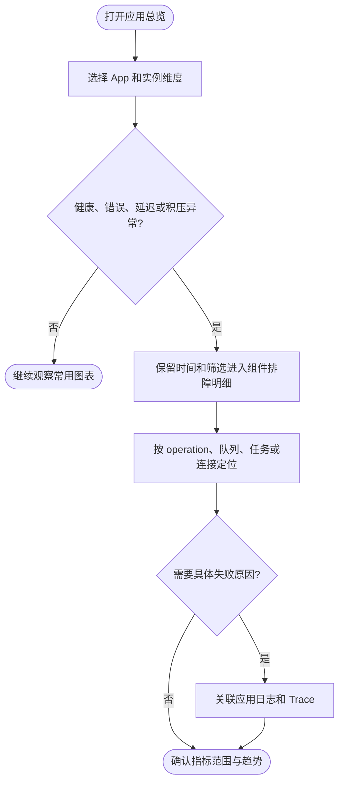
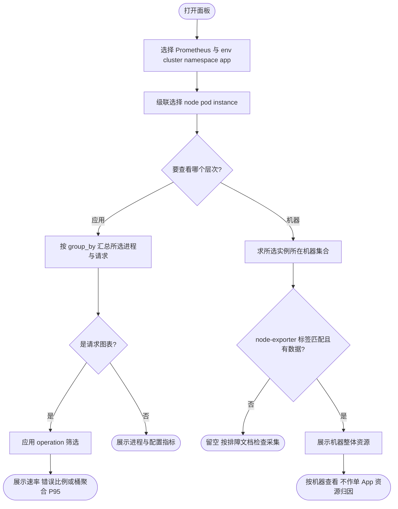

# Dashboard 维度与业务复用

入口：[Dashboard JSON](../grafana/dashboards/foundation.json)、[部署说明](../README.md)。总览与组件明细两份面板共享 App 筛选；变量决定选择哪些数据，聚合维度决定如何汇总。同一 App 的多个副本可以合并，也可以分别比较。

## 页面组织与单位

默认打开应用总览：首组聚焦健康、流量、错误、延迟、CPU、内存和积压风险；下方按 Server、Client、数据访问、异步任务排列。完整的连接池、Redis、配置、Go 运行时与机器细节放在 [组件排障明细](../grafana/dashboards/foundation-components.json)，通过顶部链接保留时间范围和筛选跳转。所有分组默认展开。

按排障用途划分 Dashboard，按 app 变量选择应用。业务专属 KPI 可另建 Dashboard；仅为了不同 app 复制整套基础图表，会增加维护成本。

`ops/s` 是每秒操作次数，即吞吐量；现在图表显示“次/秒”。耗时使用 s/ms 并自动换算；错误比例使用百分比。窗口请求数由 increase 估算，可能有小数，不是审计计数。Server/Client 明细按稳定 operation 与协议区分请求量、状态码、4xx/5xx、平均耗时、P95/P99；未经方法中间件的路由和未知路径 404 不包含在内。

SQL 慢操作复用有效 GORM slow_threshold（默认 200ms，0s 禁用）；计数包含超阈值的失败操作，不等于实际输出日志行数。明细同时展示阈值、慢操作速率和窗口次数。阈值合并多实例时取最大值；核对配置时选择单实例。未发生慢操作时计数序列可能不存在。

## 标签契约

| 标签 / 变量 | 含义 | Kubernetes 来源 | 普通服务来源 |
| --- | --- | --- | --- |
| datasource | Prometheus 数据源 | Grafana 已有数据源 | Grafana 已有或本地 provisioned 数据源 |
| env | local/dev/test/pre/prod 等部署环境 | Service environment 标签 | static_configs labels，与 APP_ENV 保持一致 |
| cluster | 集群或部署区域的稳定名称 | ServiceMonitor 固定 replacement | 例如 vm-production、local |
| namespace | 资源所属命名空间 | Kubernetes namespace | 固定 standalone |
| app | 稳定业务应用名 | Service app.kubernetes.io/name | static_configs labels |
| node | 机器/Node 名 | Pod 所在 Node 名 | 运维管理的稳定机器名 |
| pod | Pod 名 | Kubernetes Pod 名 | 固定 none |
| instance | 每个抓取端点 | PodIP:管理端口 | 主机地址:管理端口 |
| operation | 稳定接口名 | 方法中间件 | 方法中间件 |
| group_by | app/pod/instance/node/target | 查询时聚合 | 查询时聚合 |

`foundation="true"` 用于标记应用采集目标，避免将 Prometheus、Grafana 或其他服务混进应用变量。标签在抓取时统一附加，不需要给每个业务计数器重复添加。app/node 取部署身份，不能用随机进程 UUID 代替。service.instance.id 等 OTel Resource 信息通常出现在 target_info 等导出信息中，不保证每个原生 Go 指标都自带这些属性。

变量从 env 到 instance 级联、多选并支持 All；operation 仅影响请求量、错误率和延迟图，不过滤进程内存。group_by 为固定白名单单选；新增默认“实例明细”target=App / Node / Pod / 地址，便于一张图中区分所有实例。聚合时始终保留 env、cluster、namespace，以免不同环境中的同名 App 合并。

当前不添加用户 ID、订单 ID、trace ID 等高基数筛选。后续确有需求可增加 region、team、version，但应先有稳定采集标签、控制取值数量并验证滚动发布语义。接口变量对应 operation，不能用原始带 ID URL 代替。

## 三种视角

- **App**：选 app，group_by=app；多个副本的请求数、CPU 核数、RSS 求和。错误率为总错误数/总请求数，P95 先合并直方图桶后计算，不平均各 Pod 的 P95。
- **Pod / 实例**：group_by=pod 或 instance；namespace 和 pod 可定位单个副本。非 K8s 所有 pod=none，比较进程时选 instance。
- **机器**：group_by=node 汇总该节点上所选应用的进程资源。下方机器区另从 node-exporter 展示整机 CPU、内存、根分区及网络；使用 env/cluster/node 与所选实例所在机器相交，避免看错机器。整机资源包括其他 App，不能当成当前 App 独占资源。

## 指标边界

| 图表 | 数据与限制 |
| --- | --- |
| 可采集实例数 | sum(up)；抓取成功不代表 ready，更不证明业务成功；已从发现中消失的目标不会继续 up=0 |
| 请求速率 / 5xx | server_requests_code_total；仅进入方法中间件的请求；Kratos gRPC 同样使用 HTTP 映射 code |
| 请求 P95 | server_requests_seconds_bucket；按实际直方图桶插值估算，低流量时结合窗口请求数与均值判断 |
| 进程 CPU | rate(process_cpu_seconds_total)，单位核；不是百分比，不除以宿主机核心数 |
| RSS / Go 堆 | process_resident_memory_bytes / go_memstats_heap_alloc_bytes；不等于整个 Pod working set |
| 配置拒绝 | Manager 拒绝快照的次数，不代表组件逐项热更新的应用结果 |
| 机器资源 | node-exporter；本地 Compose 不启用，不伪造数据，不将无数据显示为零 |

同一模板已增加 Client、Database、Redis、Kafka、Queue、Job、Lock 的默认展开分区，并增加各组件的连接、Topic、队列、任务和业务锁名称筛选。组件变量仅影响所属分区，身份筛选对所有组件生效；最小示例没有这些依赖，未接入组件时对应面板留空。完整指标、启用方式与限制见 [组件指标说明](components.md)。Kafka Lag 通过独立 exporter 接入；Queue 状态通过可选 StatsProvider 接入。

业务可共享面板 URL，也可更换 UID 后导入到业务 Folder 并保存默认筛选。变量与 Folder 都不能替代数据源级权限隔离。文件 provisioning 后的变更应在源 JSON 中维护，再重部署，避免被下一次同步覆盖。

新增 `target` 抓取标签不改变既有 app/node/pod/instance 语义；历史样本没有新标签，升级采集配置后再选择实例明细。共享Queue状态使用max去重；Kafka Lag按共享集群和消费组展示，不支持按Pod归因。配置版本始终逐实例展示。
