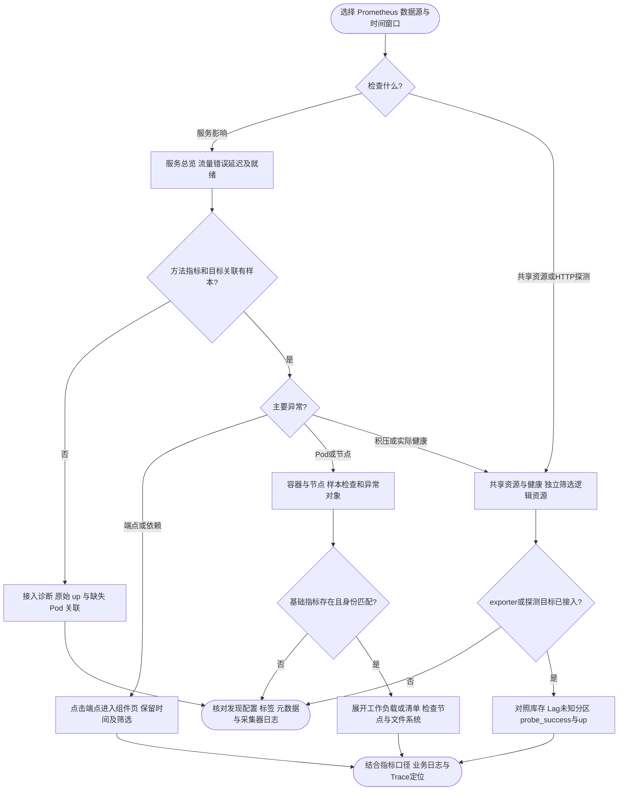

# 服务、资源与组件面板

四份 JSON 分别承担服务入口、资源排障、组件下钻和共享资源检查。导入时保留各自 UID；顶部导航保留时间窗口与已有变量，目标页只使用自己声明的变量。

| 页面 | 文件与 UID | 适用问题 |
| --- | --- | --- |
| 服务运行总览 | [foundation-service.json](../grafana/dashboards/foundation-service.json)，`ack-service-overview` | 流量、5xx、尾延迟、已发现应用 Pod 就绪率、异常端点与采集关联 |
| 容器与节点 | [foundation.json](../grafana/dashboards/foundation.json)，`ack-container-overview` | 对象状态、重启、Deployment 副本缺口、容器资源与节点容量 |
| 应用组件 | [foundation-components.json](../grafana/dashboards/foundation-components.json)，`ack-application-components` | Server、Client、Database、Redis、Cache、Queue、Kafka、Job、Lock、OSS、Runtime |
| 共享资源与健康 | [foundation-shared.json](../grafana/dashboards/foundation-shared.json)，`foundation-shared-resources` | 逻辑 Queue 库存、Kafka 消费组 Lag、实际 `/readyz` 与 `/healthz` HTTP 探测 |

## 页面判读与导航

从服务总览开始，首屏卡片汇总当前筛选范围，趋势保留应用身份。异常端点表只列当前有错误或请求样本的对象，可点击端点进入组件页；空表须结合流量与接入诊断判断。卡片不设置业务 SLO 阈值；抓取失败数大于零用红色，已发现 Pod 未全部就绪用橙色，流量、错误率和耗时用中性色。

容器与节点页按六区组织：全数据源样本检查、存活与异常、工作负载资源、节点资源、对象清单、应用指标简表。工作负载、对象清单和应用简表默认折叠；异常区优先展示未 Ready 对象、等待原因、最近 OOM 终止记录、状态时间线、窗口重启表和 Deployment 副本缺口。节点最满文件系统趋势下方保留 Top 10 表，定位节点、设备、挂载点、文件系统类型和可用空间。

组件页默认展开 Server，其他领域按需展开。端点表合并请求速率、窗口增量、5xx 比例和延迟；数据库连接池容量与最忙实例利用率组合判断局部耗尽；Queue/Kafka 单次尝试与较完整处理耗时并排观察；Runtime 结合内存、GC、调度等待和最忙进程 FD 利用率排障。Redis 建连延迟单独展示，业务缓存命中率与 Redis 连接池复用分开。

共享资源页不需要 Kubernetes 元数据，也不依赖 ACK 或四种视图。Queue 按逻辑目的地展示，Kafka 按真实集群、消费组、Topic、分区展示；HTTP 探测结果与探测器抓取状态分别展示。它与应用页的 Queue/Kafka 处理结果互为补充，处理成功不能证明没有积压或已提交位点。

```mermaid
flowchart TD
    A([选择 Prometheus 数据源与时间窗口]) --> B{检查什么?}
    B -- 服务影响 --> C[服务总览 流量错误延迟及就绪]
    C --> D{方法指标和目标关联有样本?}
    D -- 否 --> E[接入诊断 原始 up 与缺失 Pod 关联]
    E --> F([核对发现配置 标签 元数据与采集器日志])
    D -- 是 --> G{主要异常?}
    G -- 端点或依赖 --> H[点击端点进入组件页 保留时间及筛选]
    G -- Pod或节点 --> I[容器与节点 样本检查和异常对象]
    I --> J{基础指标存在且身份匹配?}
    J -- 否 --> F
    J -- 是 --> K[展开工作负载或清单 检查节点与文件系统]
    G -- 积压或实际健康 --> L[共享资源与健康 独立筛选逻辑资源]
    B -- 共享资源或HTTP探测 --> L
    L --> M{exporter或探测目标已接入?}
    M -- 否 --> F
    M -- 是 --> N[对照库存 Lag未知分区 probe_success与up]
    H --> O([结合指标口径 业务日志与Trace定位])
    K --> O
    N --> O
```

该图描述面板导航与排障操作；日志需另行查看，不表示面板新增日志采集或日志事件。

## 变量与聚合范围

前三页先选择数据源、命名空间和应用，再选择节点、Pod、容器及视图。可见变量“应用 Pod 标签”`app_pod_label` 提供固定白名单 `pod_name`、`pod`，默认 `pod_name`；按真实采集目标标签选择，无需编辑 JSON。ACK 常见 `pod_name`，仓库 ServiceMonitor 示例使用 `pod`。基础设施区直接使用标准 `pod`。

具体应用筛选要求目标带稳定 `app` 标签；All 允许缺少该标签的旧指标显示。应用曲线和端点表保留 `namespace`、`app`，Node 视图也不会把同节点不同应用混成一条曲线。多个服务缺少应用身份时仍无法可靠区分，变量不能弥补采集标签缺失。服务首屏卡片汇总所选范围，不是逐应用卡片。

| 视图 | 资源图例与聚合 | 应用曲线附加身份 |
| --- | --- | --- |
| Pod | namespace / pod；所选容器按 Pod 求和 | namespace、app |
| Container | namespace / pod / container | namespace、app |
| Node | node；工作负载区仅汇总该节点上所选工作负载 | namespace、app；应用及命名空间保持独立 |
| Instance（Pod IP） | namespace / pod / pod_ip | namespace、app；不是 exporter 抓取地址 |

视图作用于资源趋势与应用组件查询。Pod 阶段时间线始终逐 Pod 展示，独立于视图和容器筛选；Pod Ready、Running 和清单不受容器筛选影响。未调度 Pod 可出现在 Pod/Instance 视图，Node 视图显示“未调度”，IP 可能为空。

节点整机资源与状态只受节点筛选影响，忽略命名空间、应用、Pod、容器和视图。容器页的“应用”仅过滤底部应用埋点，不过滤 Kubernetes 对象。Deployment 表只受命名空间与 `deployment` 筛选影响，不推断 Deployment 与 `app` 的对应关系，也不受节点、Pod 或容器筛选影响。

服务页原始应用目标抓取时间线和无法关联 Kubernetes 的目标表不按节点筛选：关联失败时节点本来就未知，先过滤节点会隐藏故障。它们仍受命名空间、应用、Pod、容器和所选 Pod 标签影响。缺少所选 Pod 标签的目标及完全未发现的目标没有完整入口，需核对发现配置与控制器期望副本。

共享页使用独立 `env`、`cluster`、`queue_name`、`kafka_cluster`、`consumer_group`、`broker_topic` 和 `probe_app` 筛选，不使用应用页的 `app/node/pod/container/view`。`broker_topic` 是 Broker 真实 Topic；组件页 `kafka_topic` 对应应用指标的逻辑目的地，二者不能自动映射。共享 Queue 与组件页均使用 `queue_name`，前者查询逻辑 Store 库存，后者还查询生产与处理行为。

## 接入契约

前三页要求一个 Prometheus 数据源对应一个 Kubernetes 集群。聚合多个集群时须先隔离，否则同名 namespace/pod/node 可能被合并或产生多对多匹配。共享页通过可靠的 `env/cluster` 区分采集范围；Kafka 另需稳定 `kafka_cluster`。变量是筛选工具，不是权限隔离。

| 来源 | 必要指标/标签 | 用途 |
| --- | --- | --- |
| kube-state-metrics | `kube_pod_info`：namespace/pod/node/pod_ip；`kube_node_info`：node | 对象发现及节点/IP 关联 |
| kube-state-metrics | Pod phase/ready、普通容器 running/waiting/restarts | 存活、就绪、异常与重启 |
| kube-state-metrics | `kube_pod_container_resource_limits`：namespace/pod/container/resource/unit | 容器 Limit 比例 |
| kube-state-metrics，可选 | `kube_pod_container_status_last_terminated_reason`、`kube_deployment_spec_replicas`、`kube_deployment_status_replicas_available` | 最近 OOM 记录与 Deployment 副本表 |
| kubelet/cAdvisor | CPU/Working Set：namespace/pod/container | 容器资源用量 |
| node-exporter | CPU、内存、文件系统、网络、磁盘；instance | 节点整机资源 |
| node-exporter | `node_uname_info`：instance + node 或 nodename | 优先 node，其次 nodename；须真实匹配 Kubernetes 节点名 |
| Foundation 应用 | 业务指标及 `up`：namespace/app/container、pod_name 或 pod | 应用与 Kubernetes 关联；Pod 标签须与可见变量一致 |
| Queue 观察器 | 显式 `RegisterStats`，逻辑目的地 `queue_destination` | 库存、统计成功与年龄可用性 |
| Kafka exporter | Lag：kafka_cluster/consumergroup/topic/partition；目标带 `foundation_kafka=true` | 已提交位点 Lag 与 exporter 抓取状态 |
| blackbox exporter | 目标带 `foundation_probe=true`、app、probe；请求 readyz/healthz | `probe_success`、HTTP 状态码、耗时与抓取状态 |

RSS、CFS 限流、OOM、Deployment 和部分节点指标可能未在当前平台启用，缺失时留空。ECI/虚拟节点可能没有 node-exporter，不能伪造物理机数据。共享页接入见 [外部指标](external-metrics.md)；页面导航不会自动创建 exporter、探测目标或业务上报。

## 计算与状态边界

| 信号 | 当前含义与限制 |
| --- | --- |
| Ready / Running 与总数 | 容器页并列展示状态数量与所选已发现节点、Pod 或普通容器总数；Running 不等于 Ready，不含 init container。服务页 Ready 分母是已发现且可关联 Kubernetes 的应用采集目标 Pod，两者都不是期望副本数 |
| Deployment 副本缺口 | `max(期望副本-可用副本,0)`；可用副本不等于 Pod Ready。任一指标缺失保留空值，不把未知填零 |
| `up` 与 HTTP 探测 | `up=1` 仅证明抓取成功；`probe_success` 为实际 HTTP 探测结果，与 Pod Ready、方法结果分别判断 |
| 全数据源样本检查 | 首区检查整个数据源是否有近期样本，不受对象筛选影响；不能证明每个目标健康。仅这些存在性检查将缺失显式显示为 0 |
| 重启与 OOM | 重启 `increase[$__range]` 在所选窗口结束点求值，可能有小数；OOM 表表示最近终止原因为 OOMKilled，不是窗口 OOM 次数或当前 OOM |
| 状态时间线 | 布尔/枚举按对象展示，缺样本断开，不延续旧状态；容器运行数量趋势使用阶梯线 |
| 采集副本去重 | Kubernetes/cAdvisor 先按对象去副本，排除空 container 与 `POD` sandbox；节点核数按 instance/cpu 去重，网络/磁盘先按 instance/device 去重 rate 再求和 |
| Limit 与容器资源 | 比例仅纳入同时有使用量与正 Limit 的容器，无 Limit 不参与，全部无 Limit 时留空；CPU 是核，限流是周期比例，Working Set、cgroup RSS、进程 RSS 含义不同 |
| 节点资源 | 内存为 `1-MemAvailable/MemTotal`；Load/逻辑核数可超过 1，不是 CPU 百分比。文件系统按 instance/device/mountpoint/fstype 去副本；设备拓扑仍需核对 bond/bridge 和磁盘映射等重复设备 |
| RED 与分位数 | P95/P99 先合并同组桶再计算，不平均实例分位数。无请求时比例/分位数留空；有请求但无 5xx 序列时补同范围零。首屏分位数受所选流量构成影响 |
| 组件口径 | Redis 连接池复用不是业务缓存命中率，`status=error` 含 `redis.Nil`；Queue 单次尝试、一次领取执行与状态落库分别展示；DB/FD 先算实例利用率再取最忙实例，避免汇总掩盖局部耗尽 |
| 共享 Queue | 同库存多个 observer 取 max，不累加；采集/年龄状态取最差 observer。年龄只取同 observer 采集成功且年龄已知的样本，未知不能解释为空队列 |
| 逻辑 Store 身份 | 同一 env/cluster 的 `queue_destination` 必须唯一标识同一 Store；不同 Store 同名时 max 无法识别后端冲突，不保证库存正确 |
| Kafka Lag | 同分区去 exporter 副本后求 Topic 合计；负值是未知并单列，不能当 0。缺失分区仍可能低估总 Lag，抓取成功不保证分区返回完整 |

Pod 元数据需在查询时刻仍存在。短任务结束并删除后，较长窗口增量无法关联当前身份，会遗漏已消失对象；实时排障图不作为精确账单、SLA 或审计报表。当前上报仍有 Server panic、前置 Deadline 拒绝、Client.Do、gRPC Stream 等覆盖限制，Kafka 批量失败及 Job 取消结果也有口径限制；面板已标明，优化展示没有改变上报实现，依据见 [指标审查报告](metrics-grafana-audit-2026-09-30.md)。

变量默认使用 `${pod}` 等插值，由 Prometheus 数据源转义；动态聚合 `${view:raw}` 仅取四项白名单，标签名 `${app_pod_label:raw}` 仅取 `pod_name/pod`，不接受任意 PromQL。

## 验证与验收

仓库根目录执行 `make -C deploy/observability check-dashboards`。固定 Prometheus 镜像中的 promtool 校验 JSON、变量、四种视图查询，并以合成样本检查身份隔离、去重、Limit、窗口增量、状态、节点关联与共享计算。覆盖范围以 [check_dashboards.py](../check_dashboards.py) 的实际断言为准；空查询通过不能证明非空数据计算正确。

离线校验不访问真实 ACK、Broker 或健康接口，不替代浏览器的变量插值、状态颜色、表格合并、默认折叠与导航验收。真实联调使用 `make -C deploy/observability smoke PROMETHEUS_URL=...`；可选 `GRAFANA_URL=...` 核对已加载 JSON。它验证查询与配置版本，不保证指标覆盖完整或每张图呈现正确。接入、工具与命令前置条件见 [入口文档](../README.md)。

指标契约参考：[阿里云基础指标列表](https://www.alibabacloud.com/help/en/prometheus/developer-reference/container-cluster-metrics)、[ACK 可观测最佳实践](https://help.aliyun.com/zh/ack/ack-managed-and-ack-dedicated/user-guide/observability-best-practices)、[kube-state-metrics Pod 指标](https://github.com/kubernetes/kube-state-metrics/blob/main/docs/metrics/workload/pod-metrics.md)、[Node 指标](https://github.com/kubernetes/kube-state-metrics/blob/main/docs/metrics/cluster/node-metrics.md)。这些来源不是当前集群接入或视觉验收的证明。
