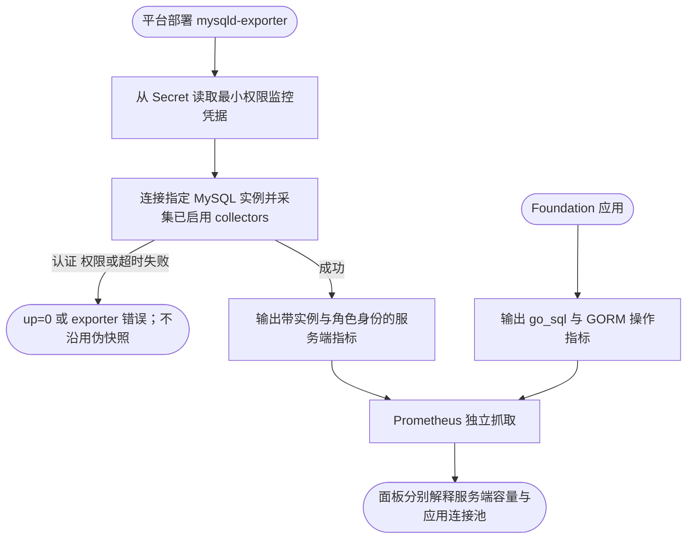
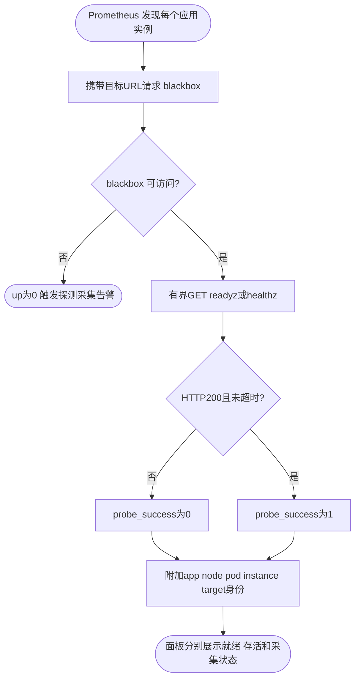
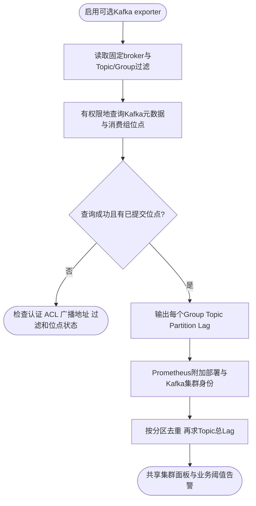

# 健康状态、Kafka Lag 与 MySQL 的外部采集

容器概览已接入 ACK 的 kube-state-metrics、cAdvisor 和 node-exporter。本文的 blackbox、Kafka Lag 与 MySQL 属于额外采集，使用独立面板和示例告警。

## MySQL 服务端指标

Foundation 应用只暴露连接池与 GORM 操作指标，不在业务进程执行 `SHOW STATUS`。需要连接数、全局命令计数、InnoDB、复制或性能_schema 指标时，由平台部署 [mysqld-exporter](https://github.com/prometheus/mysqld_exporter) 或等价采集器，并使用独立最小权限监控账号；具体权限必须匹配选用 collector 和 MySQL 版本，不能照搬业务账号或把凭据写入仓库。

Exporter 的 `up`、抓取错误和 MySQL 实例标签属于数据库基础设施维度，不应伪装成某个业务 App/Pod 的应用指标。高可用或读写分离环境按真实实例采集，再由平台按集群/角色聚合；应用的 `go_sql_*{db_name}` 只描述本进程连接池，不能与服务器连接总数直接相加。



## Ready 与 Health

`up` 表示 Prometheus 是否取得一次合法指标响应，不能表示应用就绪。模板用 [blackbox-exporter](https://github.com/prometheus/blackbox_exporter) 实际 GET 每个实例的 `/readyz` 和 `/healthz`，仅 HTTP 200 成功，不跟随重定向，单次探测超时2s、抓取超时5s。

本地 `make -C deploy/observability up` 已包含 blackbox 容器，不向宿主机发布其端口。普通部署需要运行同一 [blackbox 配置](../prometheus/blackbox.yaml)，并在 [standalone.yaml](../prometheus/standalone.yaml) 修改应用地址、blackbox地址与身份。探测 `instance` 去掉路径后与应用 `/metrics` 地址相同；`foundation_probe=true` 用于筛选探测指标，示例应用目标仍带有 `foundation=true`。ACK 面板不依赖这些示例标记，存活数量取自 Kubernetes 对象状态，不从 up 推导。

Kubernetes 可复用既有 blackbox，或审阅 [blackbox.yaml](../../kubernetes/blackbox.yaml) 后部署；将 [health-values.yaml](../../kubernetes/health-values.yaml) 的两个 additionalScrapeConfigs 合并到现有 kube-prometheus-stack。示例只发现 foundation-demo 的 minimal-api Service management 端口，探测各 Pod 地址；按实际修改 namespace、服务标签、端口和集群名。Prometheus 需有发现 Endpoints/Pod/Service 的权限，blackbox 需能访问管理端口；探测接口不能暴露给不可信网络任意访问内部地址。

独立健康面板应将 ready、healthz、探测采集状态分开；需要跨实例汇总时取最差值。探测器故障时 `up=0`，不会伪造应用健康。应用健康不等于完整外部用户链路健康；readiness依赖哪些组件取决于业务注册的 spec.Health().Checks(...)。



## Kafka Lag

Lag 是消费组在共享 Kafka 中的位点差，不能从 handler 执行计数或某个 Pod 的吞吐推算。模板接入 [kafka-exporter](https://github.com/danielqsj/kafka_exporter) 的 `kafka_consumergroup_lag`，提供分区和 Topic 合计；负值标为未知并排除合计，多副本 exporter 对同一分区使用max去重。

仓库根目录启动可选本地 exporter（连接已有 Kafka；broker 与返回的 advertised.listeners 均须可从容器访问）：

```sh
KAFKA_BROKER=host.docker.internal:19092 KAFKA_VERSION=4.1.2 \
  docker compose -f deploy/observability/compose.yaml \
  -f deploy/observability/compose.kafka.yaml up -d kafka-exporter prometheus
```

上述版本是示例，请匹配实际 broker；可设置 `KAFKA_TOPIC_FILTER`、`KAFKA_GROUP_FILTER` 缩小范围。启动会把 [示例文件发现目标](../prometheus/kafka-targets.example.json) 挂载为 kafka-targets.json，普通配置默认文件为空。普通非Compose部署修改 kafka-targets.json为实际地址，env/cluster与独立面板及示例告警一致，kafka_cluster是稳定共享集群名。不要把 exporter 实例名或业务 app 当作 Kafka 集群名。

Kubernetes 复用已有 exporter 时只对齐 foundation_kafka/env/cluster/kafka_cluster 标签；否则使用 [kafka-exporter.yaml](../../kubernetes/kafka-exporter.yaml) 示例，先修改 broker、版本、Topic/Group过滤、release标签及认证。TLS/SASL参数和证书按部署环境配置，密码通过部署系统Secret管理，不写入仓库。本例启用offset.show-all以包括未连接消费组；结果仍受权限、组/Topic过滤和已提交位点是否存在影响。Exporter读取元数据与消费组位点，不作为业务消费者，不创建Topic。

独立 Lag 面板可按 env、cluster、kafka_cluster、consumergroup、topic 筛选；不应按 App/Node/Pod 筛选，因为没有可靠的一对一归属。若业务确需按App过滤，需自己维护消费组到App的明确映射，不能按名字猜测。此例没有部署生产Kafka，也不验证业务SASL/ACL；请检查Exporter日志与原生命令的已提交位点后再使用告警阈值。


