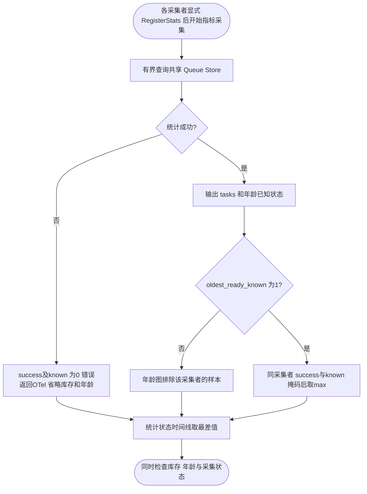
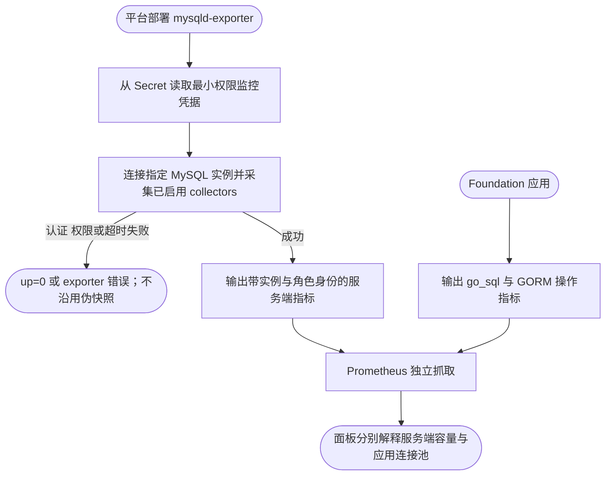
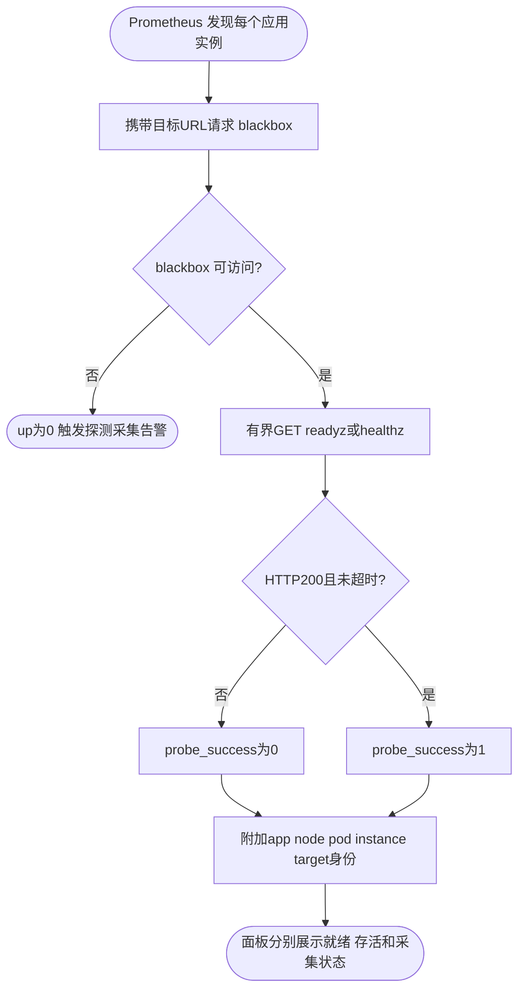
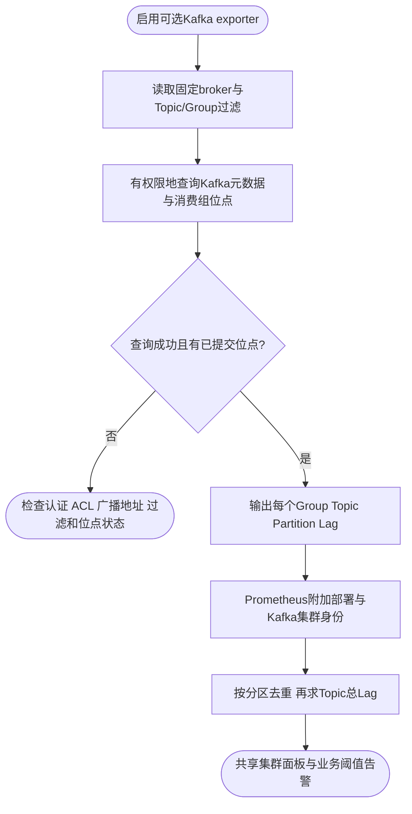

# 健康状态、Kafka Lag 与 MySQL 的外部采集

容器与节点页使用 ACK 的 kube-state-metrics、cAdvisor 和 node-exporter。本文的 blackbox 与 Kafka Lag 属于额外采集，已集中在 [共享资源与健康](../grafana/dashboards/foundation-shared.json)；MySQL 服务端仍使用平台自己的 exporter 面板。共享页不要求 kube_pod_info，使用 env/cluster 等共享资源身份，不受 App/Node/Pod/Container 视图筛选。

## Queue 库存

共享页使用 `queue_tasks` 展示各状态任务数、`queue_oldest_ready_age_seconds` 展示最老 ready 任务年龄，同时显示统计成功/年龄已知时间线及统计采集者清单。各队列与状态独立画线，不跨队列或环境堆叠。需要业务显式调用 `queue.RegisterStats`，并为采集目标附加 env/cluster；接入方式与限流要求见 [Queue 文档](../../../pkg/queue/README.md)。这些是共享 Store 的库存，不能把多个 Worker 的统计结果相加。面板按 env/cluster/queue_destination 取 max 去重，统计状态取最差值；同一范围内不同 Store 必须使用不同逻辑目的地名称，现有指标没有独立 Store 身份，无法辨别同名但不同的 Store。

年龄图只使用同一 observer 中统计成功且 `queue_stats_oldest_ready_known=1` 的样本，未知与失败不会画成零，也不会使用旧年龄。统计状态仍须同时检查：部分 observer 成功只证明存在可用快照，不能证明所有采集者健康。未接入或目标消失显示缺失，不等于没有积压。


```mermaid
flowchart TD
    A([各采集者显式 RegisterStats 后开始指标采集]) --> B[有界查询共享 Queue Store]
    B --> C{统计成功?}
    C -- 否 --> D[success及known 为0 错误返回OTel 省略库存和年龄]
    C -- 是 --> E[输出 tasks 和年龄已知状态]
    E --> F{oldest_ready_known 为1?}
    F -- 否 --> G[年龄图排除该采集者的样本]
    F -- 是 --> H[同采集者 success与known 掩码后取max]
    D --> I[统计状态时间线取最差值]
    G --> I
    H --> I
    I --> J([同时检查库存 年龄与采集状态])
```

## MySQL 服务端指标

Foundation 应用只暴露连接池与 GORM 操作指标，不在业务进程执行 `SHOW STATUS`。需要连接数、全局命令计数、InnoDB、复制或性能_schema 指标时，由平台部署 [mysqld-exporter](https://github.com/prometheus/mysqld_exporter) 或等价采集器，并使用独立最小权限监控账号；具体权限必须匹配选用 collector 和 MySQL 版本，不能照搬业务账号或把凭据写入仓库。

Exporter 的 `up`、抓取错误和 MySQL 实例标签属于数据库基础设施维度，不应伪装成某个业务 App/Pod 的应用指标。高可用或读写分离环境按真实实例采集，再由平台按集群/角色聚合；应用的 `go_sql_*{db_name}` 只描述本进程连接池，不能与服务器连接总数直接相加。


```mermaid
flowchart TD
    A([平台部署 mysqld-exporter]) --> B[从 Secret 读取最小权限监控凭据]
    B --> C[连接指定 MySQL 实例并采集已启用 collectors]
    C -- 认证 权限或超时失败 --> D([up=0 或 exporter 错误；不沿用伪快照])
    C -- 成功 --> E[输出带实例与角色身份的服务端指标]
    E --> F[Prometheus 独立抓取]
    G([Foundation 应用]) --> H[输出 go_sql 与 GORM 操作指标]
    H --> F
    F --> I([面板分别解释服务端容量与应用连接池])
```

## Ready 与 Health

`up` 表示 Prometheus 是否取得一次合法指标响应，不能表示应用就绪。模板用 [blackbox-exporter](https://github.com/prometheus/blackbox_exporter) 实际 GET 每个实例的 `/readyz` 和 `/healthz`，仅 HTTP 200 成功，不跟随重定向，单次探测超时2s、抓取超时5s。

本地 `make -C deploy/observability up` 已包含 blackbox 容器，不向宿主机发布其端口。普通部署需要运行同一 [blackbox 配置](../prometheus/blackbox.yaml)，并在 [standalone.yaml](../prometheus/standalone.yaml) 修改应用地址、blackbox地址与身份。探测 `instance` 去掉路径后与应用 `/metrics` 地址相同；共享页使用 `foundation_probe=true` 筛选探测指标，示例应用目标仍带有 `foundation=true`。容器与节点页的存活数量取自 Kubernetes 对象状态，不从 up 推导。

Kubernetes 可复用既有 blackbox，或审阅 [blackbox.yaml](../../kubernetes/blackbox.yaml) 后部署；将 [health-values.yaml](../../kubernetes/health-values.yaml) 的两个 additionalScrapeConfigs 合并到现有 kube-prometheus-stack。示例只发现 foundation-demo 的 minimal-api Service management 端口，探测各 Pod 地址；按实际修改 namespace、服务标签、端口和集群名。Prometheus 需有发现 Endpoints/Pod/Service 的权限，blackbox 需能访问管理端口；探测接口不能暴露给不可信网络任意访问内部地址。

共享页将 readyz/healthz 的 probe_success、探测采集 up 时间线，以及 HTTP 状态码与探测耗时分开；同一实例的重复采集取最差成功状态。探测器故障时 `up=0`，不会伪造应用健康。页面“探测应用”使用独立 probe_app 变量，避免传入应用组件的筛选值。应用健康不等于完整外部用户链路健康；readiness依赖哪些组件取决于业务注册的 spec.Health().Checks(...)。


```mermaid
flowchart TD
    A([Prometheus 发现每个应用实例]) --> B[携带目标URL请求 blackbox]
    B --> C{blackbox 可访问?}
    C -- 否 --> D([up为0 触发探测采集告警])
    C -- 是 --> E[有界GET readyz或healthz]
    E --> F{HTTP200且未超时?}
    F -- 否 --> G[probe_success为0]
    F -- 是 --> H[probe_success为1]
    G --> I[附加app node pod instance target身份]
    H --> I
    I --> J([面板分别展示就绪 存活和采集状态])
```

## Kafka Lag

Lag 是消费组在共享 Kafka 中的位点差，不能从 handler 执行计数或某个 Pod 的吞吐推算。模板接入 [kafka-exporter](https://github.com/danielqsj/kafka_exporter) 的 `kafka_consumergroup_lag`，提供分区和 Topic 合计；负值标为未知并排除合计，多副本 exporter 对同一分区使用max去重。

仓库根目录启动可选本地 exporter（连接已有 Kafka；broker 与返回的 advertised.listeners 均须可从容器访问）：

```sh
KAFKA_BROKER=host.docker.internal:19092 KAFKA_VERSION=4.1.2 \
  docker compose -f deploy/observability/compose.yaml \
  -f deploy/observability/compose.kafka.yaml up -d kafka-exporter prometheus
```

上述版本是示例，请匹配实际 broker；可设置 `KAFKA_TOPIC_FILTER`、`KAFKA_GROUP_FILTER` 缩小范围。启动会把 [示例文件发现目标](../prometheus/kafka-targets.example.json) 挂载为 kafka-targets.json，普通配置默认文件为空。普通非Compose部署修改 kafka-targets.json为实际地址，env/cluster与独立面板及示例告警一致，kafka_cluster是稳定共享集群名。不要把 exporter 实例名或业务 app 当作 Kafka 集群名。

Kubernetes 复用已有 exporter 时只对齐 foundation_kafka/env/cluster/kafka_cluster 标签；否则使用 [kafka-exporter.yaml](../../kubernetes/kafka-exporter.yaml) 示例，先修改 broker、版本、Topic/Group过滤、release标签及认证。TLS/SASL参数和证书按部署环境配置，密码通过部署系统Secret管理，不写入仓库。本例启用offset.show-all以包括未连接消费组；结果仍受权限、组/Topic过滤和已提交位点是否存在影响。Exporter读取元数据与消费组位点，不作为业务消费者，不创建Topic。

共享页 Lag 按 env、cluster、kafka_cluster、consumergroup、topic 筛选，包含 Topic 合计、分区 Top 20、负值未知清单与 exporter 采集状态。实际 Topic 变量为 broker_topic，与组件页的逻辑 kafka_destination 分开，跨页导航不会误传同名筛选。Kafka exporter 目标需带 `foundation_kafka=true`，采集状态不受消费组/Topic 筛选，因为 exporter 是共享目标。不按 App/Node/Pod 筛选：没有可靠的一对一归属。若业务确需按App过滤，需自己维护消费组到App的明确映射，不能按名字猜测。负值可列为未知，但整个分区未返回时无法仅凭这张表识别缺失。此例没有部署生产Kafka，也不验证业务SASL/ACL；请检查Exporter日志与原生命令的已提交位点后再使用告警阈值。


```mermaid
flowchart TD
    A([启用可选Kafka exporter]) --> B[读取固定broker与Topic/Group过滤]
    B --> C[有权限地查询Kafka元数据与消费组位点]
    C --> D{查询成功且有已提交位点?}
    D -- 否 --> E([检查认证 ACL 广播地址 过滤和位点状态])
    D -- 是 --> F[输出每个Group Topic Partition Lag]
    F --> G[Prometheus附加部署与Kafka集群身份]
    G --> H[按分区去重 再求Topic总Lag]
    H --> I([共享集群面板与业务阈值告警])
```
