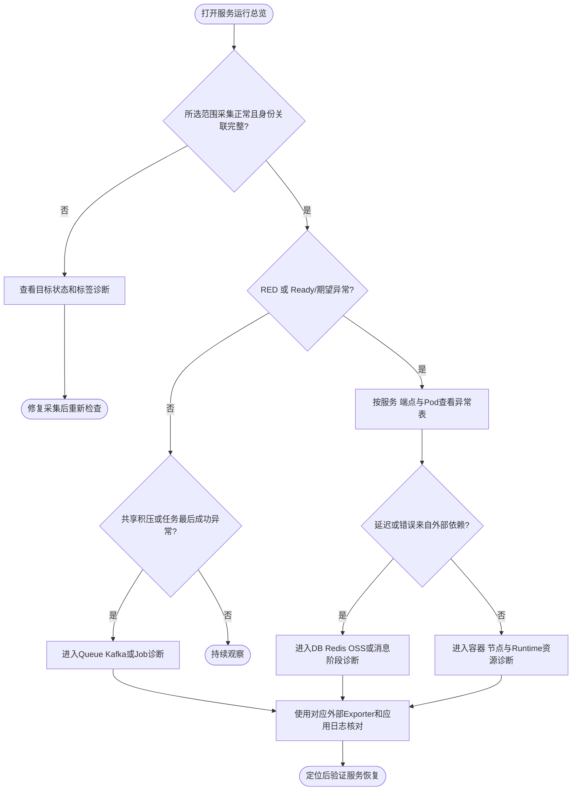
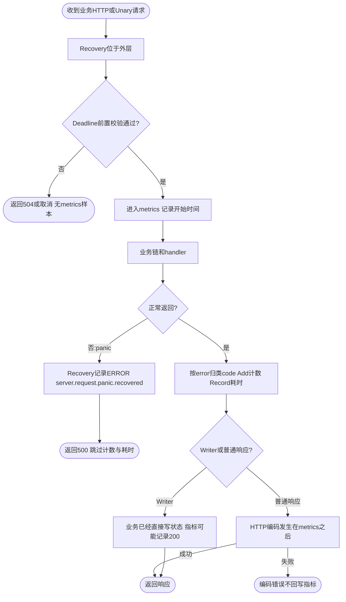
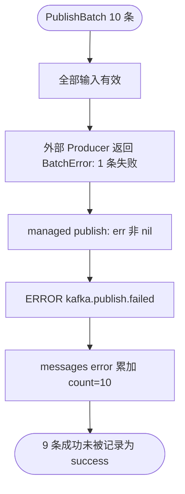
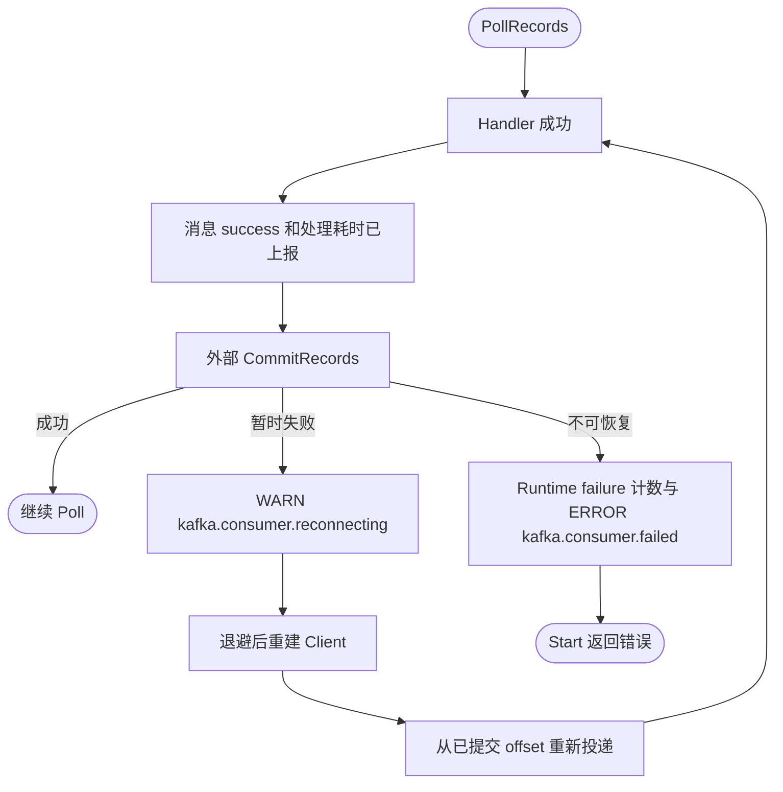

# Metrics 与 Grafana 审查（2026-09-30）

> 本文保存面板优化前的审查基线；下文两份面板、128张图及验证数量均是当时快照。后续已按建议完成四页拆分、查询修正与非空样本验收，当前用法见 [监控入口](../README.md) 和 [面板说明](dashboard.md)。上报实现的缺口仍需单独修复，不能由面板改动消除。

## 结论与范围

当前主要领域已经有指标，问题集中在**失败路径漏报、计数口径混用、采集标签契约、共享资源归属和诊断呈现**。应先修正数据真实性，再补关键缺口，最后重组面板；继续平铺更多折线图收益较低。

本审查以 HEAD `6da3c70` 上的当前工作树为准，包含未提交改动。读取了手写指标、上报调用、依赖库对应版本源码、两份 Grafana JSON、Prometheus/ServiceMonitor 配置及关联文档。没有连接线上 ACK、Prometheus 或 Grafana；布局结论来自 JSON 配置，不代表已做浏览器视觉验收。未修改业务代码、指标名称、同步策略或现有面板。

梳理到 **67 个 Foundation/Cache 指标族**（Histogram作为一个族计），另有当前环境默认导出的31个Go、7个Process和1个target_info族；示例业务另有2个Counter。外部采集指标按面板及Exporter边界单列。并非这些可选族都在当前线上启用。

两份面板合计 **128 张数据图表、133 个查询 target**：

| 页面 | 区块 | 数据图表 | 查询 | 当前定位 |
| --- | ---: | ---: | ---: | --- |
| ACK · 容器概览 | 6 | 37 | 39 | Kubernetes 对象、容器、整机资源与少量应用黄金指标 |
| ACK · 应用组件 | 11 | 91 | 94 | Server/Client、Database、Redis、Cache、Queue、Kafka、Job、Lock、OSS、Runtime |

组件页有 2 张端点明细表、89 张时序图；初始只展开 Server。容器概览默认全量展开，应用黄金指标排在第 5 区，采集可用性在最底部。

## 优先修正的数据问题

`P1` 表示可直接漏记或扭曲故障/容量判断；`P2` 表示覆盖与诊断缺口或条件性误导。这里的“确认”只适用于写明的触发条件。

| 优先级 | 问题与触发条件 | 影响 | 建议 |
| --- | --- | --- | --- |
| P1 | Server recovery 在 metrics 外层；业务或内层中间件 panic 被恢复为 500，但 metrics 在正常返回后才记录；外层 deadline 的提前拒绝也到不了 metrics | 这类请求的计数、500/504 与延迟全部漏记 | 让统计边界覆盖 recovery 的最终结果；覆盖业务 panic、内层中间件 panic、普通错误与正常请求。不要仅加一个未分类的 panic 总数替代请求结果 |
| P1 | Kafka PublishBatch 任意一条失败，整个批次的 `len(prepared)` 都记为 error；批次校验失败却只记 rejected=1 | 10 条中仅 1 条失败会被显示为 10 条失败；同一 messages counter 混入调用计数 | 用逐条发送结果统计 success/error；整体拒绝按拒绝消息数统计，另设调用次数。不能确定的结果单独标 unknown，不能猜测成功 |
| P1（条件性） | 同 instance 出现不同 job/replica 的重复 node-exporter 样本时，Load 分母直接数 CPU 序列，网络与磁盘直接求和 | Load/核数偏低；网络和磁盘吞吐翻倍 | 先按真实对象维度去采集副本，再聚合。Load 对 instance/cpu 去重；网络/磁盘对 instance/device 去重 |
| P2 | Kafka handler 成功在 CommitRecords 之前记录；可恢复 fetch/commit 故障自动重建，没有相应故障 counter | 处理成功率正常，但位点提交失败或持续重连不可见；可能重复处理 | 区分 handler_result、commit_result、fetch/recovery。新增固定 stage/reason 指标，不把错误原文作为 label |
| P2 | HTTP 自定义 Writer 已写 503 但返回 nil，方法指标仍记 200；HTTP Client.Do、gRPC stream 等入口不在当前方法指标覆盖范围 | 面板被当成完整传输层请求统计时，会漏报或错误解释 | 明确方法指标边界；需要完整 HTTP 覆盖时增加响应状态边界统计，并区分 metric 名称以避免重复累计；stream 分别定义会话与消息语义 |
| P2 | Queue面板53/54复用Kafka说明，称“最终结果”“含重试流程”“一次消息多次尝试”；实际Queue每次领取只执行一次，持久化Release后下次领取另计 | 可能把每次执行结果当唯一任务终态，把P95当包含跨次重试等待的总耗时 | Queue改为“本次领取执行结果”“本次执行及状态落库耗时”；Kafka保留进程内完整重试流程口径 |
| P2 | 当前秒单位 View 覆盖 instrument 建议桶，文档仍称 Server/Client 最大桶 1 秒、Kafka/Queue 使用 SDK 默认桶 | 对 P95 尾部范围、SLO 桶与成本的判断错误 | 同步 components.md；业务接入指南须明确秒单位建议桶会被 View 覆盖 |

重要依据：[Server中间件](../../../pkg/server/middleware.go)、[请求指标](../../../internal/middleware/metrics/metrics.go)、[Kafka计数](../../../pkg/kafka/managed_producer.go)、[Kafka发送](../../../pkg/kafka/producer.go)、[消费提交](../../../pkg/kafka/consumer_fetch.go)、[消费恢复](../../../pkg/kafka/consumer.go)、[Provider](../../../pkg/metrics/metrics.go)、[组件文档](components.md)。详细行号见后附领域审查。节点问题涉及容器概览 panel 20、22、23，临时合成样本已复现偏差及修正公式。

Kafka 重连或提交失败可能导致重复处理的风险来自现有执行路径；本次仅指出指标盲区，没有改变消费者并发、重试、提交或幂等策略。

## 现有设计中应保留的部分

- Registry 和 MeterProvider 按应用实例隔离，业务、组件和 Go/Process 共用一次抓取；不存在默认必须增加第二个端口的问题。
- 大部分标签是固定操作、结果和配置资源名，没有默认把用户 ID、SQL、对象 key 或错误原文上报。
- Histogram 先合并桶再算分位数，Counter 先 rate 再聚合；错误分子在有分母时补零，没有把所有缺失序列统一解释为零错误。
- DB 池利用率按实例计算后取最繁忙值，避免多实例总量掩盖局部耗尽；无限池没有伪造利用率。
- Queue 快照已用 max 去重，统计失败不输出任务数，年龄未知单独有可用性指标。
- Redis 池命中与业务缓存命中分开，非成功返回标题已明确“含空结果”；失败归档成功和死信投递成功也已有语义说明。
- Node 工作负载汇总与整机资源、Pod IP 与 exporter 地址、单集群数据源等边界已明确说明，应保留。

## 上报与展示缺口

| 领域 | 已上报但当前未充分展示 | 建议补上报 | 说明 |
| --- | --- | --- | --- |
| Server / Client | 现有吞吐、状态码、平均/P95/P99 足以组成 RED；缺服务级汇总与异常端点排序 | in-flight；若有需求，再加固定下游身份、传输层状态与 streaming 指标 | Client 固定 Operation 防止动态 path/query 带来高基数；不把任意 URL 作为标签 |
| Database | open connections、连接因 idle/lifetime 被回收等 collector 指标未全部展示 | 有业务诊断需求时加事务 begin/commit/rollback 与错误结果 | GORM 指标不覆盖原生 sql.DB、事务控制语句、游标后续扫描；慢操作不是慢日志条数 |
| Redis | create_time 建连延迟、连接池 hits/misses、idle.min/max、connections.max 未展示 | 若做容量监控，补实际 MaxActiveConns 硬上限；真正命令故障须分开 redis.Nil | SDK connections.max 当前来自 PoolSize（基准），不是硬上限；不建议直接用它算硬容量利用率 |
| Queue / Kafka | 两者 attempt_duration_seconds 均已记录，但没有单次处理尝试 P95 图；Queue标题还混用了Kafka的跨尝试口径 | fetch/claim/ack/commit/recovery 的固定阶段结果；需要时补处理心跳或最后成功时间 | 区分尝试耗时、最终处理流程耗时、重试等待、端到端消息年龄；不能从吞吐推出 Lag |
| Job | skipped/pending/wait 已有指标，但多个语义叠到单图 | last_success_timestamp、last_run_timestamp、是否启用及预期计划（固定任务名） | 只看失败次数无法发现任务长时间未触发；分布式协调器续租/准入另有盲区，见详细清单 |
| Lock | 操作与释放后持有时长已完整分开 | 暂不建议直接补“当前分布式持有锁数量” | 本地对象无法证明分布式真实持有，过期/崩溃/释放失败使结果不可信 |
| OSS | 请求、Reader字节和下载流完成已记录 | 需要时补未关闭下载流/在用流的本地生命周期观测 | Reader 消费量包括预读/重放，不是物理网络流量；仅成功 Close 后才完成流结果 |
| Config / Registry / App | 来源/组件日志承担目前诊断 | 按需要补配置接受/拒绝、source 连通、watcher/订阅状态、reload 时间、注册/续租故障 | 目前没有这些公共 metrics；不要因没有面板就误认为健康 |
| 健康与共享 Kafka | blackbox probe_success、探测 up、Kafka Lag 配置/告警已存在，但无随仓库提供的独立面板 JSON | 基础信号已由外部 exporter 提供，无需在应用再查询一次 | 应提供实际健康/Lag面板入口；MySQL服务端/Broker指标继续由外部采集 |
| Kubernetes | Ready、Running、restarts、waiting 已展示 | 使用 KSM 已有指标补 OOM、init container 故障、期望/可用副本对照 | 平台版本及 collector 支持需实际核对，不需要业务进程新增埋点 |

这里不要求把每个 runtime 明细指标都变成图。优先补的是能发现静默故障、定位延迟所在阶段、判断容量边界的信号。

## 采集契约与指标成本

1. 默认面板使用 `namespace/container/pod_name`；仓库 ServiceMonitor 示例显式写 `pod`，未显式统一为 `pod_name`。文档允许手改隐藏变量 `app_pod_label=pod`，但直接按示例导入会遇到标签不匹配。应统一示例默认契约，或把标签选择作为接入步骤；`container` 是否由平台发现提供也须用实际 `/metrics` 目标标签确认。
2. 应用页缺少 `app/workload` 筛选。Node 视图可能把同节点上不同应用的同名 operation/db_name/task 混合；Pod 内多个应用进程也可能合并。建议应用页先选择稳定的 scrape `app` 或明确 workload 身份，再下钻 Pod/Container；`service_name` 对大部分 OTel instrument 只在 `target_info`；Database 自行附加了该标签，Provider 的 Go/Process collector 没有。不能假定每条指标都有相同服务身份标签。
3. 所有 `Unit="s"` 的 OTel Histogram 被统一为 26 个有限桶（100µs 至 24h）。一个 labelset 产生 27 个 bucket（含 +Inf）加 sum/count，共 29 条时间序列。假设一个业务时延 histogram 有100个operation × 3个result × 20个Pod，约174,000条序列；这是容量估算，不是实测。当前Server/Client的时延histogram只含kind/operation，不含counter上的code/reason，不能把counter标签数直接套到它们。
4. Redis 毫秒 OTel histogram 与原生 SQL histogram 的首个正边界仍为5ms；真实0.2ms的大量样本会在宽桶内估计出接近4.75ms的P95。这是估计精度限制，建议围绕实际SLO增加细桶；不能把该估计直接等同单次实测延迟。
5. 统一桶修复了默认秒桶太宽的问题，但把 HTTP、Cache、Lock 和长 Job 一起使用同一布局增加成本。建议后续按 instrument/scope 选择短操作和长任务桶，并围绕业务 SLO 保留边界；先测序列和采集成本，再决定是否引入 native histogram。变更桶布局的滚动升级窗口须隔离新旧实例。
6. Queue Stats 在 scrape callback 中执行后端读取。已有超时与失败状态是正确基础；大量队列/大表场景需观察收集耗时和超时，而不是无限扩展 scrape 中的 I/O。建议有成本问题时再增加 collection_duration。

上述类型与成本判断参考 [Prometheus 埋点规范](https://prometheus.io/docs/practices/instrumentation/) 和 [Histogram 说明](https://prometheus.io/docs/practices/histograms/)。

## 更合适的面板组织

推荐保留当前资源页与组件明细作为下钻层，新增一张服务运行总览；健康与 Kafka Lag 使用独立共享资源页。原因是服务影响、应用进程、共享后端、整机容量的归属与聚合方式不同。

| 页面 | 首屏回答的问题 | 推荐内容与图形 |
| --- | --- | --- |
| 服务运行总览 | 用户是否受影响，影响哪个服务？ | 实际采集目标健康、Ready/期望副本、QPS、5xx/P95、错误端点 Top N；少量 stat + RED 趋势 + 异常表 |
| 容器与节点 | 是哪个 Pod/节点资源紧张？ | 最忙/最不健康对象表、CPU/内存相对 request/limit、限流、OOM/重启、节点压力；对象明细可点击下钻 |
| 应用依赖诊断 | 时间花在数据库、Redis、消息还是任务？ | 先选 app 与领域资源，只展示所选组件的速率/故障/延迟/饱和度；其余明细折叠 |
| 共享 Queue / Kafka | 后端是否积压、谁在消费、提交是否正常？ | Store/queue 与 Kafka cluster/group/topic 维度；Queue状态堆叠图、最老年龄、Lag、消费/生产速率、commit故障；独立采集健康 |
| Runtime | 资源增长来自分配、GC还是阻塞？ | heap live/in-use/released组合、分配速率与GC频率、GC暂停/CPU、goroutine/threads、FD利用率、进程启动时间 |

建议总览布局：

| 第 1 行：状态卡片 | 第 2 行：趋势 | 第 3 行：异常对象 | 第 4 行：依赖摘要 |
| --- | --- | --- | --- |
| Ready/期望、抓取失败、QPS、5xx、P95、异常依赖数 | 请求速率、错误率、P95/P99，保留同一时间轴 | Top错误端点、最慢端点、NotReady/OOM/重启对象 | 最忙DB池、Redis超时、Queue年龄、Kafka Lag、Job最后成功 |

“异常依赖数”只能在补齐健康/结果契约后加入；暂时没有信号的组件显示未接入，不虚构绿色健康。



这是建议的导航流程，不是新增应用执行路径；没有在图中虚构应用日志事件。

具体呈现改进：

- 采集可用性前置，并展示“预期目标数 / 实际抓取成功数 / 当前筛选有指标且拓扑关联成功的目标数”。现有卡片只在全数据源检测某类样本，只能回答“数据源有没有”，不能证明所选 Pod 健康。
- 节点Load/吞吐先修去重；range图中 `increase(...[$__range])` 表示每个点向前一个完整可见窗口，不能当作仅选中区间累计。窗口总数用instant，事件趋势用固定短窗口。
- 状态用 stat 或 state timeline；计数展示当前值和窗口总数；吞吐用 timeseries；Queue 各状态用堆叠；容量利用率用 bar gauge 配对象表；P95/P99放在同图，平均耗时作为辅助。
- 端点表合并请求数、QPS、4xx/5xx、P95/P99与样本数；按错误数、尾延迟排序。当前两张表只有按状态码的窗口计数。
- 把 DB in-use/idle/max 放到一组，并显示最忙实例、等待次数/等待时间。Redis强调超时、等待、建连与正常空结果；不把 `redis.Nil` 占比直接用红色故障阈值。
- Queue 共享库存按 Store/queue 去重展示；Pod视图的库存副本仅用于排查 observer，不让用户相加。Kafka把handler结果、提交结果和Lag并排。
- Runtime 合并同类内存图，FD显示 open/max；不要把每个底层内存字段都放成同等重要的一张大图。
- 避免 All 范围输出上百条曲线。总览采用聚合/Top N，详情保留全量；legend 的 max/last 可选，但不要以陈旧 lastNotNull 当作当前健康。
- 用业务 SLO 配阈值；固定颜色区分成功、错误、未知。没有流量时P95为空，未启用/采集失败为灰色或橙色，不能和成功零错误合并。
- 用 data link 传递数据源、时间范围、app、Pod与端点到详情；有成熟日志/Trace系统后再接其入口。

保留 `$__rate_interval` 与正确先 rate 再聚合的做法；不要简单用 `$__interval` 替代。参见 [Grafana Prometheus 变量说明](https://grafana.com/docs/grafana/latest/datasources/prometheus/template-variables/)。

## 执行顺序与验收

1. 先修 panic 漏报、Kafka逐条计数、节点重复采集的聚合；同步回归用例和语义文档。
2. 统一 scrape 身份契约，补组件非空PromQL用例：跨应用、同名资源、共享Stats、多副本、只成功、无流量、采集失败、年龄未知、低流量分位数。
3. 把已有 attempt duration、建连延迟、健康探测和 Lag 接到合适详情页；补 Job静默故障、Kafka提交/恢复等缺失上报。
4. 再做服务总览和下钻重组，按真实接入的组件显示；最后评估桶成本与 recording rules。

验收必须包含真实 Prometheus target 标签、Grafana变量插值、筛选联动、No data与无流量、多实例去重，以及实际浏览器视觉检查。本次未执行这些线上验收。

## 本次验证

- `make -C deploy/observability help`：成功，确认所有实际入口及副作用。
- `make -C deploy/observability check-dashboards`：成功，532 条查询检查及已有容器合成样本通过。
- `make -C deploy/observability check`：成功，blackbox/Compose、两份Prometheus配置和17条规则结构与已有告警用例通过。
- 临时 `promtool test rules`：10 条断言通过，复现 Load/网络/磁盘在同 instance重复采集时的偏差，并验证建议去重后的值。
- 临时Provider采集程序：成功，核对当前环境实际Go/Process与target_info导出。
- 临时 Server overlay 回归：已复现 panic 返回500但不增加请求/时延样本，以及 Writer实际503被方法指标记200；Kafka公共API临时程序已复现10条中1条失败报告error=10、10条整批拒绝报告rejected=1。具体命令见后附领域审查。临时源码/样本位于 `/private/tmp`，不加入生产包。

现有 check-dashboards 的 532 条等于133个target × 4视图，绝大多数是在空数据下检查语法及空值行为；非空fixture集中在容器概览。因此“校验通过”不能证明91张组件图的业务聚合全部正确。未运行全仓 Go 测试/竞态/代码生成：本次没有修改生产实现或并发策略。没有启动或部署监控环境，没有修改在线面板。

## 附录 A：请求、任务、锁与 OSS 的全部上报点

审计对象：2026-09-30 当前工作树，HEAD 6da3c70。范围：`internal/middleware/metrics`、`pkg/server`、`pkg/client`、`pkg/job`、`pkg/lock`、`pkg/oss`。未改仓库文件，未检查线上实例。公共 exporter 附加的 scope/target 身份、抓取端标签由父任务统一解释；下表列业务标签。所有这里的秒直方图实际使用 `pkg/metrics/metrics.go` 的统一 26 个边界，不能以 instrument 的建议桶推断实际边界。

### 完整指标族清单（18 族）

Histogram 均实际导出 `<name>_bucket{le}`、`<name>_sum`、`<name>_count`；以下使用 MetricFamily 名。UpDownCounter 在 Prometheus 中表现为 Gauge。

| 实际指标族 | 类型 | 业务标签 | 上报路径及触发条件 |
| --- | --- | --- | --- |
| `server_requests_code_total` | Counter | kind、operation、code、reason | `internal/middleware/metrics/metrics.go:26` 创建 Kratos Server 指标；HTTP 和 gRPC Unary 到达指标层且 handler 正常返回后计 1。`code` 是 HTTP 风格应用结果：nil=200，错误由 Normalize 转换后观测；不是普遍可靠的实际 HTTP 响应码 |
| `server_requests_seconds` | Histogram，秒 | kind、operation | 同上，正常返回后记录指标层内部耗时；不包含 HTTP 最终编码，WS 只含握手 |
| `client_requests_code_total` | Counter | kind、operation、code、reason | `internal/middleware/metrics/metrics.go:43`；`pkg/client/builder.go:219` 注入 HTTP Invoke 和 gRPC Unary，正常返回后计 1。nil=200，错误由 Normalize 分类，不包括 Client.Do 和 gRPC Stream |
| `client_requests_seconds` | Histogram，秒 | kind、operation | 同上；HTTP Invoke 包含默认 ResponseDecoder 的响应体解码，gRPC Unary 包含业务调用；不包括创建/租用连接耗时 |
| `job_runs_total` | Counter | job、status | `pkg/job/telemetry.go:140-158`；任务实际执行的观测 defer 每次完成计 1，status=success/failure（仅依据返回 error 是否 nil）；panic 有失败标记，因此被统计 |
| `job_duration_seconds` | Histogram，秒 | job、status | 同上；`pkg/job/middleware.go:130-138` 开始到 defer，包括可选 logging 和业务中间件/Task，不含 Cron 排队等待 |
| `job_running` | Gauge（UpDownCounter） | job | `pkg/job/telemetry.go:129-158`；实际开始 +1，完成或 panic 展开 -1；Once/Cron/Daemon 都覆盖 |
| `job_triggers_skipped_total` | Counter | job、reason | `pkg/job/concurrent_policy.go:84/94/101`；Cron gate 未准入，reason=disabled/already_running/pending_full。已取消 context 在 gate 入口退出时不计；禁用调度通常没有触发，disabled 是竞争窗口的拒绝计数，不是“启用状态” |
| `job_pending` | Gauge（UpDownCounter） | job | `pkg/job/concurrent_policy.go:111/118/126`；DelayIfRunning 入队 +1，准入或取消 -1；仅实际等待创建样本 |
| `job_wait_duration_seconds` | Histogram，秒 | job、result | `pkg/job/concurrent_policy.go:119/127`；Delay 排队结束记录，result=admitted/canceled；不包括未排队即满额的调用 |
| `lock_operations_total` | Counter | lock_name、operation、result | `pkg/lock/metrics.go:73-90`；显式 `lock.WithMetrics` 后，Lock/TryLock/TTL/Refresh/Unlock 正常返回记录。operation=lock/try_lock/ttl/refresh/unlock；result=success/contended/not_held/timeout/canceled/error |
| `lock_operation_duration_seconds` | Histogram，秒 | 同上 | 同上；获取锁的底层等待和重试全计入 operation 耗时，不是单次 Redis 调用耗时 |
| `lock_released_hold_duration_seconds` | Histogram，秒 | lock_name | `pkg/lock/metrics.go:117-125`；成功获取后到成功 Unlock 返回；只在 err=nil 时记录。不含自动过期、解锁失败、进程崩溃。自定义实现重复 Unlock 返回成功会重复采样，README 已明确该边界 |
| `oss_requests_total` | Counter | bucket、operation、result | `pkg/oss/metrics.go:147-154`；显式 `oss.WithMetrics` 后，各驱动方法正常返回计 1；operation=put/get/delete/stat/exists/list/copy，result=success/error。Get 成功返回 Body 后读失败不回写请求结果；不存在对象的 exists=false、err=nil 为 success |
| `oss_request_duration_seconds` | Histogram，秒 | 同上 | 同上；Get 只计到取得 Body，Put 包含驱动消费 reader 的整个调用 |
| `oss_transferred_bytes_total` | Counter，字节 | bucket、operation | `pkg/oss/metrics_reader.go:19-25,115-120`；put/get 每次 Read / 上传 ReadAt 返回 n>0 时累计，包括同时返回错误的 n、重读、SDK 预读；不是物理网络字节、对象大小或远端确认写入量 |
| `oss_streams_total` | Counter | bucket、operation、result | `pkg/oss/metrics.go:241-259`；Get 的 Body 首次 Close 后计 1，operation=get；result 按优先级 close_error/read_error/success/closed_early。未 Close 不产生完成样本，仅观察 EOF 才可 success |
| `oss_stream_duration_seconds` | Histogram，秒 | 同上 | 同上；从 Get 调用开始到首次 Close，包含响应头等待、业务读取和业务持有 Body 的时间 |

Server/Client 默认启用，各自 metrics.disable 可关闭；Server 支持动态切换，Client 策略变化通过新版本连接应用。Job 默认启用，可以 `job.WithMetrics(false)` 禁用。Lock/OSS 包装为显式可选，NewManager 等普通构造不会自动启用，必须共用导出 Provider，重复包装会重复计数。Job 原始标签 job 与 Prometheus job 冲突，当前部署 honor_labels=false 下实际被查询为 exported_job（组件说明已正确提醒）。

### 确定缺陷与已复现覆盖遗漏

#### P1：默认 Server 请求观测漏掉 panic 和前置 Deadline 拒绝

默认链 `pkg/server/middleware.go:53,58,75` 中 recovery 最外、Deadline 在 Metrics 前。Foundation metrics 在 `internal/middleware/metrics/metrics.go:39` 使用上游 Kratos Server；上游文件 `/Users/jagger/.gvm/pkgsets/go1.26.4/global/pkg/mod/github.com/go-kratos/kratos/v2@v2.9.2/middleware/metrics/metrics.go:129-153` 在 handler 返回后直接 Add/Record，没有 defer。业务或内层中间件 panic 会跳过两个上报，再由 `pkg/server/error_boundary.go:44-59` 转为实际 500，导致请求数及 5xx、延迟遗漏。

Deadline 接收到 `x-request-timeout-ms: 0` 时直接返回（`internal/middleware/deadline/deadline.go:28-29`），或者 Store.Derive 因取消/预算不足返回（:79-81），也不会执行 Metrics。实际响应 504，但没有指标。Client Deadline 同样在 Metrics 前（builder.go:229-234），本地预算不足的调用没有计数。

建议：先明确定义“传输收到的请求/发起的调用”与“已进入业务的处理”口径，使用可覆盖异常展开与前置拒绝的请求边界观测；保留一次计数，不通过多层同名指标重复记录。若继续用 handler 中间件计量，应明确面板不是全部流量，并额外提供前置拒绝计数。修复 panic 必须保留原 panic 恢复边界和错误语义。

现有 `internal/middleware/metrics/metrics_test.go:19,82` 只验证导出名称、错误状态及原始错误，`pkg/server/error_boundary_test.go:91` 验证恢复响应/日志，均未覆盖二者组合；Job 则已有 panic defer 保护和对应测试，可以保留。

#### P2：HTTP Writer 实际响应码与 code 标签不一致（自定义入口确定边界）

`pkg/server/http.go:69-84` 允许业务直接写 HTTP 状态后返回 nil。指标只看到 error=nil，因此 `WriteHeader(503); return nil` 实际 503，却记录 code=200。当前文档自己的上传示例 `pkg/server/README.md:199` 写201也会统计200。常规 HandleHTTP / 生成入口的 nil 返回200口径通常成立；这里不能泛化为所有响应都错误。ResponseEncoder 在指标之后失败同样不被计为失败，所以 code 应被说明为应用处理结果，或在 HTTP 最终响应边界获得真实状态。

WebSocket `pkg/server/websocket.go:81-119` 在 HTTP 链记录握手，成功 upgrade 实际101但返回nil，计200；它不统计存续时长、活跃连接、消息处理/发送、大小拒绝、关闭原因。将它当“WebSocket健康/业务吞吐”是误读，建议独立 WS 指标。

#### P2：Client.Do 无任何客户端请求指标（已复现）

Factory 创建客户端确实注入 middleware（builder.go:202-209），但上游 HTTP `Do` 直接 `return client.do(req)`，不经过 invoke/middleware（上游 `transport/http/client.go:283-291`）。`pkg/client/README.md` 明确允许 Invoke/Do 两种用法，因此“使用 Factory 就覆盖客户端请求”的组件说明（`deploy/observability/docs/components.md:9`）范围过宽。需补 Do 的传输观测或明确仅 Invoke；若在 RoundTripper 层补指标，必须避免 Invoke 双计数，并明确请求头到响应体的耗时边界。

#### P2：gRPC Stream 未接入请求指标（静态确认，未跑真实流服务）

Server `pkg/server/grpc.go:65-82` 仅额外安装 StreamServer debug interceptor，观测链配置到 grpc.Middleware；上游 Unary 与 Stream 使用不同 matcher。Client `pkg/client/builder.go:139-141` 仅 WithMiddleware 及 debug stream interceptor，没有 WithStreamMiddleware。默认流建立、完成、消息、错误全部不在这18族中。添加流指标需要独立口径（流建立/结束、活跃流、消息数），不能简单把每条 Send/Recv 当一个 Unary请求。

#### P2：手工 HTTP Invoke 把动态 path 当 operation，存在基数爆炸边界（已复现）

上游 `transport/http/calloption.go:54-58` 默认 operation=path，指标直接取该值。`Invoke(...,"/orders/1",...)` 和 `/orders/2` 导出两个标签值；调用 path 带 ID/query 时会持续创建新 Counter 及29条 Histogram序列（26个有限边界、+Inf、sum、count）。Generated client 通常明确设置稳定 Operation，不应认为所有手工调用已自动路由归一。建议让业务手工调用必须指定固定 `kratoshttp.Operation("/orders/{id}")`，或在边界提供稳定 route；PathTemplate 本身不会改 operation。另 reason 值需固定枚举，不得承载动态错误文本。

### 口径改进建议（不写成实现错误）

1. **Job 正常停机和 Daemon 异常退出的 status 不能直接代表任务健康**：`pkg/job/telemetry.go:148-150` 仅 error nil判断。正常Stop导致返回 context.Canceled，被计 failure，但 Manager 的 `stoppedByContext` 把它作为正常退出（job.go:31-58）；Daemon返回nil先计success，Manager随后认定 `daemon exited without cancellation` 并触发整体停止（manager_lifecycle.go:225-234）。两条已复现。当前 `middleware_test.go:177` 明确断言取消=failure，这是既有契约，建议在改进时增加 canceled/stopped 或独立 outcome，并在最终管理器结果确认后观测异常Daemon；需要同步测试与面板，不能默改。
2. **Job 无法从当前指标发现“应该运行却没有触发/最后一次成功过久”**：finished counter+running+pending覆盖执行和排队，不能识别 scheduler没有触发、禁用或低频任务长期无成功。建议受控 `job_last_success_timestamp_seconds`、`job_last_completed_timestamp_seconds`、`job_enabled`，并有计划地补预期触发/下次计划时间。高优先级是最后成功距今的任务表；没有可靠计划，不做通用“失败率=健康”告警。Daemon更适合活跃/异常退出展示；Cron看最近结果/过期/跳过；Once看本次完成。
3. **Client无具名连接维度，HTTP无method维度**：metric只有 kind/operation。两个Factory client调用同一方法或HTTP path会合并，无法区分依赖名称；GET/POST同一注册路径也合并。可加稳定 client_name、HTTP method，优先逻辑配置名，不使用原始URL/IP/租户ID。已有堆叠耗时不含 result，无法单独比较成功/失败延迟，是否增加受控 result由排障需求和序列预算决定。
4. **请求缺少进行中数量，WS缺少独立观测**：仅完成计数/耗时不能区分无流量与长请求全部挂住；建议 server/client in_flight。WS活跃连接、消息/字节、大小拒绝、关闭原因适合单独分区，不依赖当前HTTP握手计数。
5. **OSS完结指标看不到尚未Close的流**：`oss_streams_total` 只有close事件；泄漏/长时间持有的Body既无完成样本，也没有当前打开量。可加 opened总数和 in_flight，明确进程退出/资源过期边界；字节统计及request/stream区分已清楚，无需把真实Reader读量改成对象Size。Body要求串行Read/Close已在README:150明确，审计没有改变并发策略。
6. **Lock现有指标基本合理**：竞争、timeout、canceled分开，固定lock_name无锁key。成功Unlock持有时长有幸存者偏差，README已经准确描述；不能拿它估计所有租约真实时长或推导可靠“当前持锁数”。如果监测等待饱和，加入等待in_flight即可；没有租约到期观察器，不建议维护错误的持锁Gauge。
7. **文档桶边界漂移**：`deploy/observability/docs/components.md:23` 仍称Server/Client最大有限桶1秒、Kafka/Queue为SDK默认桶，与现在秒单位统一View不符。当前最大有限桶86400秒，首桶0.0001秒。建议统一说明实际View覆盖，并按SLO/域预算讨论是否拆分长任务/短请求桶。该项父任务可统一处理。

### 复现验证

临时文件：`/private/tmp/foundation-metrics-audit.UWh8x3/metrics_audit_tmp_test.go`、`job_metrics_audit_tmp_test.go`、`overlay.json`；overlay虚拟新增包内测试文件，实际仓库文件未创建/修改。Go缓存也位于这个tmp目录，避免写受限的系统缓存。

命令：`GOCACHE=/private/tmp/foundation-metrics-audit.UWh8x3/go-cache go test -overlay /private/tmp/foundation-metrics-audit.UWh8x3/overlay.json ./pkg/server ./pkg/job -run '^TestAudit' -v -count=1`。

已通过的临时验证：panic返回500且不增加计数/耗时；Writer实际503但观测200；Client.Do无样本、Invoke动态路径生成两组operation；正常取消failure/Daemon异常退出success口径；前置Deadline耗尽实际504无请求指标。未运行真实gRPC流服务、对象存储外部服务、分布式锁、Grafana线上查询。未执行Make target（只读审计的有界复现，并非实现改动的全量验证）。



## 附录 B：Database、Redis、Queue 与 Kafka 的全部上报点

审计日期：2026-09-30；基于当前工作树，而非 HEAD。范围为 `pkg/database`、`pkg/redis` 与锁定的 redisotel v9.17.2、`pkg/queue`/`contrib/queue`、`pkg/kafka`。未修改仓库代码；临时复现程序位于 `/private/tmp/foundation-kafka-metrics-repro.go`。本报告记录实际 instrument 标签，OTel scope 与 Prometheus 抓取身份标签由公共导出/采集层补充。

### 指标族完整清单

四个领域共 46 个指标族：Database 13、Redis 11、Queue 13、Kafka 9。Histogram 各自展开 `_bucket/_sum/_count`，没有重复计为三个指标族。

#### Database：13 个族

开启前提：`database.metrics.disable=false`（省略同样开启）、通过 `NewManager` 创建连接。所有具名池构造期均登记；每个连接独立 SQL pool。全部族附加 `service_name/service_version/service_instance_id` 与 `database.metrics.labels` 常量标签。

| 实际导出名 | 类型 | 标签 | 上报点及触发 |
| --- | --- | --- | --- |
| `go_sql_max_open_connections` | Gauge | `db_name` | scrape 调用 `sql.DB.Stats()`，当前 MaxOpenConnections；0 表示不限制 |
| `go_sql_open_connections` | Gauge | `db_name` | scrape，OpenConnections |
| `go_sql_in_use_connections` | Gauge | `db_name` | scrape，InUse |
| `go_sql_idle_connections` | Gauge | `db_name` | scrape，Idle |
| `go_sql_wait_count_total` | Counter | `db_name` | scrape，累计 WaitCount |
| `go_sql_wait_duration_seconds_total` | Counter | `db_name` | scrape，累计 WaitDuration 秒 |
| `go_sql_max_idle_closed_total` | Counter | `db_name` | scrape，因空闲容量限制关闭数 |
| `go_sql_max_idle_time_closed_total` | Counter | `db_name` | scrape，因空闲时长关闭数 |
| `go_sql_max_lifetime_closed_total` | Counter | `db_name` | scrape，因存活时长关闭数 |
| `database_sql_operations_total` | Counter | `db_name,operation,result` | GORM 六种回调结束且 SQL 非空、非 DryRun 时；operation=`create/update/delete/query/row/raw`，result=`success/error/not_found` |
| `database_sql_operation_duration_seconds` | Histogram | 同上 | 同一回调从 before 到 after；包括回调及默认事务耗时，不是服务端纯 SQL 时间 |
| `database_sql_slow_operations_total` | Counter | 同上 | 有效 threshold>0 且耗时严格大于 threshold 时 |
| `database_sql_slow_threshold_seconds` | Gauge | `db_name` | install 时设置有效构造期阈值；0 表示关闭，不热更新 |

证据：`pkg/database/metrics.go:46–71`、`pkg/database/sql_metrics.go:25–115`、`pkg/database/manager.go:100–122`；DBStats 九族来自 `github.com/prometheus/client_golang@v1.23.2/prometheus/collectors/dbstats_collector.go`。生命周期：`manager.go:160–172` 先注销族，再关闭池，cleanup 幂等。`sqlMetrics` 仍能被旧会话记录，但不会重新登记已注销指标。

明确覆盖边界：原生 `sql.DB` 调用不计 GORM 指标；无 SQL 的前置失败不计；Row/Rows 只统计获得游标前，Scan/遍历错误不计；显式 BEGIN/COMMIT/ROLLBACK 不独立计；已构建 SQL 后发生校验错误仍可能计为 operation error；SQL count 是 GORM operation 尝试，批量/预加载/关联可增加多个样本。这些边界已在 `pkg/database/README.md:221` 说明。

#### Redis：11 个族

开启前提：`redis.metrics.disable=false`、通过 Manager 创建 client。默认连接构造期创建，其他具名连接按需创建。每个族基础标签为 `db_system="redis",redis_connection,pool_name`，其中 pool_name 默认为配置地址。同地址的独立具名池已用 redis_connection 隔离。

| 实际导出名 | 类型 | 额外标签 | 上报点及触发 |
| --- | --- | --- | --- |
| `db_client_connections_idle_max` | Gauge（OTel ObservableUpDownCounter） | 无 | scrape，Options.MaxIdleConns；0 为不限 |
| `db_client_connections_idle_min` | Gauge（同上） | 无 | scrape，Options.MinIdleConns |
| `db_client_connections_max` | Gauge（同上） | 无 | scrape，**Options.PoolSize 基准容量**，不是 MaxActiveConns 硬上限 |
| `db_client_connections_usage` | Gauge（同上） | `state=idle/used` | scrape，IdleConns 和 TotalConns-IdleConns |
| `db_client_connections_waits` | Gauge（同上，但数据为累计量） | 无 | scrape，PoolStats.WaitCount |
| `db_client_connections_waits_duration_nanoseconds` | Gauge（同上，但累计量） | 无 | scrape，PoolStats.WaitDurationNs |
| `db_client_connections_timeouts` | Gauge（同上，但累计量） | 无 | scrape，PoolStats.Timeouts |
| `db_client_connections_hits` | Gauge（同上，但累计量） | 无 | scrape，复用池中空闲连接次数；不是缓存 hit |
| `db_client_connections_misses` | Gauge（同上，但累计量） | 无 | scrape，未发现可复用池连接次数；不是缓存 miss |
| `db_client_connections_create_time_milliseconds` | Histogram | `status=ok/error,error_type=none/context_canceled/context_timeout/other` | DialHook 每次调用结束；秒转换为毫秒 |
| `db_client_connections_use_time_milliseconds` | Histogram | 上述 status/error_type 与 `type=command/pipeline` | ProcessHook/ProcessPipelineHook 每次调用结束；pipeline 全批一次，包含 SDK 重试与等待，无 command 名标签 |

证据：`pkg/redis/manager.go:244–264`；SDK `redisotel/v9@v9.17.2/metrics.go:121–229,232–349`。生命周期：Manager cleanup 发信号并关闭 client，SDK goroutine 异步注销池回调，不保证 cleanup 返回瞬间样本消失；这一限制已见 `pkg/redis/README.md:43`，不属于未处理泄漏。

结果边界：SDK 任意非 nil 返回记 error，包括正常 `redis.Nil`；当前面板标题已经写“非成功返回比例（含空结果）”，文档也明确空结果，不列为确定缺陷。它不能直接表示 Redis server/网络故障率；真实业务缓存 hit/miss 由独立业务 cache instrument 补充。

#### Queue：13 个族

Queue/Worker 通过 `NewQueue`/`Queue.Worker` 注入 Metrics Provider；没有独立 metrics disable。前三个 histogram 单位秒，公共 Provider 的秒桶 View 会覆盖建议桶。Consumer 族固定标签 `queue_destination,queue_consumer,queue_result`；Producer 族为 `queue_destination,queue_operation,queue_result`。

| 实际导出名 | 类型 | 上报点及触发 |
| --- | --- | --- |
| `queue_consumer_messages_total` | Counter | execute 状态操作结束；result=`success/retry/failed/storage_error`，**每次领取执行一次，不是唯一任务数** |
| `queue_consumer_message_duration_seconds` | Histogram | 同上；执行到状态落库/失败通知结束，不含领取请求和持久排队时间 |
| `queue_consumer_attempts_total` | Counter | execute 处理尝试结束；result=`success/error`，包括超限、缺 Handler、解码/校验失败等未调用业务 Handler 的执行 |
| `queue_consumer_attempt_duration_seconds` | Histogram | 同上，单次执行处理阶段 |
| `queue_consumer_retries_total` | Counter | Release 成功后才计，result=`scheduled` |
| `queue_consumer_failed_tasks_total` | Counter | 每次 Fail 归档调用结果，result=`success/error`；error 是归档失败，非另一个“失败任务” |
| `queue_consumer_runtime_failures_total` | Counter | Worker.Start 的 errgroup 最终返回非 nil 时，每个 Runtime 一次；result=`error` |
| `queue_producer_messages_total` | Counter | dispatcher Enqueue 尝试后；operation=`dispatch`，result=`success/error`；每条 count=1 |
| `queue_producer_duration_seconds` | Histogram | 同上，从 prepareTask 开始，但不含 PostWith 验证和 Encode |
| `queue_tasks` | Gauge | 显式 RegisterStats scrape 回调；标签 `queue_destination,state=ready/scheduled/running/failed` |
| `queue_oldest_ready_age_seconds` | Gauge | 显式 stats 成功且年龄 known；标签 `queue_destination`；now-min(AvailableAt)，不是 CreatedAt |
| `queue_stats_collection_success` | Gauge | 显式 stats 每次回调，1/0；标签 `queue_destination` |
| `queue_stats_oldest_ready_known` | Gauge | 同上，精确年龄可提供时 1，否则 0 |

证据：`pkg/queue/internal/telemetry/telemetry.go:48–110,119–240`、`pkg/queue/queue.go:138–148,183–203`、`pkg/queue/worker_execution.go:72–122`、`pkg/queue/worker.go:221–225`、`pkg/queue/observability.go:36–98`。

Stats 失败时输出 success=0/known=0 并省略 count/age，不报伪零；Redis Ready>1000 时 count 精确，known=0、age 省略（`contrib/queue/redis/stats.go:24,58–64`）。GORM 单条聚合读取 count/age（`contrib/queue/database/gorm/stats.go:68–83`）。多个应用副本读同一后端会提供相同 snapshot，必须按真实 queue 去重，不能累加；README:176 已说明。cleanup 返回 `registration.Unregister`，需在借用连接和 Provider 之前调用。构造期不自动 RegisterStats，业务必须显式接入。

Queue 消费指标无取消终态样本：应用停止，RecordAttempt 后直接退出，RecordMessage 不执行（worker_execution.go:72–76）。非法 reservation 在记录前返回。该设计是“完成执行阶段”的口径，不宜把 attempts 与 messages 的差额一概视为丢数。租约丢失记 messages{storage_error} 后只记 WARN queue.lease.lost、继续循环，不增加 runtime failures。

#### Kafka：9 个族

ConsumerRuntime 与 ManagedProducer 注入 Metrics Provider。仅 `NewProducer` 或 `ClientFactory.NewProducerClient` 创建原始驱动没有本领域九族，需要显式 `NewManagedProducer` 包装。直接原始 `Consumer.Consume` 同样需要 ConsumerRuntime 才有消息处理指标。Consumer 标签 `kafka_destination,kafka_consumer,kafka_result`，Producer 标签 `kafka_destination,kafka_operation,kafka_result`；logical destination/consumer 由配置传入，并不保证等于真实 Topic/Group。

| 实际导出名 | 类型 | 上报点及触发 |
| --- | --- | --- |
| `kafka_consumer_messages_total` | Counter | 每次 handleDelivery 完成，result=`success/error/dead_lettered/canceled`；**在位点 Commit 前** |
| `kafka_consumer_message_duration_seconds` | Histogram | 同上，包含进程内业务 retry/退避/死信发布，不包含后续 Commit 和 Broker 排队 |
| `kafka_consumer_attempts_total` | Counter | 每次调用业务 Handler 后；result=`success/error`；decode/header 无效直接归档，不有 attempt |
| `kafka_consumer_attempt_duration_seconds` | Histogram | 同上，单次 Handler 耗时 |
| `kafka_consumer_retries_total` | Counter | 决定重试时、waitBackoff 前计；result=`scheduled`，取消退避后不一定真的执行下一 attempt |
| `kafka_consumer_dead_letters_total` | Counter | DeadLetter.Publish 返回后；result=`success/error`，无死信 producer 时不计 |
| `kafka_consumer_runtime_failures_total` | Counter | ConsumerRuntime.Start 最终消费返回非 nil 且不归一为停止时；result=`error` |
| `kafka_producer_messages_total` | Counter | Managed Publish/PublishBatch；operation=`publish/publish_batch`，result=`success/error/rejected`；批量 error 和 rejected 存在下述计量缺陷 |
| `kafka_producer_duration_seconds` | Histogram | 每次 managed producer 调用一次，从准备消息开始，包括发送；批量也是一次，不是逐条消息耗时 |

证据：`pkg/kafka/internal/telemetry/telemetry.go:48–107,119–237`、`pkg/kafka/delivery.go:24–57,91–119,165–178`、`pkg/kafka/runtime.go:156–166`、`pkg/kafka/managed_producer.go:75–140`。

### 确定缺陷与高价值补充

#### P1 确定缺陷：Kafka 批量消息计数将部分成功全部算失败，并混入批次次数

`managed_producer.go:104` 把 count 固定为整批长度；`:125–132` 任意 error 将整个 count 记 error。底层 `producer.go:77–83` 能返回 `BatchError{Failures}` 逐条结果，契约 `errors.go:53–56` 明示不代表全批未发送。因此 10 条中仅 1 条失败会导出 error=10、success=0。输入验证拒绝 N 条整批时 `managed_producer.go:139–140` 固定 rejected=1，而 success/error 是消息数量，造成同一个 messages counter 混合量纲。

修复建议：分开 publish calls 与 message outcomes；BatchError 可确定部分成功时按失败数/成功数拆计，未确定结果用独立 unknown 口径；rejected 批量口径明确为拒绝消息数或独立拒绝调用数。Duration 仍每调用记录一次，不能因拆 result 重复录时延。

复现程序在临时目录通过公共 API 注入只返回一个 BatchFailure 的 Producer，不访问 Kafka 网络。已从仓库根目录执行 `GOCACHE=/private/tmp/foundation-metrics-audit-build-cache go run /private/tmp/foundation-kafka-metrics-repro.go`，退出码 0；使用临时 cache 是因为默认 Go cache 读取被沙箱拒绝。实际输出：

```text
10 messages, 1 BatchFailure: publish queue message: queue batch publish failed for 1 message(s)
10-message batch rejected before sending: prepare queue message 9: queue message is nil
kafka_producer_messages_total kafka_destination=partial kafka_operation=publish_batch kafka_result=error value=10
kafka_producer_messages_total kafka_destination=rejected kafka_operation=publish_batch kafka_result=rejected value=1
```



#### P2 采集遗漏：Kafka 提交/拉取/自动恢复无指标

`delivery.go:46–53` 先记录消息处理 success；`consumer_fetch.go:64–78` 之后才 CommitRecords。暂时性 Fetch/Commit 故障在 `consumer.go:93–116` 自动重建，只有 WARN kafka.consumer.reconnecting，Runtime 继续运行，`runtime.go:164` 不计 runtime_failures；反复处理成功、提交失败可能面板业务 success 正常而 lag 增长且发生重复业务执行。

建议增加 bounded operation=`fetch/commit/create/session`、result 与恢复 attempts 指标，以及 commit duration/reconnect 状态；runtime_failures 保持“最终退出”口径，不能当所有 Kafka故障。Kafka consumer lag 外部 exporter 已属于现有外采方案，不应重复把 server lag 归应用 instrument。这里只把“提交及恢复过程”列采集遗漏。



#### P2 精度问题：Redis/原生 SQL histogram 的细延迟桶不足

公共 Provider 只修正 Unit=s 的 OTel histogram；redisotel Unit=ms 仍为 SDK 默认 `[0,5,10,25,50,75,100,250,500,750,1000,2500,5000,7500,10000]`。绝大多数请求若真实 0.2ms 都落 `(0,5]ms`，P95 插值会接近 4.75ms，无法准确看常见亚毫秒波动。SQL 原生 histogram `sql_metrics.go:35` 仍是 Prometheus DefBuckets，首个为 5ms；大量 0.2ms SQL 会估出接近 4.75ms，公共 OTel秒 View 不影响它。

建议基于应用 SLO 给 Redis 与 SQL 增加 .1/.25/.5/1/2.5ms 等边界，并保留长尾。不是额外统计坏数据，而是分位精度和基数预算的取舍，改桶需要同期更新记录规则/历史兼容说明。

#### P2 语义风险：Redis max 指标值实际是 PoolSize

redisotel `metrics.go:207` 采集 Options.PoolSize；go-redis v9.17.2 `options.go:170–203` 明确 PoolSize 是基础连接数，可超出，MaxActiveConns 才是限制，0 无上限。当前若称其为最大连接或拿它作硬容量利用率分母，会将正常扩展解释为超限；低 MaxActiveConns 又可能提前耗尽。建议面板称“基准池容量”，另外补真实硬上限/是否无限制。父代理需根据当前面板实际标题决定是现有展示缺陷还是改进建议。

#### P3 可选遗漏与观测改进

- Queue 失败通知错误/panic/超时只有 `queue.failure.callback_failed` 日志（worker_execution.go:150–164），没有 counter，归档 success 仍正常；建议 failure callback result/duration，用固定 result/cause。
- Queue 原始 producer 验证/编码/prepare 错误在指标前直接退出（queue.go:139–147,185–187）；目前只反映到达 Enqueue 的请求，无法区分入队错误 vs 输入拒绝。既已文档明确边界，列为新增 rejected/encode 功能建议。
- Queue 缺少 Reserve/Ack/Release/Fail 按操作分开的 duration/error；messages{storage_error} 能看执行期汇总，但 Reserve 失败只能看最终 runtime failure，LeaseLost 与真正存储错误混在一起；可补 operation 与固定 reason。
- Queue/Kafka 缺少 worker active/processing-enabled/concurrency capacity 与 in-flight；持久 queue_tasks{running} 是有效租约快照，不代表当前 Handler 活着。可在详情页增加本地运行状态，禁用/停止与没流量区别更清楚。
- Queue/Kafka 无 completed 单条端到端排队 histogram；Queue 只有可选 oldest ready 当前排期 age（Release/Retry会重置排期）且 Redis >1000 条时未知，Kafka消息处理耗时不含 Broker等待。先明确 CreatedAt/Timestamp 可信来源及重投递口径，再补 enqueue-to-start age。
- Database 显式事务提交、回滚、超时和开启失败没有独立 outcome/duration；原生 SQL 当前不覆盖是明确契约，是否补完整 DB client instrumentation 取决于实际调用使用比例。
- Redis command/pipeline latency 没有命令名、pipeline size、逐条成功失败；当前 type 标签区分两种调用，文档已明确全批一次。只有排障需要才补固定命令类标签；禁止 Redis key/SQL等高基数。

### 父代理询问项核验

1. Queue/Kafka runtime_failures 没有 `stage` 或 `reason` 标签，仅 destination/consumer/result。当前面板去掉固定 result=error 不丢故障分类；不存在“面板丢弃 stage/reason”缺陷。原因分类目前仅 trace final classification event 与日志。
2. 两个 attempt histogram 确实导出，但 `rg 'consumer_attempt_duration_seconds' deploy/observability/grafana/dashboards/*.json` 无引用，展示覆盖遗漏属实。建议消息总耗时与单次 attempt P95/P99 并排：Kafka能区分退避/死信总开销，Queue能区分 Handler阶段 vs状态落库/通知开销。
3. Queue共享后端 snapshot 多副本重复有明确文档，必须检查面板 max 聚合时保留真实 queue/backend 身份，不能 sum。对不同 app 同名 queue 是否同后端需靠部署契约确认；没有 backend 唯一标签，无法从现有序列自动判定。

### 验证边界

完成源代码、锁定依赖源、README 和相关已有测试的静态交叉核对；未运行全量 make test/vet/race，未接外部 Redis/Kafka/MySQL，未读线上指标或 Grafana UI。本次无仓库改动，不需要代码格式化或竞态检查。临时 public API 复现只验证 Kafka批量计数，不能证明实际 Broker发送结果。

## 附录 C：Cache、默认 Collector 与示例业务指标

| 指标族 | 类型 | 标签与上报点 | 前提与范围 |
| --- | --- | --- | --- |
| `business_cache_lookups_total` | Counter | cache_name,result=hit/miss/error；`pkg/metrics/cache.go:56` 的 Hit/Miss/Error 调用 | 业务显式构造 NewCacheMetrics 并判定有效命中，不自动操作Redis |
| `business_cache_loads_total` | Counter | cache_name,result=success/error；Load调用 | 每次实际回源完成一次；请求合并只由执行回源的一方记录 |
| `business_cache_load_duration_seconds` | Histogram | 同上；`cache.go:67-68`，elapsed.Seconds | Unit=s，实际用统一View；无单独cleanup |
| `business_greetings_total` | Counter | 无业务标签；`examples/minimal/cmd/api/service.go:39` | Hello每次执行时累计 |
| `business_demo_runs_total` | Counter | 无业务标签；`examples/components/cmd/api/service.go` | 同步演示步骤全部成功的轮数，不等于异步消费成功 |

默认 collector 在 `metrics.NewProvider` 中注册，随 scrape收集；下表来自当前环境真实 Gather。Go runtime版本及操作系统会影响可用族。GoInfo有version标签、GC Summary有quantile；Histogram有le；大部分Go/Process族无业务标签。Prometheus再附加target标签，OTel instrument有scope标签；Resource metadata在target_info，Database另行添加应用身份常量标签。

| 当前实际导出族 | 类型 | 当前面板覆盖 |
| --- | --- | --- |
| `go_cpu_classes_gc_total_cpu_seconds_total` | Counter | 有 |
| `go_gc_duration_seconds` | Summary | 有 |
| `go_gc_gogc_percent` | Gauge | 无（不要求每族单独成图） |
| `go_gc_gomemlimit_bytes` | Gauge | 无（不要求每族单独成图） |
| `go_goroutines` | Gauge | 有 |
| `go_info` | Gauge | 无（不要求每族单独成图） |
| `go_memstats_alloc_bytes` | Gauge | 无（不要求每族单独成图） |
| `go_memstats_alloc_bytes_total` | Counter | 有 |
| `go_memstats_buck_hash_sys_bytes` | Gauge | 无（不要求每族单独成图） |
| `go_memstats_frees_total` | Counter | 无（不要求每族单独成图） |
| `go_memstats_gc_sys_bytes` | Gauge | 有 |
| `go_memstats_heap_alloc_bytes` | Gauge | 有 |
| `go_memstats_heap_idle_bytes` | Gauge | 无（不要求每族单独成图） |
| `go_memstats_heap_inuse_bytes` | Gauge | 有 |
| `go_memstats_heap_objects` | Gauge | 有 |
| `go_memstats_heap_released_bytes` | Gauge | 有 |
| `go_memstats_heap_sys_bytes` | Gauge | 无（不要求每族单独成图） |
| `go_memstats_last_gc_time_seconds` | Gauge | 无（不要求每族单独成图） |
| `go_memstats_mallocs_total` | Counter | 无（不要求每族单独成图） |
| `go_memstats_mcache_inuse_bytes` | Gauge | 无（不要求每族单独成图） |
| `go_memstats_mcache_sys_bytes` | Gauge | 无（不要求每族单独成图） |
| `go_memstats_mspan_inuse_bytes` | Gauge | 无（不要求每族单独成图） |
| `go_memstats_mspan_sys_bytes` | Gauge | 无（不要求每族单独成图） |
| `go_memstats_next_gc_bytes` | Gauge | 无（不要求每族单独成图） |
| `go_memstats_other_sys_bytes` | Gauge | 无（不要求每族单独成图） |
| `go_memstats_stack_inuse_bytes` | Gauge | 有 |
| `go_memstats_stack_sys_bytes` | Gauge | 无（不要求每族单独成图） |
| `go_memstats_sys_bytes` | Gauge | 有 |
| `go_sched_gomaxprocs_threads` | Gauge | 无（不要求每族单独成图） |
| `go_sched_latencies_seconds` | Histogram | 有 |
| `go_threads` | Gauge | 有 |
| `process_cpu_seconds_total` | Counter | 有 |
| `process_max_fds` | Gauge | 无（不要求每族单独成图） |
| `process_open_fds` | Gauge | 有 |
| `process_resident_memory_bytes` | Gauge | 有 |
| `process_start_time_seconds` | Gauge | 有 |
| `process_virtual_memory_bytes` | Gauge | 有 |
| `process_virtual_memory_max_bytes` | Gauge | 无（不要求每族单独成图） |
| `target_info` | Gauge | 无（不要求每族单独成图） |

## 附录 D：外部采集与缺失的展示入口

| 数据来源 | 当前面板/告警涉及的指标 | 采集条件与归属 |
| --- | --- | --- |
| kube-state-metrics | kube_pod_info、kube_node_info、kube_pod_container_info、kube_pod_status_phase/ready、kube_pod_container_status_running/waiting/waiting_reason/restarts_total、kube_pod_container_resource_limits、kube_node_status_condition/allocatable | 当前面板实时对象身份与状态；KSM对象指标需去副本；init/OOM/期望副本还未全部展示 |
| cAdvisor/kubelet | container_cpu_usage_seconds_total、container_memory_working_set_bytes/rss、container_cpu_cfs_periods_total/throttled_periods_total | 真实namespace/pod/container；排除空容器/POD；可选指标依平台采集列表 |
| node-exporter | node_uname_info、node_cpu_seconds_total、node_load15、node_memory_MemAvailable_bytes/MemTotal_bytes、node_filesystem_avail_bytes/size_bytes、node_network_receive_bytes_total/transmit_bytes_total、node_disk_read_bytes_total/written_bytes_total | instance关联节点整机，node/nodename需匹配K8s节点；虚拟节点可能没有 |
| Prometheus自身采集 | up（以及可选scrape_duration_seconds等采集质量指标） | up证明合法指标响应，不证明业务就绪；当前采集可用性卡没有覆盖每目标up |
| blackbox-exporter | probe_success、probe_http_status_code、probe_duration_seconds、探测target的up | 逐实例healthz/readyz实际HTTP探测；现有告警有，但没有随仓库提供的独立健康面板JSON |
| Kafka exporter | kafka_consumergroup_lag | 独立cluster/group/topic/partition；共享Broker位点，不按业务Pod归属。已有可选配置与告警，但没有独立Lag面板JSON |
| mysqld-exporter/Broker exporter | MySQL服务端、Kafka Broker/ISR/磁盘等 | 仅外采方案说明，不随应用自动导出；本次未连接验证，未假设已采集 |

这是仓库所用及明确建议外采的范围，不是各Exporter全量可选collector清单。

## 附录 E：全部 Grafana 数据面板映射

下列编号为JSON panel id，省略row；列表递归包含折叠区内部面板。指标名来自实际PromQL，保留 `_bucket/_sum/_count` 以明确查询数据。

### ACK · 应用组件（foundation-components.json）

| id | 标题 | 类型 | 查询指标 |
| ---: | --- | --- | --- |
| 2 | Server 端点请求明细（时间范围估算） | table | `kube_pod_info`、`server_requests_code_total` |
| 3 | Server 各端点请求速率 | timeseries | `kube_pod_info`、`server_requests_code_total` |
| 4 | Server 各端点状态码速率 | timeseries | `kube_pod_info`、`server_requests_code_total` |
| 5 | Server 各端点 4xx 比例 | timeseries | `kube_pod_info`、`server_requests_code_total` |
| 6 | Server 各端点 5xx 比例 | timeseries | `kube_pod_info`、`server_requests_code_total` |
| 7 | Server 各端点 平均耗时 | timeseries | `kube_pod_info`、`server_requests_seconds_count`、`server_requests_seconds_sum` |
| 8 | Server 各端点 P95 | timeseries | `kube_pod_info`、`server_requests_seconds_bucket` |
| 9 | Server 各端点 P99 | timeseries | `kube_pod_info`、`server_requests_seconds_bucket` |
| 11 | Client 端点请求明细（时间范围估算） | table | `client_requests_code_total`、`kube_pod_info` |
| 12 | Client 各端点请求速率 | timeseries | `client_requests_code_total`、`kube_pod_info` |
| 13 | Client 各端点状态码速率 | timeseries | `client_requests_code_total`、`kube_pod_info` |
| 14 | Client 各端点 4xx 比例 | timeseries | `client_requests_code_total`、`kube_pod_info` |
| 15 | Client 各端点 5xx 比例 | timeseries | `client_requests_code_total`、`kube_pod_info` |
| 16 | Client 各端点 平均耗时 | timeseries | `client_requests_seconds_count`、`client_requests_seconds_sum`、`kube_pod_info` |
| 17 | Client 各端点 P95 | timeseries | `client_requests_seconds_bucket`、`kube_pod_info` |
| 18 | Client 各端点 P99 | timeseries | `client_requests_seconds_bucket`、`kube_pod_info` |
| 20 | SQL 操作尝试速率 | timeseries | `database_sql_operations_total`、`kube_pod_info` |
| 21 | SQL 操作 P95 | timeseries | `database_sql_operation_duration_seconds_bucket`、`kube_pod_info` |
| 22 | SQL 操作失败比例 | timeseries | `database_sql_operations_total`、`kube_pod_info` |
| 23 | SQL 慢操作速率 | timeseries | `database_sql_slow_operations_total`、`kube_pod_info` |
| 24 | SQL 慢操作次数（时间范围估算） | timeseries | `database_sql_slow_operations_total`、`kube_pod_info` |
| 25 | SQL 慢操作阈值 | timeseries | `database_sql_slow_threshold_seconds`、`kube_pod_info` |
| 26 | DB 使用中连接 | timeseries | `go_sql_in_use_connections`、`kube_pod_info` |
| 27 | DB 空闲连接 | timeseries | `go_sql_idle_connections`、`kube_pod_info` |
| 28 | DB 最大连接 | timeseries | `go_sql_max_open_connections`、`kube_pod_info` |
| 29 | DB 最繁忙实例连接池利用率 | timeseries | `go_sql_in_use_connections`、`go_sql_max_open_connections`、`kube_pod_info` |
| 30 | DB 等待连接速率 | timeseries | `go_sql_wait_count_total`、`kube_pod_info` |
| 31 | DB 平均等待时间 | timeseries | `go_sql_wait_count_total`、`go_sql_wait_duration_seconds_total`、`kube_pod_info` |
| 33 | Redis 使用中连接 | timeseries | `db_client_connections_usage`、`kube_pod_info` |
| 34 | Redis 空闲连接 | timeseries | `db_client_connections_usage`、`kube_pod_info` |
| 35 | Redis 池等待速率 | timeseries | `db_client_connections_waits`、`kube_pod_info` |
| 36 | Redis 池超时速率 | timeseries | `db_client_connections_timeouts`、`kube_pod_info` |
| 37 | Redis 调用速率（pipeline 按批次） | timeseries | `db_client_connections_use_time_milliseconds_count`、`kube_pod_info` |
| 38 | Redis 非成功返回比例（含空结果） | timeseries | `db_client_connections_use_time_milliseconds_count`、`kube_pod_info` |
| 39 | Redis 调用 P95 | timeseries | `db_client_connections_use_time_milliseconds_bucket`、`kube_pod_info` |
| 40 | Redis 平均池等待时间 | timeseries | `db_client_connections_waits`、`db_client_connections_waits_duration_nanoseconds`、`kube_pod_info` |
| 42 | 缓存查询结果速率 | timeseries | `business_cache_lookups_total`、`kube_pod_info` |
| 43 | 业务缓存命中率 | timeseries | `business_cache_lookups_total`、`kube_pod_info` |
| 44 | 缓存回源速率（按结果） | timeseries | `business_cache_loads_total`、`kube_pod_info` |
| 45 | 缓存回源 P95 | timeseries | `business_cache_load_duration_seconds_bucket`、`kube_pod_info` |
| 47 | Queue 任务数量（按状态） | timeseries | `kube_pod_info`、`queue_tasks` |
| 48 | Queue 最老就绪等待年龄 | timeseries | `kube_pod_info`、`queue_oldest_ready_age_seconds` |
| 49 | Queue 统计采集成功（分组最差） | timeseries | `kube_pod_info`、`queue_stats_collection_success` |
| 50 | Queue 年龄可用性（分组最差） | timeseries | `kube_pod_info`、`queue_stats_oldest_ready_known` |
| 51 | Queue 生产消息速率（按结果） | timeseries | `kube_pod_info`、`queue_producer_messages_total` |
| 52 | 生产调用 P95 | timeseries | `kube_pod_info`、`queue_producer_duration_seconds_bucket` |
| 53 | 消费最终结果速率 | timeseries | `kube_pod_info`、`queue_consumer_messages_total` |
| 54 | 消费消息 P95（含重试流程） | timeseries | `kube_pod_info`、`queue_consumer_message_duration_seconds_bucket` |
| 55 | 处理尝试速率（按结果） | timeseries | `kube_pod_info`、`queue_consumer_attempts_total` |
| 56 | 重试速率 | timeseries | `kube_pod_info`、`queue_consumer_retries_total` |
| 57 | 失败任务归档结果 | timeseries | `kube_pod_info`、`queue_consumer_failed_tasks_total` |
| 58 | 消费运行时故障 | timeseries | `kube_pod_info`、`queue_consumer_runtime_failures_total` |
| 60 | Kafka 生产消息速率（按结果） | timeseries | `kafka_producer_messages_total`、`kube_pod_info` |
| 61 | 生产调用 P95 | timeseries | `kafka_producer_duration_seconds_bucket`、`kube_pod_info` |
| 62 | 消费最终结果速率 | timeseries | `kafka_consumer_messages_total`、`kube_pod_info` |
| 63 | 消费消息 P95（含重试流程） | timeseries | `kafka_consumer_message_duration_seconds_bucket`、`kube_pod_info` |
| 64 | 处理尝试速率（按结果） | timeseries | `kafka_consumer_attempts_total`、`kube_pod_info` |
| 65 | 重试速率 | timeseries | `kafka_consumer_retries_total`、`kube_pod_info` |
| 66 | 死信投递结果 | timeseries | `kafka_consumer_dead_letters_total`、`kube_pod_info` |
| 67 | 消费运行时故障 | timeseries | `kafka_consumer_runtime_failures_total`、`kube_pod_info` |
| 69 | Job 正在运行与等待 | timeseries | `job_pending`、`job_running`、`kube_pod_info` |
| 70 | Job 完成与跳过速率 | timeseries | `job_runs_total`、`job_triggers_skipped_total`、`kube_pod_info` |
| 71 | Job 执行与等待 P95 | timeseries | `job_duration_seconds_bucket`、`job_wait_duration_seconds_bucket`、`kube_pod_info` |
| 72 | Job 失败次数（最近 1 小时） | timeseries | `job_runs_total`、`kube_pod_info` |
| 74 | Lock 操作结果速率 | timeseries | `kube_pod_info`、`lock_operations_total` |
| 75 | Lock 获取 P95（含等待） | timeseries | `kube_pod_info`、`lock_operation_duration_seconds_bucket` |
| 76 | TryLock 竞争比例 | timeseries | `kube_pod_info`、`lock_operations_total` |
| 77 | Lock 已释放租约持有 P95 | timeseries | `kube_pod_info`、`lock_released_hold_duration_seconds_bucket` |
| 79 | OSS 请求速率（按结果） | timeseries | `kube_pod_info`、`oss_requests_total` |
| 80 | OSS 请求 P95 | timeseries | `kube_pod_info`、`oss_request_duration_seconds_bucket` |
| 81 | OSS Reader 字节速率 | timeseries | `kube_pod_info`、`oss_transferred_bytes_total` |
| 82 | OSS 下载流完成结果 | timeseries | `kube_pod_info`、`oss_streams_total` |
| 83 | OSS 下载流 P95 | timeseries | `kube_pod_info`、`oss_stream_duration_seconds_bucket` |
| 85 | 协程数 | timeseries | `go_goroutines`、`kube_pod_info` |
| 86 | OS 线程数 | timeseries | `go_threads`、`kube_pod_info` |
| 87 | 进程虚拟内存 VMS | timeseries | `kube_pod_info`、`process_virtual_memory_bytes` |
| 88 | 进程常驻内存 RSS | timeseries | `kube_pod_info`、`process_resident_memory_bytes` |
| 89 | Go 向系统申请内存 | timeseries | `go_memstats_sys_bytes`、`kube_pod_info` |
| 90 | Go 已分配堆 | timeseries | `go_memstats_heap_alloc_bytes`、`kube_pod_info` |
| 91 | Go 堆占用跨度 | timeseries | `go_memstats_heap_inuse_bytes`、`kube_pod_info` |
| 92 | Go 已归还 OS 的堆 | timeseries | `go_memstats_heap_released_bytes`、`kube_pod_info` |
| 93 | Go 栈内存 | timeseries | `go_memstats_stack_inuse_bytes`、`kube_pod_info` |
| 94 | Go 堆对象数 | timeseries | `go_memstats_heap_objects`、`kube_pod_info` |
| 95 | GC 元数据内存 | timeseries | `go_memstats_gc_sys_bytes`、`kube_pod_info` |
| 96 | 打开文件描述符 | timeseries | `kube_pod_info`、`process_open_fds` |
| 97 | 堆分配速率 | timeseries | `go_memstats_alloc_bytes_total`、`kube_pod_info` |
| 98 | GC 频率 | timeseries | `go_gc_duration_seconds_count`、`kube_pod_info` |
| 99 | GC 平均 STW 暂停 | timeseries | `go_gc_duration_seconds_count`、`go_gc_duration_seconds_sum`、`kube_pod_info` |
| 100 | GC CPU 估计开销（核） | timeseries | `go_cpu_classes_gc_total_cpu_seconds_total`、`kube_pod_info` |
| 101 | 调度等待 P95 | timeseries | `go_sched_latencies_seconds_bucket`、`kube_pod_info` |
| 102 | 最短进程运行时间 | timeseries | `kube_pod_info`、`process_start_time_seconds` |

### ACK · 容器概览（foundation.json）

| id | 标题 | 类型 | 查询指标 |
| ---: | --- | --- | --- |
| 2 | Ready 节点 | stat | `kube_node_status_condition` |
| 3 | Running Pod | stat | `kube_pod_info`、`kube_pod_status_phase` |
| 4 | Ready Pod | stat | `kube_pod_info`、`kube_pod_status_ready` |
| 5 | 运行中容器 | stat | `kube_pod_container_status_running`、`kube_pod_info` |
| 6 | 等待中容器 | stat | `kube_pod_container_status_waiting`、`kube_pod_info` |
| 7 | 窗口重启次数 | stat | `kube_pod_container_status_restarts_total`、`kube_pod_info` |
| 9 | CPU 使用量 | timeseries | `container_cpu_usage_seconds_total`、`kube_pod_info` |
| 10 | 内存工作集 | timeseries | `container_memory_working_set_bytes`、`kube_pod_info` |
| 11 | CPU / 容器 Limit | timeseries | `container_cpu_usage_seconds_total`、`kube_pod_container_resource_limits`、`kube_pod_info` |
| 12 | 内存 / 容器 Limit | timeseries | `container_memory_working_set_bytes`、`kube_pod_container_resource_limits`、`kube_pod_info` |
| 13 | CPU 限流周期比例 | timeseries | `container_cpu_cfs_periods_total`、`container_cpu_cfs_throttled_periods_total`、`kube_pod_info` |
| 14 | 内存 RSS | timeseries | `container_memory_rss`、`kube_pod_info` |
| 15 | 容器运行数量趋势 | timeseries | `kube_pod_container_status_running`、`kube_pod_info` |
| 16 | 重启次数（所选时间窗口） | timeseries | `kube_pod_container_status_restarts_total`、`kube_pod_info` |
| 18 | 节点 CPU 使用率 | timeseries | `kube_node_info`、`node_cpu_seconds_total`、`node_uname_info` |
| 19 | 节点内存使用率 | timeseries | `kube_node_info`、`node_memory_MemAvailable_bytes`、`node_memory_MemTotal_bytes`、`node_uname_info` |
| 20 | 节点 Load 15m / CPU 核数 | timeseries | `kube_node_info`、`node_cpu_seconds_total`、`node_load15`、`node_uname_info` |
| 21 | 节点最满文件系统 | timeseries | `kube_node_info`、`node_filesystem_avail_bytes`、`node_filesystem_size_bytes`、`node_uname_info` |
| 22 | 节点网络 | timeseries | `kube_node_info`、`node_network_receive_bytes_total`、`node_network_transmit_bytes_total`、`node_uname_info` |
| 23 | 节点磁盘吞吐 | timeseries | `kube_node_info`、`node_disk_read_bytes_total`、`node_disk_written_bytes_total`、`node_uname_info` |
| 24 | 节点压力与 Ready 异常 | timeseries | `kube_node_status_condition` |
| 25 | 节点可分配 CPU | timeseries | `kube_node_status_allocatable` |
| 27 | Pod 清单 | table | `kube_pod_info` |
| 28 | 容器清单 | table | `kube_pod_container_info`、`kube_pod_info` |
| 29 | Pod 阶段 | timeseries | `kube_pod_info`、`kube_pod_status_phase` |
| 30 | 当前等待原因 | table | `kube_pod_container_status_waiting_reason`、`kube_pod_info` |
| 32 | 请求速率 | timeseries | `kube_pod_info`、`server_requests_code_total` |
| 33 | 服务端 5xx 比例 | timeseries | `kube_pod_info`、`server_requests_code_total` |
| 34 | 请求 P95 | timeseries | `kube_pod_info`、`server_requests_seconds_bucket` |
| 35 | 应用进程 CPU（核） | timeseries | `kube_pod_info`、`process_cpu_seconds_total` |
| 36 | 应用进程 RSS | timeseries | `kube_pod_info`、`process_resident_memory_bytes` |
| 38 | Kubernetes 对象状态 | stat | `kube_pod_info` |
| 39 | 容器 CPU | stat | `container_cpu_usage_seconds_total` |
| 40 | 容器内存 | stat | `container_memory_working_set_bytes` |
| 41 | 节点 CPU | stat | `node_cpu_seconds_total` |
| 42 | 节点身份 | stat | `node_uname_info` |
| 43 | 应用请求埋点 | stat | `server_requests_code_total` |

## 附录 F：节点查询偏差的确切来源

- 容器概览 `foundation.json:1121`（panel20）：Load numerator `max by(instance)` 已去副本，但CPU denominator `count by(instance)` 未按cpu去副本。同instance两job、2CPU、Load=2时当前值0.5，去重后1。
- `foundation.json:1235/1242`（panel22）：网络先对每序列rate，直接按instance求和。同设备两job正确1000/2000Bps，被显示为2000/4000。
- `foundation.json:1297/1304`（panel23）：磁盘同理，正确500/1000Bps，被显示为1000/2000。
- 建议Load分母 `count by(instance)(max by(instance,cpu)(node_cpu_seconds_total{mode="idle"}))`；网络/磁盘 `sum by(instance)(max by(instance,device)(rate(...[$__rate_interval])))`，保留现有设备过滤和节点关联。不同设备自身bond/bridge等重叠还须单独按物理口径选择，不能靠采集副本去重解决。
- 当前与修正查询的10条断言均已通过；前提是数据源保留同instance重复抓取序列。平台已做HA去重时仍须以实际样本确认是否触发。
