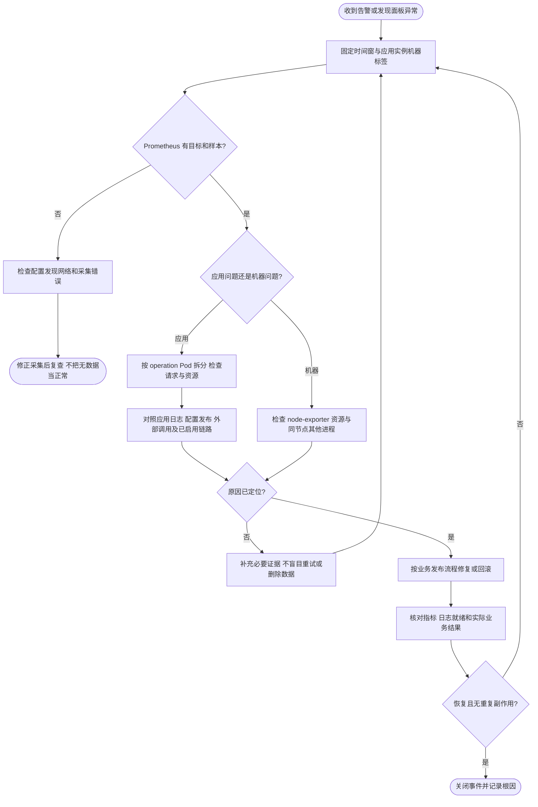
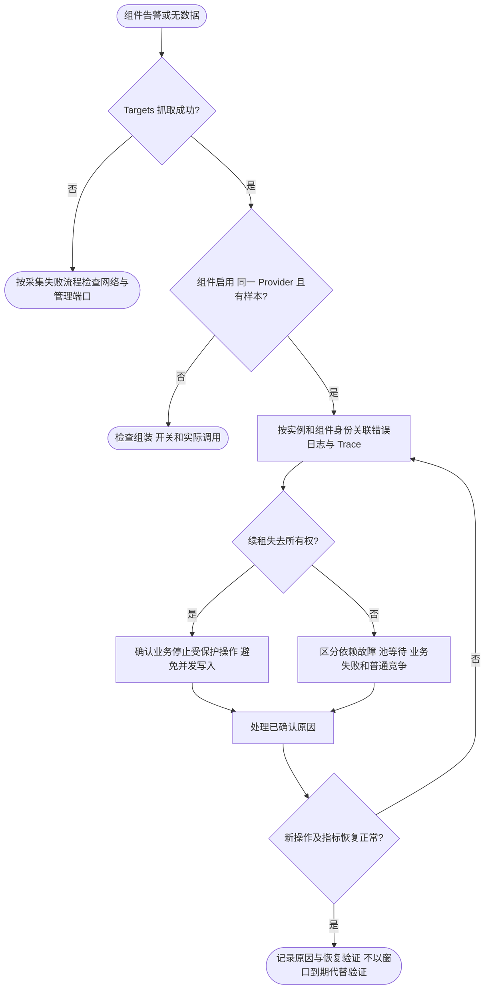

# 应用与监控排障

先记录数据源、namespace、node、pod、container、视图和发生时间；示例告警还需记录其 env、cluster、namespace、app、pod、node，按同一时间窗口比较 Dashboard 与日志。告警规则是 [alerts.yaml](../prometheus/alerts.yaml)，指标边界见 [面板说明](dashboard.md)。

## 本地启动失败

仓库根目录执行：

```sh
docker compose -f deploy/observability/compose.yaml ps
docker compose -f deploy/observability/compose.yaml logs --tail=100 app prometheus grafana
```

应用启动日志检查配置路径、端口占用和具体构造错误；本例没有外部数据库或追踪依赖。构建失败先确认网络和 Go 依赖下载，不修改 go.sum 绕过失败。Grafana 的 datasource/provisioning 错误检查只读挂载路径与 JSON；Prometheus 规则错误先运行 `make -C deploy/observability check`。

## 面板没有数据或变量为空

1. 在 Prometheus Targets 检查目标是否存在、健康和最后错误，确认数据源指向正确环境。
2. 查询 kube_pod_info、container_cpu_usage_seconds_total、node_uname_info，检查标准 namespace/pod/container 和节点名；应用指标另需 pod_name（或将隐藏 app_pod_label 改为 pod）。新面板不使用 target_info 发现对象。Job 任务名依赖默认 honor_labels=false 下的 exported_job。
3. 清除旧的级联筛选。切换 env/app 后旧 pod/instance 可能已不属于当前集合；切回 All 或重新选择。
4. 请求 `/hello` 后等待两次抓取；没有请求时，方法计数器可能尚未产生序列，不能据此判断采集失败。
5. 检查实际 `/metrics` 的名称；查询必须是 server_requests_seconds_bucket，不能写成重复的 bucket_bucket。原生 HandleFunc 不自动进入方法中间件。
6. 若是 Kubernetes，检查 ServiceMonitor/Prometheus 两层 namespace 与 label selector；应用就绪并不证明 ServiceMonitor 已被选中。

本地验证命令：

```sh
curl --fail http://127.0.0.1:19001/metrics
curl --fail --get http://127.0.0.1:19090/api/v1/query \
  --data-urlencode 'query=up'
```

不要通过 `or vector(0)` 全面填零掩盖缺失数据。容器概览已包含 ACK 容器和节点资源；健康探测与 Kafka Lag 使用独立面板。节点图为空时检查 node_uname_info 的 node/nodename 是否匹配 kube_node_info.node；多集群同名对象须隔离数据源。

## FoundationTargetDown

该告警只说明已发现目标的 `/metrics` 连续 2m 抓取失败。先看 Targets 最后错误：连接拒绝检查进程和端口；超时检查网络与目标负载；HTTP 错误检查路径、代理和认证。随后独立检查 `/readyz` 和业务请求。

K8s 使用 `kubectl -n <namespace> get pods -o wide`、`describe pod <pod>` 和 `logs <pod> -c api --since=10m`。命令中的 namespace/pod 替换为告警真实值；对重启实例增加 `--previous`。不要把 HTTP 健康端点访问成功视为全部业务依赖健康。

若整个目标消失，up 序列会消失而非始终保持 0。转查 Deployment 期望/可用副本、采集选择器、发布过程，以及已有平台缺失目标告警。

## FoundationHighServerErrorRate

先确认流量和 5xx 是否集中在某个 operation/Pod。按 App 和实例对照最近发布、配置和外部依赖错误。通过相同时间窗口、应用日志中的 trace ID 查询已接入的链路后端。模板禁用 trace 导出，因此本地演示没有可查询的链路存储。

检查 4xx/5xx 分类是否符合业务错误映射。请求级重试可能重复副作用；涉及订单、支付或消息消费时先确认幂等和事务边界，不直接批量重放或扩大重试次数。回滚或扩容由业务发布流程执行。

## FoundationHighLatency

先按 operation、Pod 拆分观察，并同时查看请求速率、进程 CPU/RSS、Goroutine 及所在机器。若同 Node 多个 App 同时变慢，检查机器资源竞争；若只有特定接口变慢，检查外部调用耗时、连接池等待和业务热点。

P95 来自有限直方图桶，当前 1s 以上长尾分辨率不足；结合日志耗时和链路诊断，不声称图上 1s 表示所有请求都小于 1s。现有可观测数据不够时，再决定是否添加合适的业务耗时指标。

## 配置热更新排查

配置源与格式错误由官方 Config 日志报告；组件解码和应用失败查看对应组件日志。结合配置发布记录与实际行为确认更新是否生效，不能通过已退役的配置状态指标判断。支持范围见 [配置说明](../../../pkg/config/README.md)。

## 机器资源告警

FoundationNodeCPUHigh / FoundationNodeMemoryHigh / FoundationNodeDiskLow 都是整机告警。

- CPU：检查是否所有核心繁忙、其他进程争抢、容器节流或节点调度倾斜。进程 CPU 核数与整机百分比不是同一量纲。
- 内存：比较机器 MemAvailable 和应用 RSS，结合 OOM/重启事件。不要将 Go heap 与 RSS 的差值直接判为泄漏。
- 磁盘：模板只覆盖根分区，检查真实挂载点、日志与存储保留策略。不得未经确认删除业务数据、清空卷或关闭保留保护。

node-exporter 不可达另由已有平台 exporter 告警负责；本规则不能用缺失机器数据证明资源正常。

## 告警触发但没有通知

先在 Prometheus Alerts 查看 pending/firing；pending 尚未满足 for。Firing 后检查是否配置 Alertmanager、目标是否可达、路由匹配、静默与抑制状态、通知渠道失败日志。本地 Compose 没有 Alertmanager，所以不会发消息。通过已授权的测试通知验证渠道，不能将规则测试通过称为通知投递成功。



## 组件告警

先按 env/cluster/namespace/app 确认目标，再切到 instance 或 pod；组件变量只筛选相应分区。若整个分区 No data，检查组件是否确实被构造、观测开关、是否注入 HTTP 暴露使用的同一 Provider，以及是否已有实际操作和至少两次抓取。最小 HTTP 示例未构造这些组件，不会自动产生它们的指标。

| 现象 / 告警 | 排查与处置 |
| --- | --- |
| FoundationKafkaRuntimeFailure | 查看运行时错误与 Topic/消费者配置、Broker 网络及认证；区分 handler 错误、重试和死信投递失败；需要 lag 时检查独立采集器 |
| FoundationQueueRuntimeFailure | 查看 Worker 与底层 Store 错误、网络及权限；按队列/Worker 查看最终结果和失败任务归档；业务重放前先核对幂等约束 |
| FoundationJobFailure | 任务名为 exported_job；结合任务日志和 Trace 检查最终错误。没有 job_running 不代表调度一定健康，同时查看 job_triggers_skipped_total、job_pending 和 job_wait_duration_seconds |
| FoundationLockRenewalFailure | 该规则只观察业务显式调用 `Lease.Refresh` 的结果，Foundation 没有自动续租协调器。not_held 说明已经失去租约；确认业务已停止受保护操作。error/timeout 时检查 Redis、上下文期限、任务耗时与 TTL；不应假设锁仍有效后继续写入 |
| FoundationRedisPoolTimeout | 同时看使用中连接、池等待、命令耗时、连接数和并发量；先检查慢命令/阻塞调用与资源释放，再评估连接池参数；不要将池 misses 当缓存未命中 |
| FoundationDatabasePoolSaturated | 按 instance/db_name 看使用中连接、等待次数与等待时间，核对未关闭 rows、长事务、慢 SQL；无限上限没有利用率告警，不代表容量无风险 |
| Redis 非成功比例高 | status=error 包含 key 不存在，先区分业务 miss、取消、超时和真实错误；该图不能直接作为可用性 SLO |
| Lock 持有时间无数据 | 必须使用 WithMetrics 且成功 Unlock 才有样本；过期或进程退出不会补发，不用该图证明没有锁泄漏 |



## 健康探测与配置状态

独立健康面板应取自真实HTTP探测；默认应用面板不包含 Health 分区。`probe_success=0` 时按probe标签检查readyz或healthz，查看probe_http_status_code、probe_duration_seconds及blackbox日志；readyz依赖检查失败可能只影响就绪，不影响healthz。`up{foundation_probe="true"}=0` 表示无法取得探测结果，先检查blackbox、模块配置与网络，不把它解释成服务返回503。消失的目标可能不再有up序列，还需部署平台的副本与目标存在性告警。

Config watcher为0时先核对应用是否正在停止或使用自定义配置Manager；不要机械重启业务。版本是进程内本地接受序号，不能据此判断多Pod配置内容一致；最近成功时间很旧但没有发布新配置并不异常。订阅积压增长、回调均值升高时关联订阅处理日志；接受快照不代表每个组件成功应用，必要时组件应另加自己的应用结果事件。

## 积压与传输指标

Queue统计失败先查看统计错误、数据库查询超时或Redis的context_timeout_enabled。Redis年龄known=0且数量>1000是有界采样限制，不能解释为0等待；按任务规模使用数据库聚合或后续设计独立有索引的统计采集。不能通过缩短Prometheus抓取间隔解决重查询，统计源应单独限流、调整抓取频率或由一个采集实例负责。

Kafka Lag先确认kafka_cluster、consumergroup、topic、partition，比较Kafka已提交位点；不要只看业务pod吞吐。HA exporter重复序列不相加，未知负值不当作零；认证、广播地址、过滤或没有提交位点都可能导致无数据。共享集群不会随App/Pod筛选变化，属于明确的图表边界。

OSS请求成功只代表请求阶段；Get完整流应查看streams结果，closed_early说明未读取到EOF便关闭，read_error/close_error分别排查读流与释放错误。未Close没有完成样本；Reader字节包括预读与重放，不能当网络计费。缓存命中率不包含读取错误，请同时看error与回源结果，避免高命中率掩盖访问失败。
