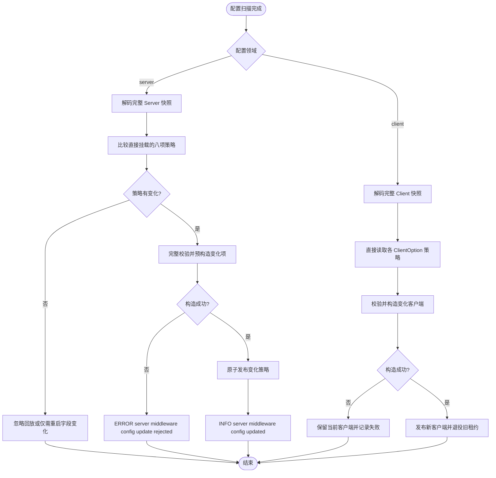

# 中间件配置路径扁平化设计

## 目标

删除 Server 与具名 Client 配置中只承担分组作用的 `middleware` 层，使中间件策略直接挂在其实际所有者上：

- `server.middleware.<policy>` 改为 `server.<policy>`；
- `client.clients.<name>.middleware.<policy>` 改为 `client.clients.<name>.<policy>`。

本次是直接配置契约迁移。旧 `middleware` 字段直接从 protobuf 删除，不保留 `reserved`，不提供新旧路径兼容或优先级规则。

## 范围

Server 直接持有以下策略：

- `deadline`
- `request_debug`
- `metadata`
- `tracing`
- `metrics`
- `logging`
- `validator`
- `rate_limit`

每个 `ClientOption` 直接持有以下策略：

- `deadline`
- `request_debug`
- `metadata`
- `tracing`
- `metrics`
- `logging`
- `circuit_breaker`

以下路径保留不变，因为顶层未来可能增加其他属性，集合名是稳定的领域边界：

- `registry.instances.<name>`
- `kafka.connections.<name>`
- `oss.buckets.<name>`
- `job.cron.<name>`

`client.clients`、`database.connections`、`redis.connections` 同样保留；其根配置已经存在默认值、遥测或生命周期等同级属性。

## 协议与生成代码

`ServerMiddleware` 和 `ClientMiddleware` 不再作为配置消息存在。共享的具体策略类型继续由 `common.proto` 中的 `Middleware.*` 定义，以避免复制 metadata、deadline、tracing 等相同结构；该类型命名不形成 YAML 路径。

修改 protobuf 源后通过根 Makefile 的协议生成入口更新 `*.pb.go`、校验代码和 `config.schema.json`，不手工修改生成产物。

## 运行期行为

Server 初始加载仍读取完整 `server` 配置。热更新改为订阅 `server`，从完整快照中比较八项策略；只有内容真正变化的策略才重建并通过现有原子指针发布。HTTP、gRPC、监听地址和停机延迟即使出现在新快照中也不会运行期替换，继续遵守“需重启”契约。

Client 继续订阅完整 `client` 配置。规范化过程直接从 `ClientOption` 读取策略，合并根级 deadline 默认值；任意有效策略变化仍生成不同 client spec，使旧连接按现有租约机制退役。

本次不增加锁，不改变请求热路径、客户端租约或资源释放顺序。

## 错误与迁移边界

旧路径不再被识别。配置仍使用 `server.middleware` 或具名客户端的 `middleware` 时，解码必须失败，而不是静默忽略。错误应包含实际路径，便于部署前完成迁移。

所有示例、README、根配置 Schema 和 `MIGRATION_V2.md` 必须同步替换旧路径。迁移表应明确这是删除旧字段的一次性变更。

## 测试与验收

1. 先增加配置解码契约测试，证明新路径能够解码、旧路径会失败。
2. 更新 Server 热更新测试，验证非策略字段变化不会重建策略，策略变化仍按现有原子模型生效。
3. 更新 Client 规范化、校验、构建及热更新测试，覆盖 deadline 默认值和显式零值。
4. 生成协议、校验代码与 JSON Schema，检查 Schema 只展示新路径。
5. 运行格式化、相关单元测试、竞态测试、`make test`、`make vet`、`make lint` 和生成差异检查。
