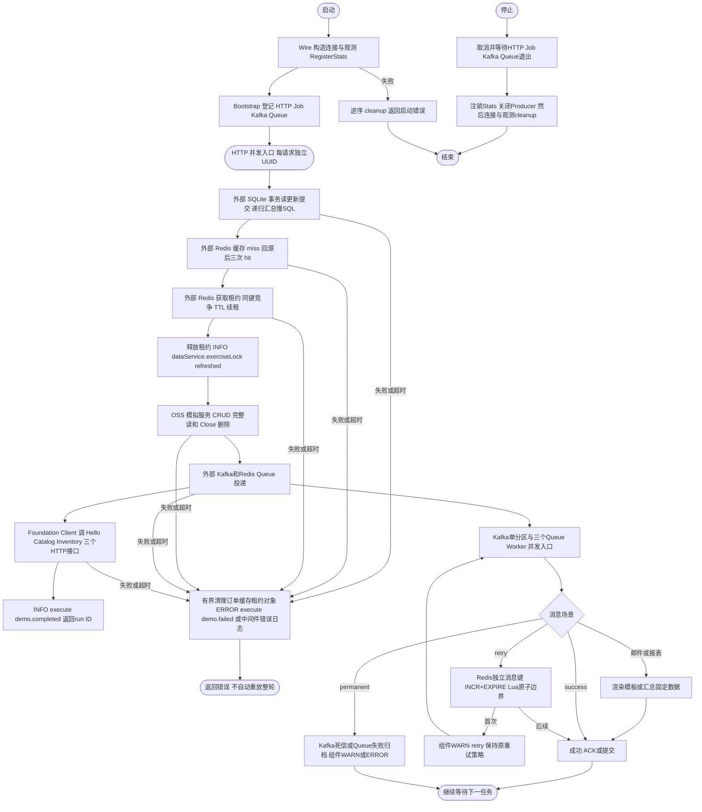
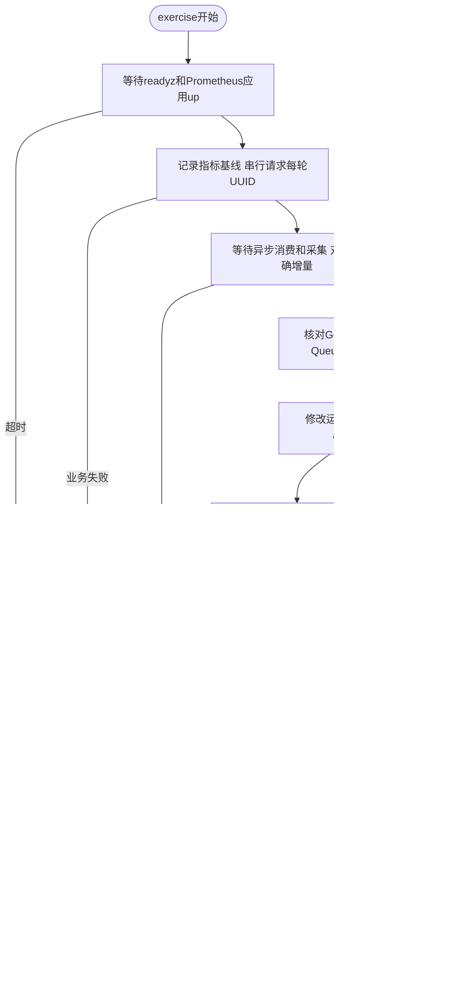

# 组件业务演示

这个示例让组件产生真实的操作指标，供业务接入和 Grafana 排障练习。保留独立的 [最小示例](../minimal/README.md)：不需要全部组件的项目从 minimal 开始，按需复制本例的 provider、声明和业务代码。

## 运行

在仓库根目录执行，需要 Docker Compose、Python 3；本机编译还需要 Go 1.26.4 和 C 编译器（SQLite）。Docker 构建已包含编译器。

```sh
make -C examples/components up
make -C examples/components exercise
```

`up` 合并 [监控 Compose](../../deploy/observability/compose.yaml)，使用同一个 `foundation-observability` 本地项目，保留 minimal-api 并新增 components-api、Redis、Kafka、Kafka exporter 和 OSS 协议模拟服务。会重建应用并重新加载 Prometheus；不会连接生产依赖。首次需要拉取镜像。

- Grafana：<http://127.0.0.1:13000/d/foundation-overview?var-app=components-api&var-group_by=target>
- 业务入口：`POST http://127.0.0.1:18010/demo/run`，每次生成独立 run ID。
- 指标及健康：`http://127.0.0.1:19011/metrics`、`/healthz`、`/readyz`。
- `exercise` 默认五轮、间隔五秒；指定轮数：`python3 examples/components/exercise.py --rounds 10`。仅有限轮次，不会持续压测。
- 验证报告：`.runtime/latest-report.json`，包含预期/实际增量、进程状态和延迟分位数；失败退出非零。

不要同时启动多个 exercise 或手动投递：核验用同一 app 的指标增量，额外流量会改变结果。请求里的数据由 UUID 隔离，不把 UUID 放进指标标签。代码演示部分操作失败时返回错误，不提供跨数据库、Redis、OSS、Kafka 的分布式事务；不能把重试整个 `/demo/run` 用作生产事务补偿。

`make -C examples/components down` 停止整个本地演示项目并移除容器，保留 Grafana/Prometheus 卷；业务数据库在应用容器 `/tmp`，Redis/Kafka/OSS 数据没有持久卷，移除容器后清空。`up` 会重置 `.runtime/config.yaml` 为仓库示例配置。`make ... run` 仅启动 Go 应用，默认配置使用 Compose DNS；本机运行须先将配置路径及依赖地址改成实际可达地址。

## 每轮预期

| 组件 | 常规操作 | 每轮可核验结果 |
| --- | --- | --- |
| HTTP Server / Client | Run、Catalog、Inventory；Client 调 Hello、Catalog、Inventory | Server 和 Client 各三个 operation 的 200 各 +1 |
| Database | 创建订单、事务读与更新、缓存回源、删除、确认不存在 | create +1、query success +2、update +1、delete +1、query not_found +1、递归汇总 raw +1 |
| Redis / 业务 Cache | 首次 GET 未命中，SQL 回源并 SET，再读三次，结束 DEL | hit +3、miss +1、load success +1，命中率 75% |
| Lock | 获取、同键竞争、TTL、续租、释放 | 五种操作各 +1，竞争为 contended，成功释放时长 count +1 |
| OSS | 上传、Stat、Exists、完整下载校验、删除 | 五种请求各 +1；上传/下载各 44 字节；成功下载流 +1 |
| Kafka | 三条消息：成功、首次失败后重试成功、永久失败进入死信 | 原 topic 生产 +3，消费 success +2/dead_lettered +1；attempt success +2/error +2，retry +1，死信生产 +1；处理提交完成后 lag=0 |
| Queue | 三任务：成功、重试成功、永久失败归档 | 主队列生产 +3；success +2、retry +1、failed +1；4 次 attempt；失败归档 +1 |
| Queue 邮件与报表 | email.render 渲染模板，report.summarize 汇总固定数据 | 两个队列各生产、消费、attempt success +1 |
| Queue 积压 | 独立无 Worker 队列放入立即任务及 24 小时后任务 | ready +1、scheduled +1；最老 ready 年龄随时间增长 |
| Job | 每 10 秒执行 Redis Ping、DBSIZE、TTL | `redis-heartbeat`、`cache-size`、`cache-ttl` success 持续增加，不按演示轮次断言 |
| Config | 脚本将运行副本 max_open_conns 从 8 改为 9，再写语法不完整的 YAML，最后恢复 | accepted/rejected 分别增加；非法 YAML 快照被拒绝，不替换有效快照 |
| Health / Go | 实际 blackbox 探测与默认采集 | healthz/readyz=1，Redis 为 readiness 关键依赖；协程/GC/内存/CPU等可见 |

SQL 示例设置 slow_threshold: 0.010s（10ms），每轮执行真实递归汇总 UPDATE，验证 raw 慢操作至少 +1；实际机器若低于阈值会使核验失败，不伪造耗时。protobuf Duration 配置使用秒格式，不能写 10ms。

SQL 建表在构造期产生额外采样，因此按增量核验。Redis 包括后台 Queue 轮询、Job Ping、健康探测和 SDK 初始化，不应把命令总数等同业务 GET 次数；`redis.Nil` 被 SDK 记为 error，业务缓存正常 miss 不是基础设施故障。

OSS 使用**真实 Aliyun SDK 和 Foundation 包装器访问本地协议模拟服务**，不是阿里云端到端验证。44 字节包含末尾换行。只实现本例需要的 CRUD，不能用模拟服务评估云端权限、可靠性和性能。SQLite 是真实本地数据库，没有 MySQL 服务端指标。

Queue 失败记录和 backlog 故意留存供图表观察，多轮会累积；24 小时后 scheduled 转为 ready。请按需停止演示，旧 ready 超过告警阈值会触发示例告警。Kafka 消费完成后的 lag 为零是正确结果；这里不伪造非零 lag。未发生的运行时故障、超时、错误等计数可能尚无序列，图表为空不应补假数据。

Config 的 accepted 表示快照解析及保留字段检查通过，不保证全部组件语义校验或热应用成功。本次实测：未被热订阅读取的 stop_delay 非法 duration 仍会增加 accepted，因此拒绝场景使用确定的 YAML 语法错误。成功场景使用实际支持热更新的 max_open_conns，并核验连接池最大值变为 9、最终恢复为 8。脚本最后恢复原始配置；文件 watcher 和组件自身的热更新范围见 [配置组件](../../pkg/config/README.md)。

## 生命周期与并发边界

Wire 按依赖构造，Bootstrap 在应用启动前登记 HTTP、Job、Kafka ConsumerRuntime 和 Queue Worker。沿用组件内部并发控制；示例没有新 Go 锁。任务重试演示使用每消息独立的 Redis INCR+EXPIRE Lua 原子计数，键保留一天，避免共享 Go 计数与跨实例竞态；一天后重放会再次演示首次失败。业务幂等和持久重试次数应按实际用例设计。



面板选 `App=components-api` 查看本例；选 All 比较两个应用。`实例明细` 图例保留 app/node/pod/instance，避免同名 Pod 或多机器混淆；公共身份标签由 Prometheus 目标配置提供。Kafka lag 是共享集群指标，使用 kafka_cluster/group/topic 筛选，不错误地绑定业务 app。

## 验证入口

```sh
make -C examples/components generate
make -C examples/components test
python3 examples/components/oss-emulator.py --self-test
make -C deploy/observability check
make -C deploy/observability smoke
```

`test` 是无需外部服务的 Go race + vet，含本地 HTTP/SQLite/OSS 协议测试；真实 Docker 业务与指标核验是 `exercise`。面板查询验证见 [监控说明](../../deploy/observability/README.md)，业务自定义指标接入见 [业务指标指南](../../deploy/observability/docs/business-metrics.md)。

本地 Redis SDK 的非成功返回还包含 Queue 空轮询的 `redis.Nil`，因此空闲时该比例可能很高；结合 `error_type` 与 Queue runtime 故障指标判断，不把它当成服务错误率。



本次逐项结果见 [本地实测记录](verification.md)。
