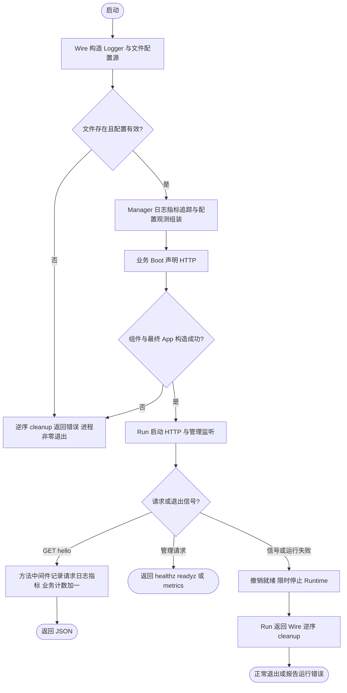

# 最小业务模板

本示例提供一个可复制的 HTTP 应用：文件配置、Logger、指标、禁用外部导出的 Tracing Provider、健康检查、统一 Bootstrap/Wire、业务端点和逆序 cleanup。无需数据库或消息服务。目录中的代码仅依赖 Foundation 公共包。

## 在本仓库运行

前置条件：根模块要求的 Go 版本；Wire 使用根 `go.mod` 固定的 `go tool wire`，不依赖 PATH 中的其他版本。以下命令从仓库根目录执行：

```sh
make -C examples/minimal help
make -C examples/minimal generate
make -C examples/minimal test
make -C examples/minimal build
APP_ENV=local LOG_FILE_ENABLE=false /tmp/foundation-minimal-api -config examples/minimal/configs/config.yaml
```

在另一个终端验证：

```sh
curl --fail http://127.0.0.1:8000/hello
curl --fail http://127.0.0.1:9001/readyz
curl --fail http://127.0.0.1:9001/metrics
```

`/hello` 返回 JSON，并产生 `business_greetings_total`、`server_requests_code_total` 和 `server_requests_seconds_bucket`。需要至少两次 Prometheus 抓取后才能计算速率；只有请求发生后才会出现相应请求时间序列。

按 Ctrl-C 停机；默认总停机预算 30s，包含服务器 3s 的流量摘除等待。Run 返回后 Wire 才逆序 cleanup。端口占用、配置缺失和非法配置会以非零状态退出；不存在的配置文件不会静默采用默认值。Tracing 显式禁用，接入 OTLP 后端时按 [Tracing 文档](../../pkg/tracing/README.md) 配置；仅创建 Provider 不等于已经保存链路数据。

## 复制为业务项目

复制 `cmd/api`、`configs`、Dockerfile 到业务仓库。`cmd/api` 内没有对示例自身 module path 的引用；将业务实现逐步放入自己的 `internal/service`、`internal/biz`、`internal/data`，在 `boot` 中声明端点，在 `wire.go` 中注入依赖。默认配置参数从 `examples/minimal/configs/config.yaml` 改为业务项目的 `configs/config.yaml`，Dockerfile 的 build 路径改为 `./cmd/api`。

业务根目录使用自己的 `go.mod`，Foundation 依赖固定到**实际可获取的 tag 或已推送 commit**。本仓库尚未发布稳定 v2，工作树未提交的 API 不能靠 `go get` 获取；先验证对应版本具备 `bootstrap.NewSpec` 等当前接口。以下命令的 `FOUNDATION_REF` 必须由业务方设为已验证的真实引用：

```sh
# 在新业务项目根目录执行；FOUNDATION_REF 为真实 tag 或已推送 commit。
: "${FOUNDATION_REF:?请先设置已验证的 Foundation 引用}"
go mod init example.com/orders
go get "github.com/jaggerzhuang1994/kratos-foundation/v2@${FOUNDATION_REF}"
go get -tool github.com/google/wire/cmd/wire@v0.7.0
go mod tidy
go tool wire ./cmd/api
go build -o ./bin/orders-api ./cmd/api
```

提交业务自己的 go.mod/go.sum 和 Wire 生成产物，不使用永久本地 `replace`。先保留原有 `/hello` 和指标契约测试验证接入，再按实际端点调整测试。示例 Makefile 的 `ROOT` 和命令路径也需改成业务仓库布局。

应用身份 `AppInfo.Name()` 来自可执行文件名；例如上面的 `orders-api`。Prometheus 的 `app` 则由采集配置显式设置，建议保持一致。不要把每次构建的随机文件名作为稳定 App 标识；容器中的可执行文件也应使用业务名称。

## 业务指标与组装约定

- `service.go` 展示一个低基数业务计数器；实际项目可添加订单成功数、任务耗时等，不记录用户 ID、订单 ID 或请求 ID 标签。
- 手写 Kratos HTTP 路由显式调用 `ctx.Middleware`，并设置稳定 operation。直接 `HandleFunc` 不自动经过方法中间件，不能假定会产生请求指标；生成的 HTTP 服务则沿用其生成入口。
- 配置源先由 `newSources` 确认文件存在，再交给 Manager；Manager 管理监听和源关闭。
- 业务只借用注入的 Logger/Provider；资源 cleanup 由 Wire 持有。组件由 `application.Run()` 启动。
- 当前示例只选择 HTTP。数据库、Redis、Queue、Kafka、Job 按 [Bootstrap 文档](../../pkg/bootstrap/README.md) 增加相应 provider；不为未使用的组件引入外部依赖。



本地完整监控体验见 [部署入口](../../deploy/observability/README.md)，Kubernetes 接入见 [Kubernetes 示例](../../deploy/kubernetes/README.md)。

需要观察数据库、Redis、Kafka、Queue、OSS 等真实操作指标时，运行独立的 [components 演示](../components/README.md)。

示例已导入 Consul 注册驱动并配置 `registry.instances.default`。`app.registry` 默认选择此实例；本地未设置 `CONSUL_HTTP_ADDR` 时驱动自动禁用，也可显式设置 `DISABLE_CONSUL=true` 跳过注册。生产环境按 Consul 驱动文档配置环境变量。
