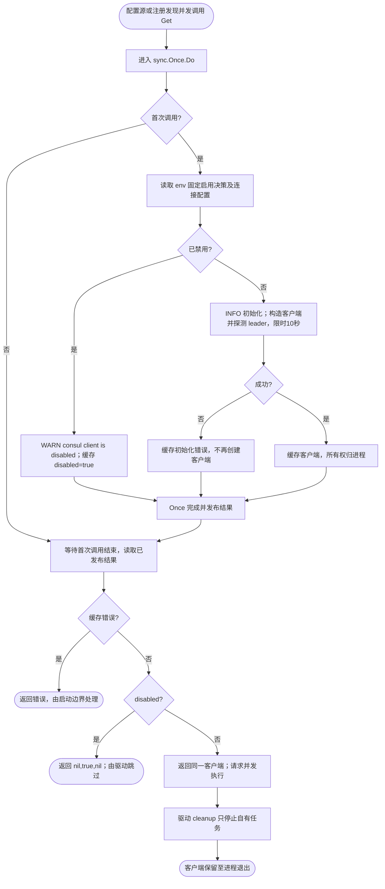

# Consul 进程单例

配置源驱动和注册/发现驱动统一调用 `Get()`，借用同一个 SDK 客户端。业务只导入 contrib 驱动，不直接导入本 internal 包；旧 pkg/consul 构造入口已删除。

第一次调用读取环境（Consul SDK 的 `CONSUL_HTTP_ADDR`、`CONSUL_HTTP_TOKEN`、TLS 等变量），构造客户端并在 10 秒内探测 leader。`DISABLE_CONSUL=true`，或 local 环境没有设置地址，表示禁用，`Get()` 返回 `nil, true, nil`。真实初始化失败返回 `nil, false, err`；成功返回 `client, false, nil`。配置源在禁用时跳过，注册实例不执行注册；要求服务发现的客户端仍校验发现能力是否可用。

首次结果由 `sync.Once` 固定，包括初始化错误和禁用结果；以后 env 变化不生效，不自动重试。成功的客户端归进程所有，不提供调用方 cleanup 或 Reset。驱动仅停止自己的 watcher、心跳等任务。初始化过程不返回 cleanup，也不单独管理连接池释放；首次失败被缓存，不循环创建客户端，连接资源由进程生命周期及底层 transport 管理。

多个具名 Consul 实例共享同一连接与集群；各自保留注册及发现策略。SDK 客户端只供借用，调用方不得修改客户端配置、令牌或关闭 transport。单例持有 SDK 并发安全客户端，不串行化后续请求。

同步范围仅包括首次初始化及结果发布。并发首次调用最多等待一次 10 秒探测；没有驱动级锁，也没有失败重试循环。测试使用本机 HTTP 服务验证并发单例、环境冻结、失败缓存、域名与 env token 传递。
